Introduction to Kubernetes and Containers
=========================================

By the end of the chapter, you will be able to run a basic Docker
container from an image. You will also be able to package a custom
application to make your own Docker image.


Docker Basics
=============

You can confirm whether Docker is installed by querying the version of Docker using the following command:


```
docker --version
```

You should see the following output:


```
Docker version 20.10.14, build a224086
```


What\'s behind docker run?
--------------------------

After Docker is installed, running a containerized application is quite
simple. For demonstration purposes, we will use the Nginx web server as
an example application. We can simply run the following command to start
up the Nginx server.

To map the host port `8080` to the container port `80`, use
the following command:


```
docker run -p 8080:80 -d nginx
```


You should see the similar result:


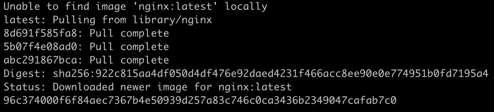


The running instance can be verified using the following command:


```
docker ps
```

You should see the following result:

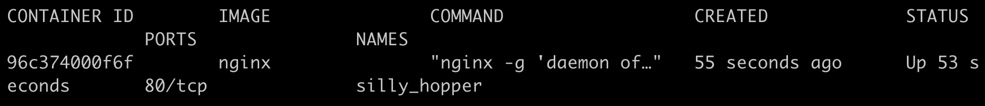


The `-p 8080:80` parameter tells Docker Engine to start the
container and map the traffic on port 8080 of the host to the inside
container at port `80`. Now, if we try to access the
`localhost` on port `8080`, we will be able to
access the containerized `nginx` service. Let\'s try it out:


```
curl localhost:8080
```


You should see the following output:


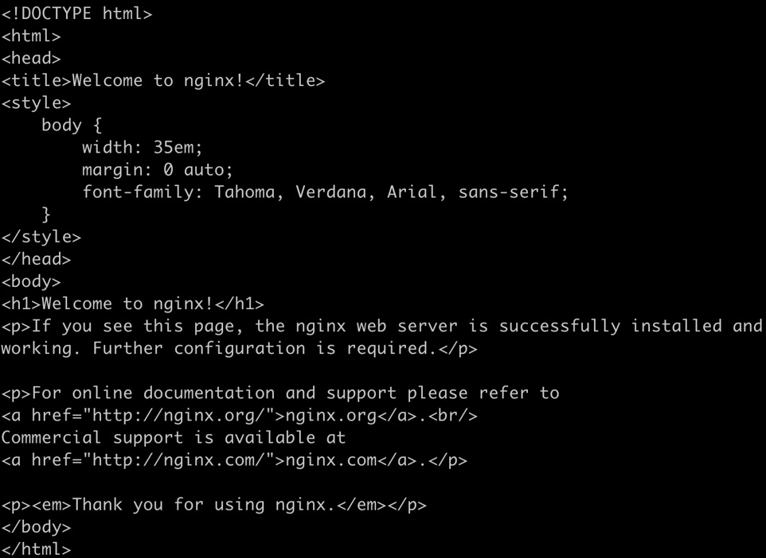


Run following command in the terminal to delete nginx container:

```
docker stop UPDATE_CONTAINER_ID

docker rm UPDATE_CONTAINER_ID
```

Nginx is an example of a type of workload that doesn\'t have a fixed
termination time, that is, it does not just show output and then
terminates. This is also known as a **long-running service**. The other
type of workload, which just runs to completion and exits, is called a
**short-time service**, or simply a **job**. For containers running
jobs, we can omit the `-d` parameter. Here is an example of a
job:


```
docker run hello-world
```

You should see the following response:


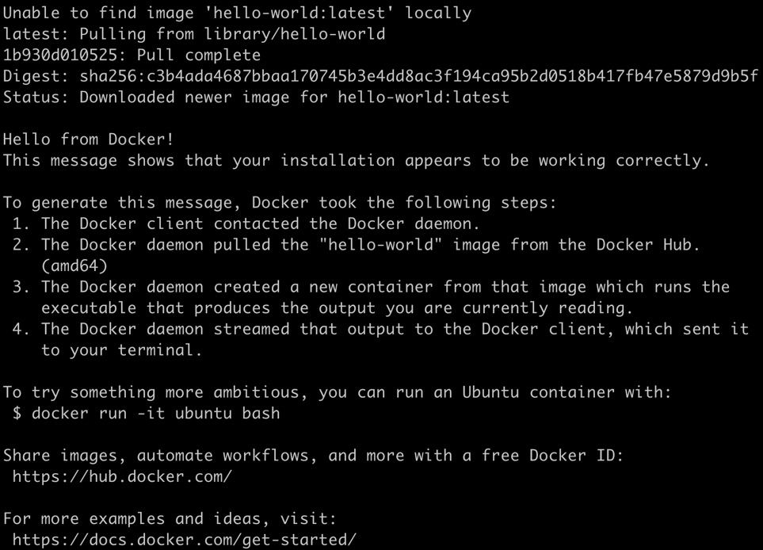


Now, if you run `docker ps`, which is intended to list running
containers, it doesn\'t show the `hello-world` container. This
is as expected since the container has finished its job (that is,
printing out the response text that we saw in the previous screenshot)
and exited. To be able to find the exited container, you can run the
same command with the `-a` flag, which will show all the
containers:


```
docker ps -a
```

You should see the following output:


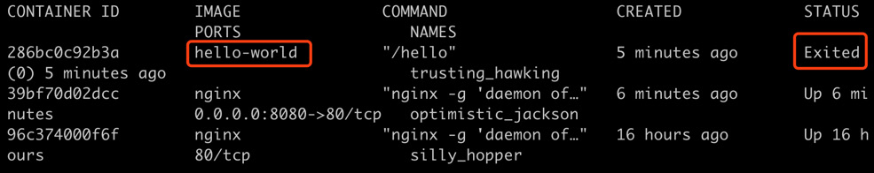


If you rerun the `docker run hello-world`, it will again bring up a new
container with a new ID and exit after it finishes its job. You can try
this out yourself as follows:


```
docker run hello-world

docker ps -a
```

You should see the following output:


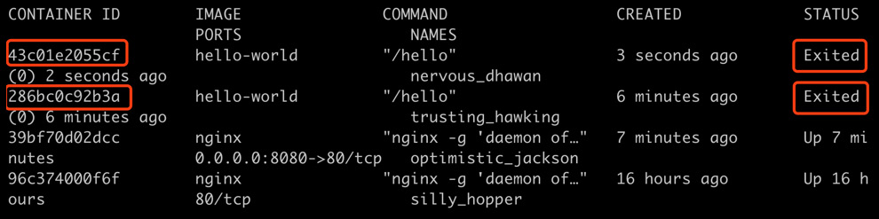


By now, you should have a very basic understanding of how a container is
launched, and how to check its status.


Dockerfiles and Docker Images
-----------------------------

Use the following command to list all the locally downloaded images:


```
docker images
```

You should see the following list:


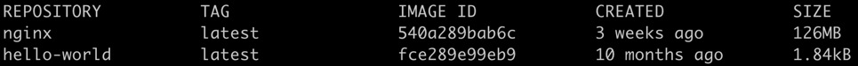


Let\'s take a look at how we can build our own Docker image for an
application in the following exercise.


Exercise 1.01: Creating a Docker Image
--------------------------------------

In this exercise, we will build a Docker image for a simple application
written in Go.

We\'re going to use Go in this exercise so that the source code and its
language dependencies can be compiled into a single executable binary.
However, you\'re free to use any programming language you prefer; just
remember to bundle the language runtime dependencies if you\'re going to
use Java, Python, Node.js, or any other language:

1.  For this exercise, we will create a file named
    `Dockerfile`. Note that this filename has no extension.
    You can use your preferred text editor to create this file with the
    following content:

    
    ```
    FROM alpine:3.10
    COPY k8s-for-beginners /
    CMD ["/k8s-for-beginners"]
    ```

    The first line specifies which base image to use as the foundation.
    This example uses Alpine, a popular base image that takes only about
    5 MB and is based on Alpine Linux. The second line copies a file
    called `k8s-for-beginners` from the directory where the
    `Dockerfile` is located to the root folder of the image.
    In this example, we will build a tiny web server and compile it to a
    binary with the name `k8s-for-beginners`, which will be
    placed in the same directory as the `Dockerfile`. The
    third line specifies the default startup command. In this case, we
    just start our sample web server.

2.  Next, let\'s build our sample web server. Create a file named
    `main.go` with the following content:

    
    ```
    package main
    import (
            "fmt"
            "log"
            "net/http"
    )
    func main() {
            http.HandleFunc("/", handler)
            log.Fatal(http.ListenAndServe("0.0.0.0:8080", nil))
    }
    func handler(w http.ResponseWriter, r *http.Request) {
            log.Printf("Ping from %s", r.RemoteAddr)
            fmt.Fprintln(w, "Hello Kubernetes Beginners!")
    }
    ```
    

    As you can observe from `func main()`, this application
    serves as a web server that accepts an incoming HTTP request at port
    8080 on the root path and responds with the message
    `Hello Kubernetes Beginners`.

3.  To verify this program works, you can just run
    `go run main.go`, and then open
    [`http://localhost:8080`](http://localhost:8080/) on the
    browser. You\'re expected to get the
    \"`Hello Kubernetes Beginners!`\" output.

4.  Use `go build` to compile runtime dependencies along with
    the source code into one executable binary. Run the following
    command in the terminal:

    
    ```
    CGO_ENABLED=0 GOOS=linux GOARCH=amd64 go build -o k8s-for-beginners
    ```

    **Note:** Above command should be run in `git bash` only. It will not work in cmd/powershell.
   

5.  Now, check whether the `k8s-for-beginners` file is
    created:

    
    ```
    ls
    ```
    

    You should see the following response:

    
    ```
    Dockerfile k8s-for-beginners  main.go
    ```
    

6.  Now we have both the `Dockerfile` and the runnable binary.
    Build the Docker image by using the following command:

    
    ```
    docker build -t k8s-for-beginners:v0.0.1 .
    ```
    

    Don\'t miss the dot (`.`) at the end of this command. You
    should see the following response:

    
    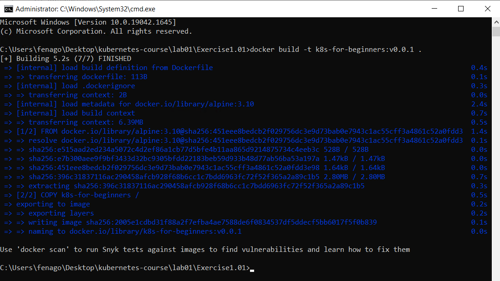
    

    **Note**

    If you open `lab01` folder, you will find
    that we have provided a copy of the `Dockerfile` in each
    directory so that you can conveniently run the
    `docker build` command by navigating to the directory.

7.  Now, we have the `k8s-for-beginners:v0.0.1` image
    available locally. You can confirm that by running the following
    command:

    
    ```
    docker images
    ```
    

    You should see the following response:

    
    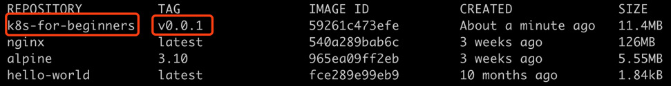
    


Exercise 1.02: Running Your First Application in Docker
-------------------------------------------------------

In *Exercise 1.01*, *Creating a Docker Image*, we packaged the web application into a Docker image. In this exercise, we will run it:

1.  First, we should clean up any leftover containers from the previous
    exercise by running the following command in the terminal:

    
    ```
    docker rm -f $(docker ps -aq)
    ```
    

    **Note:** Above command should be run in `git bash` only. It will not work in cmd/powershell.
   
    You should see the following response:

    
    ```
    43c01e2055cf
    286bc0c92b3a
    39bf70d02dcc
    96c374000f6f
    ```
    

    We have seen that `docker ps -a` returns the information
    of all the containers. The extra `q` in the
    `-aq` flag means \"quiet\" and the flag will only display
    numeric IDs. These IDs will be passed to `docker rm -f`,
    and, therefore, all the containers will be removed forcefully.

2.  Run the following command to start the webserver:

    
    ```
    docker run -p 8080:8080 -d k8s-for-beginners:v0.0.1
    ```
    

    You should see the following response:

    
    ```
    9869e9b4ab1f3d5f7b2451a7086644c1cd7393ac9d78b6b4c1bef6d423fd25ac
    ```
    

    As you can see in the preceding command, we are mapping the internal
    port `8080` of the container to the host machine\'s port
    `8080`. The `8080:8080` parameter preceded by
    `-p` maps port `8080` of the container to port
    `8080` on the host machine. The `-d` parameter
    indicates the detached mode. By default, Docker checks the local
    registry first. So, in this case, the local Docker image will be
    used for launching the container.

3.  Now, let us check whether it works as expected by sending an HTTP
    request to `localhost` at port `8080`:

    
    ```
    curl localhost:8080
    ```
    

    The `curl` command checks for a response from the stated
    address. You should see the following response:

    
    ```
    Hello Kubernetes Beginners!
    ```
    

4.  We can also observe the logs of the running container by using the
    following commands:

    
    ```
    docker logs <container ID>
    ```
    

    You should see the following logs:

    
    ```
    2019/11/18  05:19:41 Ping from 172.17.0.1:41416
    ```
 

**The Essence of Linux Container Technology**

Once a Docker container is created, Docker creates and associates a
number of namespaces with the container. For example, let\'s take a look
at the sample container we created in the previous section. Let\'s use
the following command:


```
docker inspect --format '{{.State.Pid}}' <container ID>
```

The preceding command checks the PID of the container running on the
host OS. You should see a response similar to the following:


```
5897
```


The `uts` namespace is created to enable the container to have
its hostname instead of the host\'s hostname. By default, a container is
assigned its container ID as the hostname, and it can be changed using
the `-h` parameter while running a container, as shown here:


```
docker run -h k8s-for-beginners -d fenago/the-kubernetes-workshop:k8s-for-beginners
```

This should give the following response:


```
df6a15a8e2481ec3e46dedf7850cb1fbef6efafcacc3c8a048752da24ad793dc
```

**Note:** Below `docker exec` command should be run in windows `cmd` only.

Using the returned container ID, we can enter the container and check
its hostname using the following two commands one after the other:


```
docker exec -it <container ID> sh

hostname
```


You should see the following response:


```
k8s-for-beginners
```

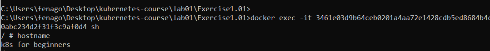


In addition to the `uts` namespace, the container is also
isolated in its own `PID` namespace, so it can only view the
processes launched by itself, and the launching process (specified by
`CMD` or `ENTRYPOINT` in the `Dockerfile`
that we created in *Exercise 1.01*, *Creating a Docker Image*) is assigned `PID` `1`.
Let\'s take a look at this by entering the following two commands one
after the other:


```
docker exec -it <container ID> sh

ps
```

You should see the following response:


Exercise 1.03: Joining a Container to the Network Namespace of Another Container
--------------------------------------------------------------------------------

In this exercise, we will recreate the `k8s-for-beginners`
container without host mapping, and then create another container to
join its network namespace:

1.  As with the previous exercise, remove all the existing containers by
    running the following command:

    
    ```
    docker rm -f $(docker ps -aq)
    ```
    
    **Note:** Above command should be run in `git bash` only. It will not work in cmd/powershell.

    You should see an output similar to this:

    
    ```
    43c01e2055cf
    286bc0c92b3a
    ```
    

2.  Now, begin by running our container using the following command:

    
    ```
    docker run -d fenago/the-kubernetes-workshop:k8s-for-beginners
    ```
    

    You should see the following response:

    
    ```
    33003ddffdf4d85c5f77f2cae2528cb2035d37f0a7b7b46947206ca104bbbaa5
    ```
    

3.  Next, we will get the list of running containers so that we can see
    the container ID:

    
    ```
    docker ps
    ```
    

    You should see the following response:

    
    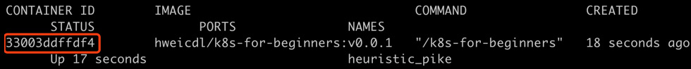
    


4.  Now, we will run an image called `netshoot` in the same
    network namespace as the container that we created in *step 1*, by
    using the `--net` parameter:

    
    ```
    docker run -it --net container:<container ID> nicolaka/netshoot
    ```
    

    Use the container ID of our previous container that we obtained in
    the previous step. You should see a response that is similar to the
    following:

    
    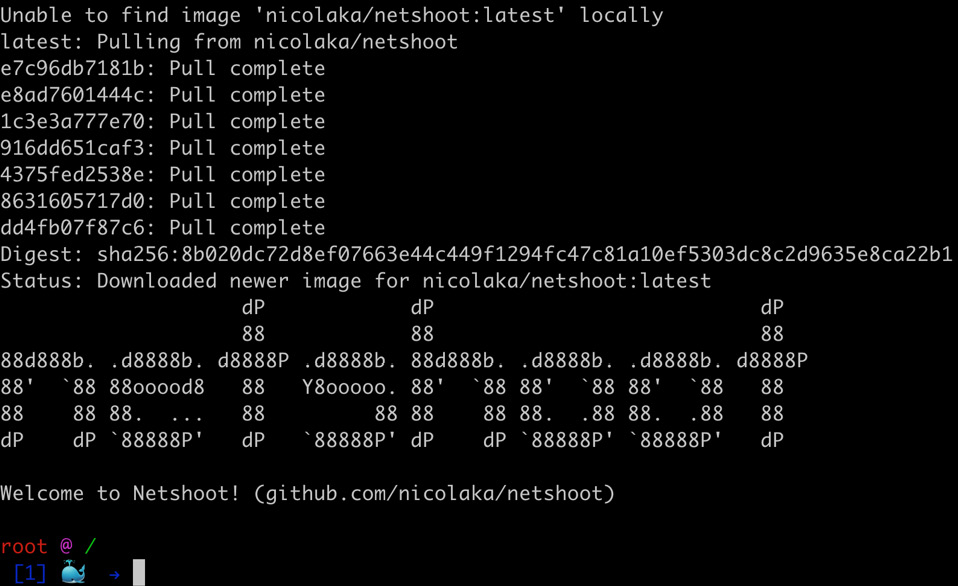
    


    `nicolaka/netshoot` is a tiny image packaged with some
    commonly used network libraries such as `iproute2`,
    `curl`, and more.

5.  Now, let\'s run the `curl` command inside
    `netshoot` to check whether we are able to access the
    `k8s-for-beginners` container:

    
    ```
    curl localhost:8080
    ```
    

    You should see the following response:

    
    ```
    Hello Kubernetes Beginners!
    ```
    

    The preceding example proves that the `netshoot` container
    was created by joining the network namespace of
    `k8s-for-beginners`; otherwise, accessing port
    `8080` on `localhost` wouldn\'t have got us a
    response.

6. As a final cleanup step, let\'s remove all of the containers:

    
    ```
    docker rm -f $(docker ps -aq)
    ```

    **Note:** Above command should be run in `git bash` only. It will not work in cmd/powershell.


    You should see a response similar to the following:

    
    ```
    61d0fa62bc49
    33003ddffdf4
    ```

Let\'s confirm that by using the following command:


```
docker ps
```

You should see an empty list as follows:


```
CONTAINER ID     IMAGE       COMMAND          CREATED          STATUS
        PORTS          NAMES
```


Activity 1.01: Creating a Simple Page Count Application
-------------------------------------------------------

In this activity, we will create a simple web application that counts
the number of visitors. We will containerize this application, push it
to a Docker image registry, and then run the containerized application.

**A PageView Web App**

We will first build a simple web application to
show the pageviews of a particular web page:

1.  Use your favorite programming language to write an HTTP server to
    listen on port `8080` at the root path (`/`).
    Once it receives a request, it adds `1` to its internal
    variable and responds with the message
    `Hello, you're visitor #i`, where `i` is the
    accumulated number. You should be able to run this application on
    your local development environment.

    **Note**

    In case you need help with the code, we have provided a sample piece
    of code written in Go, which is also used for the solution to this
    activity. Solution is present in `lab01\Activity1.01` folder.

2.  Compose a `Dockerfile` to build the HTTP server and
    package it along with its dependencies into a Docker image. Set the
    startup command in the last line to run the HTTP server.

3.  Build the `Dockerfile` and push the image to a public
    Docker images registry (for example, <https://hub.docker.com/>).

4.  Test your Docker images by launching a Docker container. You should
    use either Docker port mapping or an internal container IP to access
    the HTTP server.

You can test whether your application is working by repeatedly accessing
it using the `curl` command as follows:


```
root@ubuntu:~# curl localhost: 8080
Hello, you're visitor #1.
root@ubuntu:~# curl localhost: 8080
Hello, you're visitor #2.
root@ubuntu:~# curl localhost: 8080
Hello, you're visitor #3.
```

**Bonus Objective**

Until now, we have implemented the basics of Docker that we have learned
in this chapter. However, we can demonstrate the need to link different
containers by extending this activity.

For an application, usually, we need multiple containers to focus on
different functionalities and then connect them together as a fully
functional application. Later on, in this book, you will learn how to do
this using Kubernetes; however, for now, let\'s connect the containers
directly.

We can enhance this application by attaching a backend datastore to it.
This will allow it to persist its state even after the container is
terminated, that is, it will retain the number of visitors. If the
container is restarted, it will continue the count instead of resetting
it. Here are some guidelines for building on top of the application that
you have built so far.

**A Backend Datastore**

We may lose the pageview number when the container
dies, so we need to persist it into a backend datastore:

1.  Run one of the three well-known datastores: Redis, MySQL, or MongoDB
    within a container.

    Note

    The solution to this activity can be found at the following address:
    `Activity_Solutions\Solution_Final.pdf`. We have implemented Redis for
    our datastore.

    You can find more details about the usage of the Redis container at
    this link: <https://hub.docker.com/_/redis>.

    If you wish to use MySQL, you can find details about its usage at
    this link: <https://hub.docker.com/_/mysql>.

    If you wish to use MongoDB, you can find details about its usage at
    this link: <https://hub.docker.com/_/mongo>.

2.  You may need to run the container using the `--name db`
    flag to make it discoverable. If you are using Redis, the command
    should look like this:
    
    ```
    docker run --name db -d redis
    ```
    

**Modifying the Web App to Connect to a Backend Datastore**

1.  Every time a request comes in, you should modify the logic to read
    the pageview number from the backend, then add `1` to its
    internal variable, and respond with a message of
    `Hello, you're visitor #i`, where `i` is the
    accumulated number. At the same time, store the added pageview
    number in the datastore. You may need to use the datastore\'s
    specific SDK **Software Development Kit** (**SDK**) to connect to
    the datastore. You can put the connection URL as
    `db:<db port>` for now.

    Note

    You may use the source code from the following link:
    <https://github.com/fenago/kubernetes-course/blob/master/lab01/Activity1.01/pageview-modified/main.go>.

    If you are using the code from this link, ensure that you modify it
    to map to the exposed port on your datastore.

2.  Rebuild the web app with a new image version.

3.  Run the web app container using the `--link db:db` flag.

4.  Verify that the pageview number is returned properly.

5.  Kill the web app container and restart it to see whether the
    pageview number gets restored properly.

Once you have created the application successfully, test it by accessing
it repeatedly. You should see it working as follows:


```
root@ubuntu:~# curl localhost: 8080
Hello, you're visitor #1.
root@ubuntu:~# curl localhost: 8080
Hello, you're visitor #2.
root@ubuntu:~# curl localhost: 8080
Hello, you're visitor #3.
```

Then, kill the container and restart it. Now, try accessing it. The
state of the application should be persisted, that is, the count must
continue from where it was before you restarted the container. You
should see a result as follows:


```
root@ubuntu:~# curl localhost: 8080
Hello, you're visitor #4.
```

Note

The solution to this activity can be found at the following address:
`Activity_Solutions\Solution_Final.pdf`.


Summary
=======


In this chapter, we walked you through a brief
history of software development and explained some of the challenges in
the VM era. With the emergence of Docker, containerization technologies
open a new gate in terms of resolving the problems that existed with
earlier methods of software development.

We walked you through the basics of Docker and detailed the underlying
features of Linux such as namespaces and cgroups, which enable
containerization. We then brought up the concept of container
orchestration and illustrated the problems it aims to solve. Finally, we
gave a very brief overview of some of the key features and methodologies
of Kubernetes.

In the next chapter, we will dive a little deeper and take a look at
Kubernetes\' architecture to understand how it works.
