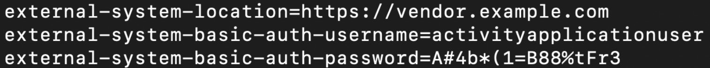

ConfigMaps and Secrets
==========================


Overview

In this chapter, we will learn how to decouple application configuration
data from the application itself and the advantages of taking this
approach. By the end of this chapter, you will be able to define
Kubernetes ConfigMap and Secret objects, run a simple Pod that uses data
from ConfigMaps and Secrets, describe the advantages of decoupling
configuration data from applications, and use ConfigMaps and Secrets to
decouple application configuration data from the application container.

Introduction
============


In *Chapter 5*, *Pods*, we learned that Pods are the minimal unit of
deployment in Kubernetes. Pods can have multiple containers, and each
container can have a container image associated with it. This container
image generally packages the target application that you plan to run.
Once the developers are satisfied that the code is running as expected,
the next step is to promote the code to testing, integration, and
production environments.

Easy, right? One problem, however, is that as we move our packaged
container from one environment to another, although the application
remains the same, it needs environment-specific data, for example, the
database URL to connect to. To overcome this problem, we can write our
applications in such a way that the environment-specific data is
provided to the application by the environment it is being
deployed into.

In this chapter, we will discover what Kubernetes provides to associate
**environment-specific data** with our application containers without
changing our container image. There are multiple ways to provide
**environment-specific configuration** data to our application:

1.  Provide command-line arguments to the Pods.
2.  Provide environment variables to the Pods.
3.  Mount configuration files in the containers.

First, we need to define our configuration data using an object called
**ConfigMap**. Once the data is defined and loaded into Kubernetes, the
second step is to provide the defined data to your application.

However, what if you have sensitive data, such as database passwords,
that you want to provide to your application container? Well, Kubernetes
**Secret** provides a way to define sensitive data to an application.

ConfigMap and Secret objects both serve a similar purpose. Both provide
a way to define data that can be injected into your applications so that
the same container can be used across different environments. There is
little difference between them, which we will learn in detail later on
in this chapter. As a quick rule, Secrets are designed to hold
confidential data (such as passwords, private keys, and more), while
ConfigMaps are more suited for general configuration data such as a
database location. ConfigMaps and Secrets reside in the specific
namespace in which they are created. They can only be referenced by Pods
residing in the same namespace.

Kubernetes uses an internal key-value store called **etcd** as its
database to store all the objects defined in Kubernetes. As ConfigMaps
and Secrets are Kubernetes objects, they get stored in the internal
key-value store.

Let\'s dig a bit deeper into ConfigMaps first.


What Is a ConfigMap?
====================


A ConfigMap allows us to define application-related data. A ConfigMap
decouples the application data from the application so that the same
application can be ported across different environments. It also
provides a way to inject customized data into running services from the
same container image.

ConfigMaps can be created through a literal value or from a file or all
the files in a directory. Note that the primary data we stored in
ConfigMaps is for non-sensitive configuration, for example, config files
or environment variables.

Once a ConfigMap is defined, it will be loaded to the application via an
environment variable or a set of files. The application can then see the
files as local files and can read from them. It is important to note
that (from 1.9.6 version onward of Kubernetes), files loaded from
ConfigMaps are read-only. ConfigMaps can also hold configuration data
for system applications such as operators and controllers.

In the following exercises, you will see different ways of defining
ConfigMaps and different ways to make the ConfigMap data available to
the running Pods.

Let\'s see what Kubernetes offers us in terms of ConfigMap creation.
Kubernetes help commands provide a good starting point:


```
kubectl create configmap --help
```

You should see the following response:


As you can see from the preceding output, ConfigMaps can be created for
a single value, a list of values, or from an entire file or directory.
We will learn exactly how to do each of these in the exercises in this
chapter. Note that the command to create a ConfigMap has the following
format:


```
kubectl create configmap <map-name> <data-source>
```

Here, `<map-name>` is the name you want to assign to the
ConfigMap and `<data-source>` is the directory, file, or
literal value to draw the data from.

The data source corresponds to a key-value pair in the ConfigMap, where:

-   **Key** is the filename or the key you provided on the command line
-   **Value** is the file content or the literal value you provided on
    the command line

Before we start with the exercises, let\'s make sure that you have
Kubernetes running and that you can issue commands to it. We will use
minikube to easily run a single-node cluster on your local computer.

Start up minikube using the following command:


```
minikube start
```

You should see the following response as minikube starts up:


For all of the exercises in this chapter, we recommend creating a new
namespace. Recall from *Chapter 5*, *Pods*, that namespaces are
Kubernetes\' way to group components of the solution together.
Namespaces can be used to apply policies, quotas, and could also be used
to separate resources if the same Kubernetes resources are being used by
different teams.

In the following exercise, we will create a
ConfigMap from literal values using the kubectl CLI commands. The idea
is that we have some configuration data (for example, the master
database name) that we can inject into, for example, a MySQL Pod, and it
will create the database as per the given environment variable. This set
of commands can also be used in the automated code pipelines that are
responsible for application deployments across multiple environments.


Exercise 10.01: Creating a ConfigMap from Literal Values and Mounting It on a Pod Using Environment Variables
-------------------------------------------------------------------------------------------------------------

In this exercise, we will create a ConfigMap in the Kubernetes cluster.
This exercise shows how to create ConfigMaps using a key-value pattern.
Please follow these steps to complete the exercise:

1.  First, let\'s begin by creating a namespace for all of the exercises
    in this chapter.

    
    ```
    kubectl create namespace configmap-test
    ```
    

    You should see a response like this:

    
    ```
    namespace/configmap-test created
    ```
    

    Note

    We will use the `configmap-test` namespace for all the
    exercises in this chapter unless mentioned otherwise.

2.  First, let\'s create a ConfigMap that contains a single name-value
    pair. Use the command shown here:

    
    ```
    kubectl create configmap singlevalue-map --from-literal=partner-url=https://www.auppost.com.au --namespace configmap-test 
    ```
    

    You should see the following output in the terminal:

    
    ```
    configmap/singlevalue-map created
    ```
    

3.  Once we create the ConfigMap, let\'s confirm that it is created by
    issuing a command to get all the ConfigMaps in the namespace:

    
    ```
    kubectl get configmaps --namespace configmap-test
    ```
    

    As `singlevalue-map` is the only ConfigMap in the
    `configmap-test` namespace, you should see an output that
    looks something like this:

    
    ```
    NAME                 DATA     AGE
    singlevalue-map      1        111s
    ```
    

4.  Let\'s see what the Kubernetes ConfigMap object looks like. Enter
    the Kubernetes `get` command as follows:

    
    ```
    kubectl get configmap singlevalue-map -o yaml --namespace configmap-test
    ```
    

    The full object should be described something like this:

    
    
    


    As you can see in the third line of the preceding output, the
    ConfigMap is created and the literal value we entered is available
    as a key-value pair in the `data` section of the
    ConfigMap.

5.  Now, we will create a YAML file named
    `configmap-as-env.yaml` to create a Pod into which we will
    inject fields from our ConfigMap as an environment variable. Using
    your favorite text editor, create a YAML file with the
    following content:

    
    ```
    apiVersion: v1
    kind: Pod
    metadata:
      name: configmap-env-pod
    spec:
      containers:
        - name: configmap-container
          image: k8s.gcr.io/busybox
          command: [ "/bin/sh", "-c", "env" ]
          envFrom:
          - configMapRef:
              name: singlevalue-map
    ```
    

    You can see that the `envFrom` section in the preceding
    file is loading the data from the ConfigMap.

6.  Let\'s create a Pod from the preceding specification. This Pod is
    using the **busybox** container image, which runs the command
    specified in the `command` section of the YAML file
    mentioned in the previous step:

    
    ```
    kubectl create -f configmap-as-env.yaml --namespace configmap-test
    ```
    

    You should see an output like this:

    
    ```
    pod/configmap-env-pod created
    ```
    

7.  Let\'s check the logs for this Pod using the following command:

    
    ```
    kubectl logs -f configmap-env-pod --namespace configmap-test
    ```
    

    You should see the logs as shown here:

    
    
    


The `[ "/bin/sh", "-c", "env" ]` command will display all the
environment variables loaded into the Pod. In the ConfigMap, we have
defined the property name as `partner-url`, which is part of
the output.

In this exercise, the name of the environment variable,
`partner-url`, is the same as the key in our key-value pair.
We can also make the name of the environment variable different from the
key. For example, if we want to have `partner-server-location`
as the name of our environment variable, we can replace the content of
the YAML file in the exercise with the following:


```
apiVersion: v1
kind: Pod
metadata:
  name: configmap-multi-env-pod
spec:
  containers:
    - name: configmap-container
      image: k8s.gcr.io/busybox
      command: [ "/bin/sh", "-c", "echo $(partner-server-location)"         ]
      env:
        - name: partner-server-location
          valueFrom:
            configMapKeyRef:
              name: singlevalue-map
              key: partner-url
```

Pay special attention to the `env` section in the preceding
YAML file. The first `name` field after `env`
defines the name of the environment variable, and the `key`
field under `configMapKeyRef` defines the name of the key in
the ConfigMap.


Defining a ConfigMap from a File and Loading It onto a Pod
----------------------------------------------------------

In this section, we will create a ConfigMap from a file and then load
the file onto the application Pod. As mentioned previously, this newly
mounted file will be accessible as a local file to the application
running inside the Pod.

This is common when applications store their configuration data
externally, allowing easier upgrades, as well as patches of the
container image across different environments. We can have such a file
in our source control repository, and we load the correct file in the
correct container using a ConfigMap.

Let\'s understand this through an example. Imagine that you have written
a web application that connects to a database to store information. When
you deploy the application in a development environment, you will want
to connect to the development database. Once you are satisfied that the
application is working correctly, you will want to deploy the
application to a testing environment. Since the application is packaged
in a container, you would not want to change the container to deploy the
application to the testing environment. But to run the application in
the testing environment, you need to connect to a different database. An
easy solution to this is that you configure your application to read the
database server URL from a file, and that file can be mounted through a
ConfigMap. This way, the file is not packaged as part of the container,
but injected from outside via Kubernetes; thus, you do not need to
modify your containerized application. Another use case would be that
external software vendors can provide a container image, and any
specific configuration settings can be mounted on the image as per a
specific client\'s requirements.


Exercise 10.02: Creating a ConfigMap from a File
------------------------------------------------

In this exercise, we will create a ConfigMap from a file, which can be
mounted onto any Pods later on:

1.  First, create a file named `application.properties`
    containing the following configuration details. You may use your
    preferred text editor:
    
    ```
    partner-url=https://www.fedex.com
    partner-key=1234
    ```
    

2.  Now, create a ConfigMap from the file using the following command:

    
    ```
    kubectl create configmap full-file-map --from-file=./application.properties --namespace configmap-test
    ```
    

    You should see the following output indicating that the ConfigMap
    has been created:

    
    ```
    configmap/full-file-map created
    ```
    

3.  Get the list of all ConfigMaps to confirm that our ConfigMap has
    been created:

    
    ```
    kubectl get configmaps --namespace configmap-test
    ```
    

    You should see a list of all ConfigMaps, as shown here:

    
    ```
    NAME               DATA      AGE
    full-file-map      1         109m
    singlevalue-map    1         127m
    ```
    

    You can see that the names of the ConfigMaps are displayed alongside
    the number of keys they have.

    You might be wondering, why does this output show only one key, even
    though we have added two keys? Let\'s understand this in the next
    step.

4.  Let\'s see how the ConfigMap is being stored by using the following
    command:

    
    ```
    kubectl get configmap full-file-map -o yaml --namespace configmap-test
    ```
    

    You should see the following output:

    
    
    


    Note that the name of the file, `application.properties`,
    becomes the **key** under the `data` section, and the
    entire file payload is the **value** of the key.

5.  Now that we have defined our ConfigMap, the next step is to mount it
    onto a container. Create a YAML file named
    `mount-configmap-as-volume.yaml` to be used as our Pod
    configuration using the following content:

    
    ```
    apiVersion: v1
    kind: Pod
    metadata:
      name: configmap-test-pod
    spec:
      containers:
        - name: configmap-container
          image: k8s.gcr.io/busybox
          command: [ "/bin/sh", "-c", "ls /etc/appconfig/" ]
          volumeMounts:
          - name: config-volume
            mountPath: /etc/appconfig
      volumes:
        - name: config-volume
          configMap:
            # Provide the name of the ConfigMap containing the           files you want
            # to add to the container
            name: full-file-map
      restartPolicy: Never
    ```
    

    First, let\'s focus on the `volumes` section in the
    preceding file. In this section, we are instructing Kubernetes to
    define a volume from our ConfigMap named `full-file-map`.

    Secondly, in the `volumeMounts` section, we are defining
    that Kubernetes should mount the volume in the
    `/etc/appconfig` directory.

    Note that the `command` field in the container allows us
    to configure what command we want the container to execute when it
    starts. In this example, we are running the `ls` command,
    which is a Linux command to list the contents of a directory. This
    is similar to the Windows `dir` command. This will print
    the contents of directory `/etc/appconfig`, where we have
    mounted the ConfigMap.

    Note

    The `name` field under the `volume` and
    `volumeMounts` sections has to be the same so that
    Kubernetes can identify which `volume` is associated with
    which `volumeMounts`.

6.  Now, use the following command to start a Pod using the YAML file we
    just created:

    
    ```
    kubectl create -f mount-configmap-as-volume.yaml --namespace configmap-test
    ```
    

    You should get a response saying that the Pod has been created:

    
    ```
    pod/configmap-test-pod created
    ```
    

7.  The YAML file we used specifies the name of the Pod as
    `configmap-test-pod` and configures it to just display the
    content of the folder. To verify this, just issue the following
    command to get the output logs of the Pod:

    
    ```
    kubectl logs -f configmap-test-pod --namespace configmap-test
    ```
    

    This should print `application.properties`, which is the
    file we placed in the folder:

    
    ```
    application.properties
    ```
    

    As you can see, we get the contents of `/etc/appconfig`,
    which is the output of the `ls` command in the Pod.

You have just successfully defined a ConfigMap and mounted it as a file
in a Pod that printed the name of the file.


Exercise 10.03: Creating a ConfigMap from a Folder
--------------------------------------------------

In this exercise, we will load all the files in a folder as a ConfigMap.
Each filename becomes a key for the ConfigMap, and when you mount it,
all the files will be mounted at the `volumeMounts` location
(as defined in the YAML file for the container):

1.  Create two files in a new folder. Name one of them
    `fileone.txt`, with its contents as `file one`,
    and name the other `filetwo.txt`, with its contents as
    `file two`. The folder name can be anything for this
    exercise. You can confirm that the files have been created using the
    `ls` command:

    
    ```
    ls
    ```
    

    You will see the following list of files:

    
    ```
    fileone.txt     filetwo.txt
    ```
    

2.  Use the following command to create ConfigMap from a folder. Note
    that instead of specifying the filename, we just mentioned the name
    of the folder:

    
    ```
    kubectl create configmap map-from-folder --from-file=./ -n configmap-test
    ```
    

    You should see the following response:

    
    ```
    configmap/map-from-folder created
    ```
    

3.  Now, let\'s describe the ConfigMap to see what it contains:

    
    ```
    kubectl describe configmap map-from-folder -n configmap-test
    ```
    

    You should see the following output:

    
    
    


Notice that there are two keys in the ConfigMap -- one for each file,
that is, `fileone.txt` and `filetwo.txt`. The values
of the keys are the contents of the files. Thus, we can see that a
ConfigMap can be created from all the files in a folder.


What Is a Secret?
=================


A ConfigMap provides a way to decouple application configuration data
from the application itself. However, the problem with a ConfigMap is
that it stores the data in plain text as a Kubernetes object. What if we
want to store some **sensitive data** such as a database password?
Kubernetes Secret provides a way to store sensitive data that can then
be made available to the applications that require it.


Secret versus ConfigMap
-----------------------

You can think of a Secret as the same as a ConfigMap with the following
differences:

1.  Unlike a ConfigMap, a Secret is intended to store a small amount (1
    MB for a Secret) of sensitive data. A Secret is **base64**-encoded,
    so we cannot treat it as secure. It can also store binary data such
    as a public or private key.

2.  Kubernetes ensures that Secrets are passed only to the nodes that
    are running the Pods that need the respective Secrets.

    Note

    Another way to store sensitive data is a vault solution, such as
    HashiCorp Vault. We have left such implementation out of the scope
    of the workshop.

But wait; if the Kubernetes Secrets are not secure enough due to their
base64 encoding, then what is the solution for storing extremely
sensitive data? One way is to encrypt it and then store it in Secrets.
The data can be decrypted while it is being loaded to the Pod, though we
are leaving this implementation out of the scope of this workshop.

Once we define our Secrets, we need to expose them to the applications
Pods. The way we expose Secrets to the running application is the same
as for ConfigMaps, that is, by mounting them as an environment variable
or as a file.

As for ConfigMaps, let\'s use the built-in `help` command for
`secret` to see what types of Secrets are offered by
Kubernetes:


```
kubectl create secret --help
```

The `help` command should show the following:


As you can see in the preceding output, the
`Available Commands` section lists three types of Secrets:

-   `generic`: A generic Secret holds any custom-defined
    key-value pair.
-   `tls`: A TLS Secret is a special kind of Secret for
    holding a public-private key pair for communication using the TLS
    protocol.
-   `docker-registry`: This is a special kind of Secret that
    stores the username, password, and email address to access a Docker
    registry.

We will take a deeper dive into the implementation and uses of these
Secrets in the following exercises.


Exercise 10.04: Defining a Secret from Literal Values and Loading the Values onto the Pod as an Environment Variable
--------------------------------------------------------------------------------------------------------------------

In this exercise, we will define a Secret from a literal value and load
it as an environment variable in the running Pod on Kubernetes. This
literal value maybe something like a password to your internal database.
Since we are creating this Secret from a literal
value, it would be categorized as a **generic** Secret. Follow these
steps to perform the exercise:

1.  First, create a Secret that will hold a simple password by using the
    following command:

    
    ```
    kubectl create secret generic test-secret --from-literal=password=secretvalue --namespace configmap-test
    ```
    

    You should get a response as follows:

    
    ```
    secret/test-secret created
    ```
    

2.  Once we define our Secret, we can use the Kubernetes
    `describe` command to obtain more details about it:

    
    ```
    kubectl describe secret test-secret --namespace configmap-test
    ```
    

    
    
    


    You can see that it stored our value against the
    `password` key:

3.  Now that our Secret is created, we will mount it as an environment
    variable in a Pod. To create a Pod, make a YAML file named
    `mount-secret-as-env.yaml` with the following content:

    
    ```
    apiVersion: v1
    kind: Pod
    metadata:
      name: secret-env-pod
    spec:
      containers:
        - name: secret-container
          image: k8s.gcr.io/busybox
          command: [ "/bin/sh", "-c", "env" ]
          envFrom:
          - secretRef:
              name: test-secret
    ```
    

    Pay attention to the `envFrom` section, which mentions the
    Secret to load. In the `command` section for the
    container, we specify the `env` command, which will make
    the container display all the environment variables loaded into the
    Pod.

4.  Now, let\'s use the YAML configuration to create a Pod and see it in
    action:

    
    ```
    kubectl create -f mount-secret-as-env.yaml --namespace=configmap-test
    ```
    

    You should see a response as follows:

    
    ```
    pod/secret-env-pod created
    ```
    

5.  Now, let\'s get the logs for the Pod to see all the environment
    variables displayed by our container:

    
    ```
    kubectl logs -f secret-env-pod --namespace=configmap-test
    ```
    

    You should see the logs similar to the following screenshot:

    
    
    


As you can see in the highlighted line of the preceding output, the
`password` key is displayed with its value as
`secretvalue`, which was what we had specified.

The following exercise demonstrates how to use a public-private key
combination and mount the private key file into a Pod. The public key
can then be made available to any other service connecting to this Pod,
but that is not demonstrated in this exercise. Using a separate file as
a Secret enables us to use any kind of file instead of simple key-value
strings. This opens up the possibility of using binary files like
private key stores.


Exercise 10.05: Defining a Secret from a File and Loading the Values onto the Pod as a File
-------------------------------------------------------------------------------------------

In this exercise, we will create a private key,
store it in a new Secret, and then load it onto a Pod as a file:

1.  First, let\'s create a private key. We will use a tool used to
    create SSH keys. Enter the following command in the terminal:

    
    ```
    ssh-keygen -f ~/test_rsa -t rsa -b 4096 -C "test@example.com"
    ```
    

    If prompted, do not provide any password for the key.

    Note

    If you require more information about the SSH protocol and its uses,
    please refer to <https://www.ssh.com/ssh/protocol/>.

    After this is executed successfully, you will see two files named
    `test_rsa` and `test_rsa.pub`. You should see an
    output similar to the one shown here:

    
    
    


    Your output may not be exactly the same as shown here because the
    keys are randomized.

    Note

    Most Linux distros include the `ssh-keygen` tool. However,
    if you don\'t have or cannot use `ssh-keygen`, you can use
    any other file instead of the private key to proceed with this
    exercise.

2.  Now, let\'s load the newly created private key as a Secret. This
    time, we will use the `from-file` argument of the
    `create secret` command:

    
    ```
    kubectl create secret generic test-key-secret --from-file=private-key=/Users/faisalmassod/test_rsa --namespace=configmap-test
    ```
    

    You should get a response like this:

    
    ```
    secret/test-key-secret created
    ```
    

3.  Once the Secret is created, we can get its details using the
    `describe` command:

    
    ```
    kubectl describe secret test-key-secret --namespace=configmap-test
    ```
    

    The Secret should be described as follows:

    
    
    


4.  Now that our Secret is created, let\'s mount it onto a Pod. The
    process is similar to mounting a ConfigMap. First, create a YAML
    file named `mount-secret-as-volume.yaml` with the
    following content:

    
    ```
    apiVersion: v1
    kind: Pod
    metadata:
      name: secret-test-pod
    spec:
      containers:
        - name: secret-container
          image: k8s.gcr.io/busybox
          command: [ "/bin/sh", "-c", "ls /etc/appconfig/; cat         /etc/appconfig/private-key" ]
          volumeMounts:
          - name: secret-volume
            mountPath: /etc/appconfig
      volumes:
        - name: secret-volume
          secret:
            # Provide the name of the Secret containing the files           you want
            # to add to the container
            secretName: test-key-secret
    ```
    

    In the preceding Pod specification, note that `volumes`
    are mounted the same way as we mounted the earlier ConfigMap. In the
    volumes section, we are instructing Kubernetes to define a volume
    from our Secret. In the `volumeMounts` section, we are
    defining the specific path on which Kubernetes should mount the
    volume. The
    `"/bin/sh", "-c", "ls /etc/appconfig/; cat /etc/appconfig/private-key"`
    command will print out the contents of the file loaded onto it as a
    Secret.

    Note

    The `name` field in the `volume` and
    `volumeMounts` sections has to be the same so that
    Kubernetes can identify which `volume` is associated with
    which `volumeMounts`. For this example, we have used
    `secret-volume` as the name in both places.

5.  Now, let\'s create a Pod using the YAML file as the Pod definition
    using the following command:

    
    ```
    kubectl create -f mount-secret-as-volume.yaml --namespace=configmap-test
    ```
    

    If the Pod is successfully created, you should see the following
    output:

    
    ```
    pod/secret-test-pod created
    ```
    

6.  To check whether our Pod has the Secret loaded, we can get its logs
    and examine them. Use the following command:

    
    ```
    kubectl logs -f secret-test-pod --namespace=configmap-test
    ```
    

    The logs should show the contents of the private key, as follows:

    
    
    


    As you can see from the log, the container is displaying the
    contents of the Secret mounted onto the Pod.

    Note

    Since the SSH key is randomized, your output may not look exactly
    the same as the one shown here.

7.  The SSH key is randomized, so each time you will get a different
    output. You can try this exercise multiple times and see for
    yourself. Make sure to either delete the Pod or change the name
    every time. You can delete the Pod using the following command:

    
    ```
    kubectl delete pod secret-test-pod --namespace=configmap-test
    ```
    

    You will see the following output if the Pod is successfully
    deleted:

    
    ```
    pod "secret-test-pod" deleted
    ```
    

In this exercise, we created a key pair using another tool and loaded
the private key onto our Pod by mounting it as a binary file. However,
public-private key pairs are used for encryption in the TLS protocol,
which is a cryptographic standard for securing web traffic.

Note

To learn more about TLS, please refer to
<https://www.cloudflare.com/learning/ssl/transport-layer-security-tls/>.

Kubernetes provides its own way of creating a key pair and storing keys
for TLS. Let\'s see how to create a TLS Secret in the following
exercise.


Exercise 10.06: Creating a TLS Secret
-------------------------------------

In this exercise, we will see how to create a Secret that can store a
cryptographic key for TLS:

1.  Use the following command to create a pair of private-public keys:

    
    ```
    openssl req -x509 -nodes -days 365 -newkey rsa:2048 -keyout tls.key -out tls.crt -subj "/CN=kube.example.com"
    ```
    

    This command creates the private key in the file named
    `tls.key`, and the public certificate in the file named
    `tls.crt`.

    Note

    For more details on how the **openssl** tool is used here, you can
    refer to <https://www.openssl.org/docs/manmaster/man1/req.html>.

    If the key is successfully generated, you should see an output like
    this:

    
    
    


2.  Once it is successful, we can create a Secret to hold the files
    using the following command:

    
    ```
    kubectl create secret tls test-tls --key="tls.key" --cert="tls.crt" --namespace=configmap-test
    ```
    

    Once the Secret is successfully created, you will see the following
    output:

    
    ```
    secret/test-tls created
    ```
    

3.  Verify that our Secret is created by listing down all Secrets in the
    `configmap-test` namespace using the following command:

    
    ```
    kubectl get secrets --namespace configmap-test
    ```
    

    Our Secret must be listed in the following output:

    
    
    

4.  If we issue the `describe` command for the newly created
    Secret, you can see that it stores the two parts, the public and the
    private key, as two different keys of the Secret:

    
    ```
    kubectl describe secrets test-tls --namespace configmap-test
    ```
    

    You should see the following response:

    
    
    


Thus, we have created a set of public-private keys for TLS using a
special set of commands provided by Kubernetes. This Secret can be
mounted in a similar way as demonstrated in *Exercise 10.05*, *Defining
a Secret from a File and Loading the Values onto the Pod as a File*.

Another common task is to fetch Docker images from an external Docker
registry. Many organizations use **enterprise container registries**
(for example, Nexus) for their applications, which can then be fetched
and deployed as needed. Kubernetes also provides a special type of
Secret to store authentication information for accessing these Docker
registries. Let\'s see how to implement it in the following exercise.


Exercise 10.07: Creating a docker-registry Secret
-------------------------------------------------

In this exercise, we will create a **docker-registry** Secret that can
be used for authentication while fetching a Docker image from a
registry:

1.  We can create the Secret directly using the following command:

    
    ```
    kubectl create secret docker-registry test-docker-registry-secret --docker-username=test --docker-password=testpassword --docker-email=example@a.com --namespace configmap-test
    ```
    

    As you can see in the command arguments, we need to specify the
    username, password, and email address for the Docker account. Once
    the Secret is created, you should see the following response:

    
    ```
    secret/test-docker-registry-secret created
    ```
    

2.  Verify that it is created by using this command:

    
    ```
    kubectl get secrets test-docker-registry-secret --namespace configmap-test
    ```
    

    You should see `test-docker-registry-secret` as displayed
    in the following output:

    
    
    


3.  Let\'s use the `describe` command and get more details
    about our Secret:

    
    ```
    kubectl describe secrets test-docker-registry-secret --namespace configmap-test
    ```
    

    The command should return the following details:

    
    
    


As you can see under the `Data` section of the preceding
output, a single key with the name `.dockerconfigjson` has
been created.

Note

This exercise is just an easy way to load a
`.dockerconfigjson` file. You can create and load the file
manually using other methods and achieve the same objective as we have
in this exercise.


Activity 10.01: Using a ConfigMap and Secret to Promote an Application through Different Stages
-----------------------------------------------------------------------------------------------

Let\'s assume that we have an application and we want to promote it to
different environments. Your task is to promote the application from
testing to production environments, and each environment has different
configuration data.

In this activity, we will use the ConfigMap and Secret to easily
reconfigure the application for different stages in its life cycle. It
should also give you an idea of how the separation of ConfigMap data and
Secret data from the application can help in the easier transition of an
application through various stages of development and deployment.

These guidelines should help you to complete the activity:

1.  Define a namespace called `my-app-test`.

2.  Define a ConfigMap named `my-app-data` in the
    `my-app-test` namespace with the following key values:
    
    ```
    external-system-location=https://testvendor.example.com
    external-system-basic-auth-username=user123
    ```
    

3.  Define a Secret named `my-app-secret` in the
    `my-app-test` namespace with the following key values:
    
    ```
    external-system-basic-auth-password=password123
    ```
    

4.  Define a Pod specification and deploy the ConfigMap in the
    `/etc/app-data` folder with the filename
    `application-data.properties`.

5.  Define a Pod specification and deploy the Secret in the
    `/etc/secure-data` folder with the filename
    `application-secure.properties`.

6.  Run the Pod so that it displays all the contents from the ConfigMap
    and the Secret. You should see something like this:

    
    
    


7.  Define another namespace called `my-app-production`.

8.  Define a ConfigMap named `my-app-data` in
    `my-app-production` with the following key values:
    
    ```
    external-system-location=https://vendor.example.com
    external-system-basic-auth-username=activityapplicationuser
    ```
    

9.  Define a Secret named `my-app-secret` in
    `my-app-production` with the following key values:
    
    ```
    external-system-basic-auth-password=A#4b*(1=B88%tFr3
    ```
    

10. Use the same Pod specification as defined in *step 5* and run the
    Pod in the `my-app-production` namespace.

11. Check whether the application running in
    `my-app-production` displays the correct data. You should
    see output like this:
    
    
    


Note

The solution to this activity can be found at the following address:
`Activity_Solutions\Solution_Final.pdf`. The GitHub repository also includes a Bash
script for this activity, which will execute all these solution steps
automatically. However, please take a look at the detailed steps
provided in the solution to get a complete understanding of how to
perform the activity.


Summary
=======


In this chapter, we have seen the different ways that Kubernetes
provides to associate environment-specific data with our applications
running as containers.

Kubernetes provides ways to store sensitive data as Secrets and normal
application data as ConfigMaps. We have also seen how to create
ConfigMaps and Secrets and associate them with our containers via CLI.
Running everything via the command line will facilitate the automation
of these steps and improve the overall agility of your application.

Associating data with containers enables us to use the same container
across different environments in our IT systems (for example, in test
and production). Using the same container across different environments
provides a way for secure and trusted code promotion techniques for IT
processes. Each team can use a container as a unit of deployment and
sign the container so that other parties can trust the container. This
also provides a trusted way of distributing code not only across the
same IT organizations but also across multiple organizations. For
example, a software vendor can just provide you with a container as
packaged software. ConfigMaps and Secrets can then be used to provide
specific configurations for using the packaged software in your
organization.

The next set of chapters is all about deploying Kubernetes and running
it in high availability mode. These chapters will provide you with
fundamental and practical knowledge regarding how to run stable clusters
for Kubernetes.
