Running Stateful Components in Kubernetes
=============================================


Overview

In this lab, we will expand our skills to go beyond stateless
applications and learn how to deal with stateful applications. We will
learn about the various forms of state preservation mechanisms available
to Kubernetes cluster operators and derive a mental model for where
certain options can be invoked to run applications well. We will also
introduce Helm, a useful tool for deploying complex applications with
various Kubernetes objects.

By the end of this lab, you will be able to use StatefulSets and
PersistentVolumes in conjunction to run apps that require disk-based
state to be retained in between pod interruptions. You will also be able
to deploy applications using Helm charts.


Introduction
============


From everything that you have learned up until this point, you know that
pods and the containers that run in them are considered ephemeral. This
means that they are not to be depended upon for stability as Kubernetes
will intervene and move them around the cluster in order to comply with
the desired state specified by the various manifests in the cluster. But
there\'s a problem in this -- what do we do with the parts of our
applications that depend on the state being persisted from one
interaction to the next? Without certain guarantees such as predictable
naming for the pods and dependable storage operations, which we will
learn about later in the lab, such stateful components may fail if
Kubernetes restarts the relevant pods or moves them around. However,
before diving into the details of the aforementioned topics, let\'s talk
briefly about stateful apps and why it\'s challenging to run them in a
containerized environment.


Stateful Apps
=============


We briefly introduced the concept of statefulness in *Lab 12*, *Your
Application and HA.* Stateful components of applications are a necessity
to just about all information technology systems in the world. They\'re
necessary to keep account details, records of transactions, information
on HTTP requests, and a whole host of other purposes. The challenging
part of running these applications in a production environment almost
always has to do with either the network or the persistence mechanism.
Whether it\'s spinning metal disks, flash storage, block storage, or
some other yet-to-be-invented tool, persistence is notoriously difficult
to deal with in all forms. Part of why this is difficult is because all
of these forms have a non-zero probability of failure, which can become
very significant once you need to have hundreds or even thousands of
storage devices in a production environment. These days, many cloud
providers will give assistance to customers and offer managed services
to account for this difficulty. In the case of AWS, we have tools such
as S3, EBS, RDS, DynamoDB, Elasticache, and many others that help
developers and operators run stateful applications smoothly without much
heavy lifting (provided you are OK with vendor lock-in.)

Another trade-off that some companies face with running stateful
applications and the persistence mechanisms they depend on is between
either training and maintaining a large body of staff capable of keeping
these systems of record online, healthy, and up to date, or attempting
to develop a set of tools and programmatically enforced processes for
common operational scenarios. These two approaches differ in the amount
of human maintenance effort needed as the organization scales.

For example, a human-centric approach to operations will allow things to
move swiftly at first, but all operational costs scale linearly with the
application scale, and eventually, the bureaucracy causes diminishing
productivity returns with each new hire. Software-centric approaches are
a higher upfront investment, but costs scale logarithmically with
application scale and have a higher probability of cascading failures in
the event of an unexpected bug.

Some examples of these operational scenarios are provisioning and
configuration, normal operations, scaling input/output, backups, and
abnormal operations. Examples of abnormal operations include network
failures, hard drive failures, corruption of data on disk, security
breaches, and application-specific irregularities. Examples of
application-specific irregularities could be handling MySQL-specific
collation concerns, handling S3 eventually consistent read failures,
etcd Raft protocol resolution errors, and so on.

Many companies find it easier to pay for vendor support, use
cloud-managed product offerings, or re-train their staff rather than
developing programmatic state management processes and software.

One of the benefits of a Kubernetes-enabled development life cycle is on
the workload definition side. The more effort a company puts into
rigorously defining the smallest logical unit of compute (a pod template
or PersistentVolume definition), the better they will be prepared for
Kubernetes to intervene in irregular operations and appropriately
orchestrate the entire application. This is largely because Kubernetes
orchestration is a classical dynamic **constraint satisfaction problem**
(**CSP**). The more information in the form of constraints the CSP
solver has to work with at its disposal, the more predictable workload
orchestration will become because the number of feasible steady-state
solutions is reduced. So, using the end goal of predictable workload
orchestration, is it then possible to run state-bearing components of
our application in Kubernetes? The answer is an unequivocal yes. It is
common to be hesitant to run stateful workloads in Kubernetes. We\'ve
said from the beginning of this course that pods are ephemeral and should
not be depended on for stability because, in the event of a node
failure, they will be moved and restarted. So, before you decide that
it\'s too risky to run a database in Kubernetes, consider this -- the
world\'s largest search engine company runs databases in a very similar
tool to Kubernetes. This tells us that it\'s not only possible but in
reality, it\'s preferable to work on defining workloads well enough that
they can be run by an orchestrator because it can likely handle
application failures much faster than a human.

So, how do we accomplish this? The answer to that question is the use of
a combination of two Kubernetes objects that you have learned about
earlier -- **PersistentVolumes** and **StatefulSets**. These are
introduced in *labs 7* and *9*, so we won\'t belabor their usage
here except to say that we\'re going to be bringing together all of the
introductory topics into an example relevant to *our application*.

The key to effective stateful workload orchestration is modularization
and abstraction. These are fundamental software concepts that are taught
to engineers so they can design well-architected software systems, and
the same holds for well-architected infrastructure systems. Let\'s
consider the following diagram as an example of modularization when it
comes to running a database in Kubernetes:


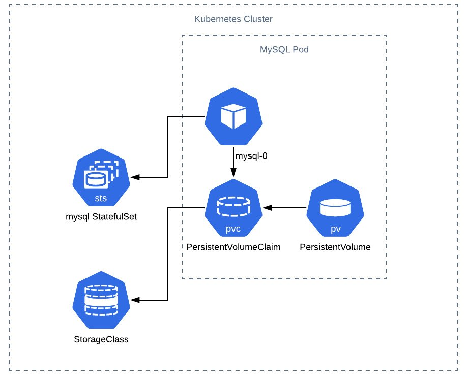


As you can see in the preceding diagram, and as you have learned up
until now in this course, Kubernetes is made up of modular components.
Thus, by leveraging the StatefulSet resource, we can compose the usage
of PersistentVolumes, PersistentVolumeClaims, StorageClasses, pods, and
some special rules around their life cycles that make much stronger
guarantees about the condition that the persistence layers of our app
are in.


Understanding StatefulSets
==========================


In *Figure 14.1*, we can see that a StatefulSet is invoked to be able to
manage pod life cycles. A StatefulSet (in older versions of Kubernetes,
this was called a PetSet) operates very similarly to a Deployment in
that we provide a pod template of what we want to run and how many
instances of it we want to run. What differs between a StatefulSet and a
Deployment is the following:

-   **A clear naming scheme that can be depended upon by pods in DNS
    queries**:

    This means that in the preceding diagram when we name a StatefulSet
    `mysql`, the first pod in that StatefulSet will always be
    `mysql-0`. This is unlike a traditional deployment where
    pod IDs are assigned randomly. It also means that if you had a pod
    named `mysql-2` and it crashed, it would be resurrected on
    the cluster using exactly the same name.

-   **A clearly ordered way in which updates must proceed**:

    Depending on the update strategy in this StatefulSet, each pod will
    be taken down in a very specific order. So, if you have a well-known
    upgrade path (such as in the case of minor software revisions in
    MySQL), you should be able to leverage one of the
    Kubernetes-provided software update strategies.

-   **Dependable storage operations**:

    Since storage is the most critical part of a stateful solution,
    having deterministic actions taken by a StatefulSet is imperative.
    By default, any PersistentVolume provisioned for a StatefulSet will
    be retained, even if that StatefulSet has been deleted. While this
    behavior is meant to prevent accidental deletion of data, it can
    lead to significant charges from your cloud provider during testing,
    so you should monitor this closely.

-   **A serviceName field that
    must be defined in the StatefulSet**:

    This `serviceName` field must refer to something called a
    \"headless\" service that points to this group of pods. This exists
    to allow the pods to be individually addressable using the common
    Kubernetes DNS syntax. So for example, if my StatefulSet is running
    in the default namespace and has the name
    `zachstatefulset`, then the first pod will have the DNS
    entry `zachstatefulset-0.default.svc.cluster.local`. The
    same DNS entry will be used by any replacement pod if this one
    fails.

    More on headless services can be found at this link:
    <https://kubernetes.io/docs/concepts/services-networking/service/#headless-services>.


Deployments versus StatefulSets
-------------------------------

Now that you\'ve been introduced to StatefulSets at a slightly more
granular level, on what basis should you choose between a StatefulSet
and a Deployment that uses a PersistentVolumeClaim? The answer to that
depends on what you\'re looking to orchestrate.

In theory, you could achieve similar behavior using both types of
Kubernetes object. Both create pods, both have update strategies, and
both can use PVCs to create and manage PersistentVolume objects. The
reason StatefulSets were designed was to give the guarantees laid out in
the preceding bullet points. Typically, you would want these guarantees
when orchestrating databases, file servers, and other forms of sensitive
persistence-dependent applications.

As we understand how StatefulSets are useful to predictably run the
stateful components of our applications, let\'s look at a specific
example that\'s relevant to us. As you\'ll recall from previous
labs, we have a little counter app that we are refactoring to
leverage as many cloud-native principles as possible as we go along. In
this lab, we will be replacing the state persistence mechanism and
testing out a new engine.


Further Refactoring Our Application
===================================


We\'d like to now take our application a little further into
cloud-native principles. Let\'s consider that the product manager for
our counter app said that we\'re getting insane amounts of load (and you
can confirm this through your observability toolset), and some people
are not always getting a strictly increasing number; sometimes, they are
getting duplicates of the same number. So, you confer with your
colleagues and come to the conclusion that in order to guarantee the
increasing number, you will need guarantees around how data is accessed
and persisted in your app.

Specifically, you need a guarantee that operations against this
datastore are atomically unique, consistent between operations, isolated
from other operations, and durable against failure. That is, you are
looking for an ACID-compliant database.

Note

More on what ACID compliance is can be found at this link:
<https://database.guide/what-is-acid-in-databases/>.

The team wants to be able to use a database, but they\'d rather not pay
for that database to be run by AWS. They would also rather not be locked
into AWS if they find better deals on GCP or Azure later.

So, after a brief look at Google for some options, your team settles on
using MySQL. MySQL is one of the more popular open-source RDBMS
solutions, and as such has a lot of documentation, support, and
community suggestions for implementation as a database solution in
Kubernetes.

Now the work begins on changing your code to support incrementing the
counter using a transaction supported by MySQL. So, to do this, we need
to change a few things:

-   Change our application code to use SQL instead of Redis to access
    the data and increment the counter.
-   Modify our Kubernetes cluster to run MySQL instead of Redis.
-   Ensure the durability of the storage underneath the database in case
    of catastrophic failure.

You may be asking yourself why a cluster operator or administrator would
need to be able to understand and refactor code. The advent of
Kubernetes accelerated a trend in the software industry of leveraging
DevOps tooling, practices, and culture to begin to deliver value to
customers more rapidly and more predictably. This means beginning to
scale our operations using software and not people. We need robust
automation to take the place of human-centric processes to be able to
make guarantees around functionalities and delivery speed. Thus, an
infrastructure designer or administrator having systems-level software
engineering experience to allow them to assist in refactoring a codebase
to leverage more cloud-native practices is a huge benefit for them in
their careers, and it may soon become a job requirement for all DevOps
engineers. So, let\'s take a look at how to refactor our application for
StatefulSets using MySQL for the transactions.

Note

If you are not yet comfortable programming or you are not familiar with
the syntax of the language the authors chose (Golang in this example),
you don\'t have to worry -- all of the solutions have been worked out
and are ready to be used.

First, let\'s examine our code for *Exercise 12.04*, *Deploying an
Application with State Management*:

main.go


```
28 if r.Method == "GET" { 
29     val, err := client.Get("num").Result() 
30     if err == redis.Nil { 
31         fmt.Println("num does not exist") 
32         err := client.Set("num", "0", 0).Err() 
33         if err != nil { 
34             panic(err) 
35         } 
36     } else if err != nil { 
37         w.WriteHeader(500) 
38         panic(err) 
39     } else { 
40         fmt.Println("num", val) 
41         num, err := strconv.Atoi(val) 
42         if err != nil { 
43             w.WriteHeader(500) 
44             fmt.Println(err) 
45         } else { 
46             num++ 
47             err := client.Set("num", strconv.Itoa(num), 0).Err() 
48             if err != nil { 
49                 panic(err) 
50             } 
51             fmt.Fprintf(w, "{number: %d}", num) 
52         } 
53 } 
```


Highlighted in the preceding code are the two instances where we are
accessing our persistence layer. As you can see, not only are we not
using a transaction, but we are manipulating the value in the code and
therefore cannot guarantee the constraint that this is a strictly
incrementing counter. To do this, we must change our strategy.

Note

You can find the required information for using a MySQL container at
this link: <https://hub.docker.com/_/mysql?tab=description>.

We have provided the refactored application that uses SQL. Let\'s take a
look at the code of the refactored application:

main.go


```
38 fmt.Println("Starting HTTP server") 
39 http.HandleFunc("/get-number", func(w http.ResponseWriter, r      *http.Request) { 
40     if r.Method == "GET" { 
41         tx, err := db.Begin() 
42             if err != nil { 
43         panic(err) 
44         } 
45         _, err = tx.Exec(t1) 
46         if err != nil { 
47             tx.Rollback() 
48             fmt.Println(err) 
49         } 
50         err = tx.Commit() 
51         if err != nil { 
52             fmt.Println(err) 
53         } 
54         row := db.QueryRow(t2, 1) 
55         switch err := row.Scan(&num); err { 
56         case sql.ErrNoRows: 
57             fmt.Println("No rows were returned!") 
58         case nil: 
59             fmt.Fprintf(w, "{number: %d}\n", num) 
60         default: 
61             panic(err) 
62         } 
63     } else { 
64         w.WriteHeader(400) 
65         fmt.Fprint(w, "{\"error\": \"Only GET HTTP method is                supported.\"}") 
66     } 
67 }
```

As you can see, it\'s roughly the same as the Redis code, except now our
value is being set in a transaction. Unlike Redis, MySQL is not a
volatile in-memory datastore, so operations against the database must be
persisted to disk to succeed, and ideally, they are persisted to a disk
that won\'t disappear when the pod is interrupted. Let\'s set up the
other required components of our application in the following exercise.


Exercise 14.01: Deploying a Counter App with a MySQL Backend
------------------------------------------------------------

In this exercise, we will reconfigure our counter app to work with a
MySQL backend instead of Redis:

1.  To Do
2.  Run the following command to get the manifest file,
    `with_mysql.yaml`, which defines all the required objects:

    
    ```
    curl -O https://raw.githubusercontent.com/fenago/kubernetes-course/master/lab12/Exercise14.01/with_mysql.yaml
    ```
    

    Open the file for inspection so we can examine this StatefulSet:

    with\_mysql.yaml

    
    ```
    44 apiVersion: apps/v1 
    45 kind: StatefulSet 
    46 metadata: 
    47   name: mysql 
    48 spec: 
    49   selector: 
    50    matchLabels: 
    51       app: mysql 
    52   serviceName: mysql 
    53   replicas: 1 
    54   template: 
    55     metadata: 
    56       labels: 
    57         app: mysql 
    58     spec: 
    ```
    

    Note

    Here, a PersistentVolumeClaim is automatically binding a 10 GiB
    volume from Amazon EBS on startup to each pod. Kubernetes will
    automatically provision the EBS volume using the IAM role that we
    defined in our Terraform file.

    When the pod gets interrupted for any reason, Kubernetes will
    automatically re-bind the appropriate PersistentVolume to the pod
    when it restarts, even if it is on a different worker node, so long
    as it is in the same availability zone.

3.  Let\'s apply this to our cluster by running the following command:

    
    ```
    kubectl apply -f with_mysql.yaml
    ```
    

    You should see this response:

    
    


4.  Now run `kubectl proxy` in this window and let\'s open up
    another terminal window:

    
    ```
    kubectl proxy
    ```
    

    You should see this response:

    
    ```
    Starting to serve on 127.0.0.1:8001
    ```
    

5.  In the other window, run the following command to access our
    application:

    
    ```
    curl localhost:8001/api/v1/namespaces/default/services/kubernetes-test-ha-application-with-mysql:/proxy/get-number
    ```
    

    You should see this response:

    
    ```
    {number: 1}
    ```
    

    You should see the app running as expected, as we have seen in the
    previous labs. And just like that, we have a working StatefulSet
    with our application using MySQL that is persisting data.

As we\'ve said, one of the things that will cause cluster operators to
not pursue StatefulSets as a way of being able to manage their data
infrastructure is a mistaken belief that the information in
PersistentVolumes is as ephemeral as the pods they are bound to. This is
not true. The PersistentVolumeClaims created by a StatefulSet will not
be deleted if a pod or even the StatefulSet is deleted. This is to
protect the data contained in these volumes at all costs. Thus, for
cleanup, we need to delete the PersistentVolume separately. Cluster
operators also have other tools at their disposal to prevent this from
happening, such as changing the reclamation policy of the
PersistentVolumes (or the StorageClass it was created from) that you are
creating.


Exercise 14.02: Testing the Resilience of StatefulSet Data in PersistentVolumes
-------------------------------------------------------------------------------

In this exercise, we will continue from where we left off in the last
exercise and test the resilience of the data that is in our application
by deleting a resource and seeing how Kubernetes responds:

1.  Now for the fun part, let\'s try to test the resilience of our
    persistence mechanism by deleting the MySQL pod:

    
    ```
    kubectl delete pod mysql-0
    ```
    

    You should see this response:

    
    ```
    pod "mysql-0" deleted
    ```
    

2.  The app may crash at this point, but if you keep trying the
    preceding `curl` command again after a few seconds, it
    should automatically continue counting from the number it had before
    we deleted the pod. We can verify this by trying to access the
    application again:

    
    ```
    curl localhost:8001/api/v1/namespaces/default/services/kubernetes-test-ha-application-with-mysql:/proxy/get-number
    ```
    

    You should see a response similar to the following:

    
    ```
    {number: 2}
    ```
    

    As you can see, we not only get a valid response from the
    application, but we also get the next number in the sequence
    (`2`), meaning that no data was lost when we lost our
    MySQL pod and Kubernetes recovered it.

    After you\'ve created this StatefulSet, cleaning it up is not as
    simple as running `kubectl delete -f with_mysql.yaml`.
    This is because Kubernetes will not automatically destroy a
    PersistentVolume created by a StatefulSet.

    Note

    This also means that even if we try to delete all of our AWS
    resources using `terraform destroy`, we will still be
    paying for orphaned EBS volumes in AWS indefinitely (and we don\'t
    want that in this example).

3.  So, to clean up, we need to find out what PersistentVolumes are
    bound to this StatefulSet. Let\'s list the PersistentVolumes in the
    default namespace of our cluster:

    
    ```
    kubectl get pv
    ```
    

    You should see a response similar to the following:

    
    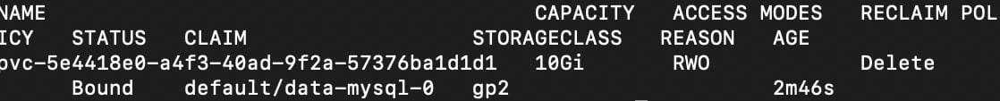
    


4.  It looks like we have a PersistentVolume named
    `data-mysql-0`, which is the one we want to delete. First,
    we need to remove the objects that created this. Thus, let\'s first
    delete our application and all of its components:

    
    ```
    kubectl delete -f with_mysql.yaml
    ```
    

    You should see this response:

    
    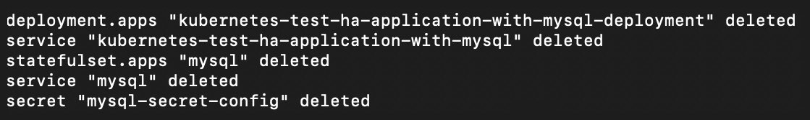
    

5.  Let\'s check on the PersistentVolume that we were trying to remove:

    
    ```
    kubectl get pv
    ```
    

    You should see a response similar to this:

    
    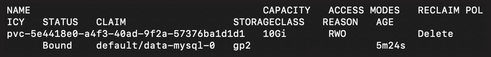
    


    From this image, it appears that our volume is still there.

6.  We need to remove both the PersistentVolume and the
    PersistentVolumeClaim that created it. To do this, let\'s run the
    following command:

    
    ```
    kubectl delete pvc data-mysql-0
    ```
    

    You should see this response:

    
    ```
    persistentvolumeclaim "data-mysql-0" deleted
    ```
    

    Once we delete the PersistentVolumeClaim, the PersistentVolume
    becomes `unbound` and is subject to its reclaim policy,
    which we can see in the screenshot of the previous step. In this
    case, the policy is to delete the underlying storage volume.

7.  To verify that the PV is deleted, let\'s run the following:

    
    ```
    kubectl get pv
    ```
    

    You should see the following response:

    
    ```
    No resources found in default namespace.
    ```
    

    As is apparent in this screenshot, our PersistentVolume has now been
    deleted.

    Note

    If the reclaim policy for your case is anything other than
    `Delete`, you will need to manually delete the
    PersistentVolume as well.

8.  Now that we have cleaned up our PersistentVolumes and
    PersistentVolumeClaims, we can continue to clean up as we would
    normally by running the following command:

    
    ```
    terraform destroy
    ```
    

    You should see a response that ends as in this screenshot:

    
    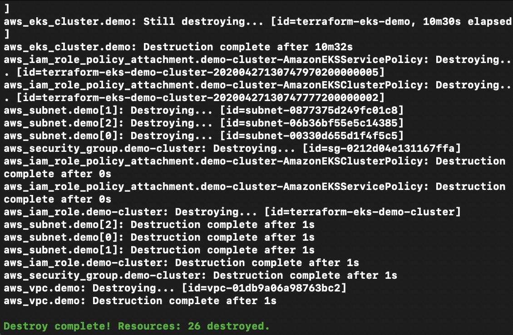
    


In this exercise, we have seen how Kubernetes tries to preserve
PersistentVolumes even when we delete the StatefulSet. We have also seen
how to proceed when we actually want to remove a PersistentVolume.

Now that we have seen how to set up a StatefulSet and run a MySQL
database attached to it, we will extend the principle of high
availability further in the following activity. Before we do this,
though, we need to address the problem of Kubernetes manifest sprawl,
because it seems to take more and more YAML manifests to achieve our
objective of building highly available stateful applications. In the
following section, we will learn about a tool that will help us better
organize and manage the manifests for our applications.


Helm
====


In this section, we are going to be taking a look at a tool that is very
helpful in the Kubernetes ecosystem called Helm. Helm was created by
Microsoft after it quickly became apparent that for any sizeable
deployment of Kubernetes (for example, those involving 20 or more
separate components, observability tools, services, and other objects),
there are a lot of YAML manifests to keep track of. Couple that with the
fact that many companies run multiple environments other than
production, which you need to be able to keep in sync with each other,
and you start to have an unwieldy problem on your hands.

Helm allows you to write Kubernetes manifest templates, to which you
supply arguments that override any defaults, and then Helm creates the
appropriate Kubernetes manifests for you. Thus, you can use Helm as a
sort of package manager, where your entire application can be deployed
using a Helm chart, and you can tweak a few small parameters before
installing. Another way to use Helm is as a templating engine. It allows
an experienced Kubernetes operator to write a good template only one
time and then it can be used by people not familiar with the Kubernetes
manifest syntax to successfully create Kubernetes resources. A Helm
chart can be created with any number of fields set by arguments, and a
base template can be adapted to deploy vastly different implementations
of a piece of software or a microservice to suit different needs.

Helm packages are called \"charts\" and they have a specific folder
structure. You can either use a shared Helm chart repository from Git,
an Artifactory server, or a local filesystem. In the upcoming exercise,
we\'re going to look at a Helm chart and install it on our clusters.

This is a good point to be introduced to Helm in your journey of
learning Kubernetes because if you\'ve been following along, you\'ve
written quite a bit of YAML and applied it to your cluster. Also, a lot
of what we\'ve written is a repeat of things that we\'ve seen before.
So, leveraging Helm\'s templating functionality will be helpful for
packaging up similar components and delivering them using Kubernetes.
You don\'t have to leverage the templating components of Helm to use it,
but it helps so that you can reuse the chart for multiple different
permutations of the resulting Kubernetes object.

Note

We will be using Helm 3, which has significant differences from its
predecessor, Helm 2, and was only recently released. If you are familiar
with Helm 2 and want to know about the differences, you can refer to the
documentation at this link:
<https://v3.helm.sh/docs/faq/#changes-since-helm-2>.

Detailed coverage of Helm is beyond the scope of this course, but the
fundamentals covered here serve as a great starting point, and also put
into perspective how different tools and technologies can work together
to remove several hurdles of complex application orchestration in
Kubernetes.

Let\'s see how we can create a chart (which is the Helm term for a
package) and apply it to a cluster. Then, we will understand how Helm
generates Kubernetes manifest files from a Helm chart.

Let\'s make a new Helm chart by running the following command:


```
helm create chart-dev
```

You should see the following response:


```
Creating chart-dev
```

When you create a new chart, Helm will generate a chart for NGINX as a
placeholder application by default. This will create a new folder and
skeleton chart for us to examine.

Note

For the following section, make sure that you have `tree`
installed as per the instructions in the *Preface*.

Let\'s use the Linux `tree` command and take a look at what
Helm has made for us:


```
tree .
```

You should see a response similar to the following:


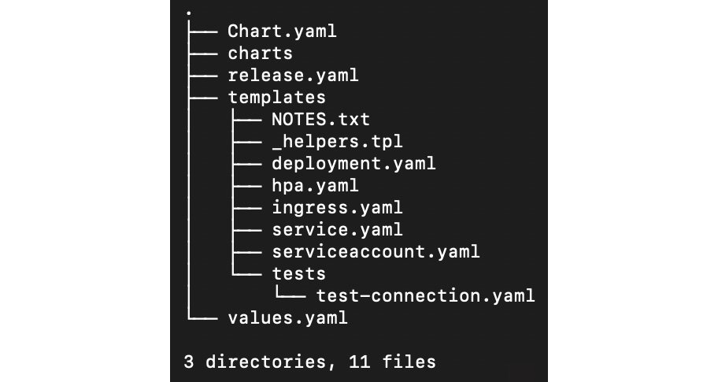


Pay attention to the `templates` folder and the
`values.yaml` file. Helm works by using the values found in
the `values.yaml` file and fills those values into the
corresponding placeholders in the files inside the `templates`
folder. Let\'s examine a part of the `values.yaml` file:

values.yaml


```
1  # Default values for chart-dev.
2  # This is a YAML-formatted file.
3  # Declare variables to be passed into your templates.
4  
5  replicaCount: 1
6  
7  image:
8    repository: nginx
9    pullPolicy: IfNotPresent
10   # Overrides the image tag whose default is the chart appVersion.
11   tag: ""
12 
13 imagePullSecrets: []
14 nameOverride: ""
15 fullnameOverride: ""
```

As we can see here, this is not a Kubernetes manifest, but it looks like
it has many of the same fields. In the preceding snippet, we have
highlighted the entire `image` block. This has three fields
(`repository`, `pullPolicy`, and `tag`),
each with their corresponding values.

Another notable file is `Chart.yaml`. The following line from
this file is relevant to our discussion:


```
appVersion: 1.16.0
```


The comment in the file is pretty descriptive of what this means:
*\"This is the version number of the application being deployed. This
version number should be incremented each time you make changes to the
application. Versions are not expected to follow Semantic Versioning.
They should reflect the version the application is using.\"*

So, how does Helm assemble these into the traditional Kubernetes
manifest format that we expect? To understand that, let\'s inspect the
corresponding section of the `deployment.yaml` file in the
`templates` folder:

deployment.yaml


```
30  containers:
31    - name: {{ .Chart.Name }}
32      securityContext:
33        {{- toYaml .Values.securityContext | nindent 12 }}
34      image: "{{ .Values.image.repository }}:{{ .Values.image.tag |           default .Chart.AppVersion }}"
35      imagePullPolicy: {{ .Values.image.pullPolicy }}
```

This file looks a lot more like a Kubernetes manifest with a bunch of
variables added into it. Comparing the template placeholders from
`deployment.yaml` to the observations from
`values.yaml` and `Chart.yaml`, we can infer the
following:

-   `{{ .Values.image.repository }}` will be interpreted as
    `nginx`.
-   `{{ .Values.image.tag | default .Chart.AppVersion }}` will
    be interpreted as `1.16.0`.

Thus, we get the resultant field for our deployment spec as
`image: nginx:1.16.0`.

This is our first glimpse into the Helm templating language. For those
familiar with templating engines such as Jinja, Go templating, or Twig,
this syntax should look familiar. As mentioned earlier, we will not dive
into too many details about Helm, but you can find more on the Helm
documentation at this link:
<https://helm.sh/docs/chart_template_guide/>.

Now, let\'s install the sample
chart `chart-dev` that we have generated. This chart will
deploy an example NGINX app to our Kubernetes cluster. To install a Helm
chart, the command would look as follows:


```
helm install [NAME] [CHART] [flags]
```

We can use
`--generate-name` to get a random name. Also, since we are
already in the `chart-dev` directory, we can directly use
`values.yaml` from the root of the current working directory:


```
helm install --generate-name -f values.yaml .
```

You should see the following response:


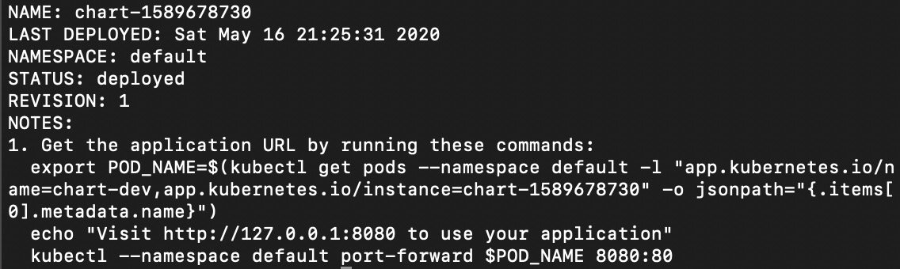


Notice that in the output, you are given instructions on what to do
next. These are customizable instructions from the
`templates/NOTES.txt` file. When you make your own Helm chart,
you can use these to guide whoever is using the chart. Now, let\'s run
these commands.

Note

The exact values in this output are customized to your particular
environment, so you should copy the commands from your terminal output.
This applies to the following command.

The first command sets the pod name into an environment variable named
`POD_NAME`:


```
export POD_NAME=$(kubectl get pods --namespace default -l "app.kubernetes.io/name=chart-dev,app.kubernetes.io/instance=chart-1589678730" -o jsonpath="{.items[0].metadata.name}")
```

We\'ll skip the `echo` command; it just tells you how to
access your application. The reason this `echo` command exists
is to show what the next commands are going to be in the terminal
output.

Now before we access our application, we need to do some port
forwarding. The next command maps port `8080` on your host to
port `80` on the pod:


```
kubectl --namespace default port-forward $POD_NAME 8080:80
```

You should see this response:


```
Forwarding from 127.0.0.1:8080 ->80
Forwarding from [::1]:8080 -> 80
```

Now let\'s try to access NGINX. In a browser, go to
`localhost:8080`. You should be able to see the default NGINX
landing page:


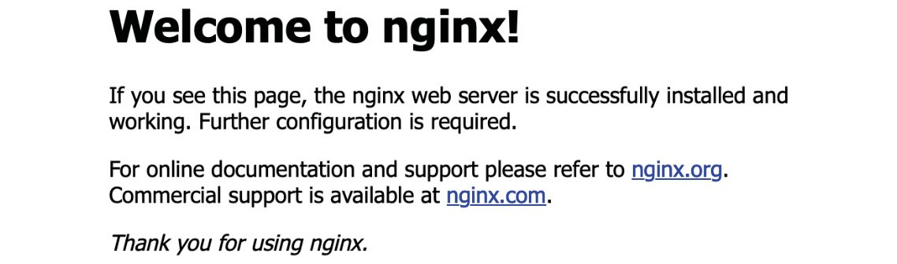


You can clean this up by deleting our resources. First, let\'s get the
generated name of this release by getting a list of all the releases
installed by Helm in your cluster:


```
helm ls
```

You should see a response similar to this:


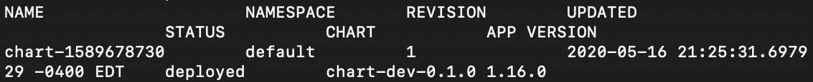


Now, we can remove the release as follows:


```
helm uninstall chart-1589678730
```

Use the name from the previous output. You should see this response:


```
release "chart-1589678730" uninstalled
```

And just like that, we\'ve written our first chart. So, let\'s proceed
to the following exercise, where we will learn exactly how Helm can make
our job easier.


Exercise 14.03: Chart-ifying Our Redis-Based Counter Application
----------------------------------------------------------------

We created a generic Helm chart in the previous section, but what if we
want to make our own chart for our software? In this exercise, we will
create a Helm chart that will deploy our HA Redis-based solution from
*Lab 12*, *Your Application and HA*, using Helm.

1.  If you are inside the `chart-dev` directory, navigate to
    the parent directory:
    
    ```
    cd ..
    ```
    

2.  Let\'s start by making a fresh Helm chart:

    
    ```
    helm create redis-based-counter && cd redis-based-counter
    ```
    

    You should see this response:

    
    ```
    Creating redis-based-counter
    ```
    

3.  Now let\'s remove the unnecessary files from our chart:
    
    ```
    rm templates/NOTES.txt; \
    rm templates/*.yaml; \
    rm -r templates/tests/; \
    cd templates
    ```
    

4.  Now, we need to navigate into the `templates` folder of
    our chart and copy in the files from our repo for the Redis-based
    counter application:

    
    ```
    curl -O https://raw.githubusercontent.com/fenago/kubernetes-course/master/lab12/Exercise14.03/templates/redis-deployment.yaml; \
    curl -O https://raw.githubusercontent.com/fenago/kubernetes-course/master/lab12/Exercise14.03/templates/deployment.yaml;\
    curl -O https://raw.githubusercontent.com/fenago/kubernetes-course/master/lab12/Exercise14.03/templates/redis-service.yaml; \
    curl -O https://raw.githubusercontent.com/fenago/kubernetes-course/master/lab12/Exercise14.03/templates/service.yaml
    ```
    

    You may recall from previous labs that we had multiple
    Kubernetes manifests sharing one file, separated by the
    `---` YAML file separator string. Now that we have a tool
    for managing Kubernetes manifests, it\'s better to keep them in
    separate files so that we can manage them independently. The job of
    bundling will now be handled by Helm.

5.  There should be four files in the `templates` folder.
    Let\'s confirm that as follows:

    
    ```
    tree .
    ```
    

    You should see the following response:

    
    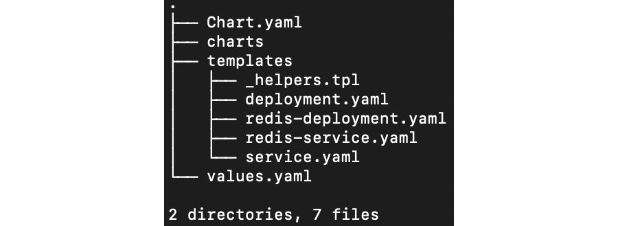
    


6.  ow we need to modify the `values.yaml` file. Delete all
    contents from that file and copy only the following into it:
    
    ```
    deployment:
      replicas: 3
    redis:
      version: 3
    ```
    

7.  Now, to wire them together, we need to edit both
    `deployment.yaml` and `redis-deployment.yaml`.
    The one we will edit first is `deployment.yaml`. We should
    replace `replicas: 3` with the template, as shown in the
    highlighted line in the following manifest:
    
    ```
    apiVersion: apps/v1
    kind: Deployment
    metadata:
      name: kubernetes-test-ha-application-with-redis-deployment
      labels:
        app: kubernetes-test-ha-application-with-redis
    spec:
      replicas: {{ .Values.deployment.replicas }}
      selector:
        matchLabels:
          app: kubernetes-test-ha-application-with-redis
      template:
        metadata:
          labels:
            app: kubernetes-test-ha-application-with-redis
        spec:
          containers:
            - name: kubernetes-test-ha-application-with-redis
              image: fenago/the-kubernetes-workshop:demo-app-with-redis
              imagePullPolicy: Always
              ports:
                - containerPort: 8080
              env:
                - name: REDIS_SVC_ADDR
                  value: "redis.default:6379"
    ```
    

8.  Next, edit the
    `redis-deployment.yaml` file and add a similar block of
    templating language, as shown in the highlighted line in the
    following manifest:
    
    ```
    apiVersion: apps/v1 # for versions before 1.9.0 use apps/v1beta2
    kind: Deployment
    metadata:
      name: redis
      labels:
        app: redis
    spec:
      selector:
        matchLabels:
          app: redis
      replicas: 1
      template:
        metadata:
          labels:
            app: redis
        spec:
          containers:
            - name: master
              image: redis:{{ .Values.redis.version }}
              resources:
                requests:
                  cpu: 100m
                  memory: 100Mi
              ports:
                - containerPort: 6379
    ```
    

9.  Now let\'s install our application using Helm:

    
    ```
    helm install --generate-name -f values.yaml .
    ```
    

    You should see a response similar to this:

    
    
    

10. To check whether our application is online, we can get the list of
    deployments:

    
    ```
    kubectl get deployment
    ```
    

    You should see the following output:

    
    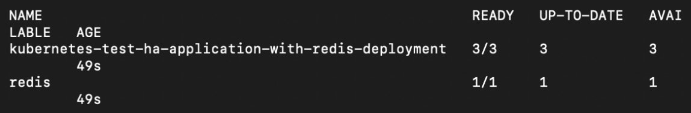
    


As you can see, Helm has deployed our application deployment, as well as
the Redis backend for it. With these skills in the bag, you are soon to
be a captain of Helm.

In the following activity, we will bring together the two things we
learned in this lab -- refactoring our application for stateful
components and then deploying it as a Helm chart.


Activity 14.01: Chart-ifying Our StatefulSet Deployment
-------------------------------------------------------

Now that you have experience with MySQL, StatefulSets, and Helm for
resource management, your activity is to take what you learned in
*Exercises 14.01*, *14.02*, and *14.03* and combine them together.

For this activity, we will refactor our Redis-based application to use
MySQL as the backend datastore using StatefulSets, and then deploy it
using Helm.

Follow these high-level guidelines to complete the activity:

1.  Set up the required cluster infrastructure as shown in *step 1* of
    *Exercise 14.01*, *Deploying a Counter App with a MySQL Backend*.
2.  Introduce a new Helm chart called `counter-mysql`.
3.  Create a template for our counter application that uses MySQL as its
    backend.
4.  Create a template for our MySQL StatefulSet.
5.  Wire everything together with Kubernetes Service objects wherever
    appropriate.
6.  Configure the template such that the `values.yaml` file is
    able to change the version of MySQL.
7.  Test the application. You should see a similar output to that which
    we\'ve seen in previous exercises with our counter application:
    
    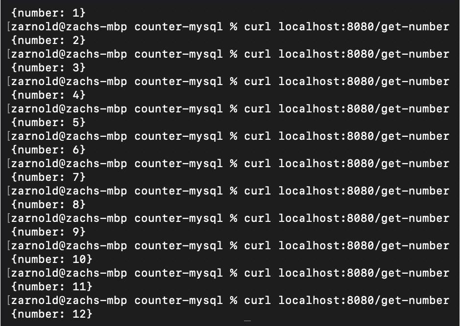
    


Note

The solution to this activity can be found at the following address:
`Activity_Solutions\Solution_Final.pdf`.

Also, don\'t forget to clean up your cloud resources using the
`terraform destroy` command to stop AWS from billing you after
you are done with the activity.


Summary
=======


Over the course of this lab, we have applied our skills to be able
to leverage StatefulSets in our example application. We have looked at
how to think about running stateful portions of our software
programmatically and how to refactor applications to leverage that
change in state persistence. Finally, we learned how to create and run
Kubernetes StatefulSets that will allow us to run stateful components in
our cluster and make guarantees about how that workload will be run.

Being equipped with the skills needed to manage stateful components on
our Kubernetes cluster is a major step in being able to operate
effectively in many real-world applications that you are likely to come
across.