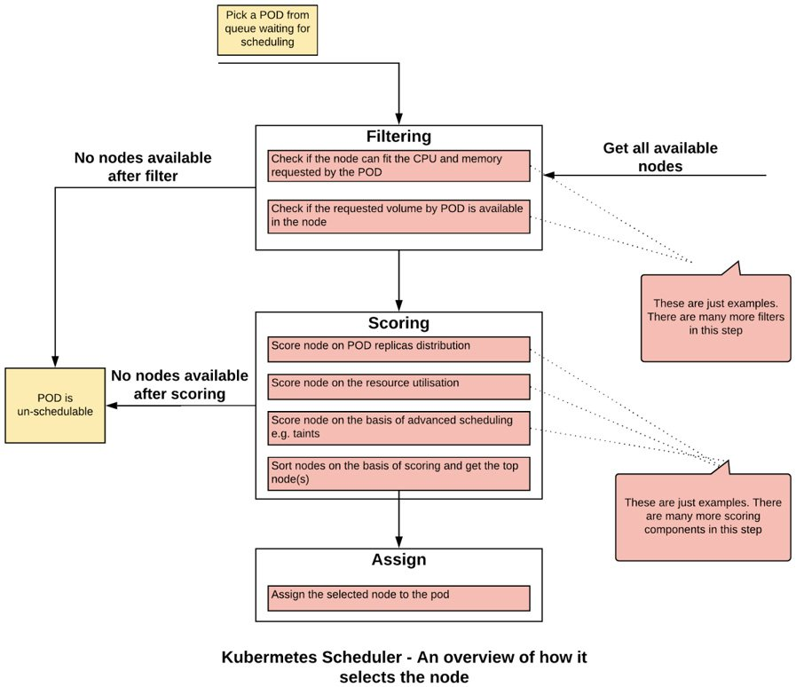
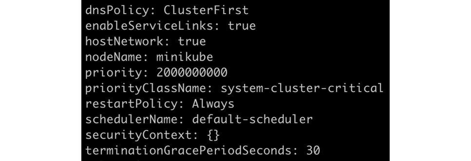

Advanced Scheduling in Kubernetes
=====================================


Overview

This chapter focuses on scheduling, which is the process by which
Kubernetes selects a node for running a Pod. In this chapter, we will
take a closer look at this process and the Kubernetes Scheduler, which
is the default Kubernetes component responsible for this process.

By the end of this chapter, you will be able to use different ways to
control the behavior of the Kubernetes Scheduler to suit the
requirements of an application. The chapter will equip you to be able to
choose appropriate Pod scheduling methods to control which nodes you
want to run your Pods on based on your business needs. You will learn
about the different ways to control the scheduling of Pods on the
Kubernetes cluster.


Introduction
============


We have seen that we package our applications as containers and deploy
them as a Pod in Kubernetes, which is the minimal unit of Deployment.
With the help of the advanced scheduling capabilities provided by
Kubernetes, we can optimize the deployment of these Pods with respect to
our hardware infrastructure to meet our needs and get the most out of
the available resources.

Kubernetes clusters generally have more than a few nodes (or machines or
hosts) where the Pod can be executed. Consider that you are managing a
few of the machines and you have been assigned to execute an application
on these machines. What would you do to decide which machine is the best
fit for the given application? Until now in this workshop, whenever you
wanted to run a Pod on a Kubernetes cluster, have you mentioned which
node(s) the Pod should run on?

That\'s right -- we don\'t need to; Kubernetes comes with a smart
component that finds the best node to run your Pod. This component is
the **Kubernetes Scheduler**. In this chapter, we will look a bit more
deeply into how the Kubernetes Scheduler works, and how to adapt it to
better control our cluster to suit different needs.


The Kubernetes Scheduler
========================


As mentioned in the introduction, a typical cluster has several nodes.
When you create a Pod, Kubernetes has to choose a node and assign the
Pod to it. This process is known as **Pod scheduling**.

The Kubernetes component that is responsible for deciding which node a
Pod should be assigned to for execution is called a scheduler.
Kubernetes comes with a default scheduler that suffices for most use
cases. For example, the default Kubernetes Scheduler spreads the load
evenly in the cluster.

Now, consider a scenario in which two different Pods are expected to
communicate with each other very often. As a system architect, you may
want them to be on the same node to reduce latency and free up some
internal networking bandwidth. The Scheduler does not know the
relationship between different types of Pods, but Kubernetes provides
ways to inform the Scheduler about this relationship and influence the
scheduling behavior so that these two different Pods can be hosted on
the same node. But first, let\'s take a closer look at the Pod
**scheduling process**.


The Pod Scheduling Process
==========================


The scheduler works in a three-step process: **filtering**, **scoring**,
and **assigning**. Let\'s take a look at what happens during the
execution of each of these steps. An overview of the process is
described in the following diagram:





Filtering
---------

Filtering is a process in which the **Kubernetes Scheduler** runs a
series of checks or filters to see which nodes are not suitable to run
the target Pod. An example of a filter is to see if the node has enough
CPU and memory to host the Pod, or if the storage volume requested by
the Pod can be mounted on the host. If the cluster has no node that\'s
suitable to meet the requirements of the Pod, then the Pod is deemed
un-schedulable and is not executed on the cluster.


Scoring
-------

Once the **Kubernetes Scheduler** has a list of feasible nodes, the
second step is to score the nodes and find the best node(s) to host the
target Pod. The node is passed through several priority functions and
assigned a priority score. Each function assigns a score between 0 and
10, where 0 is the lowest and 10 is the highest.

To understand priority functions, let\'s take
`SelectorSpreadPriority` as an example. This priority function
uses label selectors to find the Pods that are associated together.
Let\'s say, for example, that a bunch of Pods is created by the same
Deployment. As the name SpreadPriority suggests, this function tries to
spread the Pods across different nodes so that in case of a node
failure, we will still have replicas running on other nodes. Under this
priority function, the Kubernetes Scheduler selects the nodes that have
the fewest Pods running using the same label selectors as the requested
Pod. These nodes will be assigned the highest score and vice versa.

Another example of a priority function is
`LeastRequestedPriority`. This tries to spread the workload on
the nodes that have the most resources available. The scheduler gets the
nodes that have the lowest amount of memory and CPU allocated to
existing Pods. These nodes are assigned the highest scores. In other
words, this priority function will assign a higher score for a larger
amount of free resources.

Note

There are far too many priority functions to cover within the limited
scope of this chapter. The full list of priority functions can be found
at the following link:
<https://kubernetes.io/docs/concepts/scheduling/kube-scheduler/#scoring>.


Assigning
---------

Lastly, the Scheduler informs the API server about the node that has
been selected based on the highest score. If there are multiple nodes
with the same score, the Scheduler picks a random node and effectively
applies a tiebreaker.

The default Kubernetes Scheduler runs as a Pod in the
`kube-system` namespace. You can see it running by listing all
the Pods in the `kube-system` namespace:


```
kubectl get pods -n kube-system
```

You should see the following list of Pods:


In our Minikube environment, the Kubernetes Scheduler Pod is named
`kube-scheduler-minikube`, as you can see in this screenshot.


Timeline of Pod Scheduling
--------------------------

Let\'s dig into the timeline of the **Pod scheduling** process. When you
request a Pod to be created, different Kubernetes components get invoked
to assign the Pod to the right node. There are three steps involved,
from requesting a Pod to assigning a node. The following diagram gives
an overview of this process, and we will elaborate and break down the
process into more detailed steps after the diagram:


**Step 1**: When a request is raised for creating and running a Pod, for
instance, through a kubectl command or by a Kubernetes Deployment, the
API server responds to this request. It updates the Kubernetes internal
database (etcd) with a Pod pending entry to be executed. Note that at
this stage, there is no guarantee that Pod will be scheduled.

**Step 2**: The **Kubernetes Scheduler** constantly watches the
Kubernetes data store through the API server. As soon as a Pod creation
request is available (or a Pod is in the pending state), the Scheduler
tries to schedule it. It is important to note that the Scheduler is not
responsible for running the Pod. It simply calculates the best node for
hosting the Pod and informs the Kubernetes API server, which then stores
this information in etcd. In this step, the Pod is assigned to the
optimal node, and the association is stored in etcd.

**Step 3**: The Kubernetes agent (kubelet) constantly watches the
Kubernetes data store through the API server. As soon as a new Pod is
assigned to a node, it tries to execute the Pod on the node. When the
Pod is successfully up and running, it is marked as running in etcd
through the API server, and now the process is complete.

Now that we have an idea of the scheduling process, let\'s see how we
can tweak it to suit our needs in the following topic.


Managing the Kubernetes Scheduler
=================================


Kubernetes provides many parameters and objects through which we can
manage the behavior of the **Kubernetes Scheduler**. We will look into
the following ways of managing the scheduling process:

-   Node affinity and anti-affinity
-   Pod affinity and anti-affinity
-   Pod priority and preemption
-   Taints and tolerations


Node Affinity and Anti-Affinity
-------------------------------

Using node affinity rules, a Kubernetes cluster administrator can
control the placement of Pods on specific sets of nodes. Node affinity
or anti-affinity allows you to constrain which nodes a Pod can run on
based on the labels of the nodes.

Imagine that you are an administrator of the shared Kubernetes cluster
in a bank. Multiple teams are running their applications on the same
cluster. Your organization\'s security group has identified nodes that
can run data-sensitive applications and would like you to make sure that
no other applications run on those nodes. Node affinity or anti-affinity
rules provide a solution to this requirement to only associate specific
Pods to a set of nodes.

Node affinity rules are defined through two components. First, you
assign a label to a set of nodes. The second part is to configure the
Pods to associate them only with the nodes with certain labels. Another
way to think about this is that the Pod defines where it should be
placed, and the Scheduler matches the labels in this definition with the
node labels.

There are two types of node affinity/anti-affinity rules:

-   **Required rules** are hard rules. If these rules are not met, the
    Pod cannot be scheduled on a node. It is defined as the
    `requiredDuringSchedulingIgnoredDuringExecution` section
    in the Pod specification. Please see *Exercise 17.01*, *Running a
    Pod with Node Affinity* as an example of this.
-   **Preferred rules** are soft rules. The Scheduler tries to enforce
    preferred rules whenever possible, but it goes ahead to ignore them
    when the rules cannot be enforced, that is, the Pod would be
    rendered unschedulable if these rules were followed as rigidly.
    Preferred rules are defined as the
    `preferredDuringSchedulingIgnoredDuringExecution` section
    in the Pod specification.

Preferred rules have weights associated with each criterion. The
Scheduler will create a score based on these weights to schedule a Pod
at the right node. The value of the weight field ranges from 1 to 100.
The Scheduler calculates the priority score for all the suitable nodes
to find the optimal one. Note that the score can be impacted by other
priority functions, such as `LeastRequestedPriority`.

If you define a weight that is too low (compared to the other weights),
then the overall score will be most affected by other priority
functions, and our preferred rule may have little effect on the
scheduling process. If you have multiple rules defined, then you can
alter the weights of the rules that are the most important to you.

Affinity rules are defined in the Pod specification. Based on the labels
of our desired/undesired nodes, we would provide the first part of the
selection criteria in the Pod spec. It consists of the set of labels
and, optionally, their values.

The other part of the criteria is to provide the way we want to match
the labels. We define these matching criteria as the **operator** in the
affinity definition. This operator can have the following values:

-   The `In` operator instructs the Scheduler to schedule the
    Pods on the nodes that match the label and one of the specified
    values.
-   The `NotIn` operator instructs the Scheduler to not
    schedule the Pods on the nodes that do not match the label and any
    of the specified values. This is a negative operator and denotes the
    anti-affinity configuration.
-   The `Exists` operator instructs the Scheduler to schedule
    the Pods on the nodes that match the label. The value of the label
    does not matter in this case. Thus, this operator is satisfied even
    if the specified label exists and the value of the label does not
    match.
-   The `DoesNotExist` operator instructs the Scheduler to not
    schedule the Pods on the nodes that do not match the label. The
    value of the label does not matter in this case. This is a negative
    operator and denotes the anti-affinity configuration.

Note that affinity and anti-affinity rules are defined based on the
labels on the nodes. If the labels on a node are changed, it is possible
that a node affinity rule may no longer be applied. In this case, the
Pods that are running will continue to run on the node. If a Pod is
restarted, or if it dies and a new Pod is created, Kubernetes considers
this a new Pod. In this case, if the node labels have been modified, the
Scheduler may not put the Pod on the same node. This is something that
you would want to be mindful of when you modify node labels. Let\'s
implement these rules for a Pod in the following exercise.


Exercise 17.01: Running a Pod with Node Affinity
------------------------------------------------

In this exercise, we will configure a Pod to be scheduled on the node
available in our Minikube environment. We will also see, if the labels
do not match, the Pod will be in the `Pending` state. Think of
this state in which the scheduler is unable to find the right node to
assign to the Pod:

1.  Create a new namespace called `schedulerdemo` using the
    following command:

    
    ```
    kubectl create ns schedulerdemo
    ```
    

    You should see the following response:

    
    ```
    namespace/schedulerdemo created
    ```
    

2.  Now we need to create a Pod with node affinity defined. Create a
    file named `pod-with-node-affinity.yaml` with the
    following specification:

    
    ```
    apiVersion: v1
    kind: Pod
    metadata:
      name: pod-with-node-affinity
    spec:
      affinity:
       nodeAffinity: 
         requiredDuringSchedulingIgnoredDuringExecution: 
           nodeSelectorTerms:
           - matchExpressions:
             - key: data-center 
               operator: In 
               values:
               - sydney 
      containers:
        - name: pod-with-node-affinity-container
          image: k8s.gcr.io/busybox
          command: [ "/bin/sh", "-c", "while :; do echo '.'; sleep         5 ; done" ]
    ```
    

    Note that in the Pod specification, we have added the new
    `affinity` section. This rule is configured as
    `requiredDuringSchedulingIgnoredDuringExecution`. This
    means if the node with a matching label does not exist, this Pod
    will not get scheduled. Also note that as per the `In`
    operator, the expressions mentioned here are to be matched with the
    node labels. In this example, a matching node would have the label
    `data-center=sydney`.

3.  Try to create this Pod and see if it gets scheduled and executed:

    
    ```
    kubectl create -f pod-with-node-affinity.yaml -n schedulerdemo
    ```
    

    You should see the following response:

    
    ```
    pod/pod-with-node-affinity created
    ```
    

    Note that the response you see here does not necessarily imply that
    the Pod has successfully been executed on a node. Let\'s check that
    in the following step.

4.  Check the status of the Pod using this command:

    
    ```
    kubectl get pods -n schedulerdemo
    ```
    

    You will see the following response:

    
    ```
    NAME                     READY    STATUS    RESTARTS   AGE
    pod-with-node-affinity   0/1      Pending   0          10s   
    ```
    

    From this output, you can see that the Pod is in the
    `Pending` state and it is not being executed.

5.  Check the `events` to see why the Pod is not being
    executed:

    
    ```
    kubectl get events -n schedulerdemo
    ```
    

    You will see the following response:

    
    
    


    You can see that Kubernetes is saying that there is no node to match
    the selector for this Pod.

6.  Let\'s delete the Pod before proceeding further:

    
    ```
    kubectl delete pod pod-with-node-affinity -n schedulerdemo
    ```
    

    You should see the following response:

    
    ```
    pod "pod-with-node-affinity" deleted
    ```
    

7.  Now, let\'s see what nodes are available in our cluster:

    
    ```
    kubectl get nodes
    ```
    

    You will see the following response:

    
    ```
    NAME        STATUS    ROLES    AGE    VERSION
    minikube    Ready     master   105d   v1.14.3
    ```
    

    Since we are using Minikube, there is only one node available called
    `minikube`.

8.  Check the label for the `minikube` node. Use the
    `describe` command as shown here:

    
    ```
    kubectl describe node minikube
    ```
    

    You should see the following response:

    
    
    


    As you can see, the label that we want,
    `data-center=sydney`, does not exist.

9.  Now, let\'s apply the desired label to our node using this command:

    
    ```
    kubectl label node minikube data-center=sydney
    ```
    

    You will see the following response indicating that the node was
    labeled:

    
    ```
    node/minikube labeled
    ```
    

10. Verify whether the label is applied to the node using the
    `describe` command:

    
    ```
    kubectl describe node minikube
    ```
    

    You should see the following response:

    
    
    


    As you can see in this image, our label has now been applied.

11. Now try to run the Pod again and see if it can be executed:

    
    ```
    kubectl create -f pod-with-node-affinity.yaml -n schedulerdemo
    ```
    

    You should see the following response:

    
    ```
    pod/pod-with-node-affinity created
    ```
    

12. Now, let\'s check whether the Pod is successfully running:

    
    ```
    kubectl get pods -n schedulerdemo
    ```
    

    You should see the following response:

    
    ```
    NAME                     READY    STATUS     RESTARTS   AGE
    pod-with-node-affinity   1/1      Running    0          5m22s
    ```
    

    Thus, our Pod is successfully running.

13. Let\'s check out how Pod scheduling is displayed in
    `events`:

    
    ```
    kubectl get events -n schedulerdemo
    ```
    

    You will get the following response:

    
    
    


    As you can see in the preceding output, the Pod has been
    successfully scheduled.

14. Now, let\'s do some housekeeping to avoid conflicts with further
    exercises and activities. Delete the Pod using this command:

    
    ```
    kubectl delete pod pod-with-node-affinity -n schedulerdemo
    ```
    

    You should see the following response:

    
    ```
    pod "pod-with-node-affinity" deleted
    ```
    

15. Remove the label from the node using the following command:

    
    ```
    kubectl label node minikube data-center-
    ```
    

    Note that the syntax for deleting the label from the Pod has an
    additional hyphen (`–`) after the label name. You should
    see the following response:

    
    ```
    node/minikube labeled
    ```
    

In this exercise, we have seen how node affinity works by labeling a
node and then scheduling a Pod on the labeled node. We have also seen
how Kubernetes events can be used to see the status of Pod scheduling.

The `data-center=sydney` label that we used in this exercise
also hints at an interesting use case. We can use node affinity and
anti-affinity rules to target not just a specific Pod, but also specific
server racks or data centers. We would simply assign specific labels to
all nodes in a specific server rack, data center, availability zone, and
so on. Then, we can simply pick and choose the desired targets for our
Pods.


Pod Affinity and Anti-Affinity
==============================


Pod affinity and Pod anti-affinity allow your Pods to check what other
Pods are running on a given node before they are scheduled on that node.
Note that other Pods in this context do not mean a new copy of the same
Pod, but Pods related to different workloads.

Pod affinity allows you to control on which node your Pod is eligible to
be scheduled based on the labels of the other Pods that are already
running on that node. The idea is to cater to the need to place two
different types of containers relative to each other at the same place
or to keep them apart.

Consider that your application has two components: a frontend part (for
example, a GUI) and a backend (for example, an API). Let\'s assume that
you want to run them on the same host because the communications between
frontend and backend Pods would be faster if they are hosted on the same
node. By default, on a multi-node cluster (not Minikube), the Scheduler
will schedule such Pods on different nodes. Pod affinity provides a way
to control the scheduling of Pods relative to each other so that we can
ensure the optimal performance of our application.

There are two components that are required to define Pod affinity. The
first component defines how the scheduler will relate the target Pod (in
our previous example, the frontend Pod) to the already running Pods (the
backend Pod). This is done through labels on the Pod. In the Pod
affinity rules, we mention which labels of the other Pods should be used
to relate to the new Pod. Label selectors have similar operators, as
described in the Node Affinity and Anti-Affinity section, for matching
the labels of the Pods.

The second component describes where you want to run the target Pods.
Just as we have seen in the previous exercise, we can use Pod affinity
rules to schedule a Pod on the same node as the other Pod (in our
example, we are assuming that the backend Pod is the other Pod that is
already running), any node on the same rack as the other Pod, any node
on the same data center as the other Pod, and so on. This component
defines the set of nodes where the Pods can be allocated. To achieve
this, we label our group of nodes and define this label as
`topologyKey` in the Pod specification. For example, if we use
the hostname as the value for `topologyKey`, the Pods will be
placed on the same node.

If we label our nodes with the rack name on which they are hosted and
define the rack name as `topologyKey`, then the candidate Pods
will be scheduled for one of the nodes with the same rack name label.

Similar to the node affinity rules defined in the previous section,
there are hard and soft Pod affinity rules as well. Hard rules are
defined with `requiredDuringSchedulingIgnoredDuringExecution`
while soft rules are defined with
`preferredDuringSchedulingIgnoredDuringExecution`. It is
possible to have multiple combinations of hard and soft rules in the Pod
affinity configuration.


Exercise 17.02: Running Pods with Pod Affinity
----------------------------------------------

In this exercise, we will see how Pod affinity can help the Scheduler to
see the relationships between different Pods and assign them to suitable
nodes. We will place Pods using the `preferred` option. In a
later part of this exercise, we will configure the Pod anti-affinity
using the `required` option and see that that Pod will not be
scheduled until all the criteria are met. We will use the same example
of frontend and backend Pods that we mentioned earlier:

1.  We need to create and run the backend Pod first. Create a file named
    `pod-with-pod-affinity-first.yaml` with the following
    contents:

    
    ```
    apiVersion: v1
    kind: Pod
    metadata:
      name: pod-with-pod-affinity
      labels:
         application-name: banking-app
    spec:
      containers:
        - name: pod-with-node-pod-container
          image: k8s.gcr.io/busybox
          command: [ "/bin/sh", "-c", "while :; do echo 'this is         backend pod'; sleep 5 ; done" ]
    ```
    

    This Pod is a simple Pod with just a loop printing a message. Notice
    that we have assigned a label to the Pod so that it can be related
    to the frontend pod.

2.  Let\'s create the Pod defined in the previous step:

    
    ```
    kubectl create -f pod-with-pod-affinity-first.yaml -n schedulerdemo
    ```
    

    You should see the following response:

    
    ```
    pod/pod-with-pod-affinity created
    ```
    

3.  Now, let\'s see if the Pod has been successfully created:

    
    ```
    kubectl get pods -n schedulerdemo
    ```
    

    You should see a response like this:

    
    ```
    NAME                     READY    STATUS    RESTARTS   AGE
    pod-with-pod-affinity    1/1      Running   0          22s
    ```
    

4.  Now, let\'s check the labels on the `minikube` node:

    
    ```
    kubectl describe node minikube
    ```
    

    You should see the following response:

    
    
    


    Since we want to run both the Pods on the same host, we can use the
    `kubernetes.io/hostname` label of the node.

5.  Now, let\'s define the second Pod. Create a file named
    `pod-with-pod-affinity-second.yaml` with the following
    contents:

    
    ```
    apiVersion: v1
    kind: Pod
    metadata:
      name: pod-with-pod-affinity-fe
      labels:
         application-name: banking-app
    spec:
      affinity:
       podAffinity: 
         preferredDuringSchedulingIgnoredDuringExecution: 
         - weight: 100
           podAffinityTerm:
             labelSelector:
               matchExpressions:
               - key: application-name
                 operator: In 
                 values:
                 - banking-app
             topologyKey: kubernetes.io/hostname
      containers:
        - name: pod-with-node-pod-container-fe
          image: k8s.gcr.io/busybox
          command: [ "/bin/sh", "-c", "while :; do echo 'this is         frontend pod'; sleep 5 ; done" ]
    ```
    

    Consider this Pod as the frontend application. Notice that we have
    defined a
    `preferredDuringSchedulingIgnoredDuringExecution` rule in
    the `podAffinity` section. We have also defined the
    `labels` and the `topologyKey` for the Pods and
    the nodes.

6.  Let\'s create the Pod defined in the previous step:

    
    ```
    kubectl create -f pod-with-pod-affinity-second.yaml -n schedulerdemo
    ```
    

    You should see the following response:

    
    ```
    pod/pod-with-pod-affinity-fe created
    ```
    

7.  Verify the status of the Pods using the `get` command:

    
    ```
    kubectl get pods -n schedulerdemo
    ```
    

    You should see the following response:

    
    ```
    NAME                      READY    STATUS    RESTARTS   AGE
    pod-with-pod-affinity     1/1      Running   0          7m33s
    pod-with-pod-affinity-fe  1/1      Running   0          21s
    ```
    

    As you can see, the `pod-with-pod-affinity-fe` Pod is
    running. This is not much different than the normal Pod placement.
    This is because we have only one node in the Minikube environment
    and we have defined the Pod affinity using
    `preferredDuringSchedulingIgnoredDuringExecution`, which
    is the soft variation of the matching criteria.

    The next steps of this exercise will talk about anti-affinity using
    `requiredDuringSchedulingIgnoredDuringExecution` or the
    hard variation of the matching criteria, and you will see that the
    Pod does not reach the `Running` state.

8.  First, let\'s delete the `pod-with-pod-affinity-fe` Pod:

    
    ```
    kubectl delete pod pod-with-pod-affinity-fe -n schedulerdemo
    ```
    

    You should see the following response:

    
    ```
    pod "pod-with-pod-affinity-fe" deleted
    ```
    

9.  Confirm that the Pod has been deleted by listing all the Pods:

    
    ```
    kubectl get pods -n schedulerdemo
    ```
    

    You should see the following response:

    
    ```
    NAME                     READY    STATUS    RESTARTS   AGE
    pod-with-pod-affinity    1/1      Running   0          10m
    ```
    

10. Now create another Pod definition with the following contents and
    save it as `pod-with-pod-anti-affinity-second.yaml`:

    
    ```
    apiVersion: v1
    kind: Pod
    metadata:
      name: pod-with-pod-anti-affinity-fe
      labels:
         application-name: backing-app
    spec:
      affinity:
       podAntiAffinity: 
         requiredDuringSchedulingIgnoredDuringExecution: 
         - labelSelector:
             matchExpressions:
             - key: application-name
               operator: In 
               values:
               - banking-app
           topologyKey: kubernetes.io/hostname   
      containers:
        - name: pod-with-node-pod-anti-container-fe
          image: k8s.gcr.io/busybox
          command: [ "/bin/sh", "-c", "while :; do echo 'this is         frontend pod'; sleep 5 ; done" ]
    ```
    

    As you can see, the configuration is for `podAntiAffinity`
    and it uses the
    `requiredDuringSchedulingIgnoredDuringExecution` option,
    which is the hard variation of Pod affinity rules. Here, the
    Scheduler will not schedule any Pod if the condition is not met. We
    are using the `In` operator so that our Pod will not run
    on the same host as any Pod with the parameters defined in the
    `labelSelector` component of the configuration.

11. Try creating the Pod with the preceding specification:

    
    ```
    kubectl create -f pod-with-pod-anti-affinity-second.yaml -n schedulerdemo
    ```
    

    You should see the following response:

    
    ```
    pod/pod-with-pod-anti-affinity-fe created
    ```
    

12. Now, check the status of this Pod:

    
    ```
    kubectl get pods -n schedulerdemo
    ```
    

    You should see the following response:

    
    ```
    NAME                           READY  STATUS    RESTARTS   AGE
    pod-with-pod-affinity          1/1    Running   0          14m
    pod-with-pod-anti-affinity-fe  1/1    Pending   0          3s
    ```
    

    From this output, you can see the Pod is in the `Pending`
    state.

13. You can verify that the Pod is not being scheduled because of Pod
    anti-affinity by checking events:

    
    ```
    kubectl get events -n schedulerdemo
    ```
    

    You should see the following response:

    
    
    


In this exercise, we have seen how Pod affinity can help place two
different Pods on the same node. We have also seen how Pod anti-affinity
options can help us schedule the Pods on different sets of hosts.


Pod Priority
============


Kubernetes allows you to associate a priority with a Pod. If there are
resource constraints, if a new Pod with high priority is requested to be
scheduled, the Kubernetes scheduler may evict the Pods with lower
priority in order to make room for the new high-priority Pod.

Consider an example where you are a cluster administrator and you run
both critical and non-critical workloads in the cluster. An example is a
Kubernetes cluster for a bank. In this case, you would have a payment
service as well as the bank\'s website. You may decide that processing
payments are of higher importance than running the website. By
configuring Pod priority, you can prevent lower-priority workloads from
impacting critical workloads in your cluster, especially in cases where
the cluster starts to reach its resource capacity. This technique of
evicting lower-priority Pods to schedule more critical Pods could be
faster than adding additional nodes and would help you better manage
traffic spikes on the cluster.

The way we associate a priority with a Pod is to define an object known
as `PriorityClass`. This object holds the priority, which is
defined as a number between 1 and 1 billion. The higher the number, the
higher the priority. Once we have defined our priority classes, we
assign a priority to a Pod by associating a `PriorityClass`
with the Pod. By default, if there is no priority class associated with
the Pod, the Pod either gets assigned the default priority class if it
is available, or it gets assigned the priority value of 0.

You can get the list of priority classes similarly to any other objects:


```
kubectl get priorityclasses
```

You should see a response like this:


```
NAME                     VALUE         GLOBAL-DEFAULT   AGE
system-cluster-critical  2000000000    false            9d
system-node-critical     2000001000    false            9d
```

Note that in Minikube, there are two priority classes predefined in the
environment. Let\'s learn more about the
`system-cluster-critical` class. Issue the following command
to get the details about it:


```
kubectl get pc system-cluster-critical -o yaml
```

You should see the following response:


The output here mentions that this class is reserved for the Pods that
are absolutely critical for the cluster. etcd is one such Pod. Let\'s
see if this priority class is associated with it.

Issue the following command to get details about the etcd Pod running in
Minikube:


```
kubectl get pod etcd-minikube -n kube-system -o yaml
```

You should see the following response:





You can see from this output that the Pod has been associated with the
`system-cluster-critical` priority.

In the following exercise, we will add a default priority class and a
higher-priority class to better understand the behavior of the
Kubernetes scheduler.

It is important to understand that Pod priority works in coordination
with other rules, such as Pod affinity. If the Scheduler determines that
a high-priority Pod cannot be scheduled even if lower-priority Pods are
evicted, it will not evict lower-priority Pods.

Similarly, if high-priority and low-priority Pods are waiting to be
scheduled and the scheduler determines that high-priority Pods cannot be
scheduled due to affinity or anti-affinity rules, the scheduler will
schedule the suitable low-priority Pods.


Exercise 17.03: Pod Priority and Preemption
-------------------------------------------

In this exercise, we shall define two priority classes: default (low
priority) and high priority. We will then create 10 Pods with default
priority and allocate some CPU and memory to each Pod. After this, we
will check how much capacity is being used from our local cluster. We
will then create 10 more Pods with high priority and allocate resources
to them. We will see that the Pods with the default priority will be
terminated and the higher-priority Pods will be scheduled on the
cluster. We will then reduce the number of high-priority Pods from 10 to
5 and then see that some of the low-priority Pods are being scheduled
again. This is because reducing the number of high-priority Pods should
free up some resources:

1.  First, let\'s create the definition for the default priority class.
    Create a file named `priority-class-default.yaml` with the
    following contents:

    
    ```
    apiVersion: scheduling.k8s.io/v1
    kind: PriorityClass
    metadata:
      name: default-priority
    value: 1
    globalDefault: true
    description: "Default Priority class."
    ```
    

    Note that we have marked this priority class as default by setting
    the value of `globalDefault` as `true`. Also,
    the priority number, `1`, is very low.

2.  Create this priority class using the following command:

    
    ```
    kubectl create -f priority-class-default.yaml
    ```
    

    You should see the following response:

    
    ```
    priorityclass.scheduling.k8s.io/default-priority
    ```
    

    Note that we have not mentioned the namespace as this object is not
    a namespace-level object. A priority class is a cluster scope object
    in Kubernetes.

3.  Let\'s check whether our priority class has been created:

    
    ```
    kubectl get priorityclasses
    ```
    

    You should see the following list:

    
    ```
    NAME                     VALUE         GLOBAL-DEFAULT   AGE
    default-priority         1             true             5m46s
    system-cluster-critical  2000000000    false            105d
    system-node-critical     2000001000    false            105d
    ```
    

    In this output, you can see the priority class that we just created
    under the name `default-priority`, and it is the global
    default as you can see in the `GLOBAL-DEFAULT` column. Now
    create another priority class with higher priority.

4.  Create a file named `priority-class-highest.yaml` with the
    following contents:

    
    ```
    apiVersion: scheduling.k8s.io/v1
    kind: PriorityClass
    metadata:
      name: highest-priority
    value: 100000
    globalDefault: false
    description: "This priority class should be used for pods with   the highest of priority."
    ```
    

    Note the very high value of the `value` field in this
    object.

5.  Use the definition from the previous step to create a Pod priority
    class using the following command:

    
    ```
    kubectl create -f priority-class-highest.yaml
    ```
    

    You should see the following response:

    
    ```
    priorityclass.scheduling.k8s.io/highest-priority created
    ```
    

6.  Now let\'s create a definition for a Deployment with `10`
    Pods and a default priority. Create a file named
    `pod-with-default-priority.yaml` using the following
    contents to define our Deployment:
    
    ```
    apiVersion: apps/v1
    kind: Deployment
    metadata:
      name: pod-default-priority-deployment
    spec:
      replicas: 10
      selector:
        matchLabels:
          app: priority-test
        
      template:
        metadata:
          labels:
            app: priority-test
        spec:
          containers:
          - name: pod-default-priority-deployment-container
            image: k8s.gcr.io/busybox
            command: [ "/bin/sh", "-c", "while :; do echo 'this is           backend pod'; sleep 5 ; done" ]
          priorityClassName: default-priority
    ```
    

7.  Let\'s create the Deployment that we defined in the previous step:

    
    ```
    kubectl create -f pod-with-default-priority.yaml -n schedulerdemo
    ```
    

    You should see this response:

    
    ```
    deployment.apps/pod-default-priority-deployment created
    ```
    

8.  Now, increase the memory and CPU allocated to each of them to 128
    MiB and 1/10 of the CPU by using the following commands:

    
    ```
    kubectl set resources deployment/pod-default-priority-deployment --limits=cpu=100m,memory=128Mi -n schedulerdemo
    ```
    

    You should see the following response:

    
    ```
    deployment.extensions/pod-default-priority-deployment resource requirements updated
    ```
    

    Note

    You may need to adjust this resource allocation as per the resources
    available on your computer. You can start with 1/10 CPU and verify
    the resources as mentioned in *step 10*.

9.  Verify that the Pods are running using the following command:

    
    ```
    kubectl get pods -n schedulerdemo
    ```
    

    You should see the following list of Pods:

    
    
    


10. Check the resource usage in our cluster. Note that we have only one
    node, and thus we can easily see the values by issuing the
    `describe` command:

    
    ```
    kubectl describe node minikube
    ```
    

    The following screenshot is truncated for a better presentation.
    Find the `Allocated resources` section in your output:

    
    
    

    Note that CPU usage is at 77% and memory at 64% for the
    `minikube` host. Please note that the resource utilization
    is dependent on the hardware of your computer and the resources
    allocated to Minikube. If your CPU is too powerful or if you have a
    huge amount of memory (or even if you have a slower CPU and less
    memory), you may see resource utilization values vastly different
    from what we see here. Please adjust the CPU and memory resources as
    mentioned in *step 8* so that we get similar resource utilization as
    we see here. This will enable you to see a similar result to the one
    we have demonstrated in the following steps of this exercise.

11. Now let\'s schedule Pods with high priority. Create 10 Pods using
    the Kubernetes Deployment object. For this, create a file named
    `pod-with-high-priority.yaml` with the following contents:

    
    ```
    apiVersion: apps/v1
    kind: Deployment
    metadata:
      name: pod-highest-priority-deployment
    spec:
      replicas: 10
      selector:
        matchLabels:
          app: priority-test
        
      template:
        metadata:
          labels:
            app: priority-test
        spec:
          containers:
          - name: pod-highest-priority-deployment-container
            image: k8s.gcr.io/busybox
            command: [ "/bin/sh", "-c", "while :; do echo 'this is           backend pod'; sleep 5 ; done" ]
          priorityClassName: highest-priority
    ```
    

    Note that `priorityClassName` has been set to the
    `highest-priority` class in the preceding specification.

12. Now create the Deployment that we created in the previous step:

    
    ```
    kubectl create -f pod-with-high-priority.yaml -n schedulerdemo
    ```
    

    You should get the following output:

    
    ```
    deployment.apps/pod-with-highest-priority-deployment created
    ```
    

13. Allocate a similar amount of CPU and memory to these Pods as you did
    for the Pods with default priority:

    
    ```
    kubectl set resources deployment/pod-highest-priority-deployment --limits=cpu=100m,memory=128Mi -n schedulerdemo
    ```
    

    You should see the following response:

    
    ```
    deployment.apps/pod-highest-priority-deployment resource requirements updated
    ```
    

14. After a minute or so, run the following command to see which Pods
    are running:

    
    ```
    kubectl get pods -n schedulerdemo
    ```
    

    You should see a response similar to this:

    
    
    


    You can see that most of our high-priority Pods are in the
    `Running` state and the Pods with low-priority Pods are
    moved to the `Pending` state. This tells us the Kubernetes
    Scheduler has actually terminated the lower-priority Pods, and it is
    now waiting for the resources to be available to schedule them
    again.

15. Try changing the number of high-priority Pods from 10 to 5 and see
    if additional low-priority Pods can be scheduled. Change the number
    of replicas using this command:

    
    ```
    kubectl scale deployment/pod-highest-priority-deployment --replicas=5 -n schedulerdemo
    ```
    

    You should see the following response:

    
    ```
    deployment.extensions/pod-highest-priority-deployment scaled
    ```
    

16. Verify that high-priority Pods are reduced from 10 to 5 using the
    following command:
    
    ```
    kubectl get pods -n schedulerdemo
    ```
    

    
    
    


As you can see in this screenshot, some more low-priority Pods changed
from the `Pending` state to the `Running` state.
Thus, we can see that the Scheduler is working to make optimal use of
the available resources based on the priority of workloads.

In this exercise, we have used the Pod priority rules and seen how the
Kubernetes Scheduler may choose to terminate the Pods with a lower
priority if there are requests for a Pod with a higher priority to be
fulfilled.


Taints and Tolerations
======================


Previously, we have seen how Pods can be configured to control which
node they run on. Now we will see how nodes can control which Pods can
run on them using taints and tolerations.

A taint prevents the scheduling of a pod unless that Pod has a matching
toleration for the Pod. Think of taint as an attribute of a node and a
toleration is an attribute of a Pod. The Pod will get scheduled on the
node only if the Pod\'s toleration matches the node\'s taint. The taints
on a node tell the scheduler to check which Pods tolerate the taint and
run only those Pods that match their toleration with the node\'s taint.

A taint definition contains the key, value, and effect. The key and
value will match the Pod toleration definition in the Pod specification,
while the effect instructs the scheduler what should be done once the
node\'s taint matches the Pod\'s toleration.

The following diagram provides an overview of how the process of
controlling scheduling based on taints and tolerations works. Notice
that a Pod with toleration can also be scheduled on a node with no
taint.


When we define a taint, we also need to specify the behavior of the
taint. This can be specified by the following values:

-   `NoSchedule` provides the ability to reject the scheduling
    of new Pods on the node. Existing Pods that were scheduled before
    the taint was defined will continue to run on the node.
-   `NoExecute` taint provides the ability to resist new Pods
    that do not have a toleration that matches the taint. It further
    checks whether all the existing Pods running on the node match this
    taint, and removes the ones that don\'t.
-   `PreferNoSchedule` instructs the scheduler to avoid
    scheduling Pods that do not tolerate the taint on the node. This is
    a soft rule, where the scheduler will try to find the right node but
    it will still schedule the Pods on the node if it cannot find any
    other node that is appropriate as per the defined taint and
    toleration rules.

In order to apply a taint to a node, we can use the
`kubectl taint` command as follows:


```
kubectl taint nodes <NODE_NAME> <TAINT>:<TAINT_TYPE>
```

There can be many reasons why you would want certain Pods (applications)
not to be run on specific nodes. An example use case could be the
requirement of specialized hardware, such as a GPU for machine learning
applications. Another case could be when a license restriction for
software on the Pod dictates that it needs to run on specific nodes. For
example, out of 10 worker nodes in your cluster, only 2 nodes are
allowed to run particular software. Using the taints and tolerations
combination, you can help the scheduler to schedule Pods on the right
node.


Exercise 17.04: Taints and Tolerations
--------------------------------------

In this exercise, we will see how taints and tolerations can allow us to
schedule Pods on the nodes we desire. We will define a taint and try to
schedule a Pod on the node. We then showcase the `NoExecute`
functionality in which a Pod can be removed from a node if that taint on
the node changes:

1.  Get the list of nodes using the following command:

    
    ```
    kubectl get nodes
    ```
    

    You should see the following list of nodes:

    
    ```
    NAME       STATUS    ROLES    AGE    VERSION
    minikube   Ready     master   44h    v1.14.3
    ```
    

    Recall that in our Minikube environment, we have only one node.

2.  Create a taint for the `minikube` node using the following
    command:

    
    ```
    kubectl taint nodes minikube app=banking:NoSchedule
    ```
    

    You should see the following response:

    
    ```
    node/minikube tainted
    ```
    

3.  Verify that the node has been tainted correctly. You can use the
    `describe` command to see what taints are applied to the
    node:

    
    ```
    kubectl describe node minikube
    ```
    

    You should see the following response:

    
    
    


4.  Now we need to create a Pod with toleration defined as per the
    taint. Create a file named
    `pod-toleration-noschedule.yaml` with the following
    contents:

    
    ```
    apiVersion: v1
    kind: Pod
    metadata:
      name: pod-with-node-toleration-noschedule
    spec:
      tolerations:
      - key: "app"
        operator: "Equal"
        value: "banking"
        effect: "NoSchedule"
      containers:
        - name: pod-with-node-toleration-noschedule-container
          image: k8s.gcr.io/busybox
          command: [ "/bin/sh", "-c", "while :; do echo '.'; sleep         5 ; done" ]
    ```
    

    Notice that the toleration value is the same as the taint defined in
    *step 1*, that is, `app=banking`. The `effect`
    attribute controls the type of toleration behavior. Here, we have
    defined `effect` as `NoSchedule`.

5.  Let\'s create the Pod as per the preceding specification:

    
    ```
    kubectl create -f pod-toleration-noschedule.yaml -n schedulerdemo
    ```
    

    This should give the following response:

    
    ```
    pod/pod-with-node-toleration-noschedule created
    ```
    

6.  Verify that the Pod is running using the following command:

    
    ```
    kubectl get pods -n schedulerdemo
    ```
    

    You should see the following response:

    
    
    


7.  Now let\'s define a different Pod with a toleration that does not
    match the taint on the node. Create a file named
    `pod-toleration-noschedule2.yaml` with the following
    contents:

    
    ```
    apiVersion: v1
    kind: Pod
    metadata:
      name: pod-with-node-toleration-noschedule2
    spec:
      tolerations:
      - key: "app"
        operator: "Equal"
        value: "hr"
        effect: "NoSchedule"
      containers:
        - name: pod-with-node-toleration-noschedule-container2
          image: k8s.gcr.io/busybox
          command: [ "/bin/sh", "-c", "while :; do echo '.'; sleep         5 ; done" ]
    ```
    

    Notice that here we have the toleration set to `app=hr`.
    We need a Pod with the same taint to match this toleration. Since we
    have tainted our node with `app=banking`, this Pod should
    not be scheduled by the scheduler. Let\'s try this in the following
    steps.

8.  Create the Pod using the definition from the previous step:

    
    ```
    kubectl create -f pod-toleration-noschedule2.yaml -n schedulerdemo
    ```
    

    This should give the following response:

    
    ```
    pod/pod-with-node-toleration-noschedule2 created
    ```
    

9.  Check the status of the Pod using the following command:

    
    ```
    kubectl get pods -n schedulerdemo
    ```
    

    You should see this response:

    
    
    


    You can see that Pod is in the `Pending` state and not in
    the `Running` state.

10. In the remaining part of this exercise, we shall see how the
    `NoExecute` effect instructs the scheduler to even remove
    Pods after they have been scheduled to the node. Before that, we
    need to do some cleanup. Delete both Pods using the following
    command:

    
    ```
    kubectl delete pod pod-with-node-toleration-noschedule pod-with-node-toleration-noschedule2 -n schedulerdemo
    ```
    

    You should see the following response:

    
    ```
    pod "pod-with-node-toleration-noschedule" deleted
    pod "pod-with-node-toleration-noschedule2" deleted
    ```
    

11. Let\'s remove the taint from the node using the following command:

    
    ```
    kubectl taint nodes minikube app:NoSchedule-
    ```
    

    Note the hyphen (`-`) at the end of the command, which
    tells Kubernetes to remove this label. You should see the following
    response:

    
    ```
    node/minikube untainted
    ```
    

    Our node is in the state where there is no taint defined. Now, we
    want to run a Pod first with the toleration as
    `app=banking` and allocate the Pod. Once the Pod is in the
    `Running` state, we will remove the taint from the node
    and see whether the Pod has been removed.

12. Now, taint the node again with the `NoExecute` type as
    follows:

    
    ```
    kubectl taint nodes minikube app=banking:NoExecute
    ```
    

    You should see the following response:

    
    ```
    node/minikube tainted
    ```
    

13. Now, we need to define a Pod with matching toleration. Create a file
    called `pod-toleration-noexecute.yaml` with the following
    contents:

    
    ```
    apiVersion: v1
    kind: Pod
    metadata:
      name: pod-with-node-toleration-noexecute
    spec:
      tolerations:
      - key: "app"
        operator: "Equal"
        value: "banking"
        effect: "NoExecute"
      containers:
        - name: pod-with-node-toleration-noexecute-container
          image: k8s.gcr.io/busybox
          command: [ "/bin/sh", "-c", "while :; do echo '.'; sleep         5 ; done" ]
    ```
    

    Note that the `tolerations` section defines the label as
    `app=banking` and the `effect` as
    `NoExecute`.

14. Create the Pod that we defined in the previous step using the
    following command:

    
    ```
    kubectl create -f pod-toleration-noexecute.yaml -n schedulerdemo
    ```
    

    You should see the following response:

    
    ```
    pod/pod-with-node-toleration-noexecute created
    ```
    

15. Verify that the Pod is in the `Running` state using the
    following command:

    
    ```
    kubectl get pods -n schedulerdemo
    ```
    

    You should see the following response:

    
    
    


16. Now remove the taint from the node using this command:

    
    ```
    kubectl taint nodes minikube app:NoExecute-
    ```
    

    Note the hyphen (`-`) at the end of this command, which
    tells Kubernetes to remove the taint. You will see the following
    response:

    
    ```
    node/minikube untainted
    ```
    

    As mentioned earlier, Pods with tolerations can be attached to nodes
    with no taints. After you remove the taint, the Pod will still be
    executed. Note that we have not deleted the Pod and it is still
    running.

17. Now, if we add a new taint with `NoExecute` to the node,
    the Pod should be removed from it. To see this in action, add a new
    taint that is different than the Pod toleration:

    
    ```
    kubectl taint nodes minikube app=hr:NoExecute
    ```
    

    As you can see, we have added the `app=hr` taint to the
    Pod. You should see the following response:

    
    ```
    node/minikube tainted
    ```
    

18. Now, let\'s check the status of the Pod:

    
    ```
    kubectl get pods -n schedulerdemo
    ```
    

    You will see the following response:

    
    
    


The Pod will either be removed or go into the `Terminating`
(marked for removal) state. After a few seconds, Kubernetes will remove
the Pod.

In this exercise, you have seen how we can configure taints on nodes so
that they accept only specific Pods. You have also configured the taint
to affect the running Pods.


Using a Custom Kubernetes Scheduler
===================================


Building your own fully featured scheduler is out of the scope of this
workshop. However, it is important to understand that the Kubernetes
platform allows you to write your own scheduler if your use case
requires it, although it is not recommended to use a custom scheduler
unless you have a very specialized use case.

A custom scheduler runs as a normal Pod. You can specify in the
definition of the Pod running your application to use the custom
scheduler. You can add a `schedulerName` field in the Pod
specification with the name of the custom scheduler as shown in this
sample definition:


```
apiVersion: v1
kind: Pod
metadata:
  name: pod-with-custom-scheduler
spec:
  containers:
    - name: mutating-pod-example-container
      image: k8s.gcr.io/busybox
      command: [ "/bin/sh", "-c", "while :; do echo '.'; sleep 5 ;         done" ]
  schedulerName: "custom-scheduler"
```

For this configuration to work, it is assumed that a custom scheduler
called `custom-scheduler` is available in the cluster.


Activity 17.01: Configuring a Kubernetes Scheduler to Schedule Pods
-------------------------------------------------------------------

Consider you are the administrator of a Kubernetes cluster and you have
the following scenario:

1.  There is an API Pod that provides the current currency conversion
    rate.
2.  There is a GUI Pod that displays the conversion rate on a website.
3.  There is a Pod that provides services for stock exchanges to get the
    real-time currency conversion rate.

You have been tasked to make sure that the API and GUI Pods run on the
same node. You have also been asked to give higher priority to the
real-time currency converter Pod if the traffic spikes. In this
activity, you will control the behavior of the Kubernetes Scheduler to
complete the activity.

Each of the Pods in this activity should have 0.1 CPU and 100 MiB of
memory allocated to it. Note that we have named the Pods API, GUI, and
real-time to make things easier. The Pods in this activity are expected
to be just printing expressions on the console. You can use the
`k8s.gcr.io/busybox` image for all of them.

Note

Before starting this activity, make sure that the nodes are not tainted
from the previous exercises. To see how to remove a taint, please see
*step 15* of *Exercise 17.01*, *Running a Pod with Node Affinity* in
this chapter.

Here are some guidelines for the activity:

1.  Create a namespace called `scheduleractivity`.
2.  Create the Pod priority for the API Pods.
3.  Deploy and make sure that the API and GUI Pods are using Pod
    affinity to be on the same node. The GUI Pod should define the
    affinity to be on the same node as the API pod.
4.  Scale the replicas of the API and GUI Pod to two each.
5.  Create a Pod priority for the real-time currency converter Pod. Make
    sure that the API Pod priority, defined earlier, is less than the
    real-time Pod but greater than 0.
6.  Deploy and run the real-time currency converter Pod with one
    replica.
7.  Make sure that all Pods are in the `Running` state.
8.  Now, increase the number of replicas for the real-time currency
    converter Pod from 1 to 10.
9.  See whether the real-time currency converter Pods are being started
    and whether the GUI Pods are being evicted. If not, keep on
    increasing the real-time Pods by a factor of 5.
10. Depending on your resources and the number of Pods, the scheduler
    may start evicting API Pods.
11. Reduce the number of replicas of the real-time Pod from 10 to 1 and
    see that the API and GUI Pods are scheduled back on the cluster.

Once you have completed the activity, two Pods each of the API and GUI
Pods are expected to be in the `Running` state, along with one
real-time Pod as shown in the following screenshot:


Note that your output will vary as per your system resources, and hence,
you may not see exactly what you see in this screenshot.

Note

The solution to this activity can be found at the following address:
`Activity_Solutions\Solution_Final.pdf`.


Summary
=======


The Kubernetes Scheduler is a powerful software that abstracts the work
of selecting the appropriate node for a Pod on a cluster. The Scheduler
watches for unscheduled Pods and attempts to find suitable nodes for
them. Once it finds a suitable node for a Pod, it updates etcd (via the
API server) that the Pod has been bound to the node.

The scheduler has matured with every release of Kubernetes. The default
behavior of the scheduler is sufficient for a variety of workloads,
although you have also seen many ways to customize the way that the
Scheduler associates resources with Pods. You have seen how node
affinity can help you schedule Pods on your desired nodes. Pod affinity
can help you schedule a Pod relative to another Pod, and it is a good
tool for applications where multiple modules are targeted to be placed
next to each other. Taints and tolerations can also help you assign
specific workloads to specific nodes. You have also seen that Pod
priority can help you schedule the workloads as per the total resources
available in the cluster.

