An Overview of Kubernetes
============================


By the end of this lab, you will have a single-node Minikube
environment set up where you can run many of the exercises and
activities in this course. You will be able to understand the high-level
architecture of Kubernetes and identify the roles of the different
components. You will also learn the basics required to migrate
containerized applications to a Kubernetes environment.


Exercise 2.01: Getting Started with Minikube and Kubernetes Clusters
--------------------------------------------------------------------


5.  You can check the version of Minikube using the following command:

    
    ```
    minikube version
    ```
    

    You should see the following output:

    
    ```
    minikube version: v1.25.2
    commit: 362d5fdc0a3dbee389b3d3f1034e8023e72bd3a7
    ```
    

11. Now, we can create a Kubernetes cluster using
    `minikube start`:

    
    ```
    minikube start
    ```
    

    It will take a few minutes to download the VM images and get
    everything set up. After Minikube has started up successfully, you
    should see a response that looks similar to the following:

    
    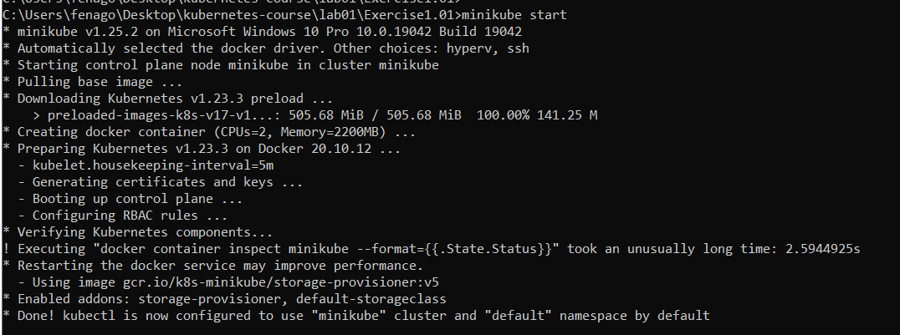
    

    The following commands should help establish that the Kubernetes
    cluster that was started by Minikube is running properly.

12. Use the following command to get the basic status of the various
    components of the cluster:

    
    ```
    minikube status
    ```
    

    You should see the following response:

    
    ```
    host: Running
    kubelet: Running
    apiserver: Running
    kubeconfig: Configured
    ```
    

13. Now, let\'s look at the version of the kubectl client and Kubernetes
    server:

    
    ```
    kubectl version --short
    ```
    

    You should see the following response:

    
    ```
    Client Version: v1.22.5
    Server Version: v1.23.3
    ```
    

14. Let\'s learn how many machines comprise the cluster and get some
    basic information about them:

    
    ```
    kubectl get node
    ```
    

    You should see a response similar to the following:

    
    ```
    NAME          STATUS          ROLES          AGE          VERSION
    minikube      Ready           master         2m41s        v1.23.3
    ```
    

After finishing this exercise, you should have Minikube set up with a
single-node Kubernetes cluster. In the next section, we will enter the
Minikube VM to take a look at how the cluster is composed and the
various components of Kubernetes that make it work.


Kubernetes Components Overview
==============================

By completing the previous exercise, you have a single-node Kubernetes
cluster up and running. Before playing your first concert, let\'s hold
on a second and pull the curtains aside to take a look backstage to see
how Kubernetes is architected behind the scenes, and then check how
Minikube glues its various components together inside its VM.


Minikube provides a command called `minikube ssh` that\'s used
to gain SSH access from the host machine (in our machine, it\'s the
physical machine running Ubuntu 20.04) to the `minikube`
virtual machine, which serves as the sole node in our Kubernetes
cluster. Let\'s see how that works:


```
minikube ssh
```


**Note:** All the commands that will be shown later in this section are presumed
to have been run inside the Minikube VM, after running
`minikube ssh`.


To simplify the output and make it easier to read, we will pipe the
output from `docker ps` into two other Bash commands:

1.  `grep -v pause`: This will filter the results by not
    displaying the \"sandbox\" containers.

    Without `grep -v pause`, you would find that each
    container is \"paired\" with a \"sandbox\" container (in Kubernetes,
    it\'s implemented as a `pause` image). This is because, as
    mentioned in the previous lab, Linux containers can be
    associated (or isolated) by joining the same (or different) Linux
    namespace. In Kubernetes, a \"sandbox\" container is used to
    bootstrap a Linux namespace, and then the containers that run the
    real application are able to join that namespace. Finer details
    about how all this works under the hood have been left out of scope
    for the sake of brevity.


2.  `awk '{print $NF}'`: This will only print the last column
    with a container name.

    Thus, the final command is as follows:

    
    ```
    docker ps | grep -v pause | awk '{print $NF}'
    ```
    

    You should see the following output:

    
    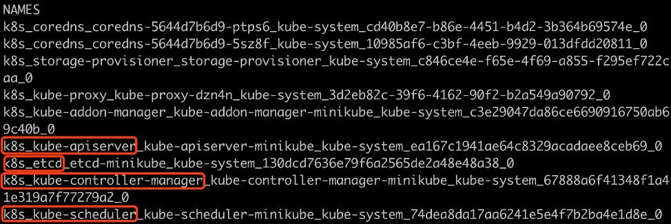
    


The highlighted containers shown in the preceding screenshot are
basically the core components of Kubernetes. We\'ll discuss each of
these in detail in the following sections.


Where Is the kubelet?
---------------------

In Minikube, the kubelet is managed by systemd and
runs as a native binary instead of a Docker container. We can run the
following command to check its status:


```
systemctl status kubelet
```

You should see an output similar to the following:


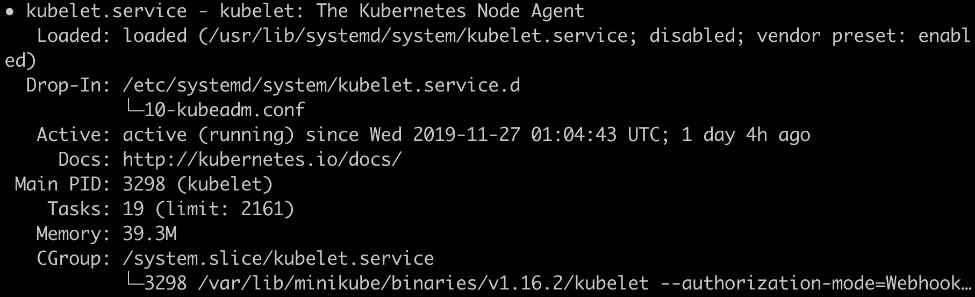


By default, the kubelet has the configuration for
`staticPodPath` in its config file (which is stored at
`/var/lib/kubelet/config.yaml`). kubelet is instructed to
continuously watch the changes in files under that path, and each file
under that path represents a Kubernetes component. Let\'s understand
what this means by first finding `staticPodPath` in the
kubelet\'s `config` file:


```
sudo grep "staticPodPath" /var/lib/kubelet/config.yaml
```

You should see the following output:


```
staticPodPath: /etc/kubernetes/manifests
```

Now, let\'s see the contents of this path:


```
ls /etc/kubernetes/manifests
```

You should see the following output:


```
addon-manager.yaml.tmpl kube-apiserver.yaml      kube-scheduler.yaml
etcd.yaml               kube-controller-manager.yaml
```

As shown in the list of files, the core components of Kubernetes are
defined by objects that have a definition specified in YAML files. In
the Minikube environment, in addition to managing the user-created pods,
the kubelet also serves as a systemd equivalent in order to manage the
life cycle of Kubernetes system-level components, such as the API
server, the scheduler, the controller manager, and other add-ons. Once
any of these YAML files is changed, the kubelet auto-detects that and
updates the state of the cluster so that it matches the desired state
defined in the updated YAML configuration.


Exercise 2.02: Running a Pod in Kubernetes
------------------------------------------

In the previous exercise, we started up Minikube and looked at the
various Kubernetes components running as pods. Now, in this exercise, we
shall deploy our pod. Follow these steps to complete this exercise:

**Note**

If you have been trying out the commands from the *Kubernetes Components Overview* section, don\'t forget to leave the SSH session by using the
`exit` command before beginning this exercise. Unless
otherwise specified, all commands using `kubectl` should run
on the host machine and not inside the Minikube VM.

1.  In Kubernetes, we use a spec file to describe an API object such as
    a pod. As mentioned earlier, we will stick to YAML as it is more
    human-readable and editable friendly. Create a file named
    `k8s-for-beginners-pod.yaml` (using any text editor of
    your choice) with the following content:

    
    ```
    kind: Pod
    apiVersion: v1
    metadata:
      name: k8s-for-beginners
    spec:
      containers:
      - name: k8s-for-beginners
        image: fenago/the-kubernetes-workshop:k8s-for-beginners
    ```
    

2.  On the host machine, run the following command to create this pod:

    
    ```
    kubectl apply -f k8s-for-beginners-pod.yaml
    ```
    

    You should see the following output:

    
    ```
    pod/k8s-for-beginners created
    ```
    

3.  Now, we can use the following command to check the pod\'s status:

    
    ```
    kubectl get pod
    ```
    

    You should see the following response:

    
    ```
    NAME                   READY     STATUS      RESTARTS       AGE
    k8s-for-beginners      1/1       Running     0              7s
    ```
    

4.  You can use the following command to get more information about the pod:

    
    ```
    kubectl get pod -o wide
    ```
    

    You should see the following output:

    
    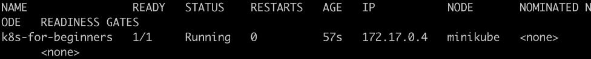
    


    As you can see, the output is still in the table format and we get
    additional information such as `IP` (the internal pod IP)
    and `NODE` (which node the pod is running on).

5.  You can get the list of nodes in our cluster by running the
    following command:

    
    ```
    kubectl get node
    ```
    

    You should see the following response:

    
    ```
    NAME          STATUS          ROLES          AGE          VERSION
    minikube      Ready           master         30h          v1.23.3
    ```
    

6.  The IP listed in above image refers to the internal IP Kubernetes
    assigned for this pod, and it\'s used for pod-to-pod communication,
    not for routing external traffic to pods. Hence, if you try to
    access this IP from outside the cluster, you will get nothing. You
    can try that using the following command from the host machine,
    which will fail:

    
    ```
    curl 172.17.0.4:8080
    ```
    

    Note

    Remember to change `172.17.0.4` to the value you get for
    your environment in *step 4*.

    The `curl` command will fail as shown here:

    
    ```
    curl 172.17.0.4:8080
    ```
    

7.  In most cases, end-users don\'t need to interact with the internal
    pod IP. However, just for observation purposes, let\'s SSH into the
    Minikube VM:

    
    ```
    minikube ssh
    ```
    

    You will see the following response in the terminal:

    
    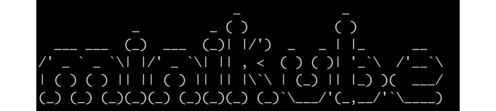
    


8.  Now, try calling the IP from inside the Minikube VM to verify that
    it works:

    
    ```
    curl 172.17.0.4:8080
    ```
    

    You should get a successful response:

    
    ```
    Hello Kubernetes Beginners!
    ```

    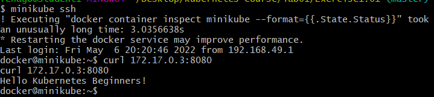
     

With this, we have successfully deployed our application in a pod on the
Kubernetes cluster. We can confirm that it is working since we get a
response when we call the application from inside the cluster. Now, you
may end the Minikube SSH session using the `exit` command.


In the following exercise, we will define Service manifests and create
them using `kubectl apply` commands. You will learn that the
common pattern for resolving problems in Kubernetes is to find out the
proper API objects, then compose the detailed specs using YAML
manifests, and finally create the objects to bring them into effect.


Exercise 2.03: Accessing a Pod via a Service
--------------------------------------------

In this exercise, we will create
Services that will act as connectors to map the external requests to the
destination pods so that we can access the pods externally without
entering the cluster. Follow these steps to complete this exercise:

1.  Firstly, let\'s tweak the pod spec from *Exercise 2.02*, *Running a
    Pod in Kubernetes*, to apply some labels. Modify the contents of the
    `k8s-for-beginners-pod1.yaml` file, as follows:

    
    ```
    kind: Pod
    apiVersion: v1
    metadata:
      name: k8s-for-beginners
      labels:
        tier: frontend
    spec:
      containers:
      - name: k8s-for-beginners
        image: fenago/the-kubernetes-workshop:k8s-for-beginners
    ```
    

    Here, we added a label pair, `tier: frontend`, under the
    `labels` field.

2.  Because the pod name remains the same, let\'s rerun the
    `apply` command so that Kubernetes knows that we\'re
    trying to update the pod\'s spec, instead of creating a new pod:

    
    ```
    kubectl apply -f k8s-for-beginners-pod1.yaml
    ```
    

    You should see the following response:

    
    ```
    pod/k8s-for-beginners configured
    ```
    

    Behind the scenes, for the `kubectl apply` command,
    kubectl generates the difference of the specified YAML and the
    stored version in the Kubernetes server-side storage (that is,
    etcd). If the request is valid (that is, we have not made any errors
    in the specification format or the command), kubectl will send an
    HTTP patch to the Kubernetes API server. Hence, only the delta
    changes will be applied. If you look at the message that\'s
    returned, you\'ll see it says
    `pod/k8s-for-beginners configured` instead of
    `created`, so we can be sure it\'s applying the delta
    changes and not creating a new pod.

3.  You can use the following command to explicitly display the labels
    that have been applied to existing pods:

    
    ```
    kubectl get pod --show-labels
    ```
    

    You should see the following response:

    
    ```
    NAME              READY  STATUS   RESTARTS   AGE  LABELS
    k8s-for-beginners 1/1    Running  0          16m  tier=frontend
    ```
    

    Now that the pod has the `tier: frontend` attribute,
    we\'re ready to create a Service and link it to the pods.

4.  Create a file named `k8s-for-beginners-svc.yaml` with the
    following content:
    
    ```
    kind: Service
    apiVersion: v1
    metadata:
      name: k8s-for-beginners
    spec:
      selector:
        tier: frontend
      type: NodePort
      ports:
      - port: 80
        targetPort: 8080
    ```
    

5.  Now, let\'s create the Service using the following command:

    
    ```
    kubectl apply -f k8s-for-beginners-svc.yaml
    ```
    

    You should see the following response:

    
    ```
    service/k8s-for-beginners created
    ```
    

6.  Use the `get` command to return the list of created
    Services and confirm whether our Service is online:

    
    ```
    kubectl get service
    ```
    

    You should see the following response:

    
    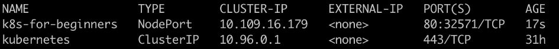
    

    So, you may have noticed that the `PORT(S)` column outputs
    `80:32571/TCP`. Port `32571` is an
    auto-generated port that\'s exposed on every node.

7.  Let's ssh into Minikube to easily access the `k8s-for-beginners` Service:

    
    ```
    minikube ssh
    ```

8.  You can access application via the command line from `minikube` VM:

    
    ```
    curl http://localhost:32571
    ```
    

    You should see the following response:

    
    ```
    Hello Kubernetes Beginners!
    ```
    

As a summary, in this exercise, we created a `NodePort`
Service to enable users to access the pod. Under the hood, there are several layers of
traffic transitions that make this happen:

-   The first layer is from the  user to the machine IP at the
    auto-generated random port (3XXXX).
-   The second layer is from the random port (3XXXX) to the Service IP
    (10.X.X.X) at port `80`.
-   The third layer is from the Service IP (10.X.X.X) ultimately to the
    pod IP at port `8080`.

The following is a diagram illustrating these interactions:


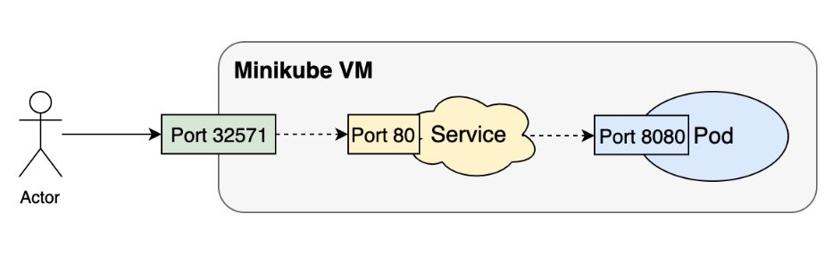


Delivering Kubernetes-Native Applications
=========================================


In the previous sections, we migrated a Docker-based application to
Kubernetes and successfully accessed it from inside the Minikube VM, as
well as externally. Now, let\'s see what other benefits Kubernetes can
provide if we design our application from the ground up so that it can
be deployed using Kubernetes.


Exercise 2.04: Scaling a Kubernetes Application
-----------------------------------------------

In Kubernetes, it\'s easy to increase the number of replicas running the
application by updating the `replicas` field of a Deployment
spec. In this exercise, we\'ll experiment with how to scale a Kubernetes
application up and down. Follow these steps to complete this exercise:

1.  Create a file named `k8s-for-beginners-deploy.yaml` using
    the content shown here:

    
    ```
    apiVersion: apps/v1
    kind: Deployment
    metadata:
      name: k8s-for-beginners
    spec:
      replicas: 3
      selector:
        matchLabels:
          tier: frontend
      template:
        metadata:
          labels:
            tier: frontend
        spec:
          containers:
          - name: k8s-for-beginners
            image: fenago/the-kubernetes-workshop:k8s-for-beginners
    ```
    

    If you take a closer look, you\'ll see that this Deployment spec is
    largely based on the pod spec from earlier exercises
    (`k8s-for-beginners-pod1.yaml`), which you can see under
    the `template` field.

2.  Next, we can use kubectl to create the Deployment:

    
    ```
    kubectl apply -f k8s-for-beginners-deploy.yaml
    ```
    

    You should see the following output:

    
    ```
    deployment.apps/k8s-for-beginners created
    ```
    

3.  Given that the Deployment has been created successfully, we can use
    the following command to show all the Deployment\'s statuses, such
    as their names, running pods, and so on:

    
    ```
    kubectl get deploy
    ```
    

    You should get the following response:

    
    ```
    NAME                   READY   UP-TO-DATE   AVAILABLE    AGE
    k8s-for-beginners      3/3     3            3            41s
    ```
    

    You can view the short names by running
    `kubectl api-resources`, without specifying the resource type.

4.  A pod called `k8s-for-beginners` exists that we created in
    the previous exercise. To ensure that we see only the pods being
    managed by the Deployment, let\'s delete the older pod:

    
    ```
    kubectl delete pod k8s-for-beginners
    ```
    

    You should see the following response:

    
    ```
    pod "k8s-for-beginners" deleted
    ```
    

5.  Now, get a list of all the pods:

    
    ```
    kubectl get pod
    ```
    

    You should see the following response:

    
    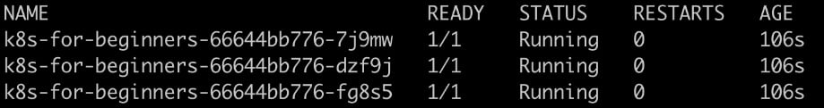
    


    The Deployment has created three pods, and their labels (specified
    in the `labels` field in *step 1*) happen to match the
    Service we created in the previous section. So, what will happen if
    we try to access the Service? Will the network traffic going to the
    Service be smartly routed to the new three pods? Let\'s test this
    out.

6.  To see how the traffic is distributed to the three pods, we can
    simulate a number of consecutive requests to the Service endpoint by
    running the `curl` command inside a Bash `for`
    loop, as follows:

    
    ```
    minikube ssh

    for i in $(seq 1 30); do curl localhost:30217; done

    exit
    ```
    

    **Note**

    In this command, use the same IP and port that you used in the
    previous exercise if you are running the same instance of Minikube.
    If you have restarted Minikube or have made any other changes,
    please get the proper IP of your Minikube cluster by following *step
    9* of the previous exercise.

    Once you\'ve run the command with the proper IP and port, you should
    see the following output:

    
    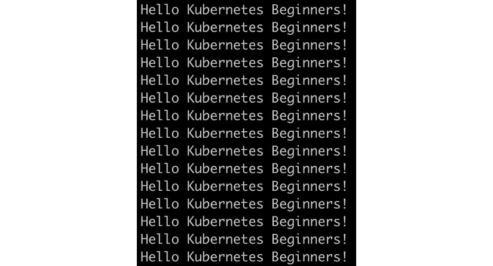
    


    From the output, we can tell that all 30 requests get the expected
    response.

7.  You can run `kubectl logs <pod name>` to check the log of
    each pod. Let\'s go one step further and figure out the exact number
    of requests each pod has responded to, which might help us find out
    whether the traffic was evenly distributed. To do that, we can pipe
    the logs of each pod into the `wc` command to get the
    number of lines:

    
    ```
    kubectl logs <pod name> | wc -l
    ```
    
    **Note:** Above command should be run in `git bash` only. It will not work in cmd/powershell.

    Run the preceding command three times, copying the pod name you
    obtained, as shown below:

    
    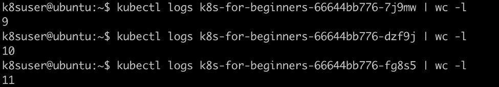
    


    The result shows that the three pods handled `9`,
    `10`, and `11` requests, respectively. Due to
    the small sample size, the distribution is not absolutely even (that
    is, `10` for each), but it is sufficient to indicate the
    default round-robin distribution strategy used by a Service.


8.  Next, let\'s learn how to scale up a Deployment. There are two ways
    of accomplishing this: one way is to modify the Deployment\'s YAML
    config, where we can set the value of `replicas` to
    another number (such as `5`), while the other way is to
    use the `kubectl scale` command, as follows:

    
    ```
    kubectl scale deploy k8s-for-beginners --replicas=5
    ```
    

    You should see the following response:

    
    ```
    deployment.apps/k8s-for-beginners scaled
    ```
    

9.  Let\'s verify whether there are five pods running:

    
    ```
    kubectl get pod
    ```
    

    You should see a response similar to the following:

    
    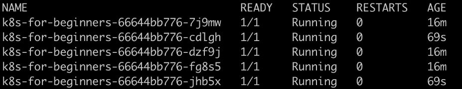
    


    The output shows that the existing three pods are kept and that two
    new pods are created.

10. Similarly, you can specify replicas that are smaller than the
    current number. In our example, let\'s say that we want to shrink
    the replica\'s number to `2`. The command for this would
    look as follows:

    
    ```
    kubectl scale deploy k8s-for-beginners --replicas=2
    ```
    

    You should see the following response:

    
    ```
    deployment.apps/k8s-for-beginners scaled
    ```
    

11. Now, let\'s verify the number of pods:

    
    ```
    kubectl get pod
    ```
    

    You should see a response similar to the following:

    
    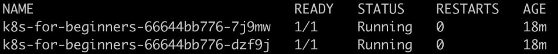
    

12. We can run the following command to verify this:

    
    ```
    kubectl get deploy
    ```
    

    You should see the following response:

    
    ```
    NAME                   READY    UP-TO-DATE   AVAILABLE    AGE
    k8s-for-beginners      2/2      2            2           19m
    ```
    

13. Now, let\'s see what happens if we delete one of the two pods:

    
    ```
    kubectl delete pod <pod name>
    ```
    

    You should get the following response:

    
    ```
    pod "k8s-for-beginners-66644bb776-7j9mw" deleted
    ```
    

14. Check the status of the pods to see what has happened:

    
    ```
    kubectl get pod
    ```
    

    You should see the following response:

    
    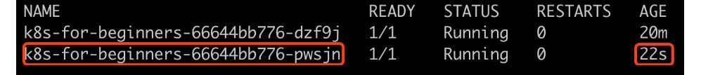
    


We can see that there are still two pods. The Deployment created a new pod so that the
number of running pods satisfies the desired state of the Deployment.

In this exercise, we have learned how to scale a deployment up and down.
You can scale other similar Kubernetes objects, such as DaemonSets and
StatefulSets, in the same way. Also, for such objects, Kubernetes will
try to auto-recover the failed pods.


Exercise 2.05: How Kubernetes Manages a Pod\'s Life Cycle
---------------------------------------------------------

As a Kubernetes cluster comprises multiple components, and each
component works simultaneously, it\'s usually difficult to know what\'s
exactly happening in each phase of a pod\'s life cycle. To solve this
problem, we will use a film editing technique to \"play the whole life
cycle in slow motion\", so as to observe each phase. We will turn off
the master plane components and then attempt to create a pod. Then, we
will respond to the errors that we see, and slowly bring each component
online, one by one. This will allow us to slow down and examine each
stage of the process of pod creation step-by-step. Follow these steps to
complete this exercise:

1.  First, let\'s delete the Deployment and Service we created earlier
    by using the following command:

    
    ```
    kubectl delete deploy k8s-for-beginners && kubectl delete service k8s-for-beginners
    ```
    

    You should see the following response:

    
    ```
    deployment.apps "k8s-for-beginners" deleted
    service "k8s-for-beginners" deleted
    ```
    

2.  Prepare two terminal sessions: one (host terminal) to run commands
    on your host machine and another (Minikube terminal) to pass
    commands inside the Minikube VM via SSH. Thus, your Minikube session
    will be initiated like this:

    
    ```
    minikube ssh
    ```
    

    You will see the following output:

    
    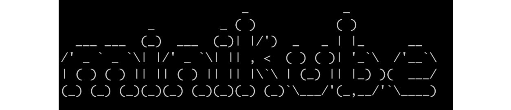
    


    **Note**

    All `kubectl` commands are expected to be run in the host
    terminal session, while all `docker` commands are to be
    run in the Minikube terminal session.

3.  In the Minikube session, clean up all stopped Docker containers:

    
    ```
    docker rm $(docker ps -a -q)
    ```
    

    You should see the following output:

    
    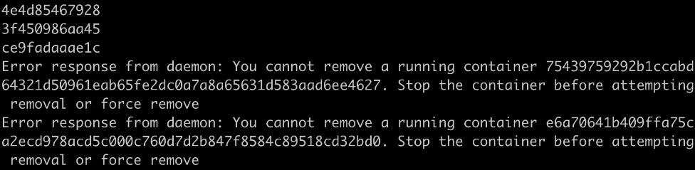
    


    You may see some error messages such as \"You cannot remove a
    running container \...\". This is because the preceding
    `docker rm` command runs against all containers
    (`docker ps -a -q`), but it won\'t stop any running
    containers.

4.  In the Minikube session, stop the kubelet by running the following
    command:

    
    ```
    sudo systemctl stop kubelet
    ```
    

    This command does not show any response upon successful execution.

    Note

    Later in this exercise, we will manually stop and start other
    Kubernetes components, such as the API server, that are managed by
    the kubelet in a Minikube environment. Hence, it\'s required that
    you stop the kubelet first in this exercise; otherwise, the kubelet
    will automatically restart its managed components.


5.  After 30 seconds, check the cluster\'s status by running the
    following command in your host terminal session:

    
    ```
    kubectl get node
    ```
    

    You should see the following response:

    
    ```
    NAME         STATUS       ROLES      AGE       VERSION
    minikube     NotReady     master     32h       v1.23.3
    ```
    

    It\'s expected that the status of the `minikube` node is
    changed to `NotReady` because the kubelet has been
    stopped.

6.  In your Minikube session, stop `kube-scheduler`,
    `kube-controller-manager`, and `kube-apiserver`.
    As we saw earlier, all of these are running as Docker containers.
    Hence, you can use the following commands, one after the other:

    
    ```
    docker stop $(docker ps | grep kube-scheduler | grep -v pause | awk '{print $1}')
    docker stop $(docker ps | grep kube-controller-manager | grep -v pause | awk '{print $1}')
    docker stop $(docker ps | grep kube-apiserver | grep -v pause | awk '{print $1}')
    ```
    

    You should see the following responses:

    
    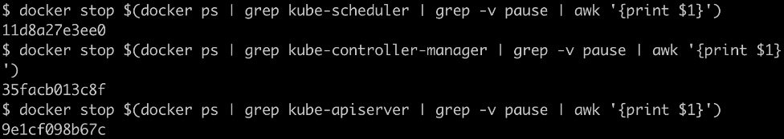
    
    Now, the three major Kubernetes components have been stopped.

7.  Now, you need to create a Deployment spec on your host machine.
    Create a file named `k8s-for-beginners-deploy2.yaml` with
    the following content:
    
    ```
    apiVersion: apps/v1
    kind: Deployment
    metadata:
      name: k8s-for-beginners
    spec:
      replicas: 1
      selector:
        matchLabels:
          tier: frontend
      template:
        metadata:
          labels:
            tier: frontend
        spec:
          containers:
          - name: k8s-for-beginners
            image: fenago/the-kubernetes-workshop:k8s-for-beginners
    ```
    

8.  Try to create the Deployment by running the following command on
    your host session:

    
    ```
    kubectl apply -f k8s-for-beginners-deploy2.yaml
    ```
    

    You should see a response similar to this:

    
    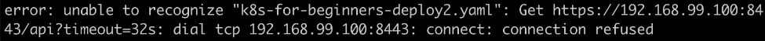
    


    Since we intentionally stopped the Kubernetes API server. If the API server
    is down, you cannot run any `kubectl` commands or use any
    equivalent tools (such as Kubernetes Dashboard) that rely on API
    requests:

    
    ```
    The connection to the server 192.168.99.100:8443 was refused – did you specify the right host or port?
    ```
    

9.  Let\'s see what happens if we restart the API server and try to
    create the Deployment once more. Restart the API server container by
    running the following command in your Minikube session:

    
    ```
    docker start $(docker ps -a | grep kube-apiserver | grep -v pause | awk '{print $1}')
    ```
    

    This command tries to find the container ID of the stopped container
    carrying the API server, and then it starts it. You should get a
    response like this:

    
    ```
    9e1cf098b67c
    ```
    

10. Wait for 10 seconds. Then, check whether the API server is online.
    You can run any simple kubectl command for this. Let\'s try getting
    the list of nodes by running the following command in the host
    session:

    
    ```
    kubectl get node
    ```
    

    You should see the following response:

    
    ```
    NAME         STATUS       ROLES      AGE       VERSION
    minikube     NotReady     master     32h       v1.23.3
    ```
    

    As you can see, we are able to get a response without errors.

11. Let\'s try to create the Deployment again:

    
    ```
    kubectl apply -f k8s-for-beginners-deploy2.yaml
    ```
    

    You should see the following response:

    
    ```
    deployment.apps/k8s-for-beginners created
    ```
    

12. Let\'s check whether the Deployment has been created successfully by
    running the following command:

    
    ```
    kubectl get deploy
    ```
    

    You should see the following response:

    
    ```
    NAME               READY     UP-TO-DATE    AVAILABLE   AGE
    k8s-for-beginners  0/1       0             0           113s
    ```
    

    From the preceding screenshot, there seems to be something wrong as
    in the `READY` column, we can see `0/1`, which
    indicates that there are 0 pods associated with this Deployment,
    while the desired number is 1 (which we specified in the
    `replicas` field in the Deployment spec).

13. Let\'s check that all the pods that are online:

    
    ```
    kubectl get pod
    ```
    

    You should get a response similar to the following:

    
    ```
    No resources found in default namespace.
    ```
    

    We can see that our pod has not been created. This is because the
    Kubernetes API server only creates the API objects; the
    implementation of any API object is carried out by other components.
    For example, in the case of Deployment, it\'s
    `kube-controller-manager` that creates the corresponding
    pod(s).

14. Now, let\'s restart the `kube-controller-manager`. Run the
    following command in your Minikube session:

    
    ```
    docker start $(docker ps -a | grep kube-controller-manager | grep -v pause | awk '{print $1}')
    ```
    

    You should see a response similar to the following:

    
    ```
    35facb013c8f
    ```
    

15. After waiting for a few seconds, check the status of the Deployment
    by running the following command in the host session:

    
    ```
    kubectl get deploy
    ```
    

    You should see the following response:

    
    ```
    NAME               READY     UP-TO-DATE    AVAILABLE   AGE
    k8s-for-beginners  0/1       1             0           5m24s
    ```
    

    As we can see, the pod that we are looking for is still not online.

16. Now, check the status of the pod:

    
    ```
    kubectl get pod
    ```
    

    You should see the following response:

    
    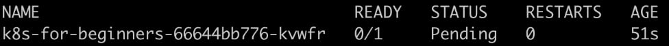
    


    The output is different from the one in *step 15*, as in this case,
    one pod was created by `kube-controller-manager`. However,
    we can see `Pending` under the `STATUS` column.
    This is because assigning a pod to a suitable node is not the
    responsibility of `kube-controller-manager`; it\'s the
    responsibility of `kube-scheduler`.

17. Before starting `kube-scheduler`, let\'s take a look at
    some additional information about the pod:

    
    ```
    kubectl get pod -o wide
    ```
    

    You should see the following response:

    
    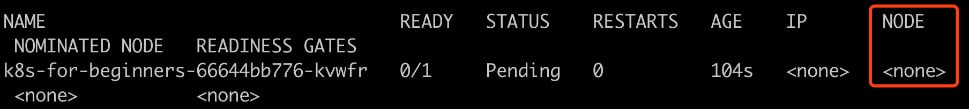
    

18. Let\'s restart `kube-scheduler` by running the following
    command in the Minikube session:

    
    ```
    docker start $(docker ps -a | grep kube-scheduler | grep -v pause | awk '{print $1}')
    ```
    

    You should see a response similar to the following:

    
    ```
    11d8a27e3ee0
    ```
    

19. We can verify that `kube-scheduler` is working by running
    the following command in the host session:

    
    ```
    kubectl describe pod k8s-for-beginners-UPDATE_ID_HERE
    ```
    

    Please get the pod name from the response you get at *step 17*, as
    seen above. You should see the following output:

    
    ```
    Name:         k8s-for-beginners-66644bb776-kvwfr
    Namespace:    default
    Priority:     0
    Node:         <none>
    ```
    

    We are truncating the output screenshots for a better presentation.
    Please take a look at the following excerpt, highlighting the
    `Events` section:

    
    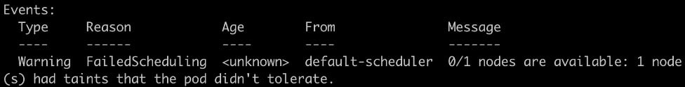


    `kube-scheduler` has tried scheduling, but it reports that
    there is no node available. Why is that?

    This is because, earlier, we stopped the kubelet, and the Minikube
    environment is a single-node cluster, so there is no available
    node(s) with a functioning kubelet for the pod to be placed.

20. Let\'s restart the kubelet by running the following command in the
    Minikube session:

    
    ```
    sudo systemctl start kubelet
    ```
    

    This should not give any response in the terminal upon successful
    execution.

21. In the host terminal, verify the status of the Deployment by running
    the following command in the host session:

    
    ```
    kubectl get deploy
    ```
    

    You should see the following response:

    
    ```
    NAME               READY     UP-TO-DATE    AVAILABLE   AGE
    k8s-for-beginners  1/1       1             1           11m
    ```
    

    Now, everything looks healthy as the Deployment shows
    `1/1` under the `READY` column, which means that
    the pod is online.

22. Similarly, verify the status of the pod:

    
    ```
    kubectl get pod -o wide
    ```
    

    You should get an output similar to the following:

    
    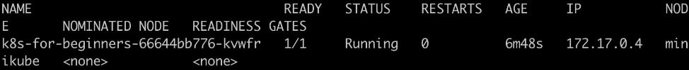
    


We can see `Running` under `STATUS` and that it\'s been assigned to the `minikube` node.


In the following activity, we will bring together the skills we learned
in the lab to find out how we can migrate from a container-based
environment to a Kubernetes environment in order to run our application.


Activity 2.01: Running the Pageview App in Kubernetes
-----------------------------------------------------

In *Activity 1.01*, *Creating a Simple Page Count Application*, in the
previous lab, we built a web application called Pageview and
connected it to a Redis backend datastore. So, here is a question:
without making any changes to the source code, can we migrate the
Docker-based application to Kubernetes and enjoy Kubernetes\' benefits
immediately? Try it out in this activity with the guidelines given.

This activity is divided into two parts: in the first part, we will
create a simple pod with our application that is exposed to traffic
outside the cluster by a Service and connected to a Redis datastore
running as another pod. In the second part, we will scale the
application to three replicas.

**Connecting the Pageview App to a Redis Datastore Using a Service**

Similar to the `--link` option in Docker, Kubernetes provides
a Service that serves as an abstraction layer to expose one application
(let\'s say, a series of pods tagged with the same set of labels) that
can be accessed internally or externally. For example, as we discussed
in this lab, a frontend app can be exposed via a
`NodePort` Service so that it can be accessed by external
users. In addition to that, in this activity, we need to define an
internal Service in order to expose the backend application to the
frontend application. Follow these steps:

1.  In *Activity 1.01*, *Creating a Simple Page Count Application*, we
    built two Docker images -- one for the frontend Pageview web app and
    another for the backend Redis datastore. You can use the skills we
    learned in this lab to migrate them into Kubernetes YAMLs.

2.  Two pods (each managed by a Deployment) for the application is not
    enough. We also have to create the Service YAML to link them
    together.

    Ensure that the `targetPort` field in the manifest is
    consistent with the exposed port that was defined in the Redis
    image, which was `6379` in this case. In terms of the
    `port` field, theoretically, it can be any port, as long
    as it\'s consistent with the one specified in the Pageview
    application.

    The other thing worth mentioning here is the `name` field
    of the pod for Redis datastore. It\'s the symbol that\'s used in the
    source code of the Pageview app to reference the Redis datastore.

    Now, you should have three YAMLs -- two pods and a Service. Apply
    them using `kubectl -f <yaml file name>`, and then use
    `kubectl get deploy,service` to ensure that they\'re
    created successfully.

3.  At this stage, the Pageview app should function well since it\'s
    connected to the Redis app via the Service. However, the Service
    only works as the internal connector to ensure they can talk to each
    other inside the cluster.

    To access the Pageview app externally, we need to define a
    `NodePort` Service. Unlike the internal Service, we need
    to explicitly specify the `type` as `NodePort`.

4.  Apply the external Service YAML using
    `kubectl -f <yaml file name>`.

5.  Run `minikube service <external service name>` to fetch
    the Service URL.

6.  Access the URL multiple times to ensure that the Pageview number
    gets increased by one each time.

With that, we have successfully run the Pageview application in
Kubernetes. But what if the Pageview app is down? Although Kubernetes
can create a replacement pod automatically, there is still downtime
between when the failure is detected and when the new pod is ready.

A common solution is to increase the replica number of the application
so that the whole application is available as long as there is at least
one replica running.

**Running the Pageview App in Multiple Replicas**

In Kubernetes, to ensure the high availability of an application, we can
simply increase the replica number. Follow these steps to do so:

1.  Modify the Pageview YAML to change `replicas` to
    `3`.

2.  Apply these changes by running
    `kubectl apply -f <pageview app yaml>`.

3.  By running `kubectl get pod`, you should be able to see
    three Pageview pods running.

4.  Access the URL shown in the output of the
    `minikube service` command multiple times.

    Check the logs of each pod to see whether the requests are handled
    evenly among the three pods.

5.  Now, let\'s verify the high availability of the Pageview app.
    Terminate any arbitrary pods continuously while keeping one healthy
    pod. You can achieve this manually or automatically by writing a
    script. Alternatively, you can open another terminal and check
    whether the Pageview app is always accessible.

If you opt for writing scripts to terminate the pods, you will see
results similar to the following:


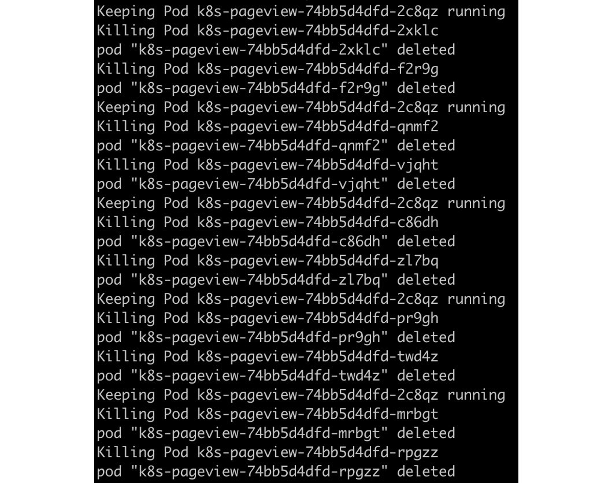


Assuming that you take a similar approach and write a script to check
whether the application is online, you should see an output similar to
the following:


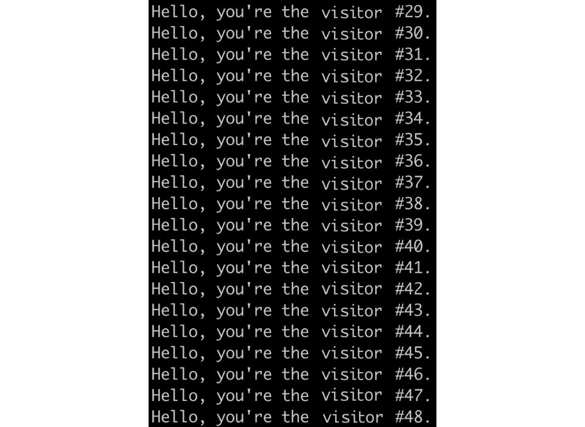


Note

The solution to this activity can be found at the following address:
`Activity_Solutions\Solution_Final.pdf`.


Summary
=======


In this lab, we used Minikube to provision a single-node Kubernetes
cluster and gave a high-level overview of Kubernetes\' core components,
as well as its key design rationale. After that, we migrated an existing
Docker container to Kubernetes and explored some basic Kubernetes API
objects, such as pods, Services, and Deployments. Lastly, we
intentionally broke a Kubernetes cluster and restored it one component
at a time, which allowed us to understand how the different Kubernetes
components work together to get a pod up and running on a node.

Throughout this lab, we have used kubectl to manage our cluster. We
provided a quick introduction to this tool, but in the following
lab, we will take a closer look at this powerful tool and explore
the various ways in which we can use it.
