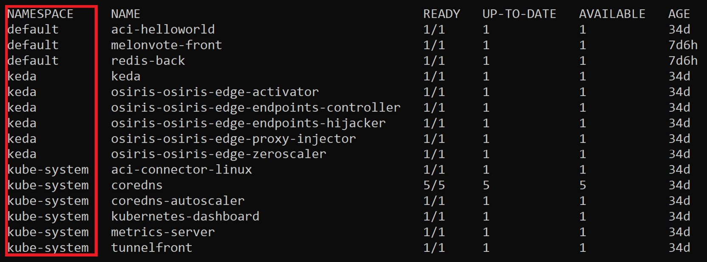

kubectl -- Kubernetes Command Center
=======================================


In this chapter, we will demystify some common kubectl commands and see
how we can use kubectl to control our Kubernetes cluster. We will begin
this chapter by taking a brief look at what the end-to-end process looks
like when using kubectl commands to communicate with a Kubernetes
cluster. Then, we will set up a few shortcuts and autocompletion for the
Bash terminal. We will begin with the basics of using kubectl by
learning how to create, delete, and manage Kubernetes objects. We will
learn about the two approaches to managing resources in Kubernetes -
declarative and imperative - with exercises. By the end of this chapter,
you will also have learned how to update a live application running on
your Kubernetes cluster in real-time using kubectl.


**Note:** All commands in this lab should be run in `git bash` only.

Exercise 3.01: Setup Alias
----------------------------------------

In this exercise, we will show you how to set up alias. Perform the following steps to
complete this exercise:


4.  You can also set up an alias for your `kubectl` commands
    by using the `alias` keyword, as follows:
    
    ```
    alias k=kubectl
    ```
    

5.  Similarly, if you want to set up an alias for some specific
    commands, you can use commands similar to the following:
    
    ```
    alias kcdp='kubectl describe po'
    alias kcds='kubectl describe svc'
    alias kcdd='kubectl describe deploy'
    ```
    

    

You can also use such as `k` instead
of `kubectl` in your commands. However, to avoid confusion and
maintain a standardized structure, we will use the full commands
throughout this book.


Setting up the kubeconfig Configuration File
--------------------------------------------

By default, kubectl looks for the file in the `$HOME/.kube`
directory. In most scenarios, you can specify a `KUBECONFIG`
environment variable or use the `--kubeconfig` flag to specify
the kubeconfig files. Those files are usually saved in
`$HOME/.kube/config`.

Let\'s take a look at the kubeconfig file to understand how this works.
You can view the kubeconfig file using the following command:


```
kubectl config view
```

Alternatively, you can also use the following command:


```
cat $HOME/.kube/config
```

You should get an output similar to the following:


A `context` is a set of information that you need to access a
cluster. If we wanted to switch to a context named
`minikube`, we would use the following command:


```
kubectl config use-context minikube
```

This would give an output similar to the following:


```
Switched to context "minikube".
```


Walkthrough of Some Simple kubectl Commands
-------------------------------------------

In this section, we\'re going to walk you through some of the commonly
used kubectl commands. This section is mostly for demonstration
purposes, so you may not see the exact output that you see in these
images. However, this section will help you understand how these
commands are used. You will use most of them extensively in later
exercises, as well as throughout this book. Let\'s take a look:

-   If you want to display nodes, use the following command:

    
    ```
    kubectl get nodes
    ```
    

    You will see an output similar to the following:

    
    
    


Since we set up aliases in *Exercise 3.01*, *Setting up Autocompletion*,
you can also get the same result using the following command:


```
k get no
```

-   If you want to display all current namespaces, you can use the
    following command:

    
    ```
    kubectl get namespaces
    ```
    

    You should see an output similar to the following:

    
    ```
    NAME                  STATUS         AGE
    default               Active         7m5s
    kube-node-lease       Active         7m14s
    kube-public           Active         7m14s
    kube-system           Active         7m15s
    ```
    

    You can also get the same result using the following shortened
    command:

    
    ```
    k get ns
    ```
    

-   If you want to check the version of `kubectl`, you can use
    the following command:

    
    ```
    kubectl version
    ```
    

    You will see an output similar to the following:

    
    ```
    Client version: version.Info{Major:"1", Minor:"17", GitVersion:"v1.17.2, GitCommit: 59603c6e503c87169aea6106f57b9f242f64df89", GitTreeState:"clean", BuildDate:"2020-01-21T22:17:28Z, GoVersion:"go1.13.5", Compiler:"gc", Platform:"linux/amd64}
    Server version: version.Info{Major:"1", Minor:"17", GitVersion:"v1.17.2, GitCommit: 59603c6e503c87169aea6106f57b9f242f64df89", GitTreeState:"clean", BuildDate:"2020-01-18T23:22:30Z, GoVersion:"go1.13.5", Compiler:"gc", Platform:"linux/amd64}
    ```
    

-   If you want to see some information regarding your current
    Kubernetes cluster, you can use the following command:

    
    ```
    kubectl cluster-info
    ```
    

    You should see an output similar to the following:

    
    
    


Before we move on further with the demonstrations, we will mention a few
commands that you can use to create a sample application, which we have
already provided in the GitHub repository for this chapter. Use the
following command to fetch the YAML specification for all the objects
required to run the application:


```
curl https://raw.githubusercontent.com/fenago/kubernetes-course/master/lab03/Activity03.01/sample-application.yaml --output sample-application.yaml
```

Now, you can deploy the `sample-application.yaml` file using
the following command:


```
kubectl apply -f sample-application.yaml 
```

If you can see the following output, this means that the sample
application has been successfully created in your Kubernetes cluster:


```
deployment.apps/redis-back created
service/redis-back created
deployment.apps/melonvote-front created
service/melonvote-front created
```

Now that you have deployed the provided application, if you try any of
the commands shown later in this section, you will see the various
objects, events, and so on related to this application. Note that your
output may not exactly match the images shown here:

-   You can use the following command to get everything in your cluster
    under the `default` namespace:

    
    ```
    kubectl get all
    ```
    

    This will give an output similar to the following:

    
    
    


-   Events describe what has happened so far in the Kubernetes cluster,
    and you can use events to get a better insight into your cluster and
    aid in any troubleshooting efforts. To list all the events in the
    default namespace, use the following command:

    
    ```
    kubectl get events
    ```
    

    This will give an output similar to the following:

    
    
    


-   A service is an abstraction that\'s used to expose an application to
    the end-user. You will learn more about services in *Chapter 8*,
    *Service Discovery*. You can use the following command to list all
    services:

    
    ```
    kubectl get services
    ```
    

    This will give an output similar to the following:

    
    
    


You can get the same result using the following shortened command:


```
k get svc
```

-   A Deployment is an API object that allows us to easily manage and
    update pods. You will learn more about Deployments in *Chapter 7*,
    *Kubernetes Controllers*. You can get the list of Deployments using
    the following command:

    
    ```
    kubectl get deployments 
    ```
    

    This should give a response similar to the following:

    
    ```
    NAME               READY    UP-TO-DATE    AVAILABLE     AGE
    aci-helloworld     1/1      1             1             34d
    melonvote-front    1/1      1             1             7d6h
    redis-back         1/1      1             1             7d6h
    ```
    

    You can also get the same result using the following shortened
    version of the command:

    
    ```
    k get deploy
    ```
    


### Some Useful Flags for the get Command

As you have seen, the `get` command is a pretty standard
command that is used when we need to get the list of objects in our
cluster. It also has several useful flags. Let\'s take a look at a few
of them here:

-   If you want to list a particular type of resource from all your
    namespaces, you can add the `--all-namespaces` flag in the
    command. For example, if we want to list all Deployments from all
    namespaces, we can use the following command:

    
    ```
    kubectl get deployments --all-namespaces
    ```
    

    This will give an output similar to this:

    
    
    


You can also see that there is an additional column on the left-hand
side that specifies the namespaces of the respective Deployments.

-   If you want to list a specific type of resource from a specific
    namespace, you can use the `-n` flag. Here, the
    `-n` flag stands for `namespace`. For example,
    if you want to list all Deployments in a namespace called
    `default`, the following command would be used:

    
    ```
    kubectl get deployments -n default
    ```
    
    

-   You can add the `--show-labels` flag to display the labels
    of the objects in the list. For example, if you wanted to get the
    list of all the pods in the `default` namespace, along
    with their labels, you would use the following command:

    
    ```
    kubectl get pods --show-labels
    ```
    

    This command should give an output similar to the following:

    
    
    


There is an additional column on the right-hand side that specifies the
labels of the pods.

-   You can use the `-o wide` flag to display more information
    about objects. Here, the `-o` flag stands for
    `output`. Let\'s look at a simple example of how to use
    this flag:

    
    ```
    kubectl get pods -o wide
    ```
    

    This will give an output similar to the following:

    
    
    


You can also see there are additional columns on the right-hand side
that specify which nodes the pods are running on, as well as the
internal IP addresses of the node.


Populating Deployments in Kubernetes
====================================

You can create a Deployment by using kubectl imperative commands or by
using declarative YAML manifest files. In the following exercise, we\'re
going to deploy an application (we will go with Nginx for this exercise)
in Kubernetes and learn how to interact with Deployments using kubectl
commands, as well as how to modify the YAML manifest file.


Exercise 3.02: Creating a Deployment
------------------------------------

There are two ways to create a Deployment in Kubernetes -- using the
`kubectl create`/`run` command and creating a
manifest file in YAML format and then using the
`kubectl apply` command. We can achieve the same goal with
those two options. Let\'s try both and then compare them:

1.  Create a Deployment using the following command directly:

    
    ```
    kubectl create deployment kubeserve --image=nginx:1.7.8
    ```
    

    You can expect an output similar to the following:

    
    ```
    deployment.apps/kubeserve created
    ```
    

    Note

    You can also create a Deployment using the `kubectl run`
    command. To achieve the same results here, you could use the
    following commands:

    `kubectl run nginx --image=nginx:1.7.8`
 

Now that we have seen how to create a Deployment, in the next exercise,
we will learn how to modify or update a Deployment that is already
running. This is something that you will need to do quite often as the
software is updated to new versions, bugs are identified and fixed, the
demands on your application change, or your organization moves on to
completely new solutions. We will also learn how to roll back a
Deployment to an earlier version, which is something that you will want
to do if an update does not lead to the expected outcome.


Exercise 3.03: Updating a Deployment
------------------------------------

In this exercise, we will update the application that we deployed in the
previous exercise to a more recent version and demonstrate how we can
roll back the Deployment to a previous version if necessary.

Similar to the two approaches that we saw for creating a Deployment,
there are two ways to update an application as well -- using the
`kubectl set image` command and updating the YAML manifest
file and then using the `kubectl apply` command. These steps
will guide you through both approaches:

1.  First, let\'s get the details of the current Deployment using the
    following command:

    
    ```
    kubectl describe deploy kubeserve
    ```
    

    You\'ll get an output similar to the following:

    
    
    


2.  You can update the image using the following command:

    
    ```
    kubectl set image deployment/kubeserve nginx=nginx:1.9.1
    ```
    
    `nginx=nginx:1.9.1`, tells Kubernetes to
    look for the specific image tagged as `1.9.1` in the
    Docker Hub repository of NGINX. You can check out the available tags
    at <https://hub.docker.com/_/nginx?tab=tags>.

    By applying this, you\'ll get an output similar to the following:

    
    ```
    deployment.extensions/kubeserve image updated
    ```
    

3.  Now, let\'s get the details of the Deployment using the following
    command:

    
    ```
    kubectl describe deploy kubeserve
    ```
    

    You should see the following output:

    
    
    

    In the preceding screenshot, you can see that the image has been


    Another way to achieve the same result is to modify the YAML file
    and then use the `kubectl apply` command. We will use the
    same YAML file that we created in the previous exercise. If you do
    not have the YAML file for an object, you can export the YAML
    manifest using the following command:

    
    ```
    kubectl get deploy kubeserve -o yaml > kubeserve-spec.yaml
    ```
    

    This command will output a file named
    `kubeserve-spec.yaml` with the manifest that is in effect
    in the cluster. Then, you can use vim, nano, or any other text
    editor to edit it and then apply the edited
    `kubeserve-spec.yaml` manifest using the
    `kubectl apply` command, as shown in the previous
    exercise, with the addition of the `--record` flag.

4.  If you want to perform a rollback, you can use the following
    command:

    
    ```
    kubectl rollout undo deployments kubeserve
    ```
    

    You\'ll see an output similar to the following:

    
    ```
    deployment.extensions/kubeserve rolled back
    ```
    

5.  You can use the `kubectl rollout history` command to check
    all the revisions for a specific Deployment, as shown here:

    
    ```
    kubectl rollout history deployment kubeserve
    ```
    

    You\'ll see an output similar to the following:

    
    
    


6.  You can also use the following command to check the details of a
    specific revision:

    
    ```
    kubectl rollout history deployment kubeserve --revision=3
    ```
    

    The output for this command will be as follows:

    
    
    


7.  You can roll back a Deployment to a specific revision by specifying
    the `--to-revision` flag:

    
    ```
    kubectl rollout undo deployments kubeserve --to-revision=3
    ```
    

    You\'ll see an output similar to the following:

    
    ```
    deployment.extensions/kubeserve rolled back
    ```
    

In this exercise, we have learned how to update an already existing
Deployment, as well as how to roll back a Deployment to its earlier
specs.

Exercise 3.04: Deleting a Deployment
------------------------------------

In this exercise, we will delete the Deployment we created in the
previous exercise:

1.  Get a list of existing Deployments using the following command:

    
    ```
    kubectl get deployment
    ```
    

    You can expect an output similar to the following:

    
    ```
    NAME              READY    UP-TO-DATE    AVAILABLE     AGE
    aci-helloworld    1/1      1             1             27d
    kubeserve         3/3      3             3             26m
    melonkedaaf       0/0      0             0             26d
    ```
    

2.  Let\'s say that, for the purpose of this exercise, we want to delete
    the `kubeserve` Deployment that we created in the previous
    exercise. Use the following command to delete the Deployment:

    
    ```
    kubectl delete deployment kubeserve
    ```
    

    The sample output will be similar to the following:

    
    ```
    deployment.extensions "kubeserve" deleted
    ```
    

3.  Get the list of Deployments to check and make sure that the target
    Deployment has been deleted successfully:

    
    ```
    kubectl get deployment
    ```

You can use the `kubectl delete` command to delete any other
object as well. However, as we mentioned earlier, in cases such as pods
managed by Deployments, it is pointless to delete individual pods as the
Deployment will just recreate them, so you need to delete the
Deployment.


Summary
=======


This chapter demystified how kubectl allows us to control our Kubernetes
cluster using API calls. First, we learned how to set up an environment
for kubectl commands and looked at a number of shortcuts. Furthermore,
we covered how to create, edit, and delete a Kubernetes object using
kubectl commands and looked at a Deployment as an example. Finally, we
deployed a real-life application and showed you how to edit a live
Deployment. Every example in this chapter has been applied in a general
context; however, we believe that the skills developed in this chapter
can help you resolve specific problems that you might encounter in a
professional environment.

In the next chapter, you\'ll explore the other side of this bridge and
dive deeper into how the API server works. You will also take a closer
look at REST API requests and how the API server deals with them.
