How to Communicate with Kubernetes (API Server)
==================================================


Overview

In this lab, we will build a foundational understanding of the
Kubernetes API server and the various ways of interacting with it. We
will learn how kubectl and other HTTP clients communicate with the
Kubernetes API server. We will use some practical demonstrations to
trace these communications and see the details of HTTP requests. Then,
we will also see how we can look up the API details so that you can
write your own API request from scratch. By the end of this lab, you
will be able to create API objects by directly communicating with the
API server using any HTTP client, such as curl, to make RESTful API
calls to the API server.


Introduction
============


As you will recall from *Lab 2*, *An Overview of Kubernetes*, the
API server acts as the central hub that communicates with all the
different components in Kubernetes. In the previous lab, we took a
look at how we can use kubectl to instruct the API server to do various
things.

In this lab, we will take a further look into the components that
make up the API server. As the API server is at the center of our entire
Kubernetes system, it is important to learn how to effectively
communicate with the API server itself and how API requests are
processed. We will also look at various API concepts, such as resources,
API groups, and API versions, which will help you understand the HTTP
requests and responses that are made to the API server. Finally, we will
interact with the Kubernetes API using multiple REST clients to achieve
many of the same results we did in the previous lab using the
kubectl command-line tool.


The Kubernetes API Server
=========================


In Kubernetes, all communications and operations between the control
plane components and external clients, such as kubectl, are translated
into **RESTful API** calls that are handled by the API server.
Effectively, the API server is a RESTful web application that processes
RESTful API calls over HTTP to store and update API objects in the etcd
datastore.

The API server is also a frontend component that acts as a gateway to
and from the outside world, which is accessed by all clients, such as
the kubectl command-line tool. Even the cluster components in the
control plane interact with each other only through the API server.
Additionally, it is the only component that interacts directly with the
etcd datastore. Since the API server is the only way for clients to
access the cluster, it must be properly configured to be accessible by
clients. You will usually see the API server implemented as
`kube-apiserver`.

Note

We will explain the RESTful API in more detail in the *The Kubernetes
API* section later in this lab.

Now, let\'s recall how the API server looks in our Minikube cluster by
running the following command:


```
kubectl get pods -n kube-system
```

You should see the following response:


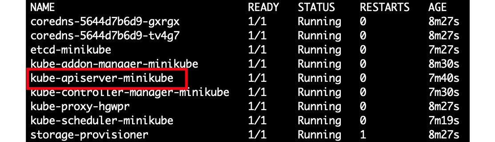


As we saw in previous labs, in the Minikube environment, the API
server is referred to as `kube-apiserver-minikube` in the
`kube-system` namespace. As you can see in the preceding
screenshot, we have a single instance of the API server:
`kube-apiserver-minikube`.

The API server is stateless (that is, its behavior will be consistent
regardless of the state of the cluster) and is designed to scale
horizontally. Usually, for the high availability of clusters, it is
recommended to have at least three instances to handle the load and
fault tolerance better.


Kubernetes HTTP Request Flow
============================


As we learned in earlier labs, when we run any `kubectl`
command, the command is translated into an HTTP API request in JSON
format and is sent to the API server. Then, the API server returns a
response to the client, along with any requested information. The
following diagram shows the API request life cycle and what happens
inside the API server when it receives a request:


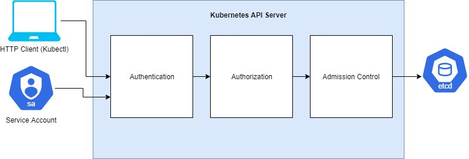


As you can see in the preceding figure, the HTTP request goes through
the authentication, authorization, and admission control stages. We will
take a look at each of these in the following subtopics.


Authentication
--------------

In Kubernetes, every API call needs to authenticate with the API server,
regardless of whether it comes from outside the cluster, such as those
made by kubectl, or a process inside the cluster, such as those made by
kubelet.

When an HTTP request is sent to the API server, the API server needs to
authenticate the client sending this request. The HTTP request will
contain the information required for authentication, such as the
username, user ID, and group. The authentication method will be
determined by either the header or the certificate of the request. To
deal with these different methods, the API server has different
authentication plugins, such as ServiceAccount tokens, which are used to
authenticate ServiceAccounts, and at least one other method to
authenticate users, such as X.509 client certificates.

Note

The cluster administrator usually defines authentication plugins during
cluster creation. You can learn more about the various authentication
strategies and authentication plugins at
<https://kubernetes.io/docs/reference/access-authn-authz/authentication/>.

We will take a look at the implementation of certificate-based
authentication in *Lab 11*, *Build Your Own HA Cluster*.

The API server will call those plugins one by one until one of them
authenticates the request. If all of them fail, then the authentication
fails. If the authentication succeeds, then the authentication phase is
complete and the request proceeds to the authorization phase.


Authorization
-------------

After authentication is successful, the attributes from the HTTP request
are sent to the authorization plugin to determine whether the user is
permitted to perform the requested action. There are various levels of
privileges that different users may have; for example, can a given user
create a pod in the requested namespace? Can the user delete a
Deployment? These kinds of decisions are made in the authorization
phase.

Consider an example where you have two users. A user called
**ReadOnlyUser** (just a hypothetical name) should be allowed to list
pods in the `default` namespace only, and **ClusterAdmin**
(another hypothetical name) should be able to perform all tasks across
all namespaces:


To understand this better, take a look at the following demonstration:

Note

We will not dive into too much detail about how to create users as this
will be discussed in *Lab 13*, *Runtime and Network Security in
Kubernetes*. For this demonstration, the users, along with their
permissions, are already set up, and the limitation of their privileges
is demonstrated by switching contexts.


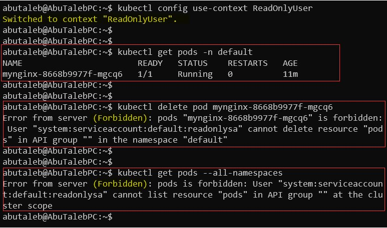


Notice, from the preceding screenshot, that the `ReadOnlyUser`
can only **list** pods in the default namespace, but when trying to
perform other tasks, such as deleting a pod in the `default`
namespace or listing pods in other namespaces, the user will get a
`Forbidden` error. This `Forbidden` error is
returned by the authorization plugin.

kubectl provides a tool that you can call by using
`kubectl auth can-i` to check whether an action is allowed for
the current user.

Let\'s consider the following examples in the context of the previous
demonstration. Let\'s say that the `ReadOnlyUser` runs the
following commands:


```
kubectl auth can-i get pods --all-namespaces
kubectl auth can-i get pods -n default
```

The user should see the following responses:


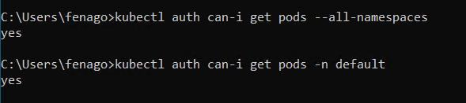


Now, after switching context, let\'s say that the
`ClusterAdmin` user runs the following commands:


```
kubectl auth can-i delete pods
kubectl auth can-i get pods
kubectl auth can-i get pods --all-namespaces
```

The user should see the following response:


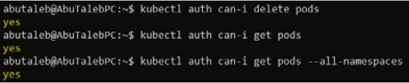


Unlike authentication phase modules, authorization modules are checked
in sequence. If multiple authorization modules are configured, and if
any authorizer approves or denies a request, that decision is
immediately returned, and no other authorizer will be contacted.


Admission Control
-----------------

After the request is authenticated and authorized, it goes to the
admission control modules. These modules can modify or reject requests.
If the request is only trying to perform a READ operation, it bypasses
this stage; but if it is trying to create, modify, or delete, it will be
sent to the admission controller plugins. Kubernetes comes with a set of
predefined admission controllers, although you can define custom
admission controllers as well.

These plugins may modify the incoming object, in some cases to apply
system-configured defaults or even to deny the request. Like
authorization modules, if any admission controller module rejects the
request, then the request is dropped and it will not process further.

Some examples are as follows:

-   If we configure a custom rule that every object should have a label
    (which you will learn how to do in *Lab 16*, *Kubernetes
    Admission Controllers*), then any request to create an object
    without a label will be rejected by the admission controllers.
-   When you delete a namespace, it goes to the **Terminating** state,
    where Kubernetes will try to evict all the resources in it before
    deleting it. So, we cannot create any new objects in this namespace.
    `NamespaceLifecycle `is what prevents that.
-   When a client tries to create a resource in a namespace that does
    not exist, the `NamespaceExists` admission controller
    rejects the request.

Out of the different modules included in Kubernetes, not all of the
admission control modules are enabled by default, and the default
modules usually change based on the Kubernetes version. Providers of
cloud-based Kubernetes solutions, such as **Amazon Web Services**
(**AWS**), Google, and Azure, control which plugins can be enabled by
default. Cluster administrators can also decide which modules to enable
or disable when initializing the API server. By using the
`--enable-admission-plugins` flag, administrators can control
which modules should be enabled other than the default ones. On the
other hand, the `--disable-admission-plugins` flag controls
which modules from the default modules should be disabled.

Note

You will learn more about admission controllers, including creating
custom ones, in *Lab 16*, *Kubernetes Admission Controllers*.

As you will recall from *Lab 2*, *An Overview of Kubernetes*, when
we created a cluster using the `minikube start` command,
Minikube enabled several modules for us by default. Let\'s take a closer
look at that in the next exercise in which we will not only view the
different API modules enabled for us by default but also start Minikube
with a custom set of modules.


Exercise 4.01: Starting Minikube with a Custom Set of Modules
-------------------------------------------------------------

In this exercise, we will take a look at how to view the different API
modules enabled for our instance of Minikube, and then restart Minikube
using a custom set of API modules:

1.  If Minikube is not already running on your machine, start it up by
    using the following command:

    
    ```
    minikube start
    ```
    

    You should see the following response:

    
    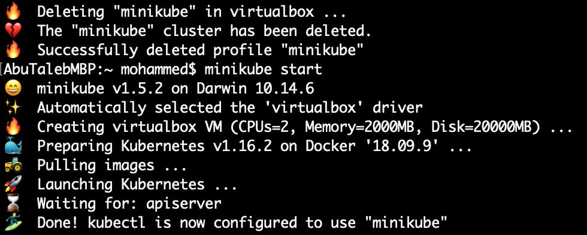
    


2.  Now, let\'s see which modules are enabled by default. Use the
    following command:

    
    ```
    kubectl describe pod kube-apiserver-minikube -n kube-system | grep enable-admission-plugins
    ```
    

    You should see the following response:

    
    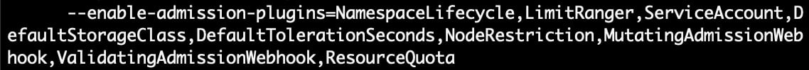
    


    As you can observe from the preceding output,
    Minikube has enabled the following modules for us:
    `NamespaceLifecycle`, `LimitRanger`,
    `ServiceAccount`, `DefaultStorageClass`,
    `DefaultTolerationSeconds`, `NodeRestriction`,
    `MutatingAdmissionWebhook`,
    `ValidatingAdmissionWebhook`, and
    `ResourceQuota`.

    Note

    To know more about modules, please refer the following link:
    [https://kubernetes.io/docs/reference/access-authn-authz/admission-controllers/](https://kubernetes.io/docs/reference/access-authn-authz/admission-controllers/%20)

3.  Another way to check the modules is to view the API server manifest
    by running the following command:

    
    ```
    kubectl exec -it kube-apiserver-minikube -n kube-system -- kube-apiserver -h | grep "enable-admission-plugins" | grep -vi deprecated
    ```
    

    Note

    We used `grep -vi deprecated` because there is another
    flag, `--admission-control`, that we are discarding from
    the output, as this flag will be deprecated in future versions.

    kubectl has the `exec` command, which allows us to execute
    a command to our running pods. This command will execute
    `kube-apiserver -h` inside our
    `kube-apiserver-minikube` pod and return the output to our
    shell:

    
    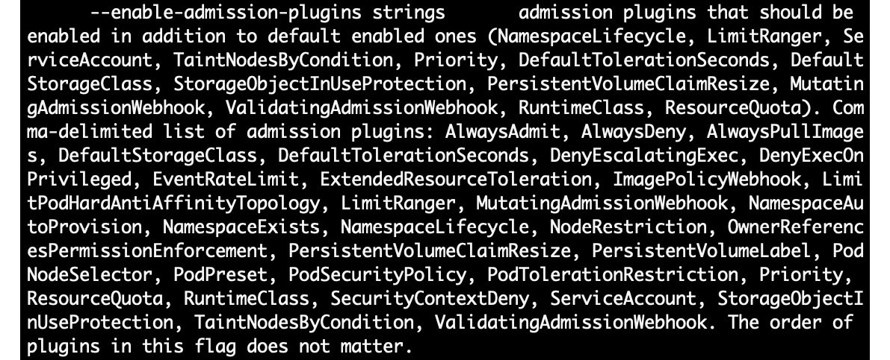
    

4.  Now, we will start Minikube with our desired configuration. Use the
    following command:

    
    ```
    minikube start --extra-config=apiserver.enable-admission-plugins="LimitRanger,NamespaceExists,NamespaceLifecycle,ResourceQuota,ServiceAccount,DefaultStorageClass,MutatingAdmissionWebhook"
    ```
    

    As you can see here, the `minikube start` command has the
    `--extra-config` configurator flag, which allows us to
    pass additional configurations to our cluster installation. In our
    case, we can use the `--extra-config` flag, along with
    `--enable-admission-plugins`, and specify the plugins we
    need to enable. Our command should produce this output:

    
    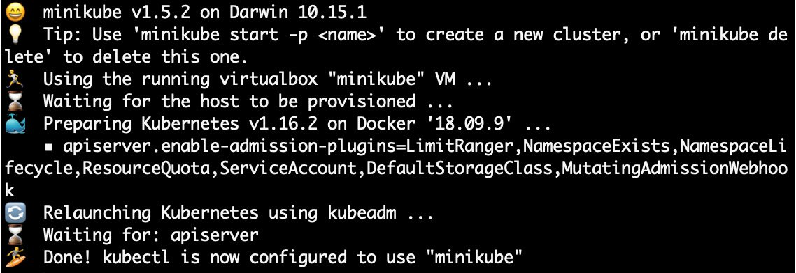
    


5.  Now, let\'s compare this instance of Minikube with our earlier one.
    Use the following command:

    
    ```
    kubectl describe pod kube-apiserver-minikube -n kube-system | grep enable-admission-plugins
    ```
    

    You should see the following response:

    
    
    


If you compare the set of modules seen here to the ones in *Figure 4.7*,
you will notice that only the specified plugins were enabled; while the
`DefaultTolerationSeconds`, `NodeRestriction`, and
`ValidatingAdmissionWebhook` modules are no longer enabled.

Note

You can revert to the default configurations in Minikube by running
`minikube start` again.


Validation
----------

After letting the request pass through all three stages, the API server
then validates the object---that is, it checks whether the object
specification, which is carried in JSON format in the response body,
meets the required format and standard.

After successful validation, the API server stores the object in the
etcd datastore and returns a response to the client. After that, as you
learned in *Lab 2*, *An Overview of Kubernetes*, other components,
such as the scheduler and the controller manager, take over to find a
suitable node and actually implement the object on your cluster.


The Kubernetes API
==================


The Kubernetes API uses JSON over HTTP for its requests and responses.
It follows the REST architectural style. You can use the Kubernetes API
to read and write Kubernetes resource objects.

Note

For more details about the RESTful API, please refer to
<https://restfulapi.net/>.

Kubernetes API allows clients to create, update, delete, or read a
description of an object via standard HTTP methods (or HTTP verbs), such
as the examples in the following table:


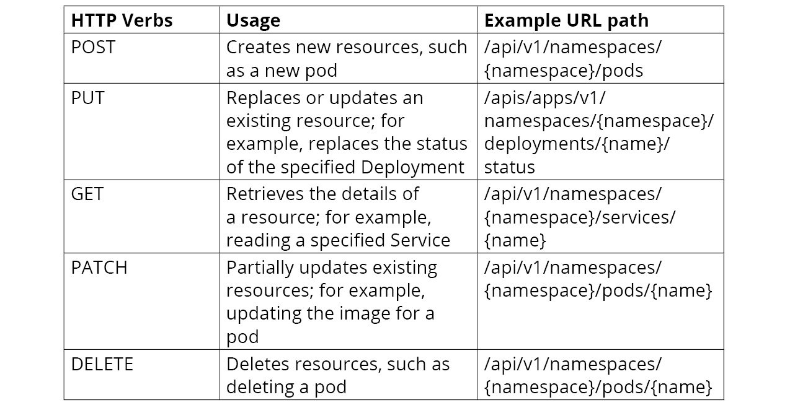


In the context of Kubernetes API calls, it is helpful to understand how
these HTTP methods map to API request verbs. So, let\'s take a look at
which verbs are sent through which methods:

-   `GET`: `get`, `list`, and
    `watch`

    Some example kubectl commands are `kubectl get pod`,
    `kubectl describe pod <pod-name>`, and
    `kubectl get pod -w`.

-   `POST`: `create`

    An example kubectl command is
    `kubectl create -f <filename.yaml>`.

-   `PATCH`: `patch`

    An example kubectl command is
    `kubectl set image deployment/kubeserve nginx=nginx:1.9.1`.

-   `DELETE`: `delete`

    An example kubectl command is
    `kubectl delete pod <pod-name>`.

-   `PUT`: `update`

    An example kubectl command is
    `kubectl apply -f <filename.yaml>`.

    Note

    If you have not encountered these commands yet, you will in the
    upcoming labs. Feel free to refer back to this lab or the
    following Kubernetes documentation to find out how each API request
    works for any command:
    <https://kubernetes.io/docs/reference/kubernetes-api/>.

As mentioned earlier, these API calls carry JSON data, and all of them
have a JSON schema identified by the `Kind` and
`apiVersion` fields. `Kind` is a string that
identifies the type of JSON schema that an object should have, and
`apiVersion` is a string that identifies the version of the
JSON schema the object should have. The next exercise should give you a
better idea about this.

You can refer to the Kubernetes API reference documentation to see the
different HTTP methods in action, at
<https://kubernetes.io/docs/reference/kubernetes-api/>.

For example, if you need to create a Deployment in a specific namespace,
under `WORKLOADS APIS`, you can navigate to
`Deployment v1 apps` \> `Write Operations` \>
`Create`. You will see the HTTP request and different examples
using `kubectl` or `curl`. The following page from
the API reference docs should give you an idea of how to use this
reference:


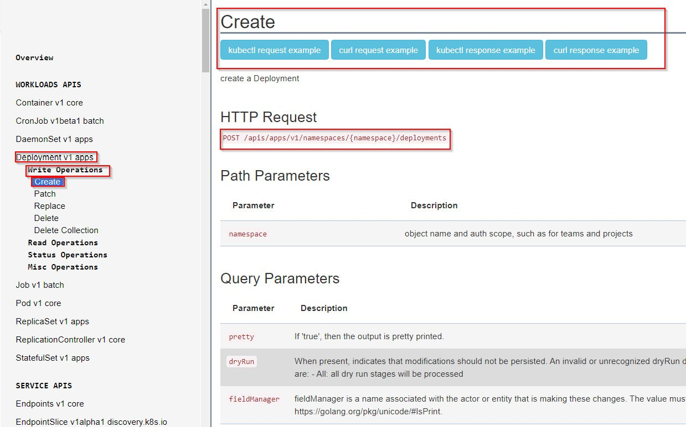


You will need to keep the version of your API server in mind when you
refer to the previously mentioned documentation. You can find your
Kubernetes API server version by running
`kubectl version --short` command and looking for
`Server Version`. For example, if your Kubernetes API server
version is running version 1.14, you should navigate to the Kubernetes
version 1.14 reference documentation
(<https://v1-14.docs.kubernetes.io/docs/reference/generated/kubernetes-api/v1.14/>)
to look up the relevant API information.

The best way to understand this is by tracing a `kubectl`
command. Let\'s do exactly that in the following section.


Tracing kubectl HTTP Requests
-----------------------------

Let\'s try tracing the HTTP requests that kubectl sends to the API
server to better understand them. Before we begin, let\'s get all the
pods in the `kube-system` namespace by using the following
command:


```
kubectl get pods -n kube-system
```

This command should display the output in a table view, as you can see
in the following screenshot:


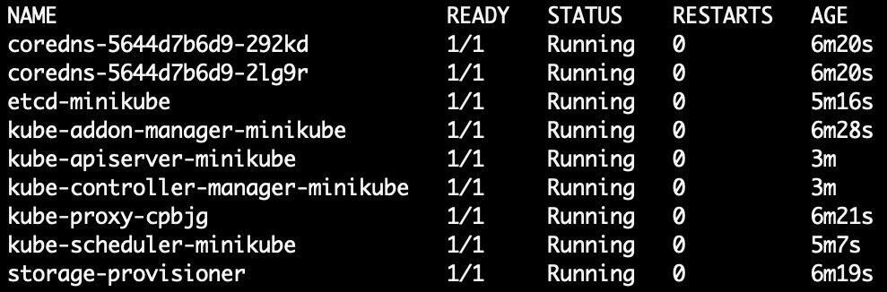


Behind the scenes, since kubectl is a REST client, it invokes an HTTP
`GET` request to the API server endpoint and requests
information from `/api/v1/namespaces/kube-system/pods`.

We can enable verbose output by adding `--v=8` to our
`kubectl` command. `v` indicates the verbosity of
the command. The higher the number, the more details we get in the
response. This number can range from `0` to `10`.
Let\'s see the output with verbosity of `8`:


```
kubectl get pods -n kube-system --v=8
```

This should give output as follows:


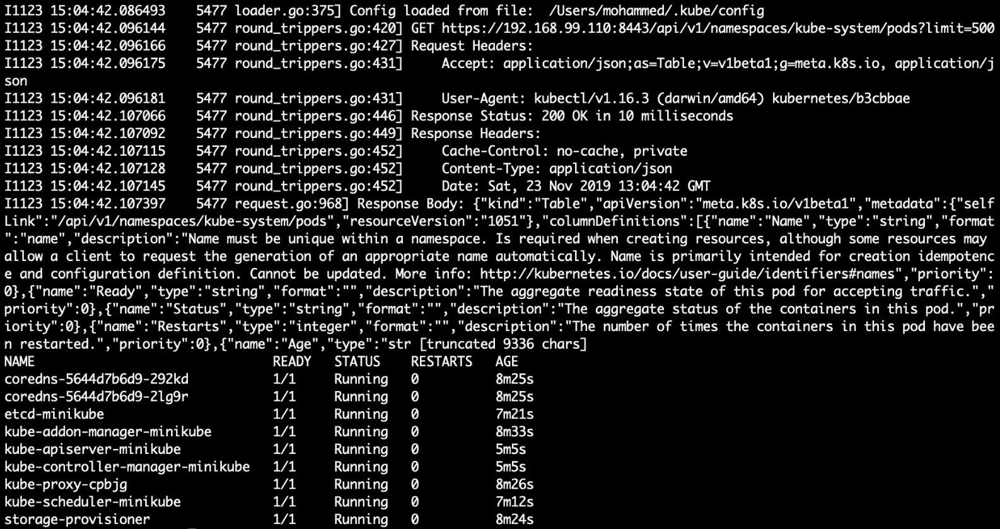


Let\'s examine the preceding output bit by bit to get a better
understanding of it:

-   The first part of the output is as follows:
    
    
    


file

From this, we can see that kubectl loaded the configuration from our
kubeconfig file, which has the API server endpoint, port, and
credentials, such as the certificate or the authentication token.

-   This is the next part of the output:
    
    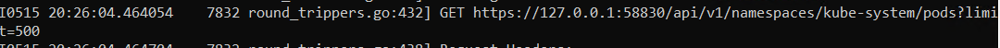
    


In this, you can see the `HTTP GET` request mentioned as
`GET https://192.168.99.100:8443/api/v1/namespaces/kube-system/pods?limit=500`.
This line contains the operation that we need to perform against the API
server, and `/api/v1/namespaces/kube-system/pods` is the API
path. You can also see `limit=500` at the end of the URL path,
which is the chunk size; kubectl fetches a large number of resources in
chunks to improve latency. We will see some examples relating to
retrieving large results sets in chunks later in this lab.

-   The next part of the output is as follows:
    
    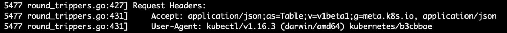
    


As you can see in this part of the output, `Request Headers`
describes the resource to be fetched or the client requesting the
resource. In our example, the output has two parts for content
negotiation:

a\) `Accept`: This is used by HTTP clients to tell the server
what content types they\'ll accept. In our example, we can see that
kubectl informed the API server about the `application/json`
content type. If this does not exist in the request header, the server
will return the default preconfigured representation type, which is the
same as `application/json` for the Kubernetes API as it uses
the JSON schema. We can also see that it is requesting the output as a
table view, which is indicated by `as=Table` in this line.

b\) `User-Agent`: This header contains information about the
client that is requesting this information. In this case, we can see
that kubectl is providing information about itself.

-   Let\'s examine the next part:
    
    
    


Here, we can see that the API server returns the `200 OK` HTTP
status code, which indicates that the request has been processed
successfully on the API server. We can also see the time taken to
process this request, which is 10 milliseconds.

-   Let\'s look at the next part:
    
    
    


As you can see, this part shows the `Response Headers`, which
include details such as the date and time of the request, in our
example.

-   Now, let\'s come to the main response sent by the API server:
    
    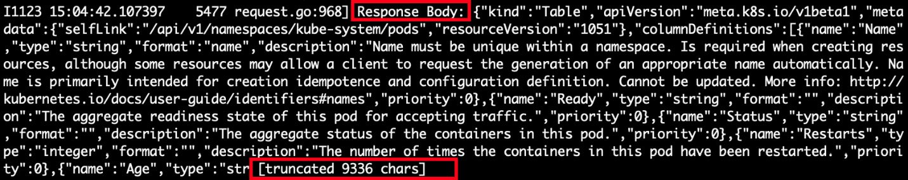
    


The `Response Body` contains the resource data that was
requested by the client. In our case, this is information about the pods
in the `kube-system` namespace. Here, this information is in
raw JSON format before kubectl can present it as a neat table. However,
the highlighted section at the end of the previous screenshot shows that
the response body does not have all the JSON output that we requested;
part of the `Response Body` is truncated. This is because
`--v=8` displays the HTTP request content with truncation of
the response content.

To see the full response body, you can run the same command with
`--v=10`, which does not truncate the output at all. The
command would look like as follows:


```
kubectl get pods -n kube-system --v=10
```

We will not examine the command with `--v=10` verbosity for
the sake of brevity.

-   Now, we come to the final part of the output that we are examining:
    
    
    


This is the final output as a table, which is what was requested.
kubectl has taken the raw JSON data and formatted it as a neat table for
us.

Note

You can learn more about kubectl verbosity and debugging flags at
<https://kubernetes.io/docs/reference/kubectl/cheatsheet/#kubectl-output-verbosity-and-debugging>.


API Resource Type
-----------------

In the previous section, we saw that the HTTP URL was made up of an API
resource, API group, and API version. Now, let\'s learn about the
resource type defined in the URL, such as pods, namespaces, and
services. In JSON form, this is called `Kind`:

-   **Collection of resource**: This represents a collection of
    instances for a resource type, such as all pods in all namespaces.
    In a URL, this would be as follows:
    
    ```
    GET /api/v1/pods
    ```
    
-   **Single resource**: This represents a single instance of a resource
    type, such as retrieving details of a specific pod in a given
    namespace. The URL for this case would be as follows:
    
    ```
    GET /api/v1/namespaces/{namespace}/pods/{name}
    ```
    

Now that we have learned about various aspects of a request made to the
API server, let\'s learn about the scope of API resources in the next
section.


Scope of API Resources
======================


All resource types can either be cluster-scoped resources or
namespace-scoped resources. The scope of a resource affects the access
of that resource and how that resource is managed. Let\'s look at the
differences between namespace and cluster scope.


Namespace-Scoped Resources
--------------------------

As we saw in *Lab 2*, *An Overview of Kubernetes*, Kubernetes makes
use of Linux namespaces to organize most Kubernetes resources. Resources
in the same namespace share the same control access policies and
authorization checks. When a namespace is deleted, all resources in that
namespace are also deleted.

Let\'s see what forms the request paths for interacting with
namespace-scoped resources take:

-   Return the information about a specific pod in a namespace:
    
    ```
    GET /api/v1/namespaces/{my-namespace}/pods/{pod-name}
    ```
    

-   Return the information about a collection of all Deployments in a
    namespace:
    
    ```
    GET /apis/apps/v1/namespaces/{my-namespace}/deployments
    ```
    

-   Return the information about all instances of the resource type (in
    this case, services) across all namespaces:

    
    ```
    GET /api/v1/services
    ```
    

    Notice that when we are looking for information against all
    namespaces, it will not have `namespace` in the URL.

You can get a full list of namespace-scoped API resources by using the
following command:


```
kubectl api-resources --namespaced=true
```

You should see a response similar to this:


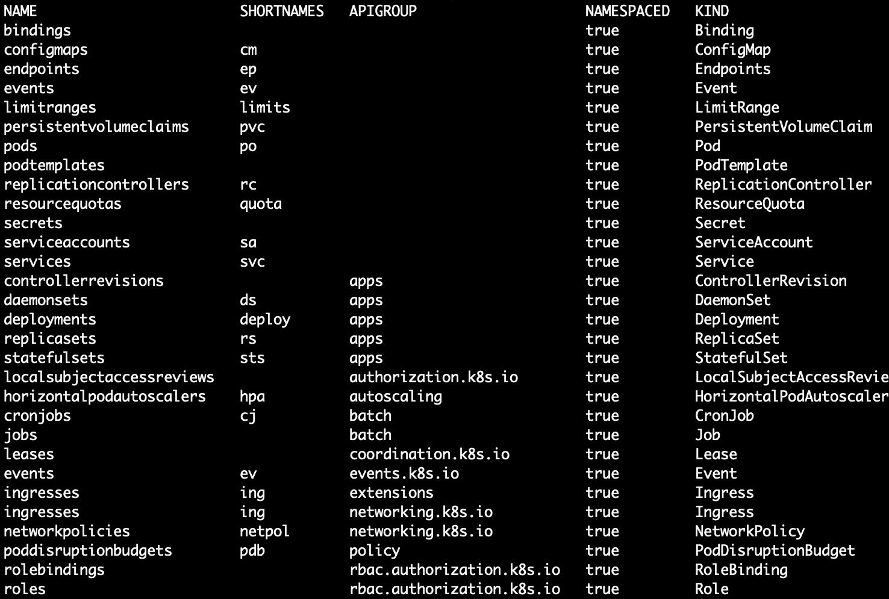


Cluster-Scoped Resources
------------------------

Most Kubernetes resources are namespace-scoped, but the namespace
resource itself is not namespace-scoped. Resources that are not scoped
within namespaces are cluster-scoped. Other examples of cluster-scoped
resources are nodes. Since a node is cluster-scoped, you can deploy a
pod on the desired node regardless of what namespace you want the pod to
be in, and a node can host different pods from different namespaces.

Let\'s see how the request paths for interacting with cluster-scoped
resources look:

-   Return the information about a specific node in the cluster:
    
    ```
    GET /api/v1/nodes/{node-name}
    ```
    

-   Return the information of all instances of the resource type (in
    this case, nodes) in the cluster:
    
    ```
    GET /api/v1/nodes
    ```
    

-   You can get a full list of cluster-scoped API resources by using the
    following command:

    
    ```
    kubectl api-resources --namespaced=false
    ```
    

    You should see an output similar to this:

    
    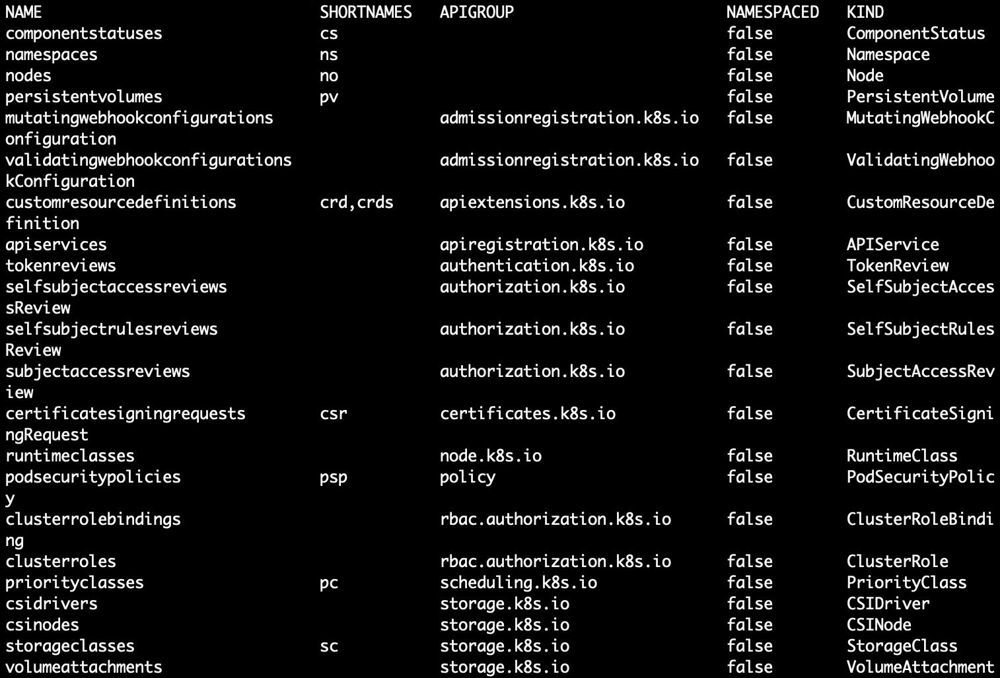
    


API Groups
==========


An API group is a collection of resources that are logically related to
each other. For example, Deployments, ReplicaSets, and DaemonSets all
belong to the apps API group: `apps/v1`.

Note

You will learn about Deployments, ReplicaSets, and DaemonSets in detail
in *Lab 7*, *Kubernetes Controllers*. In fact, this lab will
talk about many API resources that you will encounter in later labs.

The `--api-group` flag can be used to scope the output to a
specific API group, as we will see in the following sections. Let\'s
take a closer look at the various API groups in the following sections.


Core Group
----------

This is also called the legacy group. It contains objects such as pods,
services, nodes, and namespaces. The URL path for these is
`/api/v1`, and nothing other than the version is specified in
the `apiVersion` field. For example, consider the following
screenshot where we are getting information about a pod:


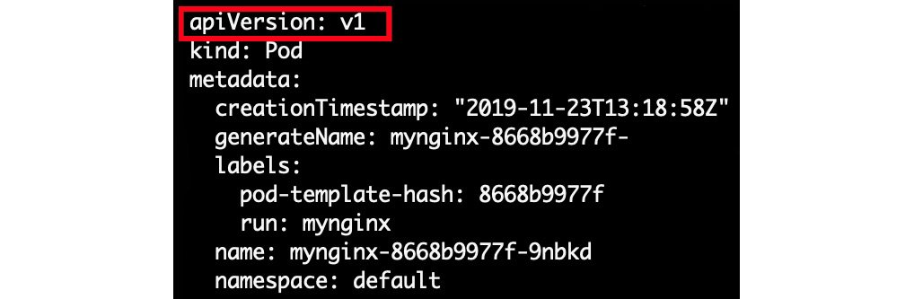


As you can see here, the `apiVersion: v1` field indicates that
this resource belongs to the core group.

Resources showing a blank entry in the `kubectl api-resources`
command output are part of the core group. You can also specify an empty
argument flag (`--api-group=''`) to only display the core
group resources, as follows:


```
kubectl api-resources --api-group=''
```

You should see an output as follows:


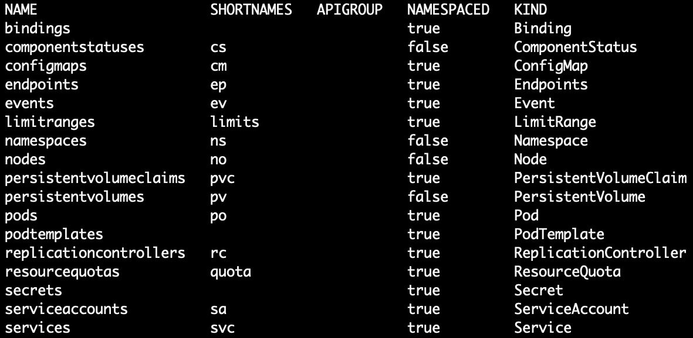


Named Group
-----------

This group includes objects for whom the request URL is in the
`/apis/$NAME/$VERSION` format. Unlike the core group, named
groups contain the group name in the URL. For example, let\'s consider
the following screenshot where we have information about a Deployment:


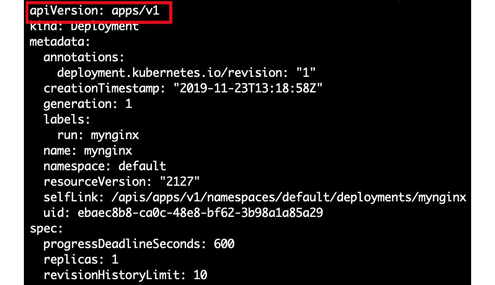


As you can see, the highlighted field showing
`apiVersion: apps/v1` indicates that this resource belongs to
the `apps` API group.

You can also specify the `--api-group='<NamedGroup Name>'`
flag to display the resources in that specified named group. For
example, let\'s list out the resources under the `apps` API
group by using the following command:


```
kubectl api-resources --api-group='apps'
```

This should give the following response:


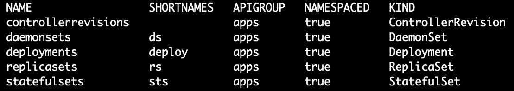


All of these resources in the preceding screenshot are clubbed together
because they are part of the `apps` named group, which we
specified in our query command.

As another example, let\'s look at the
`rbac.authorization.k8s.io API group`, which has resources to
determine authorization policies. We can look at the resources in that
group by using the following command:


```
kubectl api-resources --api-group='rbac.authorization.k8s.io'
```

You should see the following response:


API group


System-Wide
-----------

This group consists of system-wide API endpoints, such as
`/version`, `/healthz`, `/logs`, and
`/metrics`. For example, let\'s consider the output of the
following command:


```
kubectl version --short --v=6
```

This should give an output similar to this:


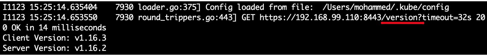


As you can see in this screenshot, when you run
`kubectl --version`, this goes to the
`/version special entity`, as seen in the `GET`
request URL.


API Versions
============


In the Kubernetes API, there is the concept of API versioning; that is,
the Kubernetes API supports multiple versions of a type of resource.
These different versions may act differently. Each one has a different
API path, such as `/api/v1` or
`/apis/extensions/v1beta1`.

The different API versions differ in terms of stability and support:

-   **Alpha**: This version is indicated by `alpha` in the
    `apiVersion` field---for example,
    `/apis/batch/v1alpha1`. The alpha version of resources is
    disabled by default as it is not intended for production clusters
    but can be used by early adopters and developers who are willing to
    provide feedback and suggestions and report bugs. Also, support for
    alpha resources may be dropped without notice by the time the final
    stable version of Kubernetes is finalized.
-   **Beta**: This version is indicated by `beta` in the
    `apiVersion` field---for example,
    `/apis/certificates.k8s.io/v1beta1`. The beta version of
    resources is enabled by default, and the code behind it is well
    tested. However, using it is recommended for scenarios that are not
    business-critical because it is possible that changes in subsequent
    releases may reduce incompatibilities; that is, some features may
    not be supported for a long time.
-   **Stable**: For these versions, the `apiVersion` field
    just contains the version number without any mention of
    `alpha` or `beta`---for example,
    `/apis/networking.k8s.io/v1`. The Stable version of
    resources is supported for many subsequent versions releases of
    Kubernetes. So, this version of API resources is recommended for any
    critical use cases.

You can get a complete list of the API versions enabled in your cluster
by using the following command:


```
kubectl api-versions
```

You should see a response similar to this:


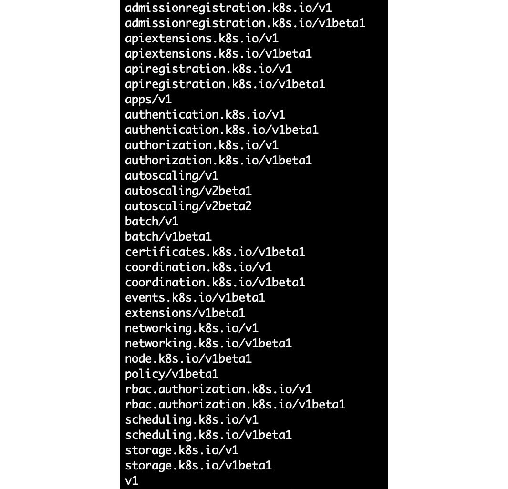


An interesting thing that you may observe in this screenshot is that
some API resources, such as `autoscaling`, have multiple
versions; for example, for `autoscaling`, there is
`v1beta1`, `v1beta2`, and `v1`. So, what
is the difference between them and which one should you use?

Let\'s again consider the example of `autoscaling`. This
feature allows you to scale the number of pods in a replication
controller, such as Deployments, ReplicaSets, or StatefulSets, based on
specific metrics. For example, you can autoscale the number of pods from
3 to 10 if the average CPU load exceeds 50%.

In this case, the difference in the versions is that of feature support.
The Stable release for autoscaling is `autoscaling/v1`, which
only supports scaling the number of pods based on the average CPU
metric. The beta release for autoscaling, which is
`autoscaling/v2beta1`, supports scaling based on CPU and
memory utilization. The newer version in the beta release, which is
`autoscaling/v2beta2`, supports scaling the number of pods
based on custom metrics in addition to CPU and memory. However, since
the beta release is still not meant to be used for business-critical
scenarios when you create an autoscaling resource, it will use the
`autoscaling/v1` version. However, you can still use other
versions to use additional features by specifying the beta version in
the YAML file until the required features are added to the stable
release.

All of this information can seem overwhelming. However, Kubernetes
provides ways to access all the information you need to navigate your
way around the API resources. You can use kubectl to access the
Kubernetes docs and get the necessary information about the various API
resources. Let\'s see how that works in the following exercise.


Exercise 4.02: Getting Information about API Resources
------------------------------------------------------

Let\'s say that we want to create an ingress object. For the purposes of
this exercise, you don\'t need to know much about ingress; we will learn
about it in the upcoming labs.

We will use kubectl to get more information about the Ingress API
resource, determine which API versions are available, and find out which
groups it belongs to. If you recall from previous sections, we need this
information for the `apiVersion` field of our YAML manifest.
Then, we also get the information required for the other fields of our
manifest file:

1.  Let\'s first ask our cluster for all the available API resources
    that match the `ingresses` keyword:

    
    ```
    kubectl api-resources | grep ingresses
    ```
    

    This command will filter the list of all the API resources by the
    `ingresses` keyword. You should get the following output:

    
    ```
    ingresses     ing     extensions            true         Ingress
    ingresses     ing     networking.k8s.io     true         Ingress
    ```
    

    We can see that we have ingress resources on two different API
    groups---`extensions` and `networking.k8s.io`.

2.  We have also seen how we can get API resources belonging to specific
    groups. Let\'s check the API groups that we saw in the previous
    step:

    
    ```
    kubectl api-resources --api-group="extensions"
    ```
    

    You should get the following output:

    
    ```
    NAME       SHORTNAMES     APIGROUP     NAMESPACED      KIND
    ingresses  ing            extensions   true            Ingress
    ```
    

    Now, let\'s check the other group:

    
    ```
    kubectl api-resources --api-group="networking.k8s.io"
    ```
    

    You should see the following output:

    
    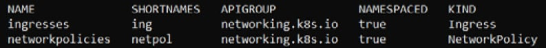
    
    However, if we were to use an ingress resource, we still don\'t know
    whether we should use the one from the `extensions` group
    or the `networking.k8s.io` group. In the next step, we
    will get some more information that will help us decide that.

3.  Use the following command to get more information:

    
    ```
    kubectl explain ingress
    ```
    

    You should get this response:

    
    
    


    extensions API group

    As you can see, the `kubectl explain` command describes
    the API resource, as well as the details about the fields associated
    with it. We can also see that ingress uses the
    `extensions/v1beta1` API version, but if we read the
    `DESCRIPTION`, it mentions that this group version of
    ingress is deprecated by `networking.k8s.io/v1beta1`.
    Deprecated means that the standard is in the process of being phased
    out, and even though it is currently supported, it is not
    recommended for use.

    Note

    If you compare this to the different versions of
    `autoscaling` that we saw just before this exercise, you
    may think that the logical upgrade path from `v1beta`
    would be `v2beta`, and that would totally make sense.
    However, the ingress resource was moved from the
    `extensions` group to the `networking.k8s.io`
    group, and so this bucks the naming trend.

4.  It is not a good idea to use a deprecated version, so let\'s say
    that you want to use the `networking.k8s.io/v1beta1`
    version instead. However, we need to get more information about it
    first. We can add a flag to the `kubectl explain` command
    to get information about a specific version of an API resource, as
    follows:

    
    ```
    kubectl explain ingress --api-version=networking.k8s.io/v1beta1
    ```
    

    You should see this response:

    
    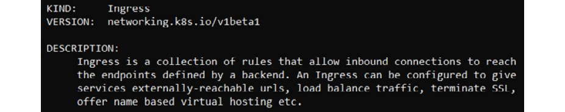


5.  We can also filter the output of the `kubectl explain`
    command by using the `JSONPath` identifier. This allows us
    to get information about the various fields that we need to specify
    while defining the YAML manifest. So, for example, if we would like
    to see the `spec` fields for Ingress, the command will be
    as follows:

    
    ```
    kubectl explain ingress.spec --api-version=networking.k8s.io/v1beta1
    ```
    

    This should give a response as follows:

    
    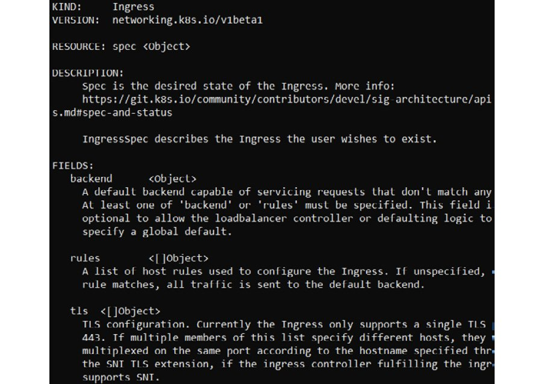
    

6.  We can dive deeper to get more details about the nested fields. For
    example, if you wanted to get more details about the
    `backend` field of ingress, we can specify
    `ingress.spec.backend` to get the required information:

    
    ```
    kubectl explain ingress.spec.backend --api-version=networking.k8s.io/v1beta1
    ```
    

    This will give the following output:

    
    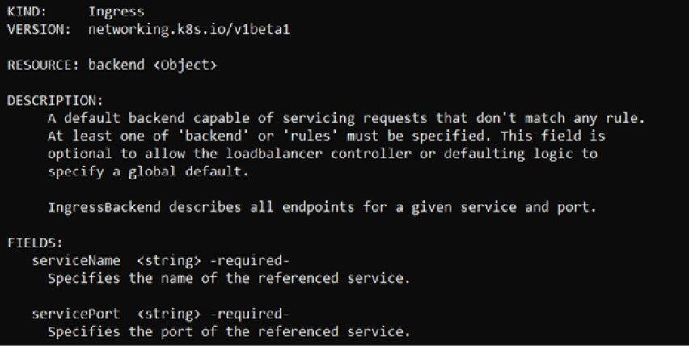
    


Similarly, we can repeat this for any field that you need information
about, which is handy for building or modifying a YAML manifest. So, we
have seen that the `kubectl explain` command is very useful
when you are looking for more details and documentation about an API
resource. It is also very useful when creating or modifying objects
using YAML manifest files.


How to Enable/Disable API Resources, Groups, or Versions
--------------------------------------------------------

In a typical cluster, not all API groups are enabled by default. It
depends on the cluster use case as determined by the administrators. For
example, some Kubernetes cloud providers disable resources that use the
alpha level for stability and security reasons. However, those can still
be enabled on the API server by using the `--runtime-config`
flag, which accepts comma-separated lists.

To be able to create any resource, the group and version should be
enabled in the cluster. For example, when you try to create a
`CronJob` that uses `apiVersion: batch/v2alpha1` in
its manifest file, if the group/version is not enabled, you will get an
error similar to the following:


```
No matches for kind "CronJob" in version "batch/v2alpha1".
```

To enable `batch/v2alpha1`, you will need to set
`--runtime-config=batch/v2alpha1` on the API server. This can
be done either during the creation of the cluster or by updating the
`/etc/kubernetes/manifests/kube-apiserver.yaml` manifest file.
The flag also supports disabling an API group or version by setting a
`false` value to the specific version---for example,
`--runtime-config=batch/v1=false`.

`--runtime-config` also supports the `api/all`
special key, which is used to control all API versions. For example, to
turn off all API versions except `v1`, you can pass the
`--runtime-config=api/all=false,api/v1=true` flag. Let\'s try
our own hands-on example of creating and disabling API groups and
versions in the following exercise.


Exercise 4.03: Enabling and Disabling API Groups and Versions on a Minikube Cluster
-----------------------------------------------------------------------------------

In this exercise, we will create specific API versions while starting up
Minikube, disable certain API versions in our running cluster, and then
enable/disable resources in an entire API group:

1.  Start Minikube with the flag shown in the following command:

    
    ```
    minikube start --extra-config=apiserver.runtime-config=batch/v2alpha1
    ```
    

    You should see the following response:

    
    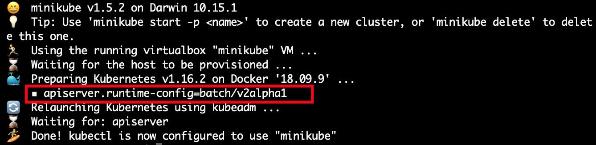
    


2.  You can confirm it is enabled by checking the details about the
    `kube-apiserver-minikube` pod. Use the
    `describe pod` command and filter the results by the
    `runtime` keyword:

    
    ```
    kubectl describe pod kube-apiserver-minikube -n kube-system | grep runtime
    ```
    

    You should see the following response:

    
    ```
    --runtime-config=batch/v2alpha1
    ```
    

3.  Another way to confirm this is by looking at the enabled API
    versions by using the following command:

    
    ```
    kubectl api-versions | grep batch/v2alpha1
    ```
    

    You should see the following response:

    
    ```
    batch/v2alpha1
    ```
    

4.  Now, let\'s create a resource called a `CronJob`, which
    uses `batch/v2alpha1` to confirm that our API server
    accepts the API. Create a file named `sample-cronjob.yaml`
    with the following contents:
    
    ```
    apiVersion: batch/v2alpha1
    kind: CronJob
    metadata:
      name: hello
    spec:
      schedule: "*/1 * * * *"
      jobTemplate:
        spec:
          template:
            spec:
              containers:
              - name: hello
                image: busybox
                args:
                - /bin/sh
                - -c
                - date; echo Hello from the Kubernetes cluster
              restartPolicy: OnFailure
    ```
    

5.  Now, create a `CronJob` by using this YAML file:

    
    ```
    kubectl create -f sample-cronjob.yaml
    ```
    

    You should see the following output:

    
    ```
    cronjob.batch/hello created
    ```
    

    As you can see, the API server accepted our YAML file and the
    `CronJob` is created successfully.

6.  Now, let\'s disable `batch/v2alpha1` on our cluster. To do
    that, we need to access the Minikube virtual machine (VM) using SSH,
    as demonstrated in previous labs:

    
    ```
    minikube ssh
    ```
    

    You should see this response:

    
    
    


7.  Open the API server manifest file. This is the template Kubernetes
    uses for the API server pods. We will use vi to modify this file,
    although you can use any text editor of your preference:

    
    ```
    sudo vi /etc/kubernetes/manifests/kube-apiserver.yaml
    ```
    

    You should see a response like the following:

    
    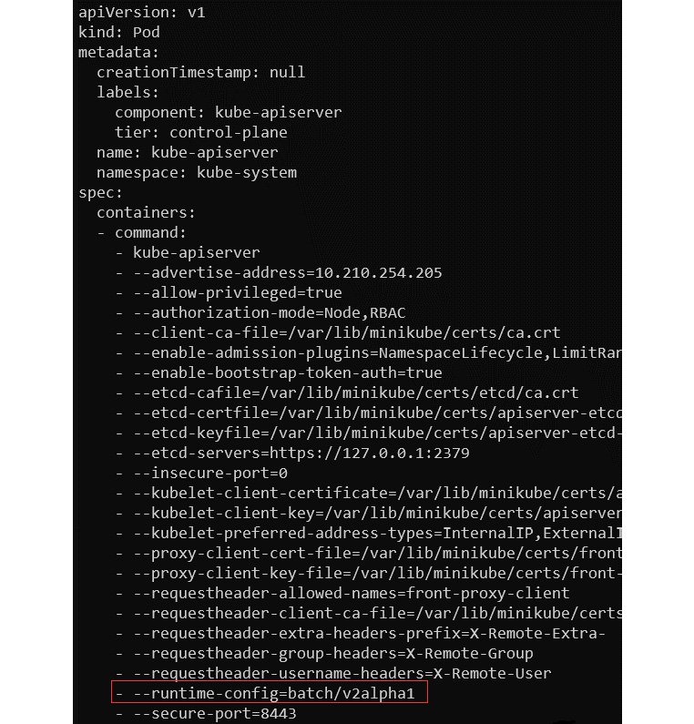
    


    Look for the line that contains
    `--runtime-config=batch/v2alpha1` and change it to
    `--runtime-config=batch/v2alpha1=false`. Then, save the
    modified file.

8.  End the SSH session by using the following command:
    
    ```
    exit
    ```
    

9.  For the changes in the API server manifest to take effect, we need
    to restart the API server and the controller manager. Since these
    are deployed as stateless pods, we can simply delete them and they
    will automatically get deployed again. First, let\'s delete the API
    server by running this command:

    
    ```
    kubectl delete pods -n kube-system -l component=kube-apiserver
    ```
    

    You should see this output:

    
    ```
    pod "kube-apiserver-minikube" deleted
    ```
    

    Now, let\'s delete the controller manager:

    
    ```
    kubectl delete pods -n kube-system -l component=kube-controller-manager
    ```
    

    You should see this output:

    
    ```
    pod "kube-controller-manager-minikube" deleted
    ```
    

    Note that for both of these commands, we did not delete the pods by
    their names. The `-l` flag looks for labels. These
    commands deleted all the pods in the `kube-system`
    namespace that had labels that match the ones specified after the
    `-l` flag.

10. We can confirm that `batch/v2alpha1` is no longer shown in
    API versions by using the following command:

    
    ```
    kubectl api-versions | grep batch/v2alpha1
    ```
    

    This command will not give you any response, indicating that we have
    disabled `batch/v2alpha1`.

So, we have seen how we can enable or disable a specific group or
version of API resources. But this is still a broad approach. What if
you wanted to disable a specific API resource?

For our example, let\'s say that you want to disable ingress. We saw in
the previous exercise that we have ingresses in the
`extensions` as well as `networking.k8s.io` API
groups. If you are targeting a specific API resource, you need to
specify its group and version. Let\'s say that you want to disable
ingress from the `extensions` group because it is deprecated.
In this group, we have just one version of ingresses, which is
`v1beta`, as you can observe from *Figure 4.33*.

To achieve this, all we have to do is modify the
`--runtime-config` flag to specify the resource that we want.
So, if we wanted to disable ingress from the `extensions`
group, the flag would be as follows:


```
--runtime-config=extensions/v1beta1/ingresses=false
```

To disable the resource, we can use this flag when starting up Minikube,
as shown in *step 1* of this exercise, or we can add this line to the
API server\'s manifest file, as shown in *step 7* of this exercise.
Recall from this exercise that if we instead want to enable the
resource, we just need to remove the `=false` part from the
end of this flag.


Interacting with Clusters Using the Kubernetes API
==================================================


Up until now, we\'ve been using the Kubernetes kubectl command-line
tool, which made interacting with our cluster quite convenient. It does
that by extracting the API server address and authentication information
from the client kubeconfig file, which is located in
`~/.kube/config` by default, as we saw in the previous
lab. In this section, we will look at the different ways to directly
access the API server with HTTP clients such as curl.

There are two possible ways to directly access the API server via the
REST API---by using kubectl in proxy mode or by providing the location
and authentication credentials directly to the HTTP client. We will
explore both methods to understand the pros and cons of each one.


Accessing the Kubernetes API Server Using kubectl as a Proxy
------------------------------------------------------------

kubectl has a great feature called **kubectl proxy**, which is the
recommended approach for interacting with the API server. This is
recommended because it is easier to use and provides a more secure way
of doing so because it verifies the identity of the API server by using
a self-signed certificate, which prevents **man-in-the-middle**
(**MITM**) attacks.

kubectl proxy routes the requests from our HTTP client to the API server
while taking care of authentication by itself. Authentication is also
handled by using the current configuration in our kubeconfig file.

In order to demonstrate how to use kubectl proxy, let\'s first create an
NGINX Deployment with two replicas in the default namespace and view it
using `kubectl get pods`:


```
kubectl create deployment mynginx --image=nginx:latest 
```

This should give an output like the following:


```
deployment.apps/mynginx created
```

Now, we can scale our Deployment to two replicas with the following
command:


```
kubectl scale deployment mynginx --replicas=2
```

You should see an output similar to this:


```
deployment.apps/mynginx scaled
```

Let\'s now check whether the pods are up and running:


```
kubectl get pods
```

This gives an output similar to the following:


```
NAME                        READY    STATUS     RESTARTS   AGE
mynginx-565f67b548-gk5n2    1/1      Running    0          2m30s
mynginx-565f67b548-q6slz    1/1      Running    0          2m30s
```

To start a proxy to the API server, run the `kubectl proxy`
command:


```
kubectl proxy
```

This should give output as follows:


```
Starting to serve on 127.0.0.1:8001
```

Note from the preceding screenshot that the local proxy connection is
running on `127.0.0.1:8001`, which is the default. We can also
specify a custom port by adding the `--port=<YourCustomPort>`
flag, while adding an `&` (ampersand) sign at the end of our
command to allow the proxy to run in the terminal background so that we
can continue working in the same terminal window. So, the command would
look like this:


```
kubectl proxy --port=8080 &
```

This should give the following response:


```
[1] 48285
AbuTalebMBP:~ mohammed$ Starting to serve on 127.0.0.1:8080
```

The proxy is run as a background job, and in the preceding screenshot,
`[1]` indicates the job number and `48285` indicates
its process ID. To exit a proxy running in the background, you can run
`fg` to bring the job back to the foreground:


```
fg
```

This will show the following response:


```
kubectl proxy --port=8080
^C
```

After getting the proxy to the foreground, we can simply use *Ctrl* +
*C* to exit it (if there\'s no other job running).

Note

If you are not familiar with job control, you can learn about it at
<https://www.gnu.org/software/bash/manual/html_node/Job-Control-Basics.html>.

We can now start exploring the API using curl:


```
curl http://127.0.0.1:8080/apis
```

Recall that even though we are mostly using YAML for convenience, the
data is stored in etcd in JSON format. You will see a long response that
begins something like this:


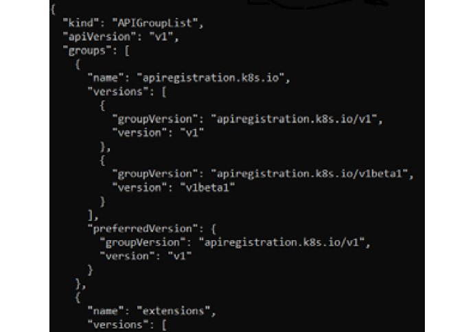


But how do we find the exact path to query the Deployment we created
earlier? Also, how do we query the pods created by that Deployment?

You can start by asking yourself a few questions:

-   What are the API version and API group used by Deployments?

    In *Figure 4.27*, we saw that the Deployments are in
    `apps/v1`, so we can start by adding that to the path:

    
    ```
    curl http://127.0.0.1:8080/apis/apps/v1
    ```
    

-   Is it a namespace-scoped resource or a cluster-scoped resource? If
    it is a namespace-scoped resource, what is the name of the
    namespace?

    We also saw in the scope of the API resources section that
    Deployments are namespace-scoped resources. When we created the
    Deployment, since we did not specify a different namespace, it went
    to the `default` namespace. So, in addition to the
    `apiVersion` field, we would need to add
    `namespaces/default/deployments` to our path:

    
    ```
    curl http://127.0.0.1:8080/apis/apps/v1/namespaces/default/deployments
    ```
    

    This will return a large output with the JSON data that is stored on
    this path. This is the part of the response that gives us the
    information that we need:

    
    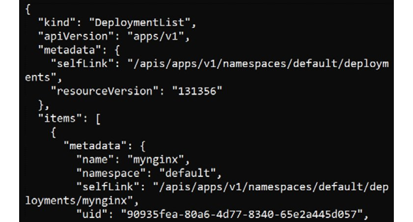
    


As you can see in this output, this lists all the Deployments in the
`default` namespace. You can infer that from
`"kind": "DeploymentList"`. Also, note that the response is in
JSON format and is not neatly presented as a table.

Now, we can specify a specific Deployment by adding it to our path:


```
curl http://127.0.0.1:8080/apis/apps/v1/namespaces/default/deployments/mynginx
```

You should see this response:


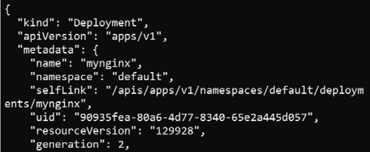


You can use this method with any other resource as well.


Creating Objects Using curl
---------------------------

When you use any HTTP client, such as curl, to send requests to the API
server to create objects, you need to change three things:

1.  Change the `HTTP` request method to `POST`. By
    default, curl will use the `GET` method. To create
    objects, we need to use the `POST` method, as we learned
    in *The Kubernetes API* section. You can change this using the
    `-X` flag.
2.  Change the HTTP request header. We need to modify the header to
    inform the API server what the intention of the request is. We can
    modify the header using the `-H` flag. In this case, we
    need to set the header to
    `'Content-Type: application/yaml'`.
3.  Include the spec of the object to be created. As you learned in the
    previous two labs, each API resource is persisted in the etcd as
    an API object, which is defined by a YAML spec/manifest file. To
    create an object, you need to use the `--data` flag to
    pass the YAML manifest to the API server so that it can persist it
    in etcd as an object.

So, the curl command, which we will implement in the following exercise,
will look something like this:


```
curl -X POST <URL-path> -H 'Content-Type: application/yaml' --data <spec/manifest>
```

At times, you will have the manifest files handy. However, that may not
always be the case. Also, we have not yet seen what manifests for
namespaces look like.

Let\'s consider a case where we want to create a namespace. Usually, you
would create a namespace as follows:


```
kubectl create namespace my-namespace
```

This will give the following response:


```
namespace/my-namespace created
```

Here, you can see that we created a namespace called
`my-namespace`. However, for passing the request without using
kubectl, we need the spec used to define a namespace. We can get that by
using the `--dry-run=client` and `-o` flags:


```
kubectl create namespace my-second-namespace --dry-run=client -o yaml
```

This will give the following response:


When you run a `kubectl` command with the
`--dry-run=client` flag, the API server takes it through all
the stages of a normal command, except that it does not persist the
changes into etcd. So, the command is authenticated, authorized, and
validated, but changes are not permanent. This is a great way to test
whether a certain command works, and also to get the manifest that the
API server would have created for this command, as you can see in the
previous screenshot. Let\'s see how to put this in practice and use curl
to create a Deployment.


Exercise 4.04: Creating and Verifying a Deployment Using kubectl proxy and curl
-------------------------------------------------------------------------------

For this exercise, we will create an NGINX Deployment called
`nginx-example` with three replicas in a namespace called
`example`. We will do this by sending our requests to the API
server with curl via kubectl proxy:

1.  First, let\'s start our proxy:

    
    ```
    kubectl proxy &
    ```
    

    This should give the following response:

    
    ```
    [1] 50034
    AbuTalebMBP:~ mohammed$ Starting to serve on 127.0.0.1:8080
    ```
    

    The proxy started as a background job and is listening on the
    localhost at port `8001`.

2.  Since the `example` namespace does not exist, we should
    create that namespace before creating the Deployment. As we learned
    in the previous section, we need to get the spec that should be used
    to create the namespace. Let\'s use the following command:

    
    ```
    kubectl create namespace example --dry-run -o yaml
    ```
    

    Note

    For Kubernetes versions 1.18+, please use
    `--dry-run=client`.

    This will give the following output:

    
    
    


    Now, we have the spec required for creating the namespace.

3.  Now, we need to send a request to the API server using curl.
    Namespaces belong to the core group and hence the path will be
    `/api/v1/namespaces`. The final `curl` command
    to create the namespace after adding all required parameters should
    look like the following:

    
    ```
    curl -X POST http://127.0.0.1:8001/api/v1/namespaces -H 'Content-    Type: application/yaml' --data "
    apiVersion: v1
    kind: Namespace
    metadata:
      creationTimestamp: null
      name: example
    spec: {}
    status: {}
    "
    ```
    

    Note

    You can discover the required path for any resource, as shown in the
    previous exercise. In this command, the double-quotes
    (`"`) after `--data` allow you to enter
    multi-line input in Bash, which is delimited by another double-quote
    at the end. So, you can copy the output from the previous step here
    before the delimiter.

    Now, if everything was correct in our command, you should get a
    response like the following:

    
    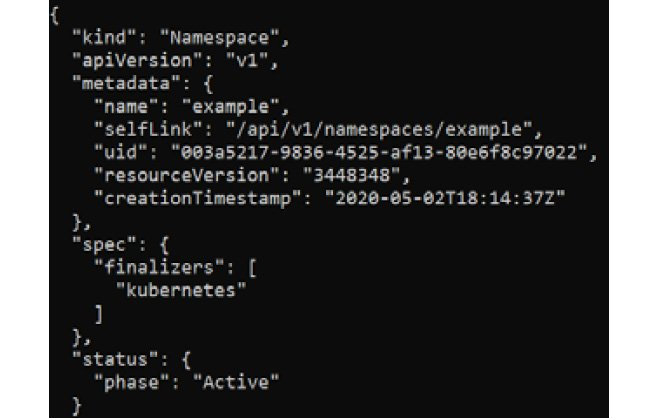
    


4.  The same procedure applies to Deployment. So, first, let\'s use the
    `kubectl create` command with `--dry-run=client`
    to get an idea of how our YAML data looks:

    
    ```
    kubectl create deployment nginx-example -n example --image=nginx:latest --dry-run -o yaml
    ```
    

    Note

    For Kubernetes versions 1.18+, please use
    `--dry-run=client`.

    You should get the following response:

    
    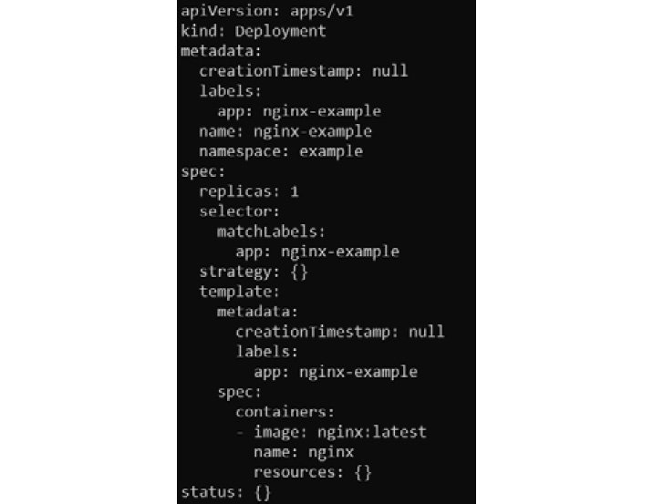
    


    Note

    Notice that the namespace will not show if you are using the
    `--dry-run=client` flag because we need to specify it in
    our API path.

5.  Now, the command for creating the Deployment will be constructed
    similarly to the command for creating the namespace. Note that the
    namespace is specified in the API path:

    
    ```
    curl -X POST http://127.0.0.1:8001/apis/apps/v1/namespaces/example/    deployments -H 'Content-Type: application/yaml' --data "
    apiVersion: apps/v1
    kind: Deployment
    metadata:
      creationTimestamp: null
      labels:
        run: nginx-example
      name: nginx-example
    spec:
      replicas: 3
      selector:
        matchLabels:
          run: nginx-example
      strategy: {}
      template:
        metadata:
          creationTimestamp: null
          labels:
            run: nginx-example
        spec:
          containers:
          - image: nginx:latest
            name: nginx-example
            resources: {}
    status: {}
    "
    ```
    

    If everything is correct, you should get a response like the
    following from the API server:

    
    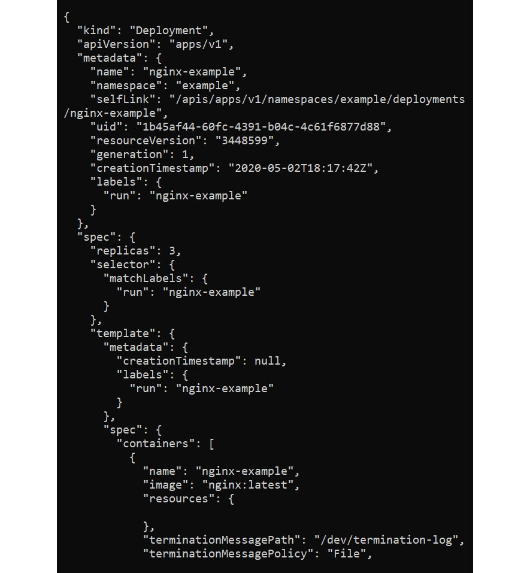
    


Note that the kubectl proxy process is still running in the background.
If you are done with interacting with the API server using kubectl
proxy, then you may want to stop the proxy from running in the
background. To do that, run the `fg` command to bring the
kubectl proxy process to the foreground and then press *Ctrl* + *C*.

So, we have seen how we can interact with the API server using kubectl
proxy, and by using curl, we have been able to create an NGINX
Deployment in a new namespace.


Direct Access to the Kubernetes API Using Authentication Credentials
====================================================================


Instead of using kubectl in proxy mode, we can provide the location and
credentials directly to the HTTP client. This approach can be used if
you are using a client that may get confused by proxies, but it is less
secure than using the kubectl proxy due to the risk of MITM attacks. To
mitigate this risk, it is recommended that you
import the root certificate and verify the identity of the API server
when using this method.

When thinking about accessing the cluster using credentials, we need to
understand how authentication is configured and what authentication
plugins are enabled in our cluster. Several authentication plugins can
be used, which allow different ways of authenticating with the server:

-   Client certificates

-   ServiceAccount bearer tokens

-   Authenticating proxy

-   HTTP basic auth

    Note

    Note that the preceding list includes only some of the
    authentication plugins. You can learn more about authentication at
    <https://kubernetes.io/docs/reference/access-authn-authz/authentication/>.

Let\'s check what authentication plugins are enabled in our cluster by
looking at the API server running process using the following command
and looking at the flags passed to the API server:


```
kubectl exec -it kube-apiserver-minikube -n kube-system -- /bin/sh -c "apt update ; apt -y install procps ; ps aux | grep kube-apiserver"
```

This command will first install/update `procps` (a tool used
to inspect processes) within the API server, which is running as a pod
on our Minikube server. Then, it will get the list of processes and
filter it by using the `kube-apiserver` keyword. You will get
a long output, but here is the part that we are interested in:


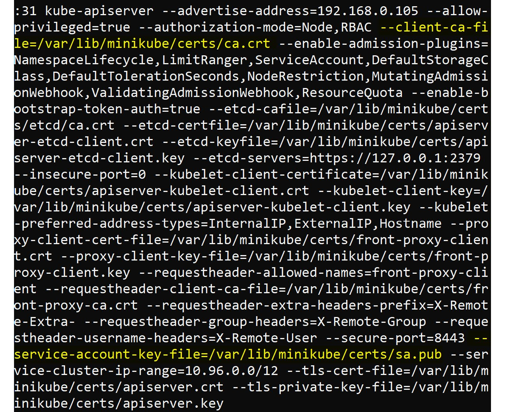


The following two flags from this screenshot tell us some important
information:

-   `--client-ca-file=/var/lib/minikube/certs/ca.crt`
-   `--service-account-key-file=/var/lib/minikube/certs/sa.pub`

These flags tell us that we have two different authentication plugins
configured---X.509 client certificates (based on the first flag) and
ServiceAccount tokens (based on the second flag). We
will now learn how to use both of these
authentication methods for communicating with the API server.


Method 1: Using Client Certificate Authentication
-------------------------------------------------

X.509 certificates are used for authenticating external requests, which
is the current configuration in our kubeconfig file. The
`--client-ca-file=/var/lib/minikube/certs/ca.crt` flag
indicates the certificate authority that is used to validate client
certificates, which will authenticate with the API server. An X.509
certificate defines a subject, which is what identifies a user in
Kubernetes. For example, the X.509 certificate used for SSL by
<https://www.google.com/> has a subject containing the following
information:


```
Common Name = www.google.com
Organization = Google LLC
Locality = Mountain View
State = California
Country = US
```

When an X.509 certificate is used for authenticating a Kubernetes user,
the `Common Name` of the subject is used as the username for
the user, and the `Organization` field is used as the group
membership of that user.

Kubernetes uses a TLS protocol for all of its API calls as a security
measure. The HTTP client that we have been using so far, curl, can work
with TLS. Earlier, kubectl proxy took care of communicating over TLS for
us, but if we want to do it directly using curl, we need to add three
more details to all of our API calls:

-   `--cert`: The client certificate path
-   `--key`: The private key path
-   `--cacert`: The certificate authority path

So, if we combine them, the command syntax should look as follows:


```
curl --cert <ClientCertificate> --key <PrivateKey> --cacert <CertificateAuthority> https://<APIServerAddress:port>/api
```

In this section, we will not create these certificates, but instead, we
will be using the certificates that were created when we bootstrapped
our cluster using Minikube. All the relevant information can be taken
from our kubeconfig file, which was prepared by Minikube when we
initialized the cluster. Let\'s see that file:


```
kubectl config view
```

You should get the following response:


kubeconfig

The final command should look like the following: you can see that we
can explore the API:


```
curl --cert ~/.minikube/client.crt --key ~/.minikube/client.key --cacert ~/.minikube/ca.crt https://192.168.99.110:8443/api
```

You should get the following response:


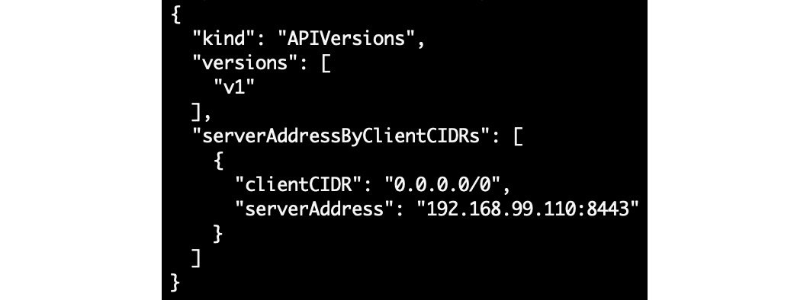


So, we can see that the API server is responding to our calls. You can
use this method to achieve everything that we have done in the previous
section using kubectl proxy.


Method 2: Using a ServiceAccount Bearer Token
---------------------------------------------

Service accounts are meant to authenticate processes running within the
cluster, such as pods, to allow internal communication with the API
server. They use signed bearer **JSON Web Tokens** (**JWTs**) to
authenticate with the API server. These tokens are stored in Kubernetes
objects called **Secrets**, which are a type of entities used to store
sensitive information, such as the aforementioned authentication tokens.
The information stored inside a Secret is Base64-encoded.

So, each ServiceAccount has a corresponding secret associated with it.
When a pod uses a ServiceAccount to authenticate with the API server,
the secret is mounted on the pod and the bearer token is decoded and
then mounted at the following location inside a pod:
`/run/secrets/kubernetes.io/serviceaccount`. This can then be
used by any process in the pod to authenticate with the API server.
Authentication by use of ServiceAccounts is enabled by a built-in module
known as an admission controller, which is enabled by default.

However, ServiceAccounts alone are not sufficient; once authenticated,
Kubernetes also needs to permit any actions for that ServiceAccount
(which is the authorization phase). This is managed by **Role-Based
Access Control** (**RBAC**) policies. In Kubernetes, you can define
certain **Roles**, and then use **RoleBinding** to *bind* those Roles to
certain users or ServiceAccounts.

A Role defines what actions (API verbs) are allowed and which API groups
and resources can be accessed. A RoleBinding defines which user or
ServiceAccount can assume that Role. A ClusterRole is similar to a Role,
except that a Role is namespace-scoped, while a ClusterRole is a
cluster-scoped policy. The same distinction is true for RoleBinding and
ClusterRoleBinding.

Note

You will learn more about secrets in *Lab 10*, *ConfigMaps and
Secrets*; more on RBAC in *Lab 13*, *Runtime and Network Security in
Kubernetes*; and admission controllers in *Lab 16*, *Kubernetes
Admission Controllers*.

Every namespace contains a ServiceAccount called `default`. We
can see that by using the following command:


```
kubectl get serviceaccounts --all-namespaces
```

You should see the following response:


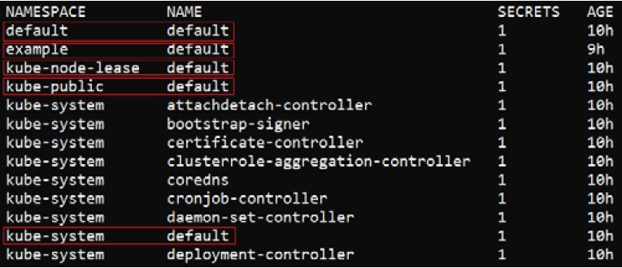


As mentioned earlier, a ServiceAccount is associated with a secret that
contains the CA certificate of the API server and a bearer token. We can
view the ServiceAccount-associated secret in the `default`
namespace, as follows:


```
kubectl get secrets
```

You should get the following response:


```
NAME                 TYPE                                 DATA   AGE
default-token-wtkk5  kubernetes.io/service-account-token  3      10h
```

We can see that we have a secret named `default-token-wtkk5`
(where `wtkk5` is a random string) in our default namespace.
We can view the content of the Secret resource by using the following
command:


```
kubectl get secrets default-token-wtkk5 -o yaml
```

This command will get the object definition as it is stored in etcd and
display it in YAML format so that it is easy to read. This will produce
an output as follows:


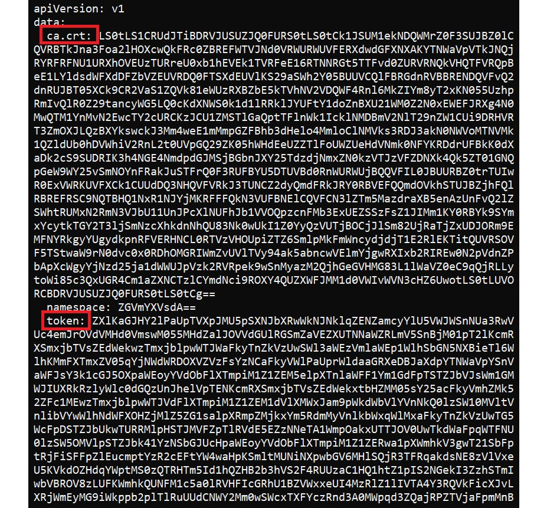


Note from the preceding secret that `namespace`,
`token`, and the CA certificate of the API server (ca.crt) are
Base64-encoded. You can decode it using `base64 --decode` in
your Linux terminal, as follows:


```
echo "<copied_value>" | base64 --decode
```

Copy and paste the value from `ca.crt` or `token` in
the preceding command. This will output the decoded value, which you can
then write to a file or a variable for later use. However, in this
demonstration, we will show another method to get the values.

Let\'s take a peek into one of our pods:


```
kubectl exec -it <pod-name> -- /bin/bash
```

This command enters the pod and then runs a Bash shell on it. Then, once
we have the shell running inside a pod, we can explore the various mount
points available in the pod:


```
df -h
```

This will give an output similar to the following:


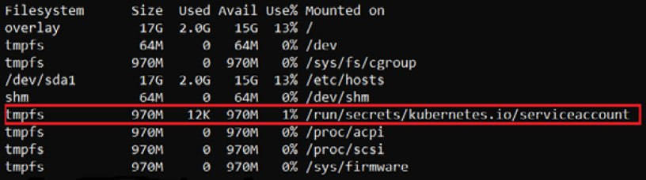


The mount point can be explored further:


```
ls /var/run/secrets/kubernetes.io/serviceaccount
```

You should see an output similar to the following:


```
ca.crt  namespace  token
```

As you can see here, the mount point contains the API server CA
certificate, the namespace this secret belongs to, and the JWT bearer
token. If you are trying these commands on your terminal, you can exit
the pod\'s shell by entering an `exit`.

If we try to access the API server using curl from inside the pod, we
would need to provide the CA path and the token. Let\'s try to list all
the pods in the pod\'s namespace by accessing the API server from inside
a pod.

We can create a new Deployment and start a Bash terminal with the
following procedure:


```
kubectl run my-bash --rm --restart=Never -it --image=ubuntu -- bash
```

This may take a few seconds to start up, and then you will get a
response similar to this:


```
If you don't see a command prompt, try pressing enter.
root@my-bash: /#
```

This will start up a Deployment running Ubuntu and immediately take us
inside the pod and open up the Bash shell. The `--rm` flag in
this command will delete the pod after all the processes inside the pod
are terminated---that is, after we leave the pod using the
`exit` command. But for now, let\'s install curl:


```
apt update && apt -y install curl
```

This should produce a response similar to this:


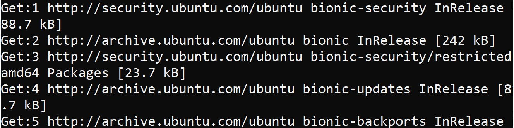


Now that we have installed curl, let\'s try to list the pods using curl
by accessing the API path:


```
curl https://kubernetes/api/v1/namespaces/$NAMESPACE/pods
```

You should see the following response:


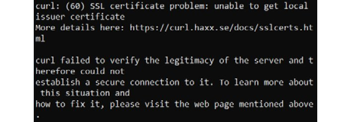


Notice that the command has failed. This happened since Kubernetes
forces all communication to use TLS, which usually rejects insecure
connections (without any authentication tokens). Let\'s add the
`--insecure` flag, which will allow an insecure connection
with curl, and observe the results:


```
curl --insecure https://kubernetes/api/v1/namespaces/$NAMESPACE/pods
```

You should get a response as follows:


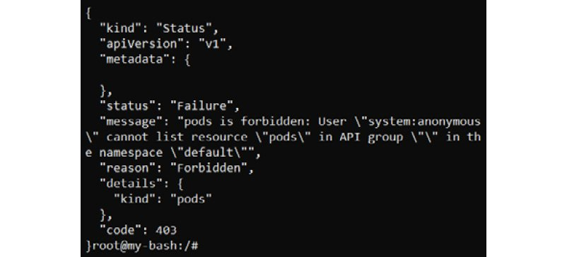


We can see that we were able to reach the server using an insecure
connection. However, the API server treated our request as anonymous
since there was no identity provided to our command.

Now, to make commands easier, we can add the namespace, CA certificate
(`ca.crt`), and the token to variables so that the API server
knows the identity of the service account generating the API request:


```
CACERT=/run/secrets/kubernetes.io/serviceaccount/ca.crt
TOKEN=$(cat /run/secrets/kubernetes.io/serviceaccount/token)
NAMESPACE=$(cat /run/secrets/kubernetes.io/serviceaccount/namespace)
```

Note that here we can use the values directly as they are in plaintext
(not encoded) when looking from inside a pod, compared to having to
decode them from a Secret. Now, we have all the parameters ready. When
using bearer token authentication, the client should send this token in
the header of the request, which is the authorization header. This
should look like this: `Authorization: Bearer <token>`. Since
we have added the token into a variable, we can simply use that. Let\'s
run the `curl` command to see whether we can list the pods
using the identity of the ServiceAccount:


```
curl --cacert $CACERT -H "Authorization: Bearer $TOKEN" https://kubernetes/api/v1/namespaces/$NAMESPACE/pods
```

You should get the following response:


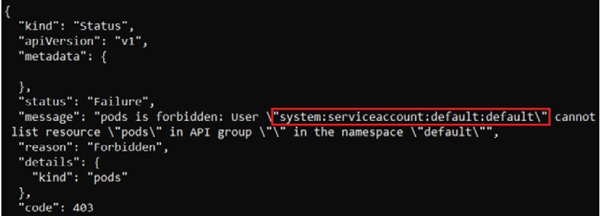


Notice that we were able to reach the API server, and the API server
verified the `"system:serviceaccount:default:default"`
identity, which is represented in this format:
`system:<resource_type>:<namespace>:<resource_name>` However,
we still got a `Forbidden` error because ServiceAccounts do
not have any permissions by default. We need to manually assign
permissions to our default ServiceAccount in order to be able to list
pods. This can be done by creating a RoleBinding and linking it to the
`view` ClusterRole.

Open another terminal window, ensuring that you don\'t close the
terminal session running the `my-bash` pod (because the pod
will be deleted and you will lose your progress if you close it). Now,
in the second terminal session, you can run the following command to
create a `rolebinding defaultSA`-view to attach the
`view` ClusterRole to the ServiceAccount:


```
kubectl create rolebinding defaultSA-view \
  --clusterrole=view \
  --serviceaccount=default:default \
  --namespace=default
```

Note

The view ClusterRole should already exist for your Kubernetes cluster,
as it is one of the default ClusterRoles available for use.

As you might recall from the previous lab, this is an imperative
approach to creating resources; you will learn how to create manifests
for RBAC policies in *Lab 13*, *Runtime and Network Security in
Kubernetes*. Note that we have to specify the ServiceAccount as
`<namespace>:<ServiceAccountName>`, and we have a
`--namespace` flag since a RoleBinding can only apply to the
ServiceAccounts within that namespace. You should get the following
response:


```
rolebinding.rbac.authorization.k8s.io/defaultSA-view created
```

Now, go back to the terminal window where we accessed the
`my-bash` pod. With the necessary permissions set, let\'s try
our curl command again:


```
curl --cacert $CACERT -H "Authorization: Bearer $TOKEN" https://kubernetes/api/v1/namespaces/$NAMESPACE/pods
```

You should get the following response:


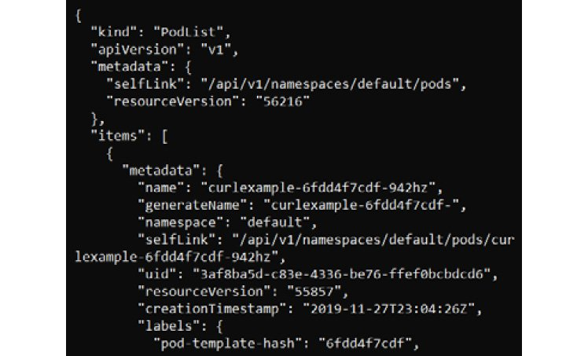


Our ServiceAccount can now authenticate with the API server, and it is
authorized to list pods in the default namespace.

It is also valid to use ServiceAccount bearer tokens outside the
cluster. You may want to use tokens instead of certificates as an
identity for long-standing jobs since the token does not expire as long
as the ServiceAccount exists, whereas a certificate has an expiry date
set by the certificate-issuing authority. An example of this is CI/CD
pipelines, where external services commonly use ServiceAccount bearer
tokens for authentication.


Activity 4.01: Creating a Deployment Using a ServiceAccount Identity
--------------------------------------------------------------------

In this activity, we will bring together all that we have learned in
this lab. We will be using various operations on our cluster and
using different methods to access the API server.

Perform the following operations using kubectl:

1.  Create a new namespace called `activity-example`.
2.  Create a new ServiceAccount called `activity-sa`.
3.  Create a new RoleBinding called `activity-sa-clusteradmin`
    to attach the `activity-sa` ServiceAccount to the
    `cluster-admin` ClusterRole (which exists by default).
    This step is to ensure that our ServiceAccount has the necessary
    permissions to interact with the API server as a cluster admin.

Perform the following operations using curl with bearer tokens for
authentication:

1.  Create a new NGINX Deployment with the identity of the
    `activity-sa` ServiceAccount.

2.  List the pods in your Deployment. Once you use curl to check the
    Deployment, if you have successfully gone through the previous
    steps, you should get a response that looks something like this:

    
    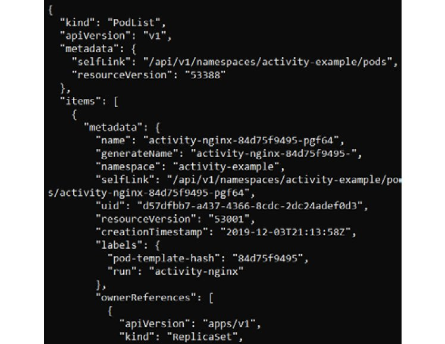
    


3.  Finally, delete the namespace with all associated resources. When
    using curl to delete a namespace, you should see a response with
    `phase` set to `terminating` for the
    `status` field of the namespace resource, as in the
    following screenshot:

    
    ```
    "status": {
      "phase": "Terminating"
    ```
    

    Note

    The solution to this activity can be found at the following address:
    `Activity_Solutions\Solution_Final.pdf`.


Summary
=======


In this lab, we took a closer look at the Kubernetes
API server, the way that Kubernetes uses the
RESTful API, and how API resources are defined. We learned that all
commands from the kubectl command-line utility are translated into
RESTful HTTP API calls and are sent to the API server. We learned that
API calls go through multiple stages, including authentication,
authorization, and admission control. We also had a closer look at each
stage and some of the modules involved.

Then, we learned about some API resources, how they are categorized as
namespace-scoped or cluster-scoped resources, and their API group and
API version. We then learned how we can use this information to build an
API path for interacting with the Kubernetes API.

We also applied what we learned by making an API call directly to the
API server, using the curl HTTP client to interact with objects by using
different authentication methods, such as ServiceAccounts and an X.509
certificate.

In the next few labs, we will inspect most of the commonly used API
objects more closely, mainly focusing on the different functionalities
offered by these objects to enable us to deploy and maintain our
application in a Kubernetes cluster. We will begin this series of
labs by taking a look at the basic unit of deployment in Kubernetes
(pods) in the next lab.
