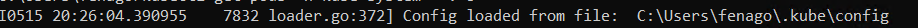
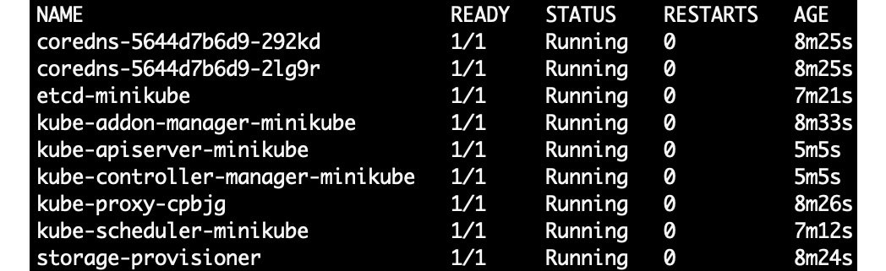

How to Communicate with Kubernetes (API Server)
==================================================


In this lab, we will build a foundational understanding of the
Kubernetes API server and the various ways of interacting with it. We
will learn how kubectl and other HTTP clients communicate with the
Kubernetes API server. We will use some practical demonstrations to
trace these communications and see the details of HTTP requests. Then,
we will also see how we can look up the API details so that you can
write your own API request from scratch. By the end of this lab, you
will be able to create API objects by directly communicating with the
API server using any HTTP client, such as curl, to make RESTful API
calls to the API server.


**Note:** All commands in this lab should be run in `git bash` only unless stated otherwise.


The Kubernetes API Server
=========================


In Kubernetes, all communications and operations between the control
plane components and external clients, such as kubectl, are translated
into **RESTful API** calls that are handled by the API server.
Effectively, the API server is a RESTful web application that processes
RESTful API calls over HTTP to store and update API objects in the etcd
datastore.


Now, let\'s recall how the API server looks in our Minikube cluster by
running the following command:


```
kubectl get pods -n kube-system
```

You should see the following response:


As we saw in previous labs, in the Minikube environment, the API
server is referred to as `kube-apiserver-minikube` in the
`kube-system` namespace. As you can see in the preceding
screenshot, we have a single instance of the API server:
`kube-apiserver-minikube`.


Authorization
-------------

kubectl provides a tool that you can call by using
`kubectl auth can-i` to check whether an action is allowed for
the current user.


```
kubectl auth can-i get pods --all-namespaces
kubectl auth can-i get pods -n default
```

The user should see the following responses:


Now, after switching context, let\'s say that the
`ClusterAdmin` user runs the following commands:


```
kubectl auth can-i delete pods
kubectl auth can-i get pods
kubectl auth can-i get pods --all-namespaces
```

The user should see the following response:


Unlike authentication phase modules, authorization modules are checked
in sequence. If multiple authorization modules are configured, and if
any authorizer approves or denies a request, that decision is
immediately returned, and no other authorizer will be contacted.


Exercise 4.01: Starting Minikube with a Custom Set of Modules
-------------------------------------------------------------

In this exercise, we will take a look at how to view the different API
modules enabled for our instance of Minikube, and then restart Minikube
using a custom set of API modules:

1.  If Minikube is not already running on your machine, start it up by
    using the following command:

    
    ```
    minikube start
    ```
    

    You should see the following response:

    
    
    


2.  Now, let\'s see which modules are enabled by default. Use the
    following command:

    
    ```
    kubectl describe pod kube-apiserver-minikube -n kube-system | grep enable-admission-plugins
    ```
    

    You should see the following response:

    
    
    


    As you can observe from the preceding output,
    Minikube has enabled the following modules for us:
    `NamespaceLifecycle`, `LimitRanger`,
    `ServiceAccount`, `DefaultStorageClass`,
    `DefaultTolerationSeconds`, `NodeRestriction`,
    `MutatingAdmissionWebhook`,
    `ValidatingAdmissionWebhook`, and
    `ResourceQuota`.


3.  Another way to check the modules is to view the API server manifest
    by running the following command:

    
    ```
    kubectl exec -it kube-apiserver-minikube -n kube-system -- kube-apiserver -h | grep "enable-admission-plugins" | grep -vi deprecated
    ```
    

    Note

    We used `grep -vi deprecated` because there is another
    flag, `--admission-control`, that we are discarding from
    the output, as this flag will be deprecated in future versions.

    kubectl has the `exec` command, which allows us to execute
    a command to our running pods. This command will execute
    `kube-apiserver -h` inside our
    `kube-apiserver-minikube` pod and return the output to our
    shell:

    
    
    

4.  Now, we will start Minikube with our desired configuration. Use the
    following command:

    
    ```
    minikube start --extra-config=apiserver.enable-admission-plugins="LimitRanger,NamespaceExists,NamespaceLifecycle,ResourceQuota,ServiceAccount,DefaultStorageClass,MutatingAdmissionWebhook"
    ```

    **Note:** Above command should be run in `cmd` only. It will not work in `git bash`.


    As you can see here, the `minikube start` command has the
    `--extra-config` configurator flag, which allows us to
    pass additional configurations to our cluster installation. In our
    case, we can use the `--extra-config` flag, along with
    `--enable-admission-plugins`, and specify the plugins we
    need to enable. Our command should produce this output:

    
    
    


5.  Now, let\'s compare this instance of Minikube with our earlier one.
    Use the following command:

    
    ```
    kubectl describe pod kube-apiserver-minikube -n kube-system | grep enable-admission-plugins
    ```
    

    You should see the following response:

    
    
    


If you compare the set of modules seen here to the ones in *Figure 4.7*,
you will notice that only the specified plugins were enabled; while the
`DefaultTolerationSeconds`, `NodeRestriction`, and
`ValidatingAdmissionWebhook` modules are no longer enabled.

**Note**

Revert to the default configurations in Minikube by running
`minikube start` again in CMD terminal.


Tracing kubectl HTTP Requests
-----------------------------

Let\'s try tracing the HTTP requests that kubectl sends to the API
server to better understand them. Before we begin, let\'s get all the
pods in the `kube-system` namespace by using the following
command:


```
kubectl get pods -n kube-system
```

This command should display the output in a table view, as you can see
in the following screenshot:


Behind the scenes, since kubectl is a REST client, it invokes an HTTP
`GET` request to the API server endpoint and requests
information from `/api/v1/namespaces/kube-system/pods`.

We can enable verbose output by adding `--v=8` to our
`kubectl` command. `v` indicates the verbosity of
the command. The higher the number, the more details we get in the
response. This number can range from `0` to `10`.
Let\'s see the output with verbosity of `8`:


```
kubectl get pods -n kube-system --v=8
```

This should give output as follows:


Let\'s examine the preceding output bit by bit to get a better
understanding of it:

-   The first part of the output is as follows:
    
    
    


From this, we can see that kubectl loaded the configuration from our
kubeconfig file, which has the API server endpoint, port, and
credentials, such as the certificate or the authentication token.

-   This is the next part of the output:
    
    
    


Above image contains the operation that we need to perform against the API
server, and `/api/v1/namespaces/kube-system/pods` is the API
path. You can also see `limit=500` at the end of the URL path,
which is the chunk size; kubectl fetches a large number of resources in
chunks to improve latency. We will see some examples relating to
retrieving large results sets in chunks later in this lab.

-   The next part of the output is as follows:
    
    
    


As you can see in this part of the output, `Request Headers`
describes the resource to be fetched or the client requesting the
resource. In our example, the output has two parts for content
negotiation:

a\) `Accept`: This is used by HTTP clients to tell the server
what content types they\'ll accept. In our example, we can see that
kubectl informed the API server about the `application/json`
content type. If this does not exist in the request header, the server
will return the default preconfigured representation type, which is the
same as `application/json` for the Kubernetes API as it uses
the JSON schema. We can also see that it is requesting the output as a
table view, which is indicated by `as=Table` in this line.

b\) `User-Agent`: This header contains information about the
client that is requesting this information. In this case, we can see
that kubectl is providing information about itself.

-   Let\'s examine the next part:
    
    
    


Here, we can see that the API server returns the `200 OK` HTTP
status code, which indicates that the request has been processed
successfully on the API server. We can also see the time taken to
process this request, which is 10 milliseconds.

-   Let\'s look at the next part:
    
    
    


As you can see, this part shows the `Response Headers`, which
include details such as the date and time of the request, in our
example.

-   Now, let\'s come to the main response sent by the API server:
    
    
    


The `Response Body` contains the resource data that was
requested by the client. In our case, this is information about the pods
in the `kube-system` namespace. Here, this information is in
raw JSON format before kubectl can present it as a neat table. However,
the highlighted section at the end of the previous screenshot shows that
the response body does not have all the JSON output that we requested;
part of the `Response Body` is truncated. This is because
`--v=8` displays the HTTP request content with truncation of
the response content.

To see the full response body, you can run the same command with
`--v=10`, which does not truncate the output at all. The
command would look like as follows:


```
kubectl get pods -n kube-system --v=10
```

We will not examine the command with `--v=10` verbosity for
the sake of brevity.

-   Now, we come to the final part of the output that we are examining:
    
    
    


This is the final output as a table, which is what was requested.
kubectl has taken the raw JSON data and formatted it as a neat table for
us.


Scope of API Resources
======================


All resource types can either be cluster-scoped resources or
namespace-scoped resources. The scope of a resource affects the access
of that resource and how that resource is managed. Let\'s look at the
differences between namespace and cluster scope.


Namespace-Scoped Resources
--------------------------


You can get a full list of namespace-scoped API resources by using the
following command:


```
kubectl api-resources --namespaced=true
```

You should see a response similar to this:


Cluster-Scoped Resources
------------------------

You can get a full list of cluster-scoped API resources by using the following command:

    
```
kubectl api-resources --namespaced=false
```


You should see an output similar to this:


API Groups
==========

The `--api-group` flag can be used to scope the output to a
specific API group, as we will see in the following sections. Let\'s
take a closer look at the various API groups in the following sections.


Core Group
----------

Resources showing a blank entry in the `kubectl api-resources`
command output are part of the core group. You can also specify an empty
argument flag (`--api-group=''`) to only display the core
group resources, as follows:


```
kubectl api-resources --api-group=''
```

You should see an output as follows:


Named Group
-----------


You can also specify the `--api-group='<NamedGroup Name>'`
flag to display the resources in that specified named group. For
example, let\'s list out the resources under the `apps` API
group by using the following command:


```
kubectl api-resources --api-group='apps'
```

This should give the following response:


All of these resources in the preceding screenshot are clubbed together
because they are part of the `apps` named group, which we
specified in our query command.

As another example, let\'s look at the
`rbac.authorization.k8s.io API group`, which has resources to
determine authorization policies. We can look at the resources in that
group by using the following command:


```
kubectl api-resources --api-group='rbac.authorization.k8s.io'
```

You should see the following response:


System-Wide
-----------

This group consists of system-wide API endpoints, such as
`/version`, `/healthz`, `/logs`, and
`/metrics`. For example, let\'s consider the output of the
following command:


```
kubectl version --short --v=6
```

This should give an output similar to this:


API Versions
============


You can get a complete list of the API versions enabled in your cluster
by using the following command:


```
kubectl api-versions
```

You should see a response similar to this:


Kubernetes provides ways to access all the information you need to navigate your
way around the API resources. You can use kubectl to access the
Kubernetes docs and get the necessary information about the various API
resources. Let\'s see how that works in the following exercise.


Exercise 4.02: Getting Information about API Resources
------------------------------------------------------

Let\'s say that we want to create an ingress object. For the purposes of
this exercise, you don\'t need to know much about ingress; we will learn
about it in the upcoming labs.

We will use kubectl to get more information about the Ingress API
resource, determine which API versions are available, and find out which
groups it belongs to. If you recall from previous sections, we need this
information for the `apiVersion` field of our YAML manifest.
Then, we also get the information required for the other fields of our
manifest file:

1.  Let\'s first ask our cluster for all the available API resources
    that match the `ingresses` keyword:

    
    ```
    kubectl api-resources | grep ingresses
    ```
    

    This command will filter the list of all the API resources by the
    `ingresses` keyword. You should get the following output:

    
    ```
    ingresses     ing     networking.k8s.io     true         Ingress
    ```

    We can see that we have ingress resources on `networking.k8s.io`.

2.  We have also seen how we can get API resources belonging to specific
    groups. Let\'s check an API group:

    
    ```
    kubectl api-resources --api-group="networking.k8s.io"
    ```
    

    You should see the following output:

    
    
    
    However, if we were to use an ingress resource, we still don\'t know
    whether we should use the one from the `extensions` group
    or the `networking.k8s.io` group. In the next step, we
    will get some more information that will help us decide that.

3.  Use the following command to get more information:

    
    ```
    kubectl explain ingress
    ```
    

    You should get this response:

    
    
    

    As you can see, the `kubectl explain` command describes
    the API resource, as well as the details about the fields associated
    with it.


Interacting with Clusters Using the Kubernetes API
==================================================


Up until now, we\'ve been using the Kubernetes kubectl command-line
tool, which made interacting with our cluster quite convenient. It does
that by extracting the API server address and authentication information
from the client kubeconfig file, which is located in
`~/.kube/config` by default, as we saw in the previous
lab. In this section, we will look at the different ways to directly
access the API server with HTTP clients such as curl.


Accessing the Kubernetes API Server Using kubectl as a Proxy
------------------------------------------------------------

In order to demonstrate how to use kubectl proxy, let\'s first create an
NGINX Deployment with two replicas in the default namespace and view it
using `kubectl get pods`:


```
kubectl create deployment mynginx --image=nginx:latest 
```

This should give an output like the following:


```
deployment.apps/mynginx created
```

Now, we can scale our Deployment to two replicas with the following
command:


```
kubectl scale deployment mynginx --replicas=2
```

You should see an output similar to this:


```
deployment.apps/mynginx scaled
```

Let\'s now check whether the pods are up and running:


```
kubectl get pods
```

This gives an output similar to the following:


```
NAME                        READY    STATUS     RESTARTS   AGE
mynginx-565f67b548-gk5n2    1/1      Running    0          2m30s
mynginx-565f67b548-q6slz    1/1      Running    0          2m30s
```

To start a proxy to the API server, run the `kubectl proxy`
command:


```
kubectl proxy
```

This should give output as follows:


```
Starting to serve on 127.0.0.1:8001
```

Note from the preceding screenshot that the local proxy connection is
running on `127.0.0.1:8001`, which is the default. We can also
specify a custom port by adding the `--port=<YourCustomPort>`
flag, while adding an `&` (ampersand) sign at the end of our
command to allow the proxy to run in the terminal background so that we
can continue working in the same terminal window. So, the command would
look like this:


```
kubectl proxy --port=8080 &
```

This should give the following response:


```
[1] 48285
AbuTalebMBP:~ $ Starting to serve on 127.0.0.1:8080
```

The proxy is run as a background job, and in the preceding screenshot,
`[1]` indicates the job number and `48285` indicates
its process ID. To exit a proxy running in the background, you can run
`fg` to bring the job back to the foreground:


```
fg
```

This will show the following response:


```
kubectl proxy --port=8080
^C
```

After getting the proxy to the foreground, we can simply use *Ctrl* +
*C* to exit it (if there\'s no other job running).

Note

If you are not familiar with job control, you can learn about it at
<https://www.gnu.org/software/bash/manual/html_node/Job-Control-Basics.html>.

We can now start exploring the API using curl:


```
curl http://127.0.0.1:8080/apis
```

Recall that even though we are mostly using YAML for convenience, the
data is stored in etcd in JSON format. You will see a long response that
begins something like this:


But how do we find the exact path to query the Deployment we created
earlier? Also, how do we query the pods created by that Deployment?

You can start by asking yourself a few questions:

-   What are the API version and API group used by Deployments?

    In *Figure 4.27*, we saw that the Deployments are in
    `apps/v1`, so we can start by adding that to the path:

    
    ```
    curl http://127.0.0.1:8080/apis/apps/v1
    ```
    

-   Is it a namespace-scoped resource or a cluster-scoped resource? If
    it is a namespace-scoped resource, what is the name of the
    namespace?

    We also saw in the scope of the API resources section that
    Deployments are namespace-scoped resources. When we created the
    Deployment, since we did not specify a different namespace, it went
    to the `default` namespace. So, in addition to the
    `apiVersion` field, we would need to add
    `namespaces/default/deployments` to our path:

    
    ```
    curl http://127.0.0.1:8080/apis/apps/v1/namespaces/default/deployments
    ```
    

    This will return a large output with the JSON data that is stored on
    this path. This is the part of the response that gives us the
    information that we need:

    
    
    


As you can see in this output, this lists all the Deployments in the
`default` namespace. You can infer that from
`"kind": "DeploymentList"`. Also, note that the response is in
JSON format and is not neatly presented as a table.

Now, we can specify a specific Deployment by adding it to our path:


```
curl http://127.0.0.1:8080/apis/apps/v1/namespaces/default/deployments/mynginx
```

You should see this response:


You can use this method with any other resource as well.


Using --dry-run Flag
--------------------


Let\'s consider a case where we want to create a namespace. Usually, you
would create a namespace as follows:


```
kubectl create namespace my-namespace
```

This will give the following response:


```
namespace/my-namespace created
```

Here, you can see that we created a namespace called
`my-namespace`. However, for passing the request without using
kubectl, we need the spec used to define a namespace. We can get that by
using the `--dry-run=client` and `-o` flags:


```
kubectl create namespace my-second-namespace --dry-run=client -o yaml
```

This will give the following response:


When you run a `kubectl` command with the
`--dry-run=client` flag, the API server takes it through all
the stages of a normal command, except that it does not persist the
changes into etcd. So, the command is authenticated, authorized, and
validated, but changes are not permanent. This is a great way to test
whether a certain command works, and also to get the manifest that the
API server would have created for this command, as you can see in the
previous screenshot.


Summary
=======


In this lab, we took a closer look at the Kubernetes
API server, the way that Kubernetes uses the
RESTful API, and how API resources are defined. We learned that all
commands from the kubectl command-line utility are translated into
RESTful HTTP API calls and are sent to the API server. We learned that
API calls go through multiple stages, including authentication,
authorization, and admission control. We also had a closer look at each
stage and some of the modules involved.

Then, we learned about some API resources, how they are categorized as
namespace-scoped or cluster-scoped resources, and their API group and
API version. We then learned how we can use this information to build an
API path for interacting with the Kubernetes API.


In the next few labs, we will inspect most of the commonly used API
objects more closely, mainly focusing on the different functionalities
offered by these objects to enable us to deploy and maintain our
application in a Kubernetes cluster. We will begin this series of
labs by taking a look at the basic unit of deployment in Kubernetes
(pods) in the next lab.
