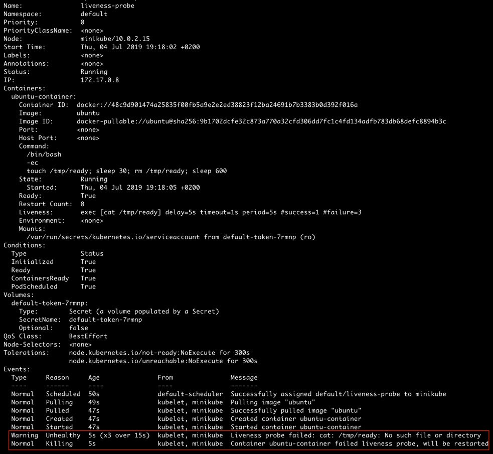

 Pods
=======


This chapter introduces the concept of pods and teaches how to properly
configure and deploy them. We will begin by creating a simple pod with
your application container running in it. We will explain what the
different aspects of pod configuration mean and decide which
configuration to use based on your application or use case. You will be
able to define resource allocation requirements and limits for pods. We
will then move on to see how we can debug the pod, check the logs, and
make changes to it when needed. Some more useful tools for managing
faults in pods, such as liveness and readiness probes and restart
policies, are also covered in this chapter.


The following exercise demonstrates how to use such a pod configuration
file to create a simple pod.


Exercise 5.01: Creating a Pod with a Single Container
-----------------------------------------------------

In this exercise, we aim to create our first simple pod that runs a
single container. To complete this exercise, perform the following
steps:

1.  Create a file called `single-container-pod.yaml` with the
    following contents:
    
    ```
    apiVersion: v1
    kind: Pod
    metadata:
      name: first-pod
    spec:
      containers:
      - name: my-first-container
        image: nginx
    ```
    

2.  Run the following command in Terminal to create a pod with the
    preceding configuration:

    
    ```
    kubectl create -f single-container-pod.yaml
    ```
    

    You should see the following response:

    
    ```
    pod/first-pod created
    ```
    

    The output indicates that the pod has been created.

3.  Verify that the pod was created by getting the list of all the pods
    using this command:

    
    ```
    kubectl get pods
    ```
    

    You should see the following response:

    
    ```
    NAME         READY       STATUS       RESTARTS      AGE
    first-pod    1/1         Running      0             5m44s
    ```
    

4.  Now that we have created our first pod, let\'s look into it in more
    detail. To do that, we can describe the pod we just created using
    the following command in Terminal:

    
    ```
    kubectl describe pod first-pod
    ```
    

    You should see the following output:

    
    
    

The output shows various details about the pod we just created. 


There are two ways to create pods in different
namespaces -- by using a CLI command, or by specifying the namespace in
the pod configuration. The following exercises
demonstrate how you can create pods in different namespaces to reap the
benefits of namespaces that were mentioned earlier.


Exercise 5.02: Creating a Pod in a Different Namespace by Specifying the Namespace in the CLI
---------------------------------------------------------------------------------------------

In this exercise, we will create a pod in a namespace other than
`default`. We will do that using the same pod configuration
from *Exercise 5.01*, *Creating a Pod with a Single Container*, by
specifying the namespace in the command argument. Follow these steps to
complete the exercise:

1.  Run the following command to view all the available namespaces in
    our Kubernetes cluster:

    
    ```
    kubectl get namespaces
    ```
    

    You should see the following list of namespaces:

    
    ```
    NAME               STATUS       AGE
    default            Active       16d
    kube-node-lease    Active       16d
    kube-public        Active       16d
    kube-system        Active       16d
    ```
    

    The output shows all the namespaces in our Kubernetes cluster. The
    `default` namespace is, as the word implies, the default
    namespace for all Kubernetes objects created without any namespace.

2.  Run the following command to create the pod with the
    `single-container-pod.yaml` pod configuration but in a
    different namespace:

    
    ```
    kubectl --namespace kube-public create -f single-container-pod.yaml
    ```
    

    You should see the following response:

    
    ```
    pod/first-pod created
    ```
    

    Note

    If you create a pod in a particular namespace, you can only view it
    by switching to that namespace.

3.  Verify that the pod was created in the `kube-public`
    namespace:

    
    ```
    kubectl --namespace kube-public get pods
    ```
    

    You should see the following response:

    
    ```
    NAME            READY       STATUS      RESTARTS     AGE
    first-pod       1/1         Running     0            8s
    ```
    

The output here shows that we have successfully created the pod in the
`kube-public` namespace.

The next exercise demonstrates how to create a pod in different
namespace based on a YAML file.


Exercise 5.03: Creating a Pod in a Different Namespace by Specifying the Namespace in the Pod Configuration YAML file
---------------------------------------------------------------------------------------------------------------------

In this exercise, we shall add a line to the YAML configuration file to
specify that all pods created using this file use a specified namespace.

1.  Run the following command to view all the available namespaces in
    our Kubernetes cluster:

    
    ```
    kubectl get namespaces
    ```
    

    You should see the following list of namespaces:

    
    ```
    NAME               STATUS       AGE
    default            Active       16d
    kube-node-lease    Active       16d
    kube-public        Active       16d
    kube-system        Active       16d
    ```
    

2.  Next, create a file named
    `single-container-pod-with-namespace.yaml` with the
    following configuration:
    
    ```
    apiVersion: v1
    kind: Pod
    metadata:
      name: first-pod-with-namespace
      namespace: kube-public
    spec:
      containers:
      - name: my-first-container
        image: nginx
    ```
    

3.  Run the following command to create a pod with the
    `single-container-pod-with-namespace.yaml` pod
    configuration:

    
    ```
    kubectl create -f single-container-pod-with-namespace.yaml
    ```
    

    You should see the following response:

    
    ```
    pod/first-pod-with-namespace created
    ```
    

4.  Verify that the pod was created in the `kube-public`
    namespace:

    
    ```
    kubectl --namespace kube-public get pods
    ```
    

    You should see the following list of pods:

    
    ```
    NAME                     READY     STATUS      RESTARTS   AGE
    first-pod                 1/1      Running     0          5m2s
    first-pod-with-namespace  1/1      Running     0          46s
    ```
    

    The output shows that the new pod we created occupies the
    `kube-public` namespace. Any other pods created using the
    `single-container-pod-with-namespace.yaml` pod
    configuration will occupy the same namespace.

In the following exercise, we shall change the default kubectl namespace
so that all pods without a defined namespace take our newly defined
namespace instead of `default`.


Exercise 5.04: Changing the Namespace for All Subsequent kubectl Commands
-------------------------------------------------------------------------

In this exercise, we will change the namespace for all subsequent
kubectl commands from `default` to `kube-public`.

1.  Run the following command to view all the available namespaces in
    our Kubernetes cluster:

    
    ```
    kubectl get namespaces
    ```
    

    You should see the following list of namespaces:

    
    ```
    NAME               STATUS       AGE
    default            Active       16d
    kube-node-lease    Active       16d
    kube-public        Active       16d
    kube-system        Active       16d
    ```
    

2.  Run the following command to change the namespace for all subsequent
    requests by modifying the current context:

    
    ```
    kubectl config set-context $(kubectl config current-context) --namespace kube-public
    ```
    

    You should see the following response:

    
    ```
    Context "minikube" modified.
    ```
    

3.  Run the following command to list all the pods in the
    `kube-public` namespace without using the
    `namespace` argument:

    
    ```
    kubectl get pods
    ```
    

    You should see the following list of pods:

    
    ```
    NAME                     READY     STATUS      RESTARTS   AGE
    first-pod                 1/1      Running     0          48m
    first-pod-with-namespace  1/1      Running     0          44m
    ```
    

    The output shows that the preceding command lists all the pods that
    we have created in the `kube-public` namespace. We saw in
    *Exercise 5.01*, *Creating a Pod with a Single Container*, that the
    `kubectl get pods` command shows pods in the default
    namespace. But here, we get results from the `kube-public`
    namespace instead.

4.  In this step, we will undo the changes so that it doesn\'t affect
    the upcoming exercises in this chapter. We will change the default
    namespace to `default` again to avoid any confusion:

    
    ```
    kubectl config set-context $(kubectl config current-context) --namespace default
    ```
    

    You should see the following response:

    
    ```
    Context "minikube" modified.
    ```
    

In this exercise, we have seen how to change and
reset the default namespace of the context.


Node
----

As you have learned in earlier chapters, nodes are the various machines
running in our cluster. This field reflects the node in the Kubernetes
cluster where this pod was running. Knowing what node a pod is running
on can help us with debugging issues with that pod. Observe the sixth
line of the output shown in *Figure 5.1*:


```
Node: minikube/10.0.2.15
```

We can list all the nodes in our Kubernetes cluster by running the
following command:


```
kubectl get nodes
```

You should see the following response:


```
NAME         STATUS      ROLES       AGE         VERSION
minikube     Ready       <none>      16d         v1.14.3
```

In this case, there\'s only one node in our cluster because we are using
Minikube for these exercises:


```
apiVersion: v1
kind: Pod
metadata:
  name: firstpod
spec:
  nodeName: my-favorite-node # run this pod on a specific node
  containers:
  - name: my-first-pod
    image: nginx
```

If we have more than one node in our cluster, we can configure our pod
to run on a particular node by adding the following `nodeName`
field to the configuration, as seen in the sixth line in the previous
spec.

Note

In a production environment, `nodeName` is typically not used
for assigning a certain pod to run on the desired node. In the next
chapter, we will learn about `nodeSelector`, which is a better
way to control which node the pod gets assigned to.


Status
------

This field tells us the status of the pod so that we can take
appropriate action, such as starting or stopping a pod as required.
While this demonstration shows one of the ways to get the status of the
pod, in actual practice, you would want to automate actions based on the
pod status. Consider the tenth line of the output shown in *Figure 5.1*:


```
Status: Running
```

This states that the current status of the pod is `Running`.
This field reflects which phase of its life cycle a pod is in. We will
talk about various phases of a pod\'s life cycle in the next section of
this chapter.


Containers
----------

Earlier in this chapter, we saw that we can bundle various containers
inside a pod. This field lists all the containers that we have created
in this pod. Consider the output field from line 12 onwards in *Figure
5.1*:


We have only one in this case. We can see that the name and the image of
the container are the same as we specified in the YAML configuration.
The following is a list of the other fields that we can set:

-   `Image`: Name of the Docker image
-   `Args`: The arguments to the entry point for the container
-   `Command`: The command to run on the container once it
    starts
-   `Ports`: A list of ports to expose from the container
-   `Env`: A list of environment variables to be set in the
    container
-   `resources`: The resource requirements of the container

In the following exercise, we shall create a container using a simple
command.


Exercise 5.05: Using CLI Commands to Create a Pod Running a Container
---------------------------------------------------------------------

In this exercise, we will create a pod that will run a container by
running a command.

1.  First, let\'s create a file named
    `pod-with-container-command.yaml` with the following pod
    configuration:
    
    ```
    apiVersion: v1
    kind: Pod
    metadata:
      name: command-pod
    spec:
      containers:
      - name: container-with-command
        image: ubuntu
        command:
        - /bin/bash
        - -ec
        - while :; do echo '.'; sleep 5; done
    ```
    

2.  Run the following command to create the pod using the configuration
    defined in the `pod-with-container-command.yaml` file:

    
    ```
    kubectl create -f pod-with-container-command.yaml
    ```
    

    You should see the following response:

    
    ```
    pod/command-pod created
    ```
    

    The YAML file we created in the previous step instructs the pod to
    start a container with an Ubuntu image and run the following
    command:

    
    ```
    /bin/bash -ec "while :; do echo '.'; sleep 5; done"
    ```
    

    This command should print a dot (`.`) character on a new
    line every 5 seconds.

3.  Let\'s check the logs of this pod to verify that it\'s doing what
    it\'s expected to do. To check the logs of a pod, we can use the
    `kubectl logs` command:

    
    ```
    kubectl logs command-pod -f
    ```
    

    You should see the following response:

    
    
    


In the log, which keeps updating periodically, we see a dot
(`.`) character printed on a new line every 5 seconds. Thus,
we have successfully created the desired container.

Note

The `-f` flag is to follow the logs on the container. That is,
the log keeps updating in real-time. If we skip that flag, we will see
the logs without following them.

In the next exercise, we shall run a container that opens up a port,
which is something that you would have to do regularly to make the
container accessible to the rest of your cluster or the internet.


Exercise 5.06: Creating a Pod Running a Container That Exposes a Port
---------------------------------------------------------------------

In this exercise, we will create a pod that runs a container that will
expose a port that we can access from outside the pod.

1.  First, let\'s create a file named
    `pod-with-exposed-port.yaml` with the following pod
    configuration:
    
    ```
    apiVersion: v1
    kind: Pod
    metadata:
      name: port-exposed-pod
    spec:
      containers:
        - name: container-with-exposed-port
          image: nginx
          ports:
            - containerPort: 80
    ```
    

2.  Run the following command to create the pod using the
    `pod-with-exposed-port.yaml` file:

    
    ```
    kubectl create -f pod-with-exposed-port.yaml
    ```
    

    You should see the following response:

    
    ```
    pod/port-exposed-pod created
    ```
    

    This pod should create a container and expose its port
    `80`. We have configured the pod to run a container with
    an `nginx` image, which is a popular web server.

3.  Next, we will forward port `80` from the pod to localhost:

    
    ```
    sudo kubectl port-forward pod/port-exposed-pod 80
    ```
    

    You should see the following response:

    
    ```
    Forwarding from 127.0.0.1:80 -> 80
    Forwarding from [::1] -> 80
    ```
    

    This will expose port `80` from the pod to localhost port
    `80`.

    Note

    We will need to keep this command running in one terminal.

4.  Now, we can simply enter either `http://localhost` or
    `http://127.0.0.1` in the address bar of the browser.

5.  Alternatively, we can run the following command and see the HTML
    source code of the default index page in the response:

    
    ```
    curl 127.0.0.1
    ```
    

    You should see the following output:

    
    
    


6.  Next, let\'s verify that the pod is actually receiving the request
    by checking the logs using the `kubectl logs` command:

    
    ```
    kubectl logs port-exposed-pod
    ```
    

    You should see the following response:

    
    
    


The log shows that our container that is running an `nginx`
image is receiving our HTTP request to localhost and responding as
expected.

We can also define the minimum and maximum resource allocation for our
containers. This is useful for managing the resources used by our
deployments. This can be achieved using the following two fields in the
YAML configuration file:

-   `limits`: Describes the maximum amount of resources
    allowed for this container.
-   `requests`: Describes the minimum amount of resources
    required for this container.

We can use these fields to define the minimum and maximum memory and CPU
resources for our containers. The CPU resource is measured in CPU units.
1 CPU unit means that the container has access to 1 logical CPU core.

In the next exercise, we shall create a container with defined resource
requirements.


Exercise 5.07: Creating a Pod Running a Container with Resource Requirements
----------------------------------------------------------------------------

In this exercise, we will create a pod with a container that has
resource requirements. First of all, let\'s see how we can configure the
container\'s resource requirements:

1.  Create a file named `pod-with-resource-requirements.yaml`
    with a pod configuration that specifies both `limits` and
    `requests` for memory and CPU resources, as shown here:

    
    ```
    apiVersion: v1
    kind: Pod
    metadata:
      name: resource-requirements-pod
    spec:
      containers:
        - name: container-with-resource-requirements
          image: nginx
          resources:
            limits:
              memory: "128M"
              cpu: "1"
            requests:
              memory: "64M"
              cpu: "0.5"
    ```
    

    In this YAML file, we define the minimum memory requirement for the
    container to be 64 MB and the maximum memory that the container can
    occupy to be 128 MB. If the container tries to allocate more than
    128 MB of memory, it will be killed with a status
    of` OOMKilled`.

    The minimum CPU requirement for CPU is 0.5 (which can also be
    understood as 500 milli-CPUs and can be written as `500m`
    instead of `0.5`) and the container will only be allowed
    to use a maximum of 1 CPU unit.

2.  Next, we will create the pod that uses this YAML configuration with
    the `kubectl create` command:

    
    ```
    kubectl create -f pod-with-resource-requirements.yaml
    ```
    

    You should see the following response:

    
    ```
    pod/resource-requirements-pod created
    ```
    

3.  Next, let\'s make sure the pod is created with the correct resource
    requirements. Check the pod definitions using the
    `describe` command:

    
    ```
    kubectl describe pod resource-requirements-pod
    ```
    

    You should see the following output:

    
    
    


The highlighted fields in the output show that the pod has been assigned
the `limits` and `requests` sections that we stated
in the YAML file.

What happens if we define unrealistic resource requirements for our pod?
Let\'s explore that in the following exercise.


Exercise 5.08: Creating a Pod with Resource Requests That Can\'t Be Met by Any of the Nodes
-------------------------------------------------------------------------------------------

In this exercise, we will create a pod with large resource requests that
are too big for the nodes in the cluster and see what happens.

1.  Create a file named
    `pod-with-huge-resource-requirements.yaml` with the
    following pod configuration:

    
    ```
    apiVersion: v1
    kind: Pod
    metadata:
      name: huge-resource-requirements-pod
    spec:
      containers:
        - name: container-with-huge-resource-requirements
          image: nginx
          resources:
            limits:
              memory: "128G"
              cpu: "1000"
            requests:
              memory: "64G"
              cpu: "500"
    ```
    

    In this YAML file, we define the minimum requirement to be 64 GB of
    memory and 500 CPU cores. It is unlikely that the machine that you
    are running this exercise on would meet those requirements.

2.  Next, we will create the pod that uses this YAML configuration with
    the `kubectl create` command:

    
    ```
    kubectl create -f pod-with-huge-resource-requirements.yaml
    ```
    

    You should see the following response:

    
    ```
    pod/huge-resource-requirements-pod created
    ```
    

3.  Now, let\'s see what\'s going on with our pod. Get its status using
    the `kubectl get` command:

    
    ```
    kubectl get pod huge-resource-requirements-pod
    ```
    

    You should see the following response:

    
    
    


    We see that the pod has been in the `Pending` state for
    almost a minute. That\'s unusual!

4.  Let\'s dig deeper and describe the pod using the following command:

    
    ```
    kubectl describe pod huge-resource-requirements-pod
    ```
    

    You should see the following output:

    
    
    


Let\'s focus on the last line of the output. We can clearly see that
there\'s a warning stating that the Kubernetes controller couldn\'t find
any nodes that satisfy the CPU and memory requirements of the pod.
Hence, the pod scheduling has failed.

To summarize, pod scheduling works on the basis of resource
requirements. A pod will only be scheduled on a node that satisfies all
its resource requirements. If we do not specify a resource (memory or
CPU) limit, there\'s no upper bound on the number of resources a pod can
use.

This poses the risk of one bad pod consuming too much CPU or allocating
too much memory that impacts the other pods running in the same
namespace/cluster. Hence, it\'s a good idea to add resource requests and
limits to the pod configuration in a production environment.

As mentioned earlier in the chapter, a pod can run
more than one container. In the following exercise, we will create a pod
with more than one container.


Exercise 5.09: Creating a Pod with Multiple Containers Running inside It
------------------------------------------------------------------------

In this exercise, we will create a pod with multiple containers. For
that, we can use the configuration that we used in the previous section,
with the only difference being that the `containers` field
will now contain more than one container spec. Follow these steps to
complete the exercise:

1.  Create a file named `multiple-container-pod.yaml` with the
    following pod configuration:
    
    ```
    apiVersion: v1
    kind: Pod
    metadata:
      name: multi-container-pod
    spec:
      containers:
        - name: first-container
          image: nginx
        - name: second-container
          image: ubuntu
          command:
            - /bin/bash
            - -ec
            - while :; do echo '.'; sleep 5; done
    ```
    

2.  Next, we will create a pod that uses the preceding YAML
    configuration with the `kubectl create` command:

    
    ```
    kubectl create -f multiple-container-pod.yaml
    ```
    

    You should see the following response:

    
    ```
    pod/multi-container-pod created
    ```
    

3.  Next, we will describe the pod and see what containers it is
    running:

    
    ```
    kubectl describe pod multi-container-pod
    ```
    

    You should see the following output:

    
    
    


As can be seen from the preceding output, we have two containers running
in a single pod. Now, we need to make sure we can access the logs from
either container.

We can specify the container name to get the logs for a particular
container running in a pod, as shown here:


```
kubectl logs <pod-name> <container-name>
```

For example, to see the logs for a second container that is printing out
dots on a new line every 5 seconds, use this command:


```
kubectl logs multi-container-pod second-container -f
```

You should see the following response:


The output we see here is similar to *Exercise 5.05*, *Using CLI
Commands to Create a Pod Running a Container*, as we have essentially
used a similar container as we defined there.

Thus, we have created a pod with multiple containers and accessed the
logs of the desired container.


Exercise 5.10: Creating a Pod Running a Container with a Liveness Probe and No Restart Policy
---------------------------------------------------------------------------------------------

In this exercise, we will create a pod with a liveness probe and no
restart policy. Not specifying a restart policy for a pod means that the
default policy of `Always` will be used.

1.  Create `liveness-probe.yaml` with the following pod
    configuration:

    
    ```
    apiVersion: v1
    kind: Pod
    metadata:
      name: liveness-probe
    spec:
      containers:
        - name: ubuntu-container
          image: ubuntu
          command:
            - /bin/bash
            - -ec
            - touch /tmp/live; sleep 30; rm /tmp/live; sleep 600
          livenessProbe:
            exec:
              command:
                - cat
                - /tmp/live
            initialDelaySeconds: 5
            periodSeconds: 5
    ```
    

    This pod configuration means that there will be a container created
    from an Ubuntu image and the following command will be run once it
    starts:

    
    ```
    /bin/bash -ec "touch /tmp/live; sleep 30; rm /tmp/live; sleep 600"
    ```
    

    The preceding command creates an empty file at path
    `/tmp/live`, sleeps for 30 seconds, deletes the
    `/tmp/live` file, and then sleeps for 10 minutes before
    terminating with success.

    Next, we have a liveness probe that executes the following command
    every 5 seconds with an initial delay of 5 seconds:

    
    ```
    cat /tmp/live
    ```
    

2.  Run the following command to create the pod using
    `liveness-probe.yaml`:
    
    ```
    kubectl create -f liveness-probe.yaml
    ```
    

3.  When the container starts, the liveness probe will succeed because
    the command will execute successfully. Now, let\'s wait for at least
    30 seconds and run the `describe` command:

    
    ```
    kubectl describe pod liveness-probe
    ```
    

    You should see the following output:

    
    
    


    In the last line, which is highlighted, we can see that the liveness
    probe has failed for the first time.

4.  Let\'s wait for a few more seconds until the probe has failed three
    times and run the same command again:

    
    ```
    kubectl describe pod liveness-probe
    ```
    

    You should see the following output:

    
    
    


    The last two highlighted lines in the output tell us that the
    liveness probe has failed three times. And now, the pod will be
    killed and restarted.

5.  Next, we will verify that the pod has been restarted at least once
    using the following command:

    
    ```
    kubectl get pod liveness-probe
    ```
    

    You should see the following response:

    
    ```
    NAME             READY     STATUS      RESTARTS    AGE
    liveness-probe   1/1       Running     1           89s
    ```
    

This output shows that the pod has been restarted upon failing the
liveness probe.

Let\'s now take a look at what happens if we set
the restart policy to `Never`.


Exercise 5.11: Creating a Pod Running a Container with a Liveness Probe and a Restart Policy
--------------------------------------------------------------------------------------------

In this exercise, we will use the same pod configuration from the last
exercise, the only difference being that the `restartPolicy`
field will be set to `Never`. Follow these steps to complete
the activity:

1.  Create `liveness-probe-with-restart-policy.yaml` with the
    following pod configuration:
    
    ```
    apiVersion: v1
    kind: Pod
    metadata:
      name: liveness-probe-never-restart
    spec:
      restartPolicy: Never
      containers:
        - name: ubuntu-container
          image: ubuntu
          command:
            - /bin/bash
            - -ec
            - touch /tmp/ready; sleep 30; rm /tmp/ready; sleep 600
          livenessProbe:
            exec:
              command:
                - cat
                - /tmp/ready
            initialDelaySeconds: 5
            periodSeconds: 5
    ```
    

2.  Run the following command to create the pod using
    `liveness-probe.yaml`:

    
    ```
    kubectl create -f liveness-probe-with-restart-policy.yaml
    ```
    

    You should see the following response:

    
    ```
    pod/liveness-probe-never-restart created
    ```
    

3.  Let\'s wait for around one minute and run the `describe`
    command:

    
    ```
    kubectl describe pod liveness-probe-never-restart
    ```
    

    You should see the following output:

    
    
    


As we can see, in the last two highlighted lines, the controller will
only kill the container and will never attempt to restart it, respecting
the restart policy specified in the pod specification.

In the following exercise, we shall take a look at the implementation of
a readiness probe.


Exercise 5.12: Creating a Pod Running a Container with a Readiness Probe
------------------------------------------------------------------------

In this exercise, we will create a pod with a container that has a
readiness probe.

1.  Create a file named `readiness-probe.yaml` with the
    following pod configuration:

    
    ```
    apiVersion: v1
    kind: Pod
    metadata:
      name: readiness-probe
    spec:
      containers:
        - name: ubuntu-container
          image: ubuntu
          command:
            - /bin/bash
            - -ec
            - sleep 30; touch /tmp/ready; sleep 600
          readinessProbe:
            exec:
              command:
                - cat
                - /tmp/ready
            initialDelaySeconds: 10
            periodSeconds: 5
    ```
    

    The preceding pod configuration specifies that there will be a
    container created from an Ubuntu image and the following command
    will be run once it starts:

    
    ```
    /bin/bash -ec "sleep 30; touch /tmp/ready; sleep 600"
    ```
    

    The preceding command sleeps for 30 seconds, creates an empty file
    at `/tmp/ready`, and then sleeps for 10 minutes before
    terminating with success.

    Next, we have a readiness probe that executes the following command
    every 5 seconds with an initial delay of 10 seconds:

    
    ```
    cat /tmp/ready
    ```
    

2.  Run the following command to create the pod using
    `readiness-probe.yaml`:

    
    ```
    kubectl create -f readiness-probe.yaml
    ```
    

    You should see the following response:

    
    ```
    pod/readiness-probe created
    ```
    

    When the container starts, the default value of the readiness probe
    will be `Failure`. It will wait for 10 seconds before
    executing the probe for the first time.

3.  Let\'s check the state of the pod:

    
    ```
    kubectl get pod readiness-probe
    ```
    

    You should see the following response:

    
    ```
    NAME              READY       STATUS       RESTARTS       AGE
    readiness-probe   0/1         Running      0              8s
    ```
    

    We can see that the pod is not ready yet.

4.  Now, let\'s try to find more information about this pod using the
    `describe` command. If we wait for more than 10 seconds
    after the container starts, we will see that the readiness probe
    starts failing:

    
    ```
    kubectl describe pod readiness-probe
    ```
    

    You should see the following output:

    
    
    


    That output tells us that the readiness probe has failed once
    already. If we wait for a while and run that command again, we will
    see that the readiness probe keeps failing until 30 seconds have
    elapsed since the starting time of the container. After that, the
    readiness probe will start succeeding since a file will be created
    at `/tmp/ready`.

5.  Let\'s check the state of the pod again:

    
    ```
    kubectl get pod readiness-probe
    ```
    

    You should see the following response:

    
    ```
    NAME              READY    STATUS      RESTARTS     AGE
    readiness-probe   1/1      Running     0            66s
    ```
    

We can see that the probe has succeeded, and the pod is now in the
`Ready` state.

Activity 5.01: Deploying an Application in a Pod
------------------------------------------------

Imagine you are working with a team of developers who have built an
awesome application that they want you to deploy in a pod. The
application has a process that starts up and takes approximately 20
seconds to load all the required assets. Once the application starts up,
it\'s ready to start receiving requests. If, for some reason, the
application crashes, you would want the pod to restart itself as well.
They have given you the task of creating the pod using a configuration
that will satisfy these needs for the application developers in the best
way possible.

We have provided a pre-made application image to emulate the behavior of
the application mentioned above. You can get it by using this line in
your pod spec:


```
image: fenago/the-kubernetes-workshop:custom-application-for-pods-chapter
```

Note

Ideally, you would want to create this pod in a different namespace to
keep it separate from the rest of the stuff that you created during the
exercises. So, feel free to create a namespace and create the pod in
that namespace.

Here are the high-level steps to complete this
activity:

1.  Create a new namespace for your pod.

2.  Create a pod configuration that\'s suitable for the application
    requirements. Ensure that you use an appropriate namespace, restart
    policy, readiness and liveness probes, and container image given by
    application developers.

3.  Create a pod using the configuration you\'ve just created.

4.  Make sure the pod is running as per the requirements.

    Note

    The solution to this activity can be found at the following address:
    `Activity_Solutions\Solution_Final.pdf`.


Summary
=======


In this chapter, we have
explored various components of pod configuration and learned when to use
what. We should now be able to create a pod and choose the right values
of various fields in the pod configuration according to the needs of
your application. This ability puts us in a position where we can use
our strong understanding of this essential, basic building block and
extend it to develop a full-fledged application that\'s deployed
reliably.

In the next chapter, we will discuss how we can add labels and arbitrary
metadata to pods and use them to identify or search for pods. That will
help us to organize our pods as well as choose a subset of them when
required.
