Labels and Annotations
=========================


In this lab, we will assign metadata to these pods in order to
identify the pods through queries based on some metadata and then add
additional unstructured metadata.
We will cover labels and annotations in detail and examine the differences
between them. We will use both labels and annotations and see when to
use one or the other.


In the upcoming exercises, we will show you how you can create pods with
labels, add labels to a running pod, and modify and/or delete existing
labels for a running pod.


Exercise 6.01: Creating a Pod with Labels
-----------------------------------------

In this exercise, we aim to create a pod with some labels. In order to
complete this exercise successfully, perform the following steps:

1.  Create a file called `pod-with-labels.yaml` with the
    following content:

    
    ```
    apiVersion: v1
    kind: Pod
    metadata:
      name: pod-with-labels
      labels:
        app: nginx
        foo: bar
    spec:
      containers:
      - name: first-container
        image: nginx
    ```
    

    As can be seen in the preceding snippet, we have added the
    `app` and `foo` labels and assigned them the
    values of `nginx` and `bar`, respectively. Now,
    we need to create a pod with these labels and verify whether the
    labels have actually been included in the pod, which will be the
    focus of the next few steps.

2.  Run the following command in the Terminal to create the pod with the
    preceding configuration:

    
    ```
    kubectl create -f pod-with-labels.yaml
    ```
    

    You should see the following response:

    
    ```
    pod/pod-with-labels created
    ```
    

3.  Verify that the pod was created by using the `kubectl get`
    command:

    
    ```
    kubectl get pod pod-with-labels
    ```
    

    The following output indicates that the pod has been created:

    
    ```
    NAME              READY      STATUS        RESTARTS     AGE
    pod-with-labels   1/1        Running       0            4m4s
    ```
    

4.  Verify that the `labels` metadata was actually added to
    the pod using the `kubectl describe` command:

    
    ```
    kubectl describe pod pod-with-labels
    ```
    

    This should lead to the following output:

    
    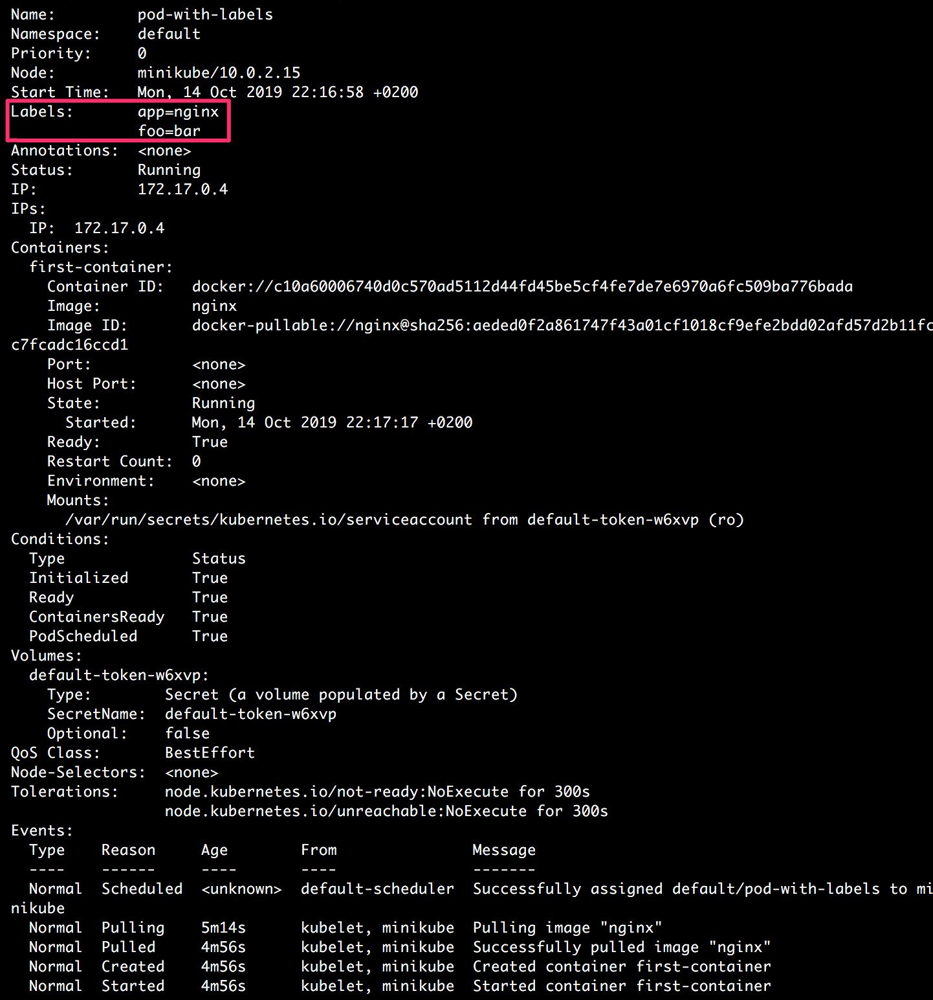
    


The output shows various details relating to the pod (as we have seen in
the previous lab as well). In this case, we will focus on the
highlighted section of the output, which shows that the desired labels,
`app=nginx`, and `foo=bar`, were actually added to
the pod. Note that, in this exercise, we added labels while creating the
pod. However, how can you add labels to a pod when a pod is already
running? The next exercise will answer this question.


Exercise 6.02: Adding Labels to a Running Pod
---------------------------------------------

In this exercise, we aim to create a pod without labels and then add
labels once the pod is running. In order to complete this exercise
successfully, perform the following steps:

1.  Create a file called `pod-without-initial-labels.yaml`
    with the following content:

    
    ```
    apiVersion: v1
    kind: Pod
    metadata:
      name: pod-without-initial-labels
    spec:
      containers:
      - name: first-container
        image: nginx
    ```
    

    Note that we have not yet added any labels to our pod.

2.  Run the following command in the Terminal to create the pod with the
    configuration mentioned in the previous step:

    
    ```
    kubectl create -f pod-without-initial-labels.yaml
    ```
    

    You should see the following response:

    
    ```
    pod/pod-without-initial-labels created
    ```
    

3.  Verify that the pod was created by using the `kubectl get`
    command:

    
    ```
    kubectl get pod pod-without-initial-labels
    ```
    

    The following output indicates that the pod has been created:

    
    
    


4.  Check if the `labels` metadata was actually added to the
    pod using the `kubectl describe` command:

    
    ```
    kubectl describe pod pod-without-initial-labels
    ```
    

    You should see the following output:

    
    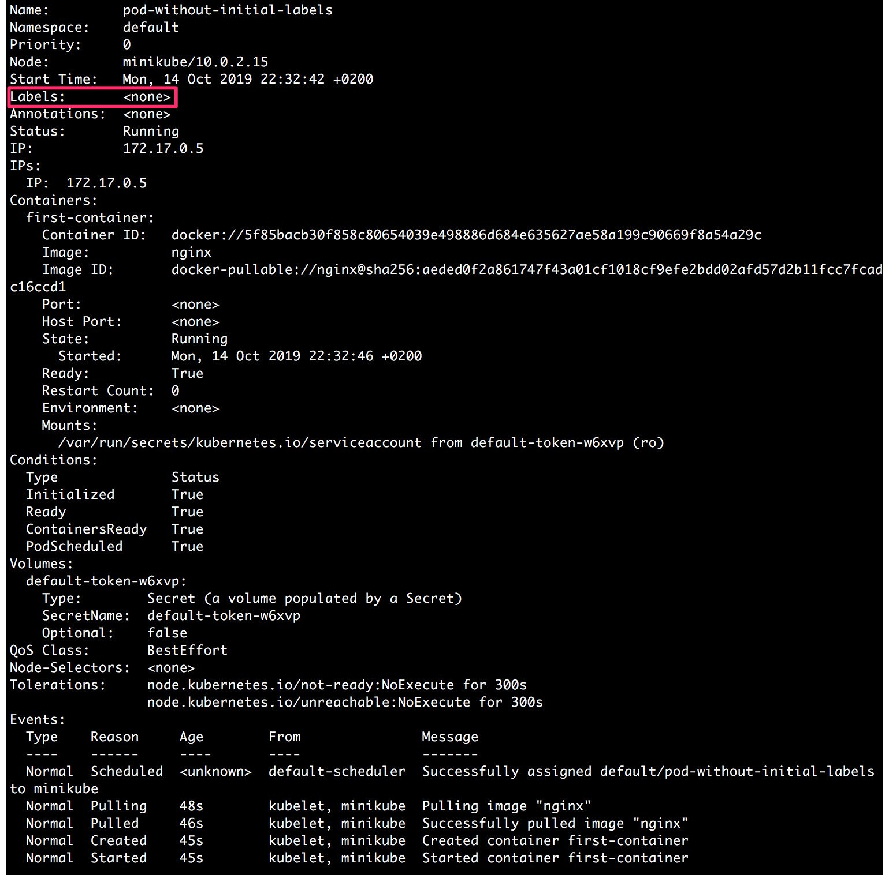
    


    In the highlighted section of the output, we can note that the
    `Labels` field is empty. Hence, we can verify that, by
    default, no label was added to the pod. In the next few steps, we
    will add a label and then run the pod again to verify whether the
    label was actually included in the pod.

5.  Add a label using the `kubectl label` command as follows:

    
    ```
    kubectl label pod pod-without-initial-labels app=nginx
    ```
    

    You should see the following response:

    
    ```
    pod/pod-without-initial-labels labeled
    ```
    

    The output shows that the `pod-without-initial-labels` pod
    was labeled.

6.  Verify that the label was actually added in the last step by using
    the `kubectl describe` command:

    
    ```
    kubectl describe pod pod-without-initial-labels
    ```
    

    You should see the following output:

    
    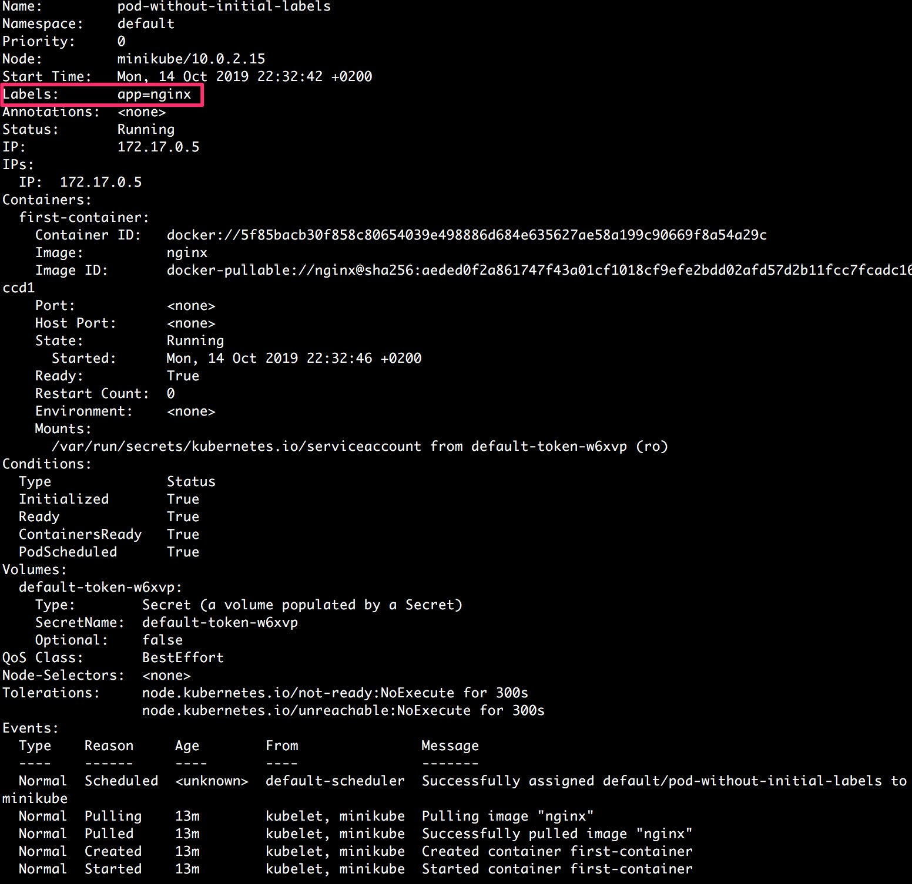
    


    We can observe in the highlighted section of the output that the
    `app=nginx` label was actually added to the pod. In the
    preceding case, we only added a single label. However, you can add
    multiple labels to a pod, as will be done in the next steps.

7.  Next, let\'s add multiple labels in the same command. We can do this
    by passing multiple labels in the `key=value` format,
    separated by spaces:

    
    ```
    kubectl label pod pod-without-initial-labels foo=bar foo2=baz
    ```
    

    You should see the following response:

    
    ```
    pod/pod-without-initial-labels labeled
    ```
    

8.  Verify that the two labels were added to the pod using the
    `kubectl describe` command:

    
    ```
    kubectl describe pod pod-without-initial-labels
    ```
    

    You should see the following output:

    
    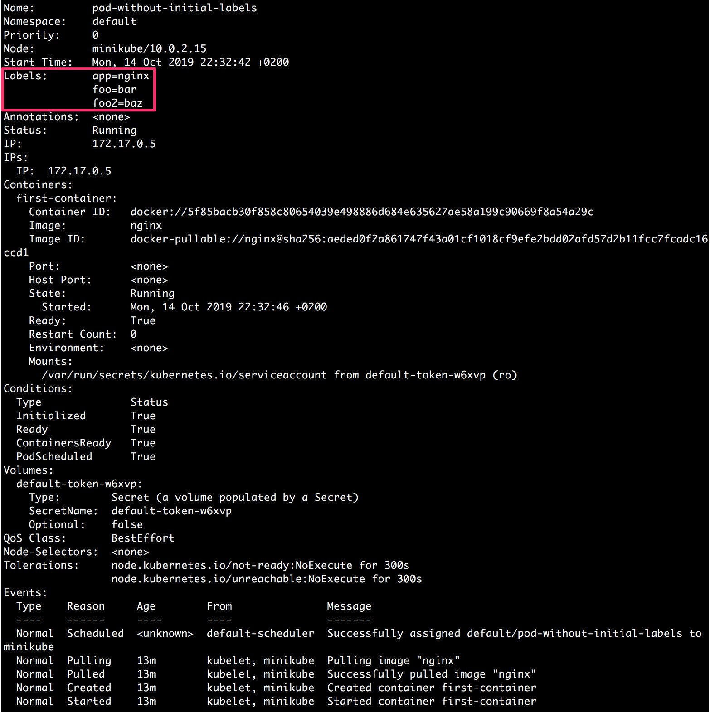
    


In the highlighted section of the output, we can see that the two new
labels, `foo=bar,` and `foo2=baz`, were also added
to the pod.

In the next exercise, we will see how we can delete and modify the
existing labels for a pod that is already running.


Exercise 6.03: Modifying And/Or Deleting Existing Labels for a Running Pod
--------------------------------------------------------------------------

In this exercise, we aim to create a pod with some labels and modify and
delete the labels while the pod is running. In order to complete this
exercise successfully, perform the following steps:

1.  Create a file called `pod-with-some-labels.yaml` with the
    following content:

    
    ```
    apiVersion: v1
    kind: Pod
    metadata:
      name: pod-with-some-labels
      labels:
        app: nginx
    spec:
      containers:
      - name: first-container
        image: nginx
    ```
    

    As you can see in the pod definition, we have added just one label,
    `app`, with the value of `nginx`.

2.  Run the following command in the Terminal to create the pod with the
    preceding configuration:

    
    ```
    kubectl create -f pod-with-some-labels.yaml
    ```
    

    You should see the following response:

    
    ```
    pod/pod-with-some-labels created
    ```
    

3.  Verify that the pod was created by using the `kubectl get`
    command:

    
    ```
    kubectl get pod pod-with-some-labels
    ```
    

    The following output indicates that the pod has been created:

    
    
    


4.  Verify that the labels were added as specified in the pod
    configuration using the `kubectl describe` command:

    
    ```
    kubectl describe pod pod-with-some-labels
    ```
    

    You should see the following output:

    
    
    


    pod-with-some-labels

    Once we are sure that the `app=nginx` label is present, we
    will modify this label in the next step.

5.  Modify the `app=nginx` label to
    `app=nginx-application` using the
    `kubectl label` command:

    
    ```
    kubectl label --overwrite pod pod-with-some-labels app=nginx-application
    ```
    

    You should see the following response:

    
    ```
    pod/pod-with-some-labels labeled
    ```
    

6.  Verify that the value of label was modified from `nginx`
    to `nginx-application` using the
    `kubectl describe` command:

    
    ```
    kubectl describe pod pod-with-some-labels
    ```
    

    The following screenshot shows the output of this command:

    
    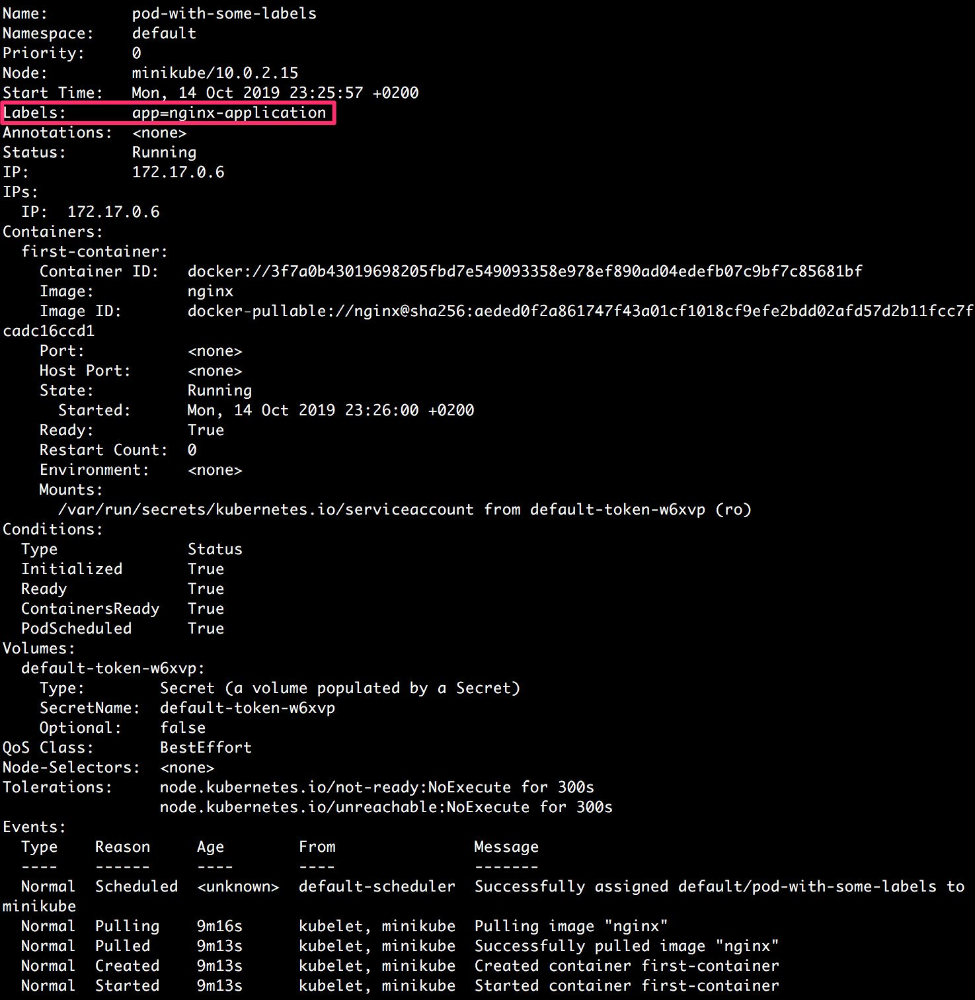
    


    As highlighted in the output, we can see that the label with the
    `app` key has a new value, `nginx-application`.

7.  Delete the label with the `app` key using the
    `kubectl label` command:

    
    ```
    kubectl label pod pod-with-some-labels app-
    ```
    

    Note the hyphen at the end of the preceding command. You should see
    the following response:

    
    ```
    pod/pod-with-some-labels labeled
    ```
    

8.  Verify that the label with the `app` key was actually
    deleted using the `kubectl describe` command:

    
    ```
    kubectl describe pod pod-with-some-labels
    ```
    

    You should see the following output:

    
    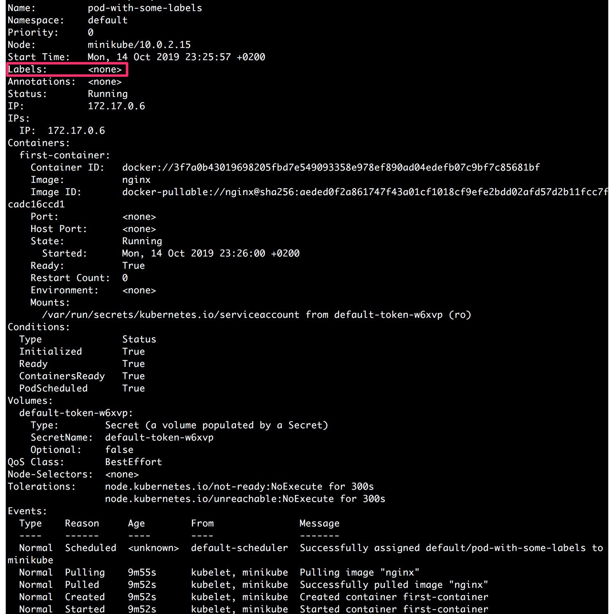
    


As highlighted in the preceding output, we can again note that the label
with the `app` key was deleted and, hence, the pod now has no
label. Thus, we have learned how to modify and delete an existing label
for a running pod.


**Selecting Kubernetes Objects Using Label Selectors**

In order to group various objects based on their labels, we use a label selector. It allows users to identify a set of objects matching certain criteria.

We can use the following syntax for the kubectl get command and pass the label selector using the -l or --label argument:

```
kubectl get pods -l {label_selector}
```

In the following exercises, we will see how to use this command in an actual scenario.


Exercise 6.04: Selecting Pods Using Equality-Based Label Selectors
------------------------------------------------------------------

In this exercise, we aim to create some pods with different labels and
then select them using equality-based selectors. In order to complete
this exercise successfully, perform the following steps:

1.  Create a file called `pod-frontend-production.yaml` with
    the following content:

    
    ```
    apiVersion: v1
    kind: Pod
    metadata:
      name: frontend-production
      labels:
        environment: production
        role: frontend
    spec:
      containers:
      - name: application-container
        image: nginx
    ```
    

    As we can see, this is the template for the pod with the following
    two labels: `environment=production` and
    `role=frontend`.

2.  Create another file called `pod-backend-production.yaml`
    with the following content:

    
    ```
    apiVersion: v1
    kind: Pod
    metadata:
      name: backend-production
      labels:
        environment: production
        role: backend
    spec:
      containers:
      - name: application-container
        image: nginx
    ```
    

    This is the template for the pod with the following two labels:
    `environment=production` and `role=backend`.

3.  Create another file called `pod-frontend-staging.yaml`
    with the following content:

    
    ```
    apiVersion: v1
    kind: Pod
    metadata:
      name: frontend-staging
      labels:
        environment: staging
        role: frontend
    spec:
      containers:
      - name: application-container
        image: nginx
    ```
    

    This is the template for the pod with the following two labels:
    `environment=staging` and `role=frontend`.

4.  Create all three pods using the following three commands:

    
    ```
    kubectl create -f pod-frontend-production.yaml
    ```
    

    You should see the following response:

    
    ```
    pod/frontend-production created
    ```
    

    Now, run the following command:

    
    ```
    kubectl create -f pod-backend-production.yaml
    ```
    

    The following response indicates that the pod has been created:

    
    ```
    pod/backend-production created
    ```
    

    Now, run the following command:

    
    ```
    kubectl create -f pod-frontend-staging.yaml
    ```
    

    This should give the following response:

    
    ```
    pod/frontend-staging created
    ```
    

5.  Verify that all three pods are created with correct labels using the
    `--show-labels` argument to the `kubectl get`
    command. First, let\'s check the `frontend-production`
    pod:

    
    ```
    kubectl get pod frontend-production --show-labels
    ```
    

    The following response indicates that the `frontend-production` pod has been created:

    
    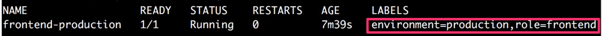
    


6.  Now, check the `backend-production` pod:

    
    ```
    kubectl get pod backend-production --show-labels
    ```
    

    The following response indicates that the `backend-production` pod has been created:

    
    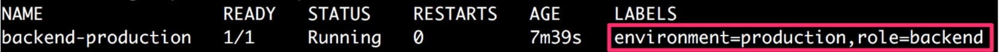
    


7.  Finally, check the `frontend-staging` pod:

    
    ```
    kubectl get pod frontend-staging --show-labels
    ```
    

    The following response indicates that the `frontend-staging` pod has been created:

    
    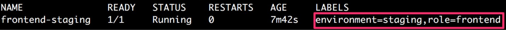
    


8.  Now, we will use label selectors to see all the pods that are
    assigned to the production environment. We can do this by using
    `environment=production` as the label selector with the
    `kubectl get` command:

    
    ```
    kubectl get pods -l environment=production
    ```
    

    In the following output, we can see that it only shows those pods
    that have a label with the `environment` key and the
    `production` value:

    
    ```
    NAME                    READY      STATUS       RESTARTS    AGE
    backend-production      1/1        Running      0           67m
    frontend-production     1/1        Running      0           68m
    ```
    

    You can confirm from *Figure 6.10* and *Figure 6.11* that these are
    the pods with the `environment=production` label.

9.  Next, we will use label selectors to see all the pods that have the
    `frontend` role and the `staging` environment.
    We can do this by using the label selector with the
    `kubectl get` command, as shown here:

    
    ```
    kubectl get pods -l role=frontend,environment=staging
    ```
    

    In the following output, we can see that it only shows those pods
    that have `staging` as the environment and
    `frontend` as the role:

    
    ```
    NAME                    READY      STATUS       RESTARTS    AGE
    frontend-staging        1/1        Running      0           72m
    ```
    

In this exercise, we have used label selectors to select particular
pods. Such label selectors for the `get` command provide a
convenient way to choose the required set of pods based on the labels.
This also represents a common scenario, where you would want to apply
some changes only to the pods involved in the production or staging
environment, or the frontend or backend infrastructure.


#### Set-Based Selectors

Let\'s implement the set-based selectors in the following exercise.


Exercise 6.05: Selecting Pods Using Set-Based Label Selectors
-------------------------------------------------------------

In this exercise, we aim to create some pods with different labels and
then select them using set-based selectors.

**Note**

In this exercise, we assume that you have successfully completed
*Exercise 6.04*, *Selecting Pods Using Equality-Based Label Selectors*.
We will be reusing the pods created in that exercise.

In order to complete this exercise successfully, perform the following
steps:

1.  Open the terminal and verify that the
    `frontend-production` pod we created in *Exercise 6.04*,
    *Selecting Pods Using Equality-Based Label Selectors*, is still
    running and has the required labels. We will be using the
    `--show-labels` argument with the `kubectl get`
    command:

    
    ```
    kubectl get pod frontend-production --show-labels
    ```
    

    The following response indicates that the `frontend-production` pod exists:

    
    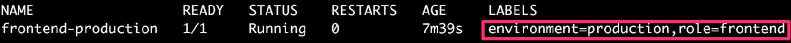
    


2.  Verify that the `backend-production` pod we created in
    *Exercise 6.04*, *Selecting Pods Using Equality-Based Label
    Selectors* is still running and has the required labels using the
    `kubectl get` command with the `--show-labels`
    argument:

    
    ```
    kubectl get pod backend-production --show-labels
    ```
    

    The following response indicates that the `backend-production` pod exists:

    
    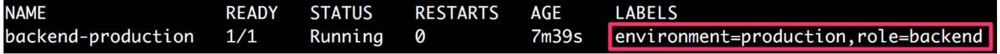
    


3.  Verify that the `frontend-staging` pod we created in
    *Exercise 6.04*, *Selecting Pods Using Equality-Based Label
    Selectors* is still running and has the required labels using the
    `kubectl get` command with the `--show-labels`
    argument:

    
    ```
    kubectl get pod frontend-staging --show-labels
    ```
    

    The following response indicates that the `frontend-staging` pod exists:

    
    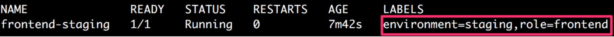
    


4.  Now, we will use the label selectors to match all the pods for which
    the environment is `production`, and the role is either
    `frontend` or `backend`. We can do this by using
    the label selector with the `kubectl get` command as shown
    here:

    
    ```
    kubectl get pods -l 'role in (frontend, backend),environment in (production)'
    ```
    
    **Note:** Above command should be run in `git bash` only. It will not work in cmd/powershell.
   
    You should see the following response:

    
    ```
    NAME                    READY      STATUS       RESTARTS    AGE
    backend-production      1/1        Running      0           82m
    frontend-production     1/1        Running      0           82m
    ```
    

5.  Next, we will use the label selectors to match all those pods that
    have the `environment` label and whose role is anything
    other than `backend`. We also want to exclude those pods
    that don\'t have the `role` label set:

    
    ```
    kubectl get pods -l 'environment,role,role notin (backend)'
    ```

    **Note:** Above command should be run in `git bash` only. It will not work in cmd/powershell.
     

    This should produce the following output:

    
    ```
    NAME                    READY      STATUS       RESTARTS    AGE
    frontend-production     1/1        Running      0           86m
    frontend-staging        1/1/       Running      0           86m
    ```
    

In this example, we have the set-based selectors that can be used to get
the desired pods. We can also combine these with selector-based pods, as
we shall see in the following exercise.


Exercise 6.06: Selecting Pods Using a Mix of Label Selectors
------------------------------------------------------------

In this exercise, we aim to create some pods with different labels and
then select them using a combination of equality-based and set-based
selectors.

**Note**

In this exercise, we assume that you have successfully completed
*Exercise 6.04*, *Selecting Pods Using Equality-Based Label Selectors*.
We will be reusing the pods created in that exercise.

In order to complete this exercise successfully, perform the following
steps:

1.  Open the terminal and verify that the
    `frontend-production` pod we created in *Exercise 6.04*,
    *Selecting Pods Using Equality-Based Label Selectors*, is still
    running and has the required labels. We will be using the
    `--show-labels` argument with the `kubectl get`
    command:

    
    ```
    kubectl get pod frontend-production --show-labels
    ```
    

    The following response indicates that the
    `frontend-production` pod exists:

    
    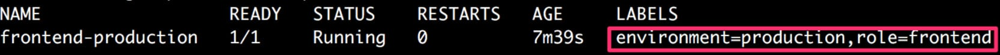
    


2.  Verify that the `backend-production` pod we created in
    *Exercise 6.04*, *Selecting Pods Using Equality-Based Label
    Selectors* is still running and has the required labels using the
    `kubectl get` command with the `--show-labels`
    argument:

    
    ```
    kubectl get pod backend-production --show-labels
    ```
    

    The following response indicates that the
    `backend-production` pod exists:

    
    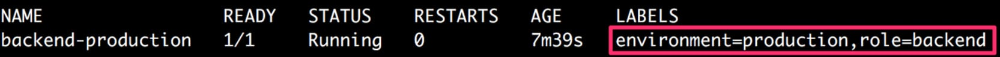
    


3.  Verify that the `frontend-staging` pod we created in
    *Exercise 6.04*, *Selecting Pods Using Equality-Based Label
    Selectors* is still running and has the required labels using the
    `kubectl get` command with the `--show-labels`
    argument:

    
    ```
    kubectl get pod frontend-staging --show-labels
    ```
    

    The following response indicates that the
    `frontend-staging` pod exists:

    
    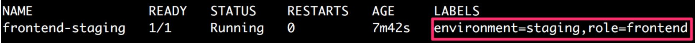
    


4.  Now, we will use the label selectors to match all the pods that have
    a `frontend` role and whose environment is one of
    `production`, `staging`, or `dev`:

    
    ```
    kubectl get pods -l 'role=frontend,environment in (production,staging,dev)'
    ```
    

    This command should give the following list of pods:

    
    ```
    NAME                    READY      STATUS       RESTARTS    AGE
    frontend-production     1/1        Running      0           95m
    frontend-staging        1/1        Running      0           95m
    ```
    

In the output, we can only see those pods that have a
`frontend` role, whereas the `environment` can be
any one of the given values. Thus, we have seen that a mix of different
types of selectors can be used as required.


We will learn how to add annotations to a pod in the following exercise.


Exercise 6.07: Adding Annotations to Help with Application Debugging
--------------------------------------------------------------------

In this exercise, we will add some arbitrary metadata to our pod. In
order to complete this exercise successfully, perform the following
steps:

1.  Create a file called `pod-with-annotations.yaml` with the
    following content:

    
    ```
    apiVersion: v1
    kind: Pod
    metadata:
      name: pod-with-annotations
      annotations:
        commit-SHA: d6s9shb82365yg4ygd782889us28377gf6
        JIRA-issue: "https://your-jira-link.com/issue/ABC-1234"
        timestamp: "123456789"
        owner: "https://internal-link.to.website/username"
    spec:
      containers:
      - name: application-container
        image: nginx
    ```
    

    The highlighted part in the pod definition shows the annotations
    that we have added.

2.  Run the following command in the Terminal to create the pod using
    the `kubectl create` command:

    
    ```
    kubectl create -f pod-with-annotations.yaml
    ```
    

    You should get the following response:

    
    ```
    pod/pod-with-annotations created
    ```
    

3.  Run the following command in the Terminal to verify that the pod was
    created as desired:

    
    ```
    kubectl get pod pod-with-annotations
    ```
    

    You should see the following list of pods:

    
    ```
    NAME                    READY      STATUS       RESTARTS    AGE
    pod-with-annotations    1/1        Running      0           29s
    ```
    

4.  Run the following command in the Terminal to verify that the created
    pod has the desired annotations:

    
    ```
    kubectl describe pod pod-with-annotations
    ```
    

    You should see the following output of this command:

    
    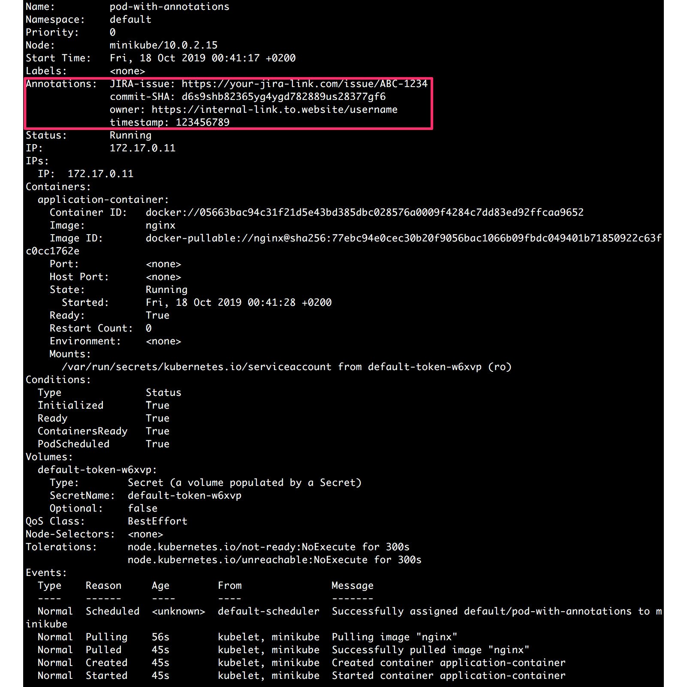
    


As we can see in the highlighted section of the preceding output, the
desired metadata has been added as annotations to the pod. Now, this
data can be used by any deployment tools or clients who may know about
the key names used.


Summary
=======


In this lab, we have described labels and annotations and used them
to add metadata information, which can either be identifiable
information that can be used to filter or select objects, or
non-identifiable information that can be used by users or tools to get
more context regarding the state of the application. More specifically,
we have also organized objects such as pods using labels and
annotations. These are important skills that will help you manage your
Kubernetes objects more efficiently.

In the following labs, as we become familiar with more Kubernetes
objects such as Deployments and Services, we will see the further
application of labels and label selectors while organizing pods for
deployment or discovery.
