Kubernetes Controllers
=========================


This lab introduces the concept of Kubernetes controllers and
explains how to use them to create replicated Deployments. We will
describe the use of different types of controllers, such as ReplicaSets,
Deployments, DaemonSets, StatefulSets, and Jobs. You will learn how to
choose a suitable controller for specific use cases. Using hands-on
exercises, we will guide you through how to use these controllers with
the desired configuration to deploy several replicas of Pods for your
application. You will also learn how to manage them using various
commands.


Let\'s proceed to create our first ReplicaSet.


Exercise 7.01: Creating a Simple ReplicaSet with nginx Containers
-----------------------------------------------------------------

In this exercise, we will create a simple ReplicaSet and examine the
Pods created by it. To successfully complete this exercise, perform the
following steps:

1.  Create a file called `replicaset-nginx.yaml` with the
    following content:

    
    ```
    apiVersion: apps/v1
    kind: ReplicaSet
    metadata:
      name: nginx-replicaset
      labels:
        app: nginx
    spec:
      replicas: 2
      selector:
        matchLabels:
          environment: production
      template:
        metadata:
          labels:
            environment: production
        spec:
          containers:
          - name: nginx-container
            image: nginx
    ```
    

    As you can see in the highlighted part of the configuration, we have
    three fields: `replicas`, `selector`, and
    `template`. We have set the number of replicas to
    `2`. The Pod selector has been set in such a way that this
    ReplicaSet will manage the Pods with the
    `environment: production` label. The Pod template has the
    simple Pod configuration that we used in previous labs. We have
    ensured that the Pod label selector matches the Pod\'s labels in the
    template exactly.

2.  Run the following command to create the ReplicaSet using the
    preceding configuration:

    
    ```
    kubectl create -f replicaset-nginx.yaml
    ```
    

    You should see the following response:

    
    ```
    replicaset.apps/nginx-replicaset created
    ```
    

3.  Verify that the ReplicaSet was created by using the
    `kubectl get` command:

    
    ```
    kubectl get rs nginx-replicaset
    ```
    

    Note that `rs` is a short form of `replicaset` in all kubectl commands.

    You should see the following response:

    
    ```
    NAME               DESIRED    CURRENT    READY    AGE
    nginx-replicaset   2          2          2        30s
    ```
    

    As you can see, we have a ReplicaSet with two desired replicas, as
    we defined in `replicaset-nginx.yaml` in *step 1*.

4.  Verify that the Pods were actually created by using the following
    command:

    
    ```
    kubectl get pods
    ```
    

    You should get the following response:

    
    ```
    NAME                     READY    STATUS   RESTARTS   AGE
    nginx-replicaset-b8fwt   1/1      Running  0          51s
    nginx-replicaset-k4h9r   1/1      Running  0          51s
    ```
    

    We can see that the names of the Pods created by the ReplicaSet take
    the name of the ReplicaSet as a prefix.

5.  Now that we have created our first ReplicaSet, let\'s look at it in
    more detail to understand what actually happened during its
    creation. To do that, we can describe the ReplicaSet we just created
    by using the following command in the terminal:

    
    ```
    kubectl describe rs nginx-replicaset
    ```
    

6.  Next, we will inspect the Pods created by this ReplicaSet and verify
    that they have been created with the correct configuration. Run the
    following command to get a list of the Pods that are running:

    
    ```
    kubectl get pods
    ```
    

    You should see a response as follows:

    
    ```
    NAME                     READY    STATUS   RESTARTS   AGE
    nginx-replicaset-b8fwt   1/1      Running  0          38m
    nginx-replicaset-k4h9r   1/1      Running  0          38m
    ```
    

7.  Run the following command to describe one of the Pods by copying its
    name:

    
    ```
    kubectl describe pod <pod_name>
    ```
    

    You should see output similar to the following:

    
    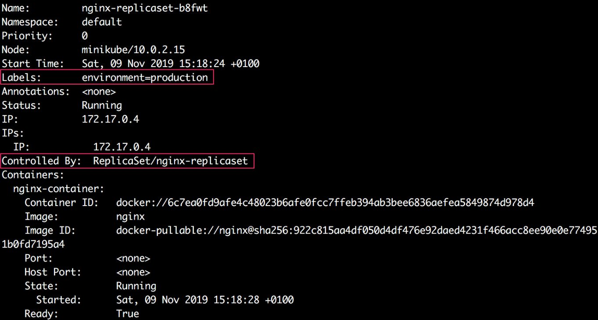
    


In the highlighted sections of the preceding output, we can clearly see
that the pod has the `environment=production` label and is
controlled by `ReplicaSet/nginx-replicaset`.

So, we have created a simple ReplicaSet in this exercise. In the
following subtopics, we will go through the highlighted sections of the
preceding output to understand the ReplicaSet that\'s running.


Exercise 7.02: Deleting Pods Managed by a ReplicaSet
----------------------------------------------------

In this exercise, we will delete one of the Pods managed by a ReplicaSet
to see how it responds. This way, we will be simulating a single or
multiple Pods failing during the runtime of a ReplicaSet:

**Note**

In this exercise, we will assume that you have successfully completed
the previous exercise as we will be reusing the ReplicaSet created in
that exercise.

1.  Verify that the Pods created by the ReplicaSet are still running:

    
    ```
    kubectl get pods
    ```
    

    You should see something similar to the following response:

    
    ```
    NAME                     READY    STATUS   RESTARTS   AGE
    nginx-replicaset-9tgb9   1/1      Running  0          103s
    nginx-replicaset-zdjb5   1/1      Running  0          103s
    ```
    

2.  Delete the first Pod to replicate Pod failure during runtime by
    using the following command:

    
    ```
    kubectl delete pod <pod_name>
    ```
    

    You should see a response similar to the following:

    
    ```
    pod "nginx-replicaset-9tgb9" deleted
    ```
    

3.  Describe the ReplicaSet and check the events:

    
    ```
    kubectl describe rs nginx-replicaset
    ```
    

    You should see output similar to the following:

    
    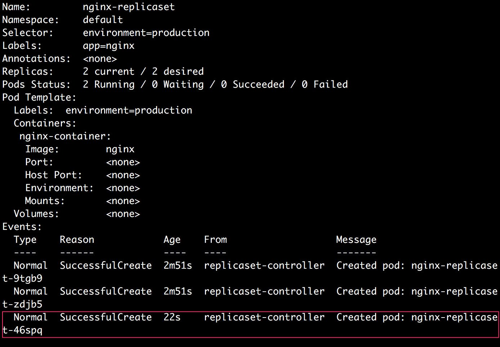
    


    As highlighted in the preceding output, we can see that after a Pod
    is deleted, the ReplicaSet creates a new Pod using the Pod
    configuration in the `Template` section of the ReplicaSet
    configuration. Even if we delete all the Pods managed by the
    ReplicaSet, they will be recreated. So, to delete all the Pods
    permanently and to avoid the recreation of the Pods, we need to
    delete the ReplicaSet itself.

4.  Run the following command to delete the ReplicaSet:

    
    ```
    kubectl delete rs nginx-replicaset
    ```
    

    You should see the following response:

    
    ```
    replicaset.apps "nginx-replicaset" deleted
    ```
    

    As shown in the preceding output, the `nginx-replicaset`
    ReplicaSet was deleted.

5.  Run the following command to verify that the Pods managed by the
    ReplicaSet were also deleted:

    
    ```
    kubectl get pods
    ```
    

    You should get the following response:

    
    ```
    No resources found in default namespace
    ```
    

    As you can see from this output, we can verify that the Pods were
    deleted.

Consider a scenario where you have already deployed a single Pod for
testing. Now, it is ready to go live. You apply the required label
changes from development to production, and now you want to control this
using a ReplicaSet. We will see how to do this in the following
exercise.


Exercise 7.03: Creating a ReplicaSet Given That a Matching Pod Already Exists
-----------------------------------------------------------------------------

In this exercise, we will create a Pod that matches the Pod template in
the ReplicaSet and then create the ReplicaSet. Our aim is to prove that
the newly created ReplicaSet will acquire the existing Pod and start
managing it as if it created that Pod itself.

In order to successfully complete this exercise, perform the following
steps:

1.  Create a file called `pod-matching-replicaset.yaml` with
    the following content:
    
    ```
    apiVersion: v1
    kind: Pod
    metadata:
      name: pod-matching-replicaset
      labels:
        environment: production
    spec:
      containers:
      - name: first-container
        image: nginx
    ```
    

2.  Run the following command to create the Pod using the preceding
    configuration:

    
    ```
    kubectl create -f pod-matching-replicaset.yaml
    ```
    

    You should see the following response:

    
    ```
    pod/pod-matching-replicaset created
    ```
    

3.  Create a file called `replicaset-nginx.yaml` with the
    following content:
    
    ```
    apiVersion: apps/v1
    kind: ReplicaSet
    metadata:
      name: nginx-replicaset
      labels:
        app: nginx
    spec:
      replicas: 2
      selector:
        matchLabels:
          environment: production
      template:
        metadata:
          labels:
            environment: production
        spec:
          containers:
          - name: nginx-container
            image: nginx
    ```
    

4.  Run the following command to create the ReplicaSet using the
    preceding configuration:

    
    ```
    kubectl create -f replicaset-nginx.yaml
    ```
    

    You should see a response similar to the following:

    
    ```
    replicaset.apps/nginx-replicaset created
    ```
    

    This output indicates that the Pod has been created.

5.  Run the following command to check the status of the ReplicaSet:

    
    ```
    kubectl get rs nginx-replicaset
    ```
    

    You should get the following response:

    
    ```
    NAME               DESIRED   CURRENT   READY   AGE
    nginx-replicaset   2         2         2       2
    ```
    

    We can see that there are currently two Pods managed by the
    ReplicaSet, as desired.

6.  Next, let\'s check what Pods are running by using the following
    command:

    
    ```
    kubectl get pods
    ```
    

    You should see output similar to the following:

    
    ```
    NAME                     READY      STATUS    RESTARTS    AGE
    nginx-replicaset-4dr7s   1/1        Running   0           28s
    pod-matching-replicaset  1/1        Running   0           81s
    ```
    

    In this output, we can see that the manually created Pod named
    `pod-matching-replicaset` is still running and that there
    was only one new Pod created by the `nginx-replicaset`
    ReplicaSet.

7.  Next, we will use the `kubectl describe` command to check
    whether the Pod named `pod-matching-replicaset` is being
    managed by the ReplicaSet:

    
    ```
    kubectl describe pod pod-matching-replicaset
    ```
    

    You should see output similar to the following:

    
    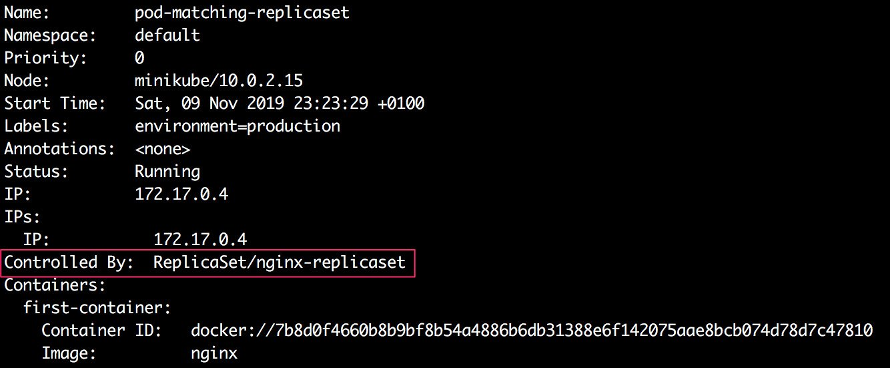
    


    In the highlighted section of the truncated output, we can see that
    even though this Pod was created manually before the ReplicaSet
    event existed, this Pod is now managed by the ReplicaSet itself.

8.  Next, we will describe the ReplicaSet to see how many Pod creations
    were triggered by it:

    
    ```
    kubectl describe rs nginx-replicaset
    ```
    

    You should see output similar to the following:

    
    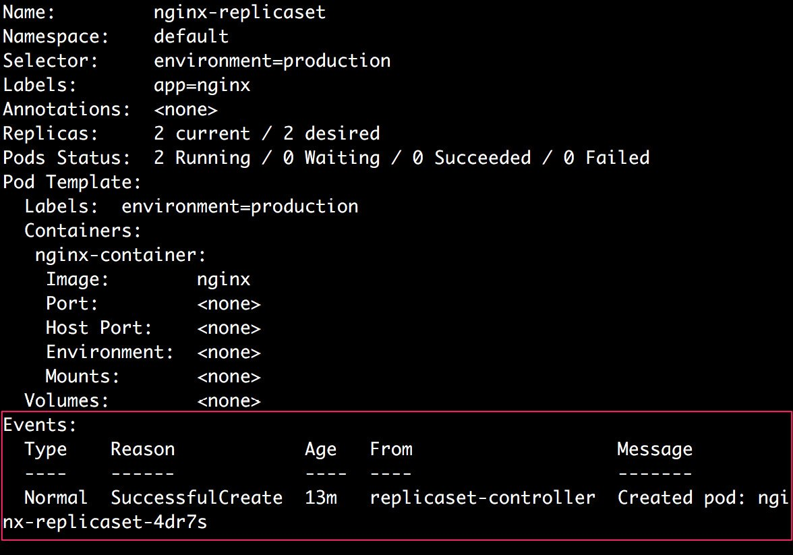
    


9.  Run the following command to delete the ReplicaSet for cleanup:

    
    ```
    kubectl delete rs nginx-replicaset
    ```
    

    You should see the following response:

    
    ```
    replicaset.apps "nginx-replicaset" deleted
    ```
    

    So, we can see that a ReplicaSet is capable of acquiring existing
    Pods as long as they match the label selector criteria. In cases
    where there are more matching Pods than the desired count, the
    ReplicaSet will terminate some of the Pods in order to maintain the
    total count of running Pods.

Another common operation is horizontally scaling a ReplicaSet that you
previously created. Let\'s say that you create a ReplicaSet with a
certain number of replicas and later you need to have more or fewer
replicas to manage increased or decreased demand. Let\'s see how you can
scale the number of replicas in the next exercise.


Exercise 7.04: Scaling a ReplicaSet after It Is Created
-------------------------------------------------------

In this exercise, we will create a ReplicaSet with two replicas and then
modify it to increase the number of replicas. Then, we will reduce the
number of replicas.

In order to successfully complete this exercise, perform the following
steps:

1.  Create a file called `replicaset-nginx.yaml` with the
    following content:
    
    ```
    apiVersion: apps/v1
    kind: ReplicaSet
    metadata:
      name: nginx-replicaset
      labels:
        app: nginx
    spec:
      replicas: 2
      selector:
        matchLabels:
          environment: production
      template:
        metadata:
          labels:
            environment: production
        spec:
          containers:
          - name: nginx-container
            image: nginx
    ```
    

2.  Run the following command to create the ReplicaSet using the
    `kubectl apply` command, as described in the preceding
    code:

    
    ```
    kubectl apply -f replicaset-nginx.yaml
    ```
    

    You should get the following response:

    
    ```
    replicaset.apps/nginx-replicaset created
    ```
    

3.  Run the following command to check all the existing Pods:

    
    ```
    kubectl get pods
    ```
    

    You should get a response similar to the following:

    
    ```
    NAME                     READY    STATUS    RESTARTS    AGE
    nginx-replicaset-99tj7   1/1      Running   0           23s
    nginx-replicaset-s4stt   1/1      Running   0           23s
    ```
    

    We can see that there are two Pods created by the replica set.

4.  Run the following command to scale up the number of replicas for the
    ReplicaSet to `4`:

    
    ```
    kubectl scale --replicas=4 rs nginx-replicaset
    ```
    

    You should see the following response:

    
    ```
    replicaset.apps/nginx-replicaset scaled
    ```
    

5.  Run the following command to check all the Pods that are running:

    
    ```
    kubectl get pods
    ```
    

    You should see output similar to the following:

    
    ```
    NAME                     READY    STATUS    RESTARTS    AGE
    nginx-replicaset-99tj7   1/1      Running   0           75s
    nginx-replicaset-klh6k   1/1      Running   0           21s
    nginx-replicaset-lrqsk   1/1      Running   0           21s
    nginx-replicaset-s4stt   1/1      Running   0           75s
    ```
    

    We can see that now there are a total of four Pods. The ReplicaSet
    created two new Pods after we applied the new configuration.

6.  Next, let\'s run the following command to scale down the number of
    replicas to `1`:

    
    ```
    kubectl scale --replicas=1 rs nginx-replicaset
    ```
    

    You should see the following response:

    
    ```
    replicaset.apps/nginx-replicaset scaled
    ```
    

7.  Run the following command to check all the Pods that are running:

    
    ```
    kubectl get pods
    ```
    

    You should see a response similar to the following:

    
    ```
    nginx-replicaset-s4stt   1/1      Running   0           11m
    ```
    

    We can see that this time, the ReplicaSet deleted all the Pods
    exceeding the count from the desired count of `1` and kept
    only one replica running.

8.  Run the following command to delete the ReplicaSet for cleanup:

    
    ```
    kubectl delete rs nginx-replicaset
    ```
    

    You should see the following response:

    
    ```
    replicaset.apps "nginx-replicaset" deleted
    ```
    

In this exercise, we have managed to scale the number of replicas up and
down. This could be particularly useful if the traffic to your
application grows or decreases for any reason.


Exercise 7.05: Creating a Simple Deployment with Nginx Containers
-----------------------------------------------------------------

In this exercise, we will create our first Deployment Pod using the
configuration described in the previous section.

To successfully complete this exercise, perform the following steps:

1.  Create a file called `nginx-deployment.yaml` with the
    following content:

    
    ```
    apiVersion: apps/v1
    kind: Deployment
    metadata:
      name: nginx-deployment
      labels:
        app: nginx
    spec:
      replicas: 3
      selector:
        matchLabels:
          app: nginx
          environment: production
      template:
        metadata:
          labels:
            app: nginx
            environment: production
        spec:
          containers:
          - name: nginx-container
            image: nginx
    ```
    

    In this configuration, we can see that the Deployment will have
    three replicas of Pods running with the `app: nginx` and
    `environment: production` labels.

2.  Run the following command to create the Deployment defined in the
    previous step:

    
    ```
    kubectl apply -f nginx-deployment.yaml
    ```
    

    You should see the following response:

    
    ```
    deployment.apps/nginx-deployment created
    ```
    

3.  Run the following command to check the status of the Deployment:

    
    ```
    kubectl get deployment nginx-deployment
    ```
    

    You should see a response similar to the following:

    
    ```
    NAME              READY    UP-TO-DATE    AVAILABLE   AGE
    nginx-deployment  3/3      3             3           26m
    ```
    

4.  Run the following command to check all the Pods that are running:

    
    ```
    kubectl get pods
    ```
    

    You should see a response similar to the following:

    
    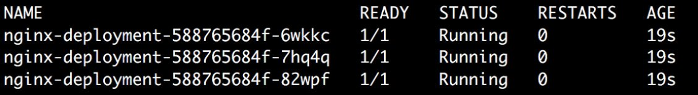
    


    We can see that the Deployment has created three Pods, as desired.

    Let\'s try to understand the names given to the Pods automatically.
    `nginx-deployment` creates a ReplicaSet named
    `nginx-deployment-588765684f`. The ReplicaSet then creates
    three replicas of Pods, each of which has a name that is prefixed
    with the name of the ReplicaSet followed by a unique identifier.

5.  Now that we have created our first Deployment, let\'s look at it in
    more detail to understand what actually happened during its
    creation. To do that, we can describe the Deployment we just created
    using the following command in the terminal:

    
    ```
    kubectl describe rs nginx-deployment
    ```
    

    You should see output similar to this:

    
    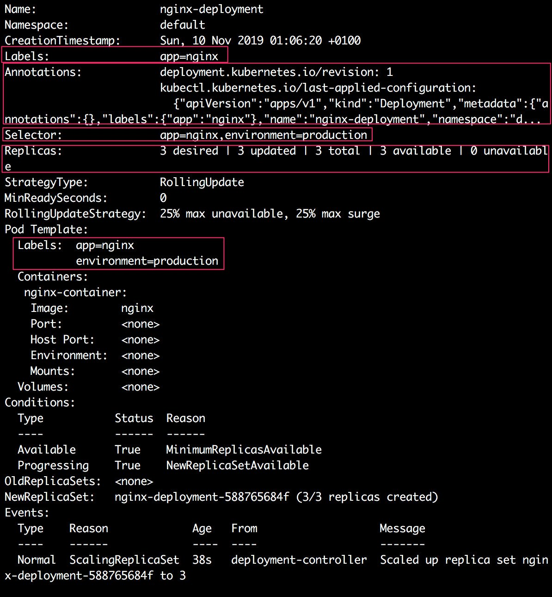
    


This output shows various details about the Deployment we just created.
In the following subtopics, we will go through the highlighted sections
of the preceding output to understand the Deployment that\'s running.


### Labels and Annotations on the Deployment

Similar to ReplicaSets, we can see the following line highlighted in the
output shown in *Figure 7.8*:


```
Labels:    app=nginx
```

This indicates that the Deployment was created with an
`app=nginx` label. Now, let\'s consider the next field in the
output:


```
Annotations:    deployment.kubernetes.io/revision: 1
                kubectl.kubernetes.io/last-applied-configuration:
{"apiVersion":"apps/v1","kind":"Deployment","metadata":{"annotations":{},"labels":{"app":"nginx"},"name":"nginx-deployment","namespace":"d...
```

There are two annotations added to the Deployment automatically.

**The Revision annotation**

The Kubernetes controller adds an annotation with the
`deployment.kubernetes.io/revision` key, which contains
information about how many revisions have been there for a particular
Deployment.

**The last-applied-configuration annotation**

Another annotation added by the controller has the
`kubectl.kubernetes.io/last-applied-configuration` key, which
contains the last configuration (in JSON format) that was applied to the
Deployment. This annotation is particularly helpful in rolling back a
Deployment to a previous revision if a new revision doesn\'t work well.


### Selectors for the Deployment

Now, consider the following line from the output shown in *Figure 7.8*:


```
Selector:    app=nginx,environment=production
```

This shows which Pod selectors the Deployment is configured with. So,
this Deployment will try to acquire the Pods that have both of these
labels.


### Replicas

Consider the following line from the output shown in *Figure 7.8*:


```
Replicas:    3 desired | 3 updated | 3 total | 3 available | 0 unavailable
```

We can see that the Deployment has the desired count of `3`
for the Pods, and it also shows that there are currently `3`
replicas present.


Rolling Back a Deployment
-------------------------

In a real-life scenario, you may make a mistake when making a change in
the Deployment configuration. You can easily undo a change and roll back
to a previous stable revision of the Deployment.

We can use the `kubectl rollout` command to check the revision
history and rollback. But to make this work, we also need to use the
`--record` flag when we use any `apply` or
`set` commands to modify the Deployment. This flag records the
rollout history. Then, you can view the rollout history using the
following command:


```
kubectl rollout history deployment <deployment_name>
```

Then, we can undo any updates by using the following command:


```
kubectl rollout undo deployment <deployment_name>
```

Let\'s take a closer look at how this works in the following exercise:


Exercise 7.06: Rolling Back a Deployment
----------------------------------------

In this exercise, we will update the Deployment twice. We will make an
intentional mistake in the second update and try to roll back to a
previous revision:

1.  Create a file called `app-deployment.yaml` with the
    following content:
    
    ```
    apiVersion: apps/v1
    kind: Deployment
    metadata:
      name: app-deployment
      labels:
        environment: production
    spec:
      replicas: 3
      selector:
        matchLabels:
          app: nginx
          environment: production
      template:
        metadata:
          labels:
            app: nginx
            environment: production
        spec:
          containers:
          - name: nginx-container
            image: nginx
    ```
    

2.  Run the following command to create the Deployment:

    
    ```
    kubectl apply -f app-deployment.yaml
    ```
    

    You should see the following response:

    
    ```
    deployment.apps/app-deployment created
    ```
    

3.  Run the following command to check the rollout history of the newly
    created Deployment:

    
    ```
    kubectl rollout history deployment app-deployment
    ```
    

    You should see the following response:

    
    ```
    deployment.apps/app-deployment
    REVISION     CHANGE-CAUSE
    1            <none>
    ```
    

    This output shows that the Deployment has no rollout history as of
    now.

4.  For the first update, let\'s change the name of the container to
    `nginx` instead of `nginx-container`. Update the
    content of the `app-deployment.yaml` file with the
    following:

    
    ```
    apiVersion: apps/v1
    kind: Deployment
    metadata:
      name: app-deployment
      labels:
        environment: production
    spec:
      replicas: 3
      selector:
        matchLabels:
          app: nginx
          environment: production
      template:
        metadata:
          labels:
            app: nginx
            environment: production
        spec:
          containers:
          - name: nginx
            image: nginx
    ```
    

    As you can see, the only thing that has changed in this template is
    the container name.

5.  Apply the changed configuration using the `kubectl apply`
    command with the `--record` flag. The `--record`
    flag ensures that the update to the Deployment is recorded in the
    rollout history of the Deployment:

    
    ```
    kubectl apply -f app-deployment.yaml --record
    ```
    

    You should see the following response:

    
    ```
    deployment.apps/app-deployment configured
    ```
    

    Note that the rollout history maintained by the `--record`
    flag is different from the past configs stored in the annotations,
    which we saw in the *Labels and Annotations on the Deployment*
    subsection.

6.  Wait for a few seconds to allow the Deployment to recreate the Pods
    with the updated Pod configuration, and then run the following
    command to check the rollout history of the Deployment:

    
    ```
    kubectl rollout history deployment app-deployment
    ```
    

    You should see the following response:

    
    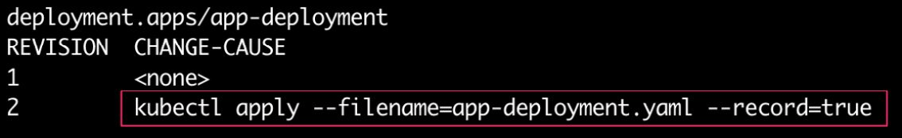
    


    In the output, we can see that the second revision of the Deployment
    was created. It also keeps track of what command was used to update
    the Deployment.

7.  Next, let\'s update the Deployment and assume that we made a mistake
    while doing so. In this example, we will update the container image
    to `ngnx` (note the intentional spelling error) instead of
    `nginx` using the `set image` command:

    
    ```
    kubectl set image deployment app-deployment nginx=ngnx --record
    ```
    

    You should see the following response:

    
    ```
    deployment.apps/app-deployment image updated
    ```
    

8.  Wait for a few seconds for Kubernetes to recreate the new
    containers, and then check the status of the Deployment rollout
    using the `kubectl rollout status` command:

    
    ```
    kubectl rollout status deployment app-deployment
    ```
    

    You should see the following response:

    
    ```
    Waiting for deployment "app-deployment" rollout to finish: 1 out of 3 new replicas have been updated...
    ```
    

    In this output, we can see that none of the new replicas are ready
    yet. Press *Ctrl* + *C* to exit and proceed.

9.  Run the following command to check the state of the Pods:

    
    ```
    kubectl get pods
    ```
    

    You should see the following output:

    
    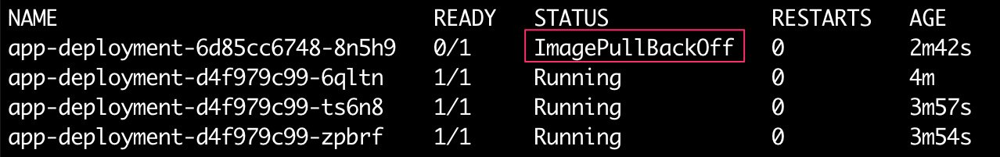
    


    We can see in the output that the newly created Pod has failed with
    an `ImagePullBackOff` error, which means that the Pods
    aren\'t able to pull the image. This is expected because we have a
    typo in the name of the image.

10. Next, check the revision history of the Deployment again by using
    the following command:

    
    ```
    kubectl rollout history deployment app-deployment
    ```
    

    You should see the following response:

    
    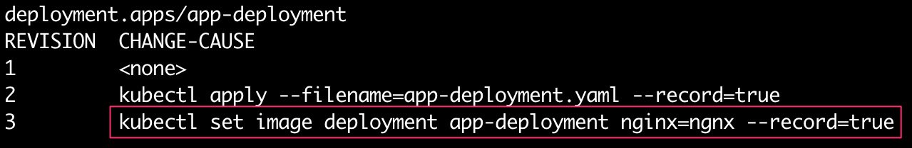
    


    We can see that a third revision of the Deployment was created using
    the `set image` command containing the typo. Now that we
    have pretended to have made a mistake in updating the Deployment, we
    will see how to undo this and roll back to the last stable revision
    of the Deployment.

11. Run the following command to roll back to the previous revision:

    
    ```
    kubectl rollout undo deployment app-deployment
    ```
    

    You should see the following response:

    
    ```
    deployment.apps/app-deployment rolled back
    ```
    

    As we can see in this output, the Deployment has not been rolled
    back to the previous revision. To practice, we may want to roll back
    to a revision different from the previous revision. We can use the
    `--to-revision` flag to specify the revision number to
    which we want to roll back. For example, in the preceding case, we
    could have used the following command and the result would have been
    exactly the same:

    
    ```
    kubectl rollout undo deployment app-deployment --to-revision=2
    ```
    

12. Run the following command to check the rollout history of the
    Deployment again:

    
    ```
    kubectl rollout history deployment app-deployment
    ```
    

    You should see the following output:

    
    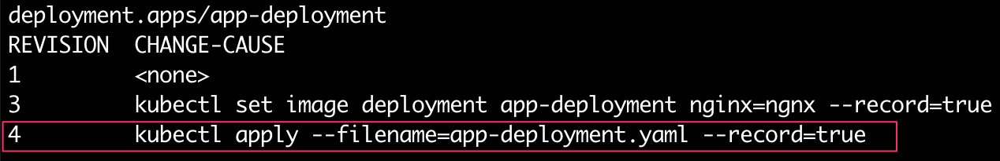
    


We can see in this output that a new revision was created, which applied
the revision that was previously revision 2. We can see that revision 2
is no longer present in the list of revisions. This is because rollouts
are always done in a rolling-forward manner. This means that any time we
update a revision, a new revision of a higher number is created.
Similarly, in the case of a rollback to revision 2, revision 2 became
revision 4.

In this exercise, we explored a lot of different possible operations
relating to updating a Deployment, rolling it forward with some changes,
tracking the history of a Deployment, undoing some changes, and rolling
back to a previous revision.


Exercise 7.07: Creating a Simple Job That Finishes in Finite Time
-----------------------------------------------------------------

In this exercise, we will create our first Job, which will run a
container that simply waits for 10 seconds and then finishes.

To successfully complete this exercise, perform the following steps:

1.  Create a file called `one-time-job.yaml` with the
    following content:
    
    ```
    apiVersion: batch/v1
    kind: Job
    metadata:
      name: one-time-job
    spec:
      template:
        spec:
          containers:
          - name: busybox-container
            image: busybox
            args:
            - /bin/sh
            - -c
            - date; sleep 20; echo "Bye"
          restartPolicy: OnFailure
    ```
    

2.  Run the following command to create the Deployment using the
    `kubectl apply` command:

    
    ```
    kubectl apply -f one-time-job.yaml
    ```
    

    You should see the following response:

    
    ```
    job.batch/one-time-job created
    ```
    

3.  Run the following command to check the status of the Job:

    
    ```
    kubectl get jobs
    ```
    

    You should see a response similar to this:

    
    ```
    NAME           COMPLETIONS    DURATION    AGE
    one-time-job   0/1            3s          3s
    ```
    

    We can see that the Job requires one completion and is not yet
    completed.

4.  Run the following command to check the Pod running the Job:

    
    ```
    kubectl get pods
    ```
    

    Note that you should run this before the Job is complete to see the
    response shown here:

    
    ```
    NAME                READY    STATUS    RESTARTS    AGE
    one-time-job-bzz8l  1/1      Running   0           7s
    ```
    

    We can see that the Job has created a Pod named
    `one-time-job-bzz8l` to run the task specified in the Job
    template.

5.  Next, run the following command to check the logs for the Pod
    created by the Job:

    
    ```
    kubectl logs -f <pod_name>
    ```
    

    You should see logs similar to the following:

    
    ```
    Sun   Nov 10 15:20:19 UTC 2019
    Bye
    ```
    

    We can see that the Pod printed the date, waited for 20 seconds, and
    then printed `Bye` in the terminal.

6.  Let\'s check the status of the Job again by using the following
    command:

    
    ```
    kubectl get job one-time-job
    ```
    

    You should see a response similar to this:

    
    ```
    NAME           COMPLETIONS     DURATION    AGE
    one-time-job   1/1             24s         14m
    ```
    

    We can see that the Job has now been completed.

7.  Run the following command to verify that the Pod has run to
    completion:

    
    ```
    kubectl get pods
    ```
    

    You should see a response similar to this:

    
    ```
    NAME                 READY    STATUS     RESTARTS    AGE
    one-time-job-whw79   0/1      Completed  0           32m
    ```
    

    We can see that the Pod has a `Completed` status.

8.  Run the following command to delete the job (as well as the Pod it
    created) for cleanup:

    
    ```
    kubectl delete job one-time-job
    ```
    

    You should see the following response:

    
    ```
    job.batch "one-time-job" deleted
    ```
    

In this exercise, we created a one-time Job and verified that the Pod
created by the Job runs to completion. Implementing Jobs for parallel
tasks is a bit more complicated, and we will leave that out of this
workshop for brevity.

Next, let\'s wrap this lab up with an activity where we will create
a Deployment and bring together several ideas learned in this lab.


Activity 7.01: Creating a Deployment Running an Application
-----------------------------------------------------------

Consider a scenario where the product/application team you\'re working
with is now ready to put their application in production and they need
your help to deploy it in a replicated and reliable manner. For the
scope of this exercise, consider the following requirements for the
application:

-   The default number of replicas should be 6.
-   For simplicity, you can use the `nginx` image for the
    container running in the Pod.
-   Make sure all the Pods have the following two labels with
    corresponding values:
    
    ```
    lab=controllers
    activity=1
    ```
    
-   The update strategy for the Deployment should be
    `RollingUpdate`. At worst, no more than half of the Pods
    can be down, and similarly, at no point should there be more than
    150% of the desired count of Pods.

You should be able to perform the following tasks once the Deployment
has been created:

-   Scale up the number of replicas to 10.

-   Scale down the number of replicas to 5.

    Note

    Ideally, you would want to create this Deployment to be in a
    different namespace to keep it separate from the rest of the stuff
    that you created during the previous exercises. So, feel free to
    create a namespace and create the Deployment in that namespace.

The following are the high-level steps to perform this activity:

1.  Create a namespace for this activity.
2.  Write the Deployment configuration. Ensure that it meets all the
    requirements that are specified.
3.  Create the Deployment using the configuration from the previous
    step.
4.  Verify that six Pods were created by the Deployment.
5.  Perform both of the tasks mentioned previously and verify the number
    of Pods after performing each step.

You should be able to get the list of Pods to check whether you can
scale up the number of Pods, as shown in the following image:


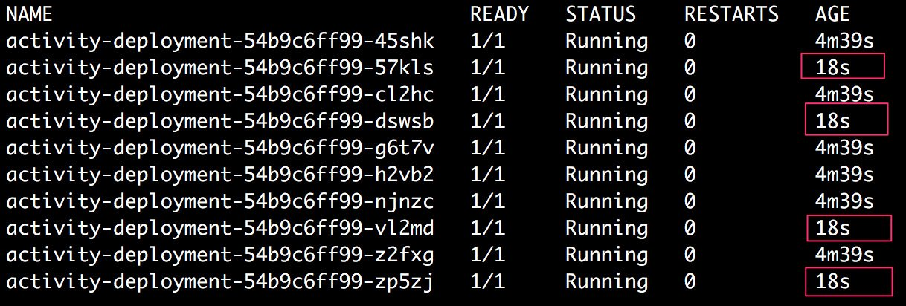


Similarly, you should also be able to scale down and check the number of
Pods, as shown here:


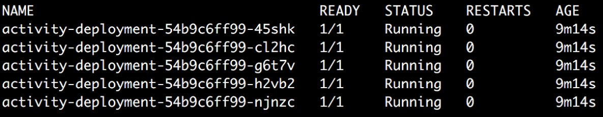


Note

The solution to this activity can be found at the following address:
`Activity_Solutions\Solution_Final.pdf`.


Summary
=======


Kubernetes treats Pods as ephemeral entities, and ideally you would not
deploy any application or a microservice in an individual Pod.
Kubernetes offers various controllers to leverage various benefits,
including automatic replication, health monitoring, and automatic
scaling.

In this lab, we covered different kinds of controllers and
understood when to use each of them. We created ReplicaSets and observed
how they manage Pods. We learned when to use DaemonSets and
StatefulSets. We also created a Deployment and learned how we can scale
up and down the number of replicas and roll back to an earlier version
of the Deployment. Finally, we learned how to create Jobs for one-time
tasks. All of these controllers come into play when you want to deploy a
production-ready application or workload, as you will see in the
upcoming labs.

In the next lab, we will see how we can discover and access the Pods
or replicas managed by a Deployment or a ReplicaSet.
