Service Discovery
====================


In this chapter, we will take a look at how to route traffic between the
various kinds of objects that we have created in previous chapters and
make them discoverable from both within and outside our cluster. This
chapter also introduces the concept of Kubernetes Services and explains
how to use them to expose the application deployed using controllers
such as Deployments. By the end of this chapter, you will be able to
make your application accessible to the external world. You will also
know about the different types of Services and be able to use them to
make different sets of pods interact with each other.


Exercise 8.01: Creating a Simple NodePort Service with Nginx Containers
-----------------------------------------------------------------------

In this exercise, we will create a simple NodePort Service with Nginx
containers. Nginx containers, by default, expose port `80` on
the Pod with an HTML page saying `Welcome to nginx!`. We will
make sure that we can access that page from a browser on our local
machine.

To successfully complete this exercise, perform the following steps:

1.  Create a file called `nginx-deployment.yaml` with the
    following content:
    
    ```
    apiVersion: apps/v1
    kind: Deployment
    metadata:
      name: nginx-deployment
      labels:
        app: nginx
    spec:
      replicas: 3
      strategy:
        type: Recreate
      selector:
        matchLabels:
          app: nginx
          environment: production
      template:
        metadata:
          labels:
            app: nginx
            environment: production
        spec:
          containers:
          - name: nginx-container
            image: nginx
    ```
    

2.  Run the following command to create the Deployment using the
    `kubectl apply` command:

    
    ```
    kubectl apply -f nginx-deployment.yaml
    ```
    

    You should get the following output:

    
    ```
    deployment.apps/nginx-deployment created
    ```
    

    As we can see, `nginx-deployment` has been created.

3.  Run the following command to verify that the Deployment has created
    three replicas:

    
    ```
    kubectl get pods
    ```
    

    You should see a response similar to the following:

    
    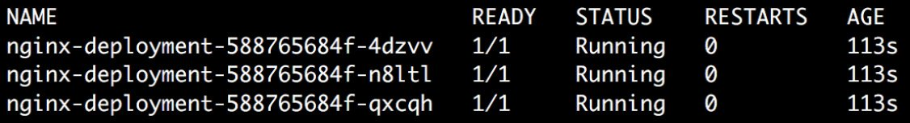
    


4.  Create a file called `nginx-service-nodeport.yaml` with
    the following content:
    
    ```
    apiVersion: v1
    kind: Service
    metadata:
      name: nginx-service-nodeport
    spec:
      type: NodePort
      ports:
        - port: 80
          targetPort: 80
          nodePort: 32023
      selector:
          app: nginx
          environment: production
    ```
    

5.  Run the following command to create the Service:

    
    ```
    kubectl create -f nginx-service-nodeport.yaml
    ```
    

    You should see the following output:

    
    ```
    service/nginx-service-nodeport created
    ```
    

    Alternatively, we can use the `kubectl expose` command to
    expose a Deployment or a Pod using a Kubernetes Service. The
    following command will also create a NodePort Service named
    `nginx-service-nodeport`, with `port` and
    `targetPort` set to `80`. The only difference is
    that this command doesn\'t allow us to customize the
    `nodePort` field. `nodePort` is automatically
    allocated when we create the Service using the
    `kubectl expose` command:

    
    ```
    kubectl expose deployment nginx-deployment --name=nginx-service-nodeport --port=80 --target-port=80 --type=NodePort
    ```
    

    If we use this command to create the Service, we will be able to

    the Service in the following step.

6.  Run the following command to verify that the Service was created:

    
    ```
    kubectl get service
    ```
    

    This should give a response similar to the following:

    
    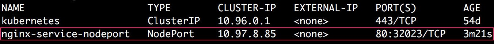
    


    You can ignore the additional Service named `kubernetes`,
    which already existed before we created our Service. This Service is
    used to expose the Kubernetes API of the cluster internally.

7.  Run the following command to verify that the Service was created
    with the correct configuration:

    
    ```
    kubectl describe service nginx-service-nodeport
    ```
    

    This should give us the following output:

    
    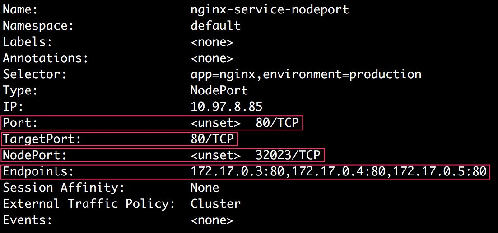
    


    In the highlighted sections of the output, we can confirm that the
    Service was created with the correct `Port`,
    `TargetPort`, and `NodePort` fields.

    There\'s also another field called `Endpoints`. We can see
    that the value of this field is a list of IP addresses; that is,
    `172.17.0.3:80`, `172.17.0.4:80`, and
    `172.17.0.5:80`. Each of these IP addresses points to the
    IP addresses allocated to the three Pods created by
    `nginx-deployment`, along with the target ports exposed by
    all of those Pods. We can use the `custom-columns` output
    format alongside the `kubectl get pods` command to get the
    IP addresses for all three pods. We can create a custom column
    output using the `status.podIP` field, which contains the
    IP address of a running Pod.

8.  Run the following command to see the IP addresses of all three Pods:

    
    ```
    kubectl get pods -o custom-columns=IP:status.podIP
    ```
    

    You should see the following output:

    
    ```
    IP
    172.17.0.4
    172.17.0.3
    172.17.0.5
    ```
    

    Hence, we can see that the `Endpoints` field of the
    Service actually points to the IP addresses of our three Pods.

    As we know in the case of a NodePort Service, we can access the
    Pod\'s application using the IP address of the node and the port
    exposed by the Service on the node. To do this, we need to find out
    the IP address of the node in the Kubernetes cluster.

9.  Run the following command to get the IP address of the Kubernetes
    cluster running locally:

    
    ```
    minikube ip
    ```
    

    You should see the following response:

    
    ```
    192.168.99.100
    ```
    

10. Run the following command to send a request to the IP address we
    obtained from the previous step at port `32023` using
    `curl`:

    
    ```
    curl 192.168.99.100:32023
    ```
    

    You should get a response from Nginx like so:

    
    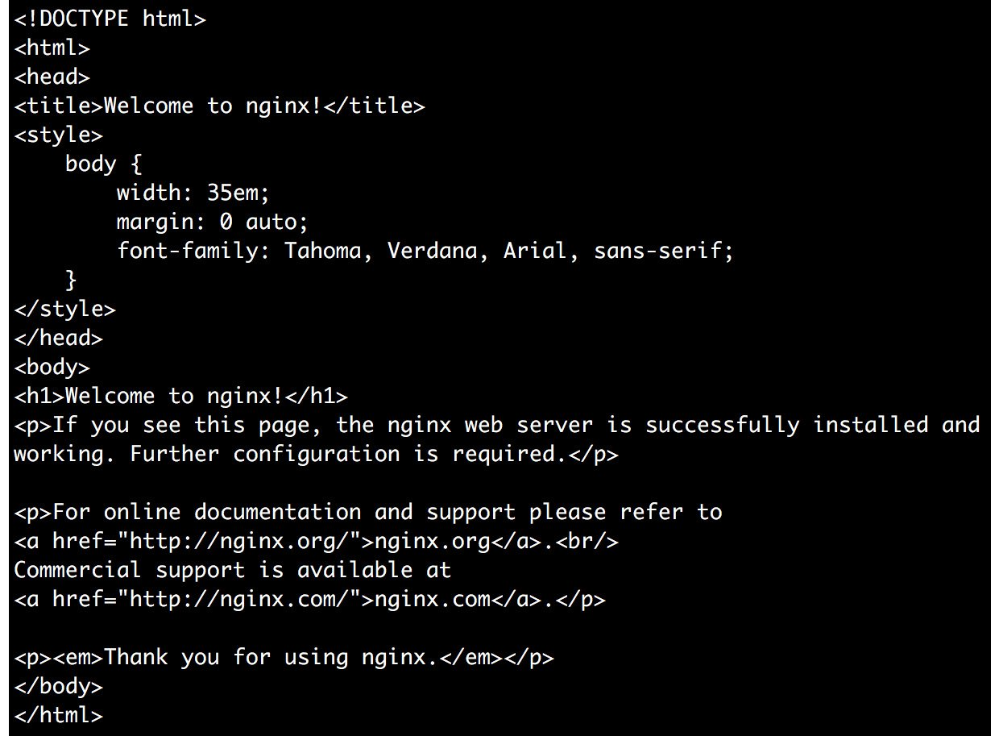
    


11. Finally, open your browser and enter
    `192.168.99.100:32023` to make sure we can get to the
    following page:

    
    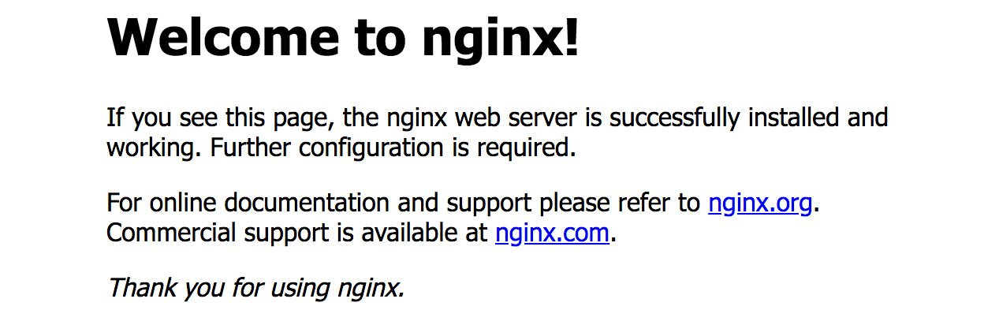
    


    Note

    Ideally, you would want to create the objects for each exercise and
    activity in different namespaces to keep them separate from the rest
    of your objects. So, feel free to create a namespace and create the
    Deployment in that namespace. Alternatively, you can ensure that you
    clean up any objects shown in the following commands so that there
    is no interference.

12. Delete both the Deployment and the Service to ensure you\'re working
    on the clean ground for the rest of the exercises in this chapter:

    
    ```
    kubectl delete deployment nginx-deployment
    ```
    

    You should see the following response:

    
    ```
    deployment.apps "nginx-deployment" deleted
    ```
    

    Now, delete the Service using the following command:

    
    ```
    kubectl delete service nginx-service-nodeport
    ```
    

    You should see this response:

    
    ```
    service "nginx-service-nodeport" deleted
    ```
    

In this exercise, we have created a Deployment with three replicas of
the Nginx container (this can be replaced with any real application
running in the container) and exposed the application using the NodePort
Service.


Exercise 8.02: Creating a Simple ClusterIP Service with Nginx Containers
------------------------------------------------------------------------

In this exercise, we will create a simple ClusterIP Service with Nginx
containers. Nginx containers, by default, expose port `80` on
the Pod with an HTML page saying `Welcome to nginx!`. We will
make sure that we can access that page from inside the Kubernetes
cluster using the `curl` command. Let\'s get started:

1.  Create a file called `nginx-deployment.yaml` with the
    following content:
    
    ```
    apiVersion: apps/v1
    kind: Deployment
    metadata:
      name: nginx-deployment
      labels:
        app: nginx
    spec:
      replicas: 3
      strategy:
        type: Recreate
      selector:
        matchLabels:
          app: nginx
          environment: production
      template:
        metadata:
          labels:
            app: nginx
            environment: production
        spec:
          containers:
          - name: nginx-container
            image: nginx
    ```
    

2.  Run the following command to create the Deployment using the
    `kubectl apply` command:

    
    ```
    kubectl create -f nginx-deployment.yaml
    ```
    

    You should see the following response:

    
    ```
    deployment.apps/nginx-deployment created
    ```
    

3.  Run the following command to verify that the Deployment has created
    three replicas:

    
    ```
    kubectl get pods
    ```
    

    You should see output similar to the following:

    
    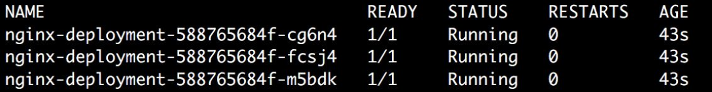
    


4.  Create a file called `nginx-service-clusterip.yaml` with
    the following content:
    
    ```
    apiVersion: v1
    kind: Service
    metadata:
      name: nginx-service-clusterip
    spec:
      type: ClusterIP
      ports:
        - port: 80
          targetPort: 80
      selector:
          app: nginx
          environment: production
    ```
    

5.  Run the following command to create the Service:

    
    ```
    kubectl create -f nginx-service-clusterip.yaml
    ```
    

    You should see the following response:

    
    ```
    service/nginx-service-clusterip created
    ```
    

6.  Run the following command to verify that the Service was created:

    
    ```
    kubectl get service
    ```
    

    You should see the following response:

    
    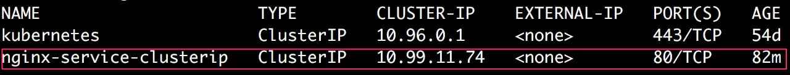
    


7.  Run the following command to verify that the Service has been
    created with the correct configuration:

    
    ```
    kubectl describe service nginx-service-clusterip
    ```
    

    You should see the following response:

    
    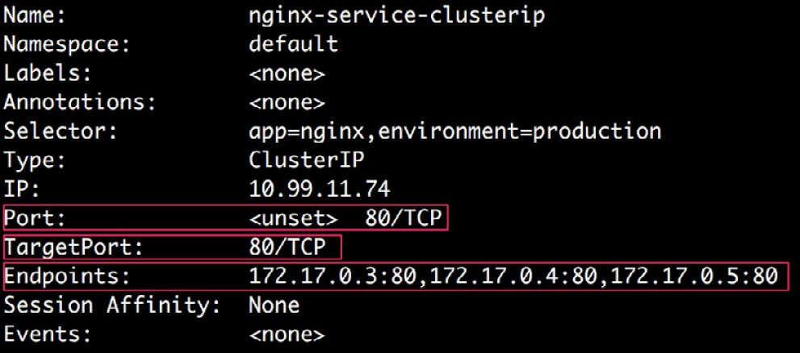
    


    We can see that the Service has been created with the correct
    `Port` and `TargetPort` fields. In the
    `Endpoints` field, we can see the IP addresses of the
    Pods, along with the target ports on those Pods.

8.  Run the following command to see the IP addresses of all three Pods:

    
    ```
    kubectl get pods -o custom-columns=IP:status.podIP
    ```
    

    You should see the following response:

    
    ```
    IP
    172.17.0.5
    172.17.0.3
    172.17.0.4
    ```
    

    Hence, we can see that the `Endpoints` field of the
    Service actually points to the IP addresses of our three Pods.

9.  Run the following command to get the cluster IP of the Service:

    
    ```
    kubectl get service nginx-service-clusterip
    ```
    

    This results in the following output:

    
    
    


    As we can see, the Service has a cluster IP of
    `10.99.11.74`.

    We know that, in the case of a ClusterIP Service, we can access the
    application running on its endpoints from inside the cluster. So, we
    need to go inside the cluster to be able to check whether this
    really works.

10. Run the following command to access the `minikube` node
    via SSH:

    
    ```
    minikube ssh
    ```
    

    You will see the following response:

    
    
    


11. Now that we are inside the cluster, we can try to access the cluster
    IP address of the Service and see whether we can access the Pods
    running Nginx:

    
    ```
    curl 10.99.11.74
    ```
    

    You should see the following response from Nginx:

    
    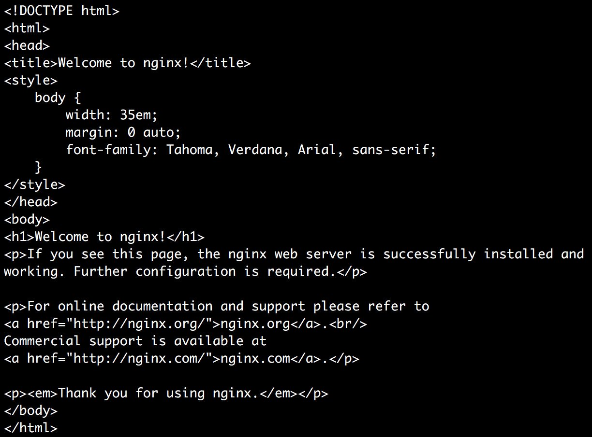
    

    Here, we can see that `curl` returns the HTML code for the
    default Nginx landing page. Thus, we can successfully access our
    Nginx Pods. Next, we will delete the Pods and Services.

12. Run the following command to exit the SSH session inside minikube:
    
    ```
    exit
    ```
    

13. Delete the Deployment and the Service to ensure you\'re working on
    the clean ground for the following exercises in this chapter:

    
    ```
    kubectl delete deployment nginx-deployment
    ```
    

    You should see the following response:

    
    ```
    deployment.apps "nginx-deployment" deleted
    ```
    

    Delete the Service using the following command:

    
    ```
    kubectl delete service nginx-service-clusterip
    ```
    

    You should see the following response:

    
    ```
    service "nginx-service-clusterip" deleted
    ```
    

In this exercise, we were able to expose the application running on
multiple Pods on a single IP address. This can be accessed by all the
other Pods running inside the same cluster.


### Choosing a Custom IP Address for the Service

In the previous exercise, we saw that the Service was created with a
random available IP address inside the Kubernetes cluster. We can also
specify an IP address if we want. This may be particularly useful if we
already have a DNS entry for a particular address and we want to reuse
that for our Service.

We can do this by setting the `spec.clusterIP` field with a
value of the IP address we want the Service to use. The IP address
specified in this field should be a valid IPv4 or IPv6 address. If an
invalid IP address is used to create the Service, the API server will
return an error.


Exercise 8.03: Creating a ClusterIP Service with a Custom IP
------------------------------------------------------------

In this exercise, we will create a ClusterIP Service with a custom IP
address. We will try a random IP address. As in the previous exercise,
we will make sure that we can access the default Nginx page from inside
the Kubernetes cluster by using the `curl` command to the set
IP address. Let\'s get started:

1.  Create a file called `nginx-deployment.yaml` with the same
    content that we used in the previous exercises in this chapter.

2.  Run the following command to create the Deployment:

    
    ```
    kubectl create -f nginx-deployment.yaml
    ```
    

    You should see the following response:

    
    ```
    deployment.apps/nginx-deployment created
    ```
    

3.  Create a file named `nginx-service-custom-clusterip.yaml`
    with the following content:

    
    ```
    apiVersion: v1
    kind: Service
    metadata:
      name: nginx-service-custom-clusterip
    spec:
      type: ClusterIP
      ports:
        - port: 80
          targetPort: 80
      clusterIP: 10.90.10.70
      selector:
          app: nginx
          environment: production
    ```
    

    This uses a random ClusterIP value at the moment.

4.  Run the following command to create a Service with the preceding
    configuration:

    
    ```
    kubectl create -f nginx-service-custom-clusterip.yaml
    ```
    

    You should see the following response:

    
    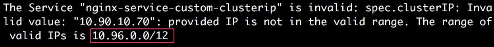
    

    As we can see, the command gives us an error because the IP address
    we used (`10.90.10.70`) isn\'t in the valid IP range. As
    highlighted in the preceding output, the valid IP range is
    `10.96.0.0/12`.

    We can actually find this valid range of IP addresses before
    creating the Service using the `kubectl cluster-info dump`
    command. It provides a lot of information that can be used for
    cluster debugging and diagnosis. We can filter for the
    `service-cluster-ip-range` string in the output of the
    command to find out the valid ranges of IP addresses we can use in a
    cluster. The following command will output the valid IP range:

    
    ```
    kubectl cluster-info dump | grep -m 1 service-cluster-ip-range
    ```
    

    You should see the following output:

    
    ```
    "--service-cluster-ip-range=10.96.0.0/12",
    ```
    

    We can then use the appropriate IP address for `clusterIP`
    for our Service.

5.  Modify the `nginx-service-custom-clusterip.yaml` file by
    changing the value of `clusterIP` to `10.96.0.5`
    since that\'s one of the valid values:
    
    ```
    apiVersion: v1
    kind: Service
    metadata:
      name: nginx-service-custom-clusterip
    spec:
      type: ClusterIP
      ports:
        - port: 80
          targetPort: 80
      clusterIP: 10.96.0.5
      selector:
          app: nginx
          environment: production
    ```
    

6.  Run the following command to create the Service again:

    
    ```
    kubectl create -f nginx-service-custom-clusterip.yaml
    ```
    

    You should see the following output:

    
    ```
    service/nginx-service-custom-clusterip created
    ```
    

    We can see that the Service has been created successfully.

7.  Run the following command to ensure that the Service was created
    with the custom ClusterIP we specified in the configuration:

    
    ```
    kubectl get service nginx-service-custom-clusterip
    ```
    

    You should see the following output:

    
    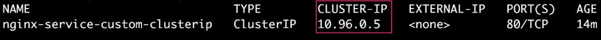
    


    Here, we can confirm that the Service was indeed created with the IP
    address mentioned in the configuration; that is,
    `10.96.0.5`.

8.  Next, let\'s confirm that we can access the Service using the custom
    IP address from inside the cluster:

    
    ```
    minikube ssh
    ```
    

    You should see the following response:

    
    
    


9.  Now, run the following command to send a request to
    `10.96.0.5:80` using `curl`:

    
    ```
    curl 10.96.0.5
    ```
    

    We intentionally skipped the port number (`80`) in the
    `curl` request because, by default, curl assumes the port
    number to be `80`. If the Service were using a different
    port number, we would have to specify that in the curl request
    explicitly. You should see the following output:

    
    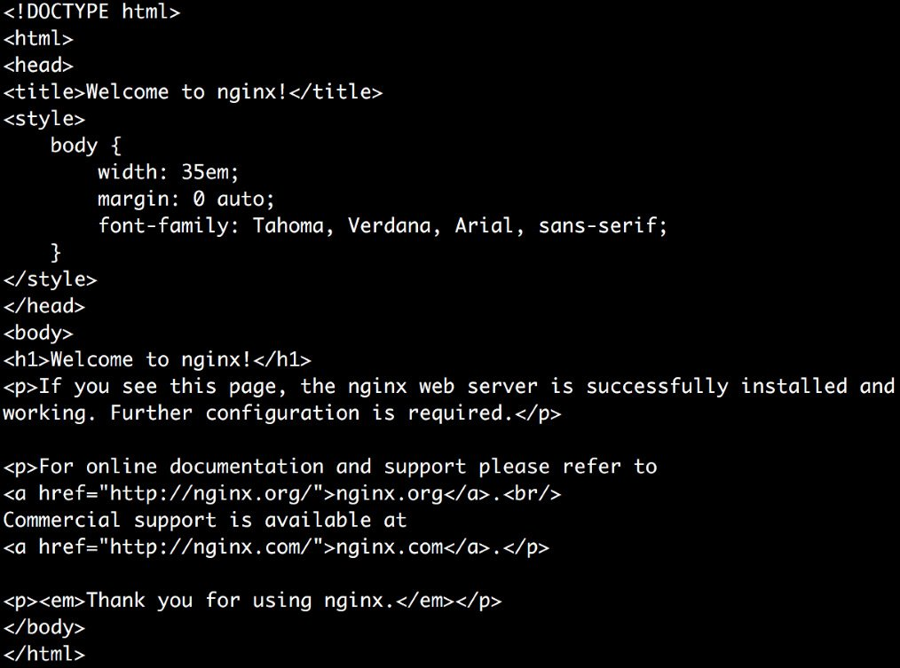
    

Thus, we can see that we are able to access our Service from inside the
cluster and that that service can be accessed at the IP address that we
defined for `clusterIP`.


Now that we have learned about the different types of Services in
Kubernetes, we will implement all of them to get an idea of how they
would work together in a real-life scenario.


Activity 8.01: Creating a Service to Expose the Application Running on a Pod
----------------------------------------------------------------------------

Consider a scenario where the product team you\'re working with has
created a survey application that has two independent and decoupled
components -- a frontend and a backend. The frontend component of the
survey application renders the survey forms and needs to be exposed to
external users. It also needs to communicate with the backend component,
which is responsible for validating and storing the survey\'s responses.

For the scope of this activity, consider the following tasks:

1.  To avoid overcomplicating this activity, you can deploy the Apache
    server (<https://hub.docker.com/_/httpd>) as the frontend, and we
    can treat its default placeholder home page as the component that
    should be visible to the survey applicants. Expose the frontend
    application so that it\'s accessible on the host node at port
    `31000`.

2.  For the backend application, deploy an Nginx server. We will treat
    the default home page of Nginx as the page that you should be able
    to see from the backend. Expose the backend application so that
    it\'s accessible for the frontend application Pods in the same
    cluster.

    Both Apache and Nginx are exposed at port `80` on the Pods
    by default.

    Note

    We are using Apache and Nginx here to keep the activity simple. In a
    real-world scenario, these two would be replaced with the frontend
    survey site and the backend data analysis component of your survey
    application, along with a database component for storing all the
    survey data.

3.  To make sure frontend applications are aware of the backend
    application Service, add an environment variable to the frontend
    application Pods that contain the IP and the port address of the
    backend Service. This will ensure that the frontend applications
    know where to send a request to backend applications.

    To add environment variables to a Pod, we can add a field named
    `env` to the `spec` section of a Pod
    configuration that contains a list of name and value pairs for all
    the environment variables we want to add. Here\'s an example of how
    to add an environment variable called `APPLICATION_TYPE`
    with a value of `Frontend`:

    
    ```
    apiVersion: v1
    kind: Pod
    metadata:
      name: environment-variables-example
      labels:
        application: frontend
    spec:
      containers:
      - name: apache-httpd
        image: httpd
        env:
        - name: APPLICATION_TYPE
          value: "Frontend"
    ```
    

    Note

    We used something called a `ConfigMap` to add an
    environment variable here. We will learn more about them in *Chapter
    10*, *ConfigMaps and Secrets*.

4.  Let\'s assume that, based on load testing the application, you have
    estimated that you\'ll initially need five replicas of the frontend
    application and four replicas of the backend application.

The following are the high-level steps you will need to perform in order
to complete this activity:

1.  Create a namespace for this activity.
2.  Write an appropriate Deployment configuration for the backend
    application and create the Deployment.
3.  Write an appropriate Service configuration for the backend
    application with the appropriate Service type and create the
    Service.
4.  Ensure that the backend application is accessible, as expected.
5.  Write an appropriate Deployment configuration for the frontend
    application. Make sure it has the environment variables set for the
    IP address and the port address for the backend application Service.
6.  Create a deployment for the frontend application.
7.  Write an appropriate Service configuration for the frontend
    application with the appropriate service type and create the
    Service.
8.  Ensure that the frontend application is accessible as expected on
    port `31000` on the host node.

**Expected Output:**

At the end of the exercise, you should be able to access the frontend
application in the browser using the host IP address at port
`31000`. You should see the following output in your browser:


Note

The solution to this activity can be found at the following address:
`Activity_Solutions\Solution_Final.pdf`.


Summary
=======


In this chapter, we covered the different ways in which we can expose
our application running on Pods. We have seen how we can use a ClusterIP
Service to expose an application inside the cluster. We have also seen
how we can use a NodePort Service to expose an application outside the
cluster. We have also covered the LoadBalancer and ExternalName Services
in brief.

Now that we have created a Deployment and learned how to make it
accessible from the external world, in the next chapter, we will focus
on storage aspects. There, we will cover reading and storing data on
disk, in and across Pods.
