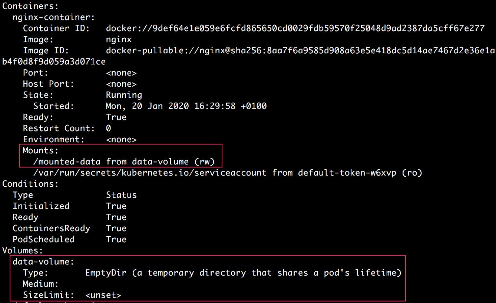
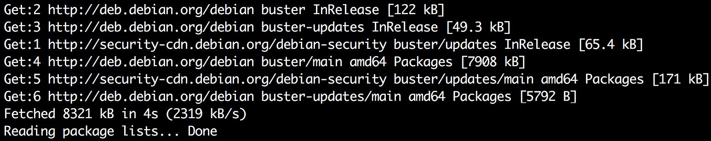

Storing and Reading Data on Disk
===================================


This lab introduces the concept of using Volumes to store or read
data from the containers running inside pods. By the end of this
lab, you will be able to create Volumes to temporarily store data in
a pod independent of a container\'s life cycle, as well as share the
data among different containers inside the same pod. You will also learn
how to use **PersistentVolumes** (**PVs**) to store data on your cluster
independent of the pod life cycle. We will also cover how to create
**PersistentVolumeClaims** (**PVCs**) to dynamically provision volumes
and use them inside a pod.


In the following exercises, we will use different type of Volumes with pods.


Exercise 9.01: Creating a Pod with an emptyDir Volume
-----------------------------------------------------

In this exercise, we will create a basic pod with an
`emptyDir` Volume. We will also simulate data being written
manually, and then make sure that the data stored in the Volume is kept
across container restarts:

1.  Create a file called `pod-with-emptydir-volume.yaml` with
    the following content:

    
    ```
    apiVersion: v1
    kind: Pod
    metadata:
      name: pod-with-emptydir-volume
    spec:
      containers:
      - image: nginx
        name: nginx-container
        volumeMounts: 
        - mountPath: /mounted-data
          name: data-volume
      volumes:
      - name: data-volume
        emptyDir: {}
    ```
    

    In this pod configuration, we have used an `emptyDir`
    Volume mounted at the `/mounted-data` directory.

2.  Run the following command to create the pod using the preceding
    configuration:

    
    ```
    kubectl create -f pod-with-emptydir-volume.yaml
    ```
    

    You should see the following response:

    
    ```
    pod/pod-with-emptydir-volume created
    ```
    

3.  Run the following command to confirm that the pod was created and is
    ready:

    
    ```
    kubectl get pod pod-with-emptydir-volume
    ```
    

    You should see the following response:

    
    ```
    NAME                       READY   STATUS   RESTARTS   AGE
    pod-with-emptydir-volume   1/1     Running  0          20s
    ```
    

4.  Run the following command to describe the pod so that we can verify
    that the correct Volume was mounted on this pod:

    
    ```
    kubectl describe pod pod-with-emptydir-volume
    ```
    

    This will give a long output. Look for the following section in the
    terminal output:

    
    
    

    As highlighted in the preceding image, the `emptyDir`
    Volume named `data-volume` was created and it was mounted
    on `nginx-container` at the `/mounted-data`
    path. We can see that the Volume has been mounted in `rw`
    mode, which stands for read-write.

    Now that we have verified that the pod was created with the correct
    Volume configured, we will manually write some data to this path. In
    practice, this writing will be done by your application code.

5.  Now, we will use the `kubectl exec` command to run the
    Bash shell inside the pod:

    
    ```
    kubectl exec pod-with-emptydir-volume -it /bin/bash
    ```
    

    You should see the following on your terminal screen:

    
    ```
    root@pod-with-emptydir-volume:/#
    ```
    

    This will now allow you to run commands via an SSH connection on the
    Bash shell running in the `nginx-container`. Note that we
    are running as a root user.

    Note

    If you had a sidecar container running in the pod (or any number of
    multiple containers in a pod), then you can control where the
    `kubectl exec` command will execute by adding the
    `-c` parameter to specify the container, as you will see
    in the next exercise.

6.  Run the following command to check the content of the root directory
    of the pod:

    
    ```
    ls
    ```
    

    You should see an output similar to this one:

    
    ```
    bin   dev  home  lib64  mnt          opt   root  sbin   sys   usr
    boot  etc  lib   media  mounted-data proc  run   srv    tmp   var
    ```
    

    Notice that there\'s a directory called `mounted-data`.

7.  Run the following commands to go to the `mounted-data`
    directory and check its content:

    
    ```
    cd mounted-data
    ls
    ```
    

    You should see a blank output, as follows:

    
    ```
    root@pod-with-emptydir-volume:/mounted-data#
    ```
    

    This output indicates that the `mounted-data` directory is
    empty as expected because we don\'t have any code running inside the
    pod that would write to this path.

8.  Run the following command to create a simple text file inside the
    `mounted-data` directory:
    
    ```
    echo "Manually stored data" > manual-data.txt
    ```
    

9.  Now, run the `ls` command again to check the content of
    the directory:

    
    ```
    ls
    ```
    

    You should see the following output:

    
    ```
    manual-data.txt
    ```
    

    Thus, we have created a new file with some content in the mounted
    volume directory. Now, our aim will be to verify that this data will
    still exist if the container is restarted.

10. In order to restart the container, we will kill the
    `nginx` process, which will trigger a restart. Run the
    following commands to install the procps package so that we can use
    the `ps` command to find out the process ID (PID) of the
    process that we want to kill. First, update the package lists:

    
    ```
    sudo apt-get update
    ```
    

    You should see an output similar to the following:

    
    
    


    Our package lists are up to date and we are now ready to install
    procps.

11. Use the following command to install procps:

    
    ```
    sudo apt-get install procps
    ```
    

    Enter *Y* when prompted to confirm the installation, and then the
    installation will proceed with an output similar to the following:

    
    
    


12. Now, run the following command to check the list of processes
    running on the container:

    
    ```
    ps aux
    ```
    

    You should see the following output:

    
    
    


    In the output, we can see that among several other processes, the
    `nginx` master process is running with a `PID`
    of `1`.

13. Run the following command to kill the `nginx` master
    process:

    
    ```
    kill 1
    ```
    

    You should see the following response:

    
    
    


    The output shows that the terminal exited the Bash session on the
    pod. This is because the container was killed. The `137`
    exit code indicates that the session was killed by manual
    intervention.

14. Run the following command to get the status of the pod:

    
    ```
    kubectl describe pod pod-with-emptydir-volume
    ```
    

    Observe the following section in the output that you get:

    
    
    


    You will see that there\'s now a `Restart Count` field for
    `nginx-container` that has a value of `1`. That
    means that the container was restarted after we killed it. Please
    note that restarting a container doesn\'t trigger a restart of a
    pod. Hence, we should expect the data stored in the Volume to still
    exist. Let\'s verify that in the next step.

15. Let\'s run Bash inside the pod again and go to the
    `/mounted-data` directory:

    
    ```
    kubectl exec pod-with-emptydir-volume -it /bin/bash
    cd mounted-data
    ```
    

    You will see the following output:

    
    ```
    root@pod-with-emptydir-volume:/# cd mounted data/
    ```
    

16. Run the following command to check the contents of
    `/mounted-data` directory:

    
    ```
    ls
    ```
    

    You will see the following output:

    
    ```
    manual-data.txt
    ```
    

    This output indicates that the file we created before killing the
    container still exists in the Volume.

17. Run the following command to verify the contents of the file we
    created in the Volume:

    
    ```
    cat manual-data.txt
    ```
    

    You will see the following output:

    
    ```
    Manually stored data
    ```
    

    This output indicates that the data we stored in the Volume stays
    intact even when the container gets restarted.

18. Run the following command to delete the pod:

    
    ```
    kubectl delete pod pod-with-emptydir-volume
    ```
    

    You will see the following output confirming that the pod has been
    deleted:

    
    ```
    pod "pod-with-emptydir-volume" deleted
    ```
    

In this exercise, we created a pod with the `emptyDir` Volume,
checked that the pod was created with an empty directory mounted at the
correct path inside the container, and verified that we can write the
data inside that directory and that the data stays intact across the
container restarts as long as the pod is still running.

Now, let\'s move to a scenario that lets us observe some more uses for
Volumes. Let\'s consider a scenario where we have an application pod
that runs a total of three containers. We can assume that two of the
three containers are serving traffic and they dump the logs into a
shared file. The third container acts as a sidecar monitoring container
that reads the logs from the file and dumps them into an external log
storage system where the logs can be preserved for further analysis and
alerting. Let\'s consider this scenario in the next exercise and
understand how we can utilize an `emptyDir` Volume shared
between the three containers of a pod.


Exercise 9.02: Creating a Pod with an emptyDir Volume Shared by Three Containers
--------------------------------------------------------------------------------

In this exercise, we will show some more uses of the
`emptyDir` Volume and share it among three containers in the
same pod. Each container will mount the same volume at a different local
path:

1.  Create a file called `shared-emptydir-volume.yaml` with
    the following content:

    
    ```
    apiVersion: v1
    kind: Pod
    metadata:
      name: shared-emptydir-volume
    spec:
      containers:
      - image: ubuntu
        name: container-1
        command: ['/bin/bash', '-ec', 'sleep 3600']
        volumeMounts:
        - mountPath: /mounted-data-1
          name: data-volume
      - image: ubuntu
        name: container-2
        command: ['/bin/bash', '-ec', 'sleep 3600']
        volumeMounts:
        - mountPath: /mounted-data-2
          name: data-volume
      - image: ubuntu
        name: container-3
        command: ['/bin/bash', '-ec', 'sleep 3600']
        volumeMounts:
        - mountPath: /mounted-data-3
          name: data-volume
      volumes:
      - name: data-volume
        emptyDir: {}
    ```
    

    In this configuration, we have defined an `emptyDir`
    Volume named `data-volume`, which is being mounted on
    three containers at different paths.

    Note that each of the containers has been configured to run a
    command on startup that makes them sleep for 1 hour. This is
    intended to keep the `ubuntu` container running so that we
    can perform the following operations on the containers. By default,
    an `ubuntu` container is configured to run whatever
    command is specified and exit upon completion.

2.  Run the following command to create the pod with the preceding
    configuration:

    
    ```
    kubectl create -f shared-emptydir-volume.yaml
    ```
    

    You will see the following output:

    
    ```
    pod/shared-emptydir-volume created
    ```
    

3.  Run the following command to check the status of the pod:

    
    ```
    kubectl get pod shared-emptydir-volume
    ```
    

    You will see the following output:

    
    ```
    NAME                     READY   STATUS    RESTARTS   AGE
    shared-emptydir-volume   3/3     Running   0          13s
    ```
    

    This output indicates that all three containers inside this pod are
    running.

4.  Next, we will run the following command to run Bash in the first
    container:

    
    ```
    kubectl exec shared-emptydir-volume -c container-1 -it -- /bin/bash
    ```
    

    Here, the `-c` flag is used to specify the container that
    we want to run Bash in. You will see the following in the terminal:

    
    ```
    root@shared-emptydir-volume:/#
    ```
    

5.  Run the following command to check the content of the root directory
    on the container:

    
    ```
    ls
    ```
    

    You will see the following output:

    
    
    


    We can see that the `mounted-data-1` directory has been
    created on the container. Also, you can see the list of directories
    you would see in a typical Ubuntu root directory, in addition to the
    `mounted-data-1` directory that we created.

6.  Now, we will go to the `mounted-data-1` directory and
    create a simple text file with some text in it:
    
    ```
    cd mounted-data-1
    echo 'Data written on container-1' > data-1.txt
    ```
    

7.  Run the following command to verify that the file has been stored:

    
    ```
    ls
    ```
    

    You will see the following output:

    
    ```
    data-1.txt
    ```
    

8.  Run the following command to exit `container-1` and go
    back to your host terminal:
    
    ```
    exit
    ```
    

9.  Now, let\'s run Bash inside the second container, which is named
    `container-2`:

    
    ```
    kubectl exec shared-emptydir-volume -c container-2 -it -- /bin/bash
    ```
    

    You will see the following in your terminal:

    
    ```
    root@shared-emptydir-volume:/#
    ```
    

10. Run the following command to locate the mounted directory in the
    root directory on the container:

    
    ```
    ls
    ```
    

    You will see the following output:

    
    
    


    Note the directory called `mounted-data-2`, which is the
    mount point for our Volume inside `container-2`.

11. Run the following command to check the content of the
    `mounted-data-2` directory:

    
    ```
    cd mounted-data-2
    ls
    ```
    

    You will see the following output:

    
    ```
    data-1.txt
    ```
    

    This output indicates that there\'s already a file called
    `data-1.txt`, which we created in `container-1`
    earlier.

12. Let\'s verify that it\'s the same file that we created in earlier
    steps. Run the following command to check the content of this file:

    
    ```
    cat data-1.txt
    ```
    

    You will see the following output:

    
    ```
    Data written on container-1
    ```
    

    This output verifies that this is the same file that we created in
    earlier steps of this exercise.

13. Run the following command to write a new file called
    `data-2.txt` into this directory:
    
    ```
    echo 'Data written on container-2' > data-2.txt
    ```
    

14. Now, let\'s confirm that the file has been created:

    
    ```
    ls
    ```
    

    You should see the following output:

    
    ```
    data-1.txt   data-2.txt
    ```
    

    As you can see in this screenshot, the new file has been created and
    there are now two files -- `data-1.txt` and
    `data-2.txt` -- in the mounted directory.

15. Run the following command to exit the Bash session on this
    container:
    
    ```
    exit
    ```
    

16. Now, let\'s run Bash inside `container-3`:

    
    ```
    kubectl exec shared-emptydir-volume -c container-3 -it -- /bin/bash
    ```
    

    You will see the following in your terminal:

    
    ```
    root@shared-empty-dir-volume:/#
    ```
    

17. Go to the `/mounted-data-3` directory and check its
    content:

    
    ```
    cd mounted-data-3
    ls
    ```
    

    You will see the following output:

    
    ```
    data-1.txt   data-2.txt
    ```
    

    This output shows that this container can see the two files --
    `data-1.txt` and `data-2.txt` -- that we created
    in earlier steps from `container-1` and
    `container-2`, respectively.

18. Run the following command to verify the content of the first file,
    `data-1.txt`:

    
    ```
    cat data-1.txt
    ```
    

    You should see the following output:

    
    ```
    Data written on container-1
    ```
    

19. Run the following commands to verify the content of the second file,
    `data-2.txt`:

    
    ```
    cat data-2.txt
    ```
    

    You should see the following output:

    
    ```
    Data written on container-2
    ```
    

    The output of the last two commands proves that the data written by
    any container on the mounted volume is accessible by other
    containers for reading. Next, we will verify that other containers
    have write access to the data written by a particular container.

20. Run the following command to overwrite the content of the
    `data-2.txt` file:
    
    ```
    echo 'Data updated on container 3' > data-2.txt
    ```
    

21. Next, let\'s exit `container-3`:
    
    ```
    exit
    ```
    

22. Run the following command to run Bash inside `container-1`
    again:

    
    ```
    kubectl exec shared-emptydir-volume -c container-1 -it -- /bin/bash
    ```
    

    You should see the following in your terminal:

    
    ```
    root@shared-emptydir-volume:/#
    ```
    

23. Run the following command to check the content of the
    `data-2.txt` file:

    
    ```
    cat mounted-data-1/data-2.txt
    ```
    

    You should see the following output:

    
    ```
    Data updated on container 3
    ```
    

    This output indicates that the data overwritten by
    `container-3` becomes available for other containers to
    read as well.

24. Run the following command to come out of the SSH session inside
    `container-3`:
    
    ```
    exit
    ```
    

25. Run the following command to delete the pod:

    
    ```
    kubectl delete pod shared-emptydir-volume
    ```
    

    You should see the following output, indicating that the pod has
    been deleted:

    
    ```
    pod "shared-emptydir-volume" deleted
    ```
    

In this exercise, we learned how to use Volumes and verified that the
same Volume can be mounted at different paths in different containers.
We also saw that the containers using the same Volume can read or write
(or overwrite) content of the Volume.


Persistent Volumes
==================


The Volumes we have seen so far have the limitation that their life
cycle depends on the life cycle of pods. Volumes such as emptyDir or
hostPath get deleted when the pod using them is deleted or gets
restarted. For example, if we use Volumes to store user data and
inventory records for our e-commerce website, the data will be deleted
when the application pod restarts. Hence, Volumes are not suited to
store data that you want to persist.

To solve this problem, Kubernetes supports persistent storage in the
form of a **Persistent Volume** (**PV**). A PV is a Kubernetes object
that represents a block of storage in the cluster. It can either be
provisioned beforehand by the cluster administrators or be dynamically
provisioned. A PV can be considered a cluster resource just like a node
and, hence, it is not scoped to a single namespace. These Volumes work
similarly to the Volumes we have seen in previous sections. The life
cycle of a PV doesn\'t depend on the life cycle of any pod that uses the
PV. From the pod\'s perspective, however, there\'s no difference between
using a normal Volume and a PV.

In order to use a PV, a **PersistentVolumeClaim** (**PVC**) needs to be
created. A PVC is a request for storage by a user or a pod. A PVC can
request a specific size of storage and specific access modes. A PVC is
effectively an abstract way of accessing the various storage resources
by users. PVCs are scoped by namespaces, so pods can only access the
PVCs created within the same namespace.

Note

At any time, a PV can be bound to one PVC only.

Here\'s a diagram showing how an application interacts with a PV and
PVC:


As you can see in this diagram, Kubernetes uses a combination of PV and
PVC to make storage available to your applications. A PVC is basically a
request to provide a PV that meets certain criteria.

This is a notable variation from what we saw in the previous exercises,
where we created Volumes directly in the pod definitions. This
separation of the request (PVC) and the actual storage abstraction (PV)
allows an application developer to not worry about the specifics and the
statuses of all the different PVs present on the cluster; they can
simply create a PVC with the application requirements and then use it in
the pod. This kind of loose binding also allows the entire system to be
resilient and remain stable in the case of pod restarts.

Similar to Volumes, Kubernetes supports several types of PVs. Some of
them may be specific to your cloud platform. You can find a list of the
different supported types at this link:
[https://kubernetes.io/docs/concepts/storage/persistent-volumes/\#types-of-persistent-volumes](https://kubernetes.io/docs/concepts/storage/persistent-volumes/#types-of-persistent-volumes%20)


PersistentVolume Configuration
------------------------------

Here\'s an example of PV configuration:


```
apiVersion: v1
kind: PersistentVolume
metadata:
  name: example-persistent-volume
spec: 
  storageClassName: standard
  capacity:
    storage: 10Gi
  volumeMode: Filesystem
  accessModes:
    - ReadWriteMany
  persistentVolumeReclaimPolicy: Retain
  nfs:
    server: 172.10.1.1
    path: /tmp/pv
```

As usual, the PV object also has the three fields that we have already
seen: `apiVersion`, `kind`, and
`metadata`. Since this is an `nfs` type of PV, we
have the `nfs` section in the configuration. Let\'s go through
some important fields in the PV `spec` section one by one.


### storageClassName

Each PV belongs to a certain storage class. We define the name of the
storage class that the PV is associated with using the
`storageClassName` field. A StorageClass is a Kubernetes
object that provides a way for administrators to describe the different
types or profiles of storages they support. In the preceding example,
`standard` is just an example of a storage class.

Different storage classes allow you to allocate different types of
storage based on performance and capacity to different applications
based on the specific needs of the application. Each cluster
administrator can configure their own storage classes. Each storage
class can have its own provisioners, backup policies, or reclamation
policies determined by administrators. A provisioner is a system that
determines how to provision a PV of a particular type. Kubernetes
supports a set of internal provisioners as well as external ones that
can be implemented by users. The details about how to use or create a
provisioner are, however, beyond the scope of this course.

A PV belonging to a certain storage class can only be bound to a PVC
requesting that particular class. Note that this is an optional field.
Any PV without the storage class field will only be available to PVCs
that do not request a specific storage class.


### capacity

This field denotes the storage capacity of the PV. We can set this field
in a similar way as we would define constraints used by memory and CPU
limit fields in a pod spec. In the preceding example spec, we have set
the capacity to 10 GiB.


### volumeMode

The `volumeMode` field denotes how we want the storage to be
used. It can have two possible values: `Filesystem` (default)
and `Block`. We can set the `volumeMode` field to
`Block` in order to use the raw block device as storage, or
`Filesystem` to use a traditional filesystem on the persistent
volume.


### accessModes

The access mode for a PV represents the capabilities allowed for a
mounted Volume. A Volume can be mounted using only one of the supported
access modes at a time. There are three possible access modes:

-   `ReadWriteOnce` (`RWO`): Mounted as read-write
    by a single node only
-   `ReadOnlyMany` (`ROX`): Mounted as read-only by
    many nodes
-   `ReadWriteMany` (`RWX`): Mounted as read-write
    by many nodes

Note that not all the types of volumes support all the access modes.
Please check the reference for the allowed access modes for the specific
type of volume you are using.


### persistentVolumeReclaimPolicy

Once a user is done with a volume, they can delete their PVC, and that
allows the PV resource to be reclaimed. The reclaim policy field denotes
the policy that will be used to allow a PV to be claimed after its
release. A PV being *released* implies that the PV is no longer
associated with the PVC since that PVC is deleted. Then, the PV is
available for any other PVCs to use, or in other words, *reclaim*.
Whether a PV can be reused or not depends on the reclaim policy. There
can be three possible values for this field:

-   `Retain`: This reclaim policy indicates that the data
    stored in the PV is kept in storage even after the PV has been
    released. The administrator will need to delete the data in storage
    manually. In this policy, the PV is marked as `Released`
    instead of `Available`. Thus, a `Released` PV
    may not necessarily be empty.

-   `Recycle`: Using this reclaim policy means that once the
    PV is released, the data on the volume is deleted using a basic
    `rm -rf` command. This marks the PV as
    `Available` and hence ready to be claimed again. Using
    dynamic provisioning is a better alternative to using this reclaim
    policy. We will discuss the dynamic provisioning in the next
    section.

-   `Delete`: Using this reclaim policy means that once the PV
    is released, both the PV as well as the data stored in the
    underlying storage will be deleted.

    Note

    Various cloud environments have different default values for reclaim
    policies. So, make sure you check the default value of the reclaim
    policy for the cloud environment you\'re using to avoid the
    accidental deletion of data in PVs.


PV Status
---------

At any moment of its life cycle, a PV can have one of the following
statuses:

-   `Available`: This indicates that the PV is available to be
    claimed.
-   `Bound`: This indicates that the PV has been bound to a
    PVC.
-   `Released`: This indicates that the PVC bound to this
    resource has been deleted; however, it\'s yet to be reclaimed by
    some other PVC.
-   `Failed`: This indicates that there was a failure during
    reclamation.

Now that we have taken a look at the various aspects of the PV, let\'s
take a look at the PVC.


PersistentVolumeClaim Configuration
-----------------------------------

Here\'s an example of PVC configuration:


```
apiVersion: v1
kind: PersistentVolumeClaim
metadata:
  name: example-persistent-volume-claim
spec:
  storageClassName: standard
  resources:
    requests:
      storage: 500Mi
  volumeMode: Filesystem
  accessModes:
    - ReadWriteMany
  selector:
    matchLabels:
      environment: "prod"
```

Again, as usual, the PVC object also has three fields that we have
already seen: `apiVersion`, `kind`, and
`metadata`. Let\'s go through some important fields in the PVC
`spec` section one by one.


### storageClassName

A PVC can request a particular class of storage by specifying the
`storageClassName` field. Only the PVs of the specified
storage class can be bound to such a PVC.

If the `storageClassName` field is set to an empty string
(`""`), these PVCs will only be bound to PVs that have no
storage class set.

On the other hand, if the `storageClassName` field in the PVC
is not set, then it depends on whether `DefaultStorageClass`
has been enabled by the administrator. If a default storage class is set
for the cluster, the PVCs with no `storageClassName` field set
will be bound to PVs with that default storage class. Otherwise, PVCs
with no `storageClassName` field set will only be bound to PVs
that have no storage class set.


### resources

Just as we learned that pods can make specific resource requests, PVCs
can also request resources in a similar manner by specifying the
`requests` and `limits` fields, which are optional.
Only the PVs satisfying the resource requests can be bound to a PVC.


### volumeMode

PVCs follow the same convention as PVs to indicate the use of storage as
a filesystem or a raw block device. A PVC can only be bound to a PV that
has the same Volume mode as the one specified in the PVC configuration.


### accessMode

A PVC should specify the access mode that it needs, and a PV is assigned
as per the availability based on that access mode.


### selectors

Similar to pod selectors in Services, PVCs can use the
`matchLabels` and/or `matchExpressions` fields to
specify the criteria of volumes that can satisfy a particular claim.
Only the PVs whose labels satisfy the conditions specified in the
`selectors` field are considered for a claim. When both of
these fields are used together as selectors, the conditions specified by
the two fields are combined using an AND operation.


How to Use Persistent Volumes
-----------------------------

In order to use a PV, we have the following three steps: provisioning
the volume, binding it to a claim (PVC), and using the claim as a volume
on a pod. Let\'s go through these steps in detail.


### Step 1 -- Provisioning the Volume

A Volume can be provisioned in two ways -- statically and dynamically:

-   **Static**: In static provisioning, the cluster administrator has to
    provision several PVs beforehand, and only then are they available
    to PVCs as available resources.

-   **Dynamic**: If you are using dynamic provisioning, the
    administrator doesn\'t need to provision all the PVs beforehand. In
    this kind of provisioning, the cluster will dynamically provision
    the PV for the PVC based on the storage class requested. Thus, as
    the applications or microservices demand more storage, Kubernetes
    can automatically take care of it and expand the cloud
    infrastructure as needed.

    We will go through dynamic provisioning in more detail in a later
    section.


### Step 2 -- Binding the Volume to a Claim

In this step, a PVC is to be created with the requested storage limits,
a certain access mode, and a specific storage class. Whenever a new PVC
is created, the Kubernetes controller will search for a PV matching its
criteria. If a PV matching all of the PVC criteria is found, it will
bind the claim to the PV. Each PV can be bound to only one PVC at a
time.


### Step 3 -- Using the Claim

Once the PV has been provisioned and bound to a PVC, the PV can be used
by the pod as a Volume. Next, when a pod uses a PVC as a Volume,
Kubernetes will take the PV bound to that PVC and mount that PV for the
pod.

Here\'s an example of pod configuration using a PVC as a Volume:


```
apiVersion: v1
kind: Pod
metadata:
  name: pod-pvc-as-volume
spec:
  containers:
  - image: nginx
    name: nginx-application
    volumeMounts:
    - mountPath: /data/application
      name: example-storage
  volumes:
  - name: example-storage
    persistentVolumeClaim:
      claimName: example-claim
```

In this example, we assume that we have a PVC named
`example-claim` that has already been bound to
`PersistentVolume`. The pod configuration specifies
`persistentVolumeClaim` as the type of the Volume and
specifies the name of the claim to be used. Kubernetes will then find
the actual PV bound to this claim and mount it on
`/data/application` inside the container.

Note

The pod and the PVC have to be in the same namespace for this to work.
This is because Kubernetes will look for the claim inside the pod\'s
namespace only, and if the PVC isn\'t found, the pod will not be
scheduled. In this case, the pod will be stuck in a `Pending`
state until deleted.

Now, let\'s put these concepts into action by creating a pod that uses
PV in the following exercise.


Exercise 9.03: Creating a Pod That Uses PersistentVolume for Storage
--------------------------------------------------------------------

In this exercise, we will first provision the PV pretending that the
cluster administrator does it in advance. Next, assuming the role of a
developer, we will create a PVC that is bound to the PV. After that, we
will create a pod that will use this claim as a Volume mounted on one of
the containers:

1.  First of all, we will access the host node via SSH. In the case of
    Minikube, we can do so by using the following command:

    
    ```
    minikube ssh
    ```
    

    You should see an output similar to this one:

    
    
    


2.  Run the following command to create a directory named
    `data` inside the `/mnt` directory:
    
    ```
    sudo mkdir /mnt/data
    ```
    

3.  Run the following command to create a file called
    `data.txt` inside the `/mnt/data` directory:

    
    ```
    sudo bash -ec 'echo "Data written on host node" > /mnt/data/data.txt'
    ```
    

    This command should create a file, `data.txt`, with the
    `Data written on host node` content. We will use the
    content of this file to verify at a later stage that we can
    successfully mount this directory on a container using a PV and a
    PVC.

4.  Run the following command to exit the host node:

    
    ```
    exit
    ```
    

    That will bring us back to the local machine terminal where we can
    run `kubectl` commands.

5.  Create a file called `pv-hostpath.yaml` with the following
    content:

    
    ```
    apiVersion: v1
    kind: PersistentVolume
    metadata:
      name: pv-hostpath
    spec:
      storageClassName: local-pv
      capacity:
        storage: 500Mi
      accessModes:
        - ReadWriteOnce
      hostPath:
        path: /mnt/data
    ```
    

    In this PV configuration, we have used the `local-pv`
    storage class. The Volume will be hosted at the
    `/mnt/data` path on the host node. The size of the volume
    will be `500Mi` and the access mode will be
    `ReadWriteOnce`.

6.  Run the following command to create the PV using the preceding
    configuration:

    
    ```
    kubectl create -f pv-hostpath.yaml
    ```
    

    You should see the following output:

    
    ```
    persistentvolume/pv-hostpath created
    ```
    

7.  Run the following command to check the status of the PV we just
    created:

    
    ```
    kubectl get pv pv-hostpath
    ```
    

    As you can see in this command, `pv` is an accepted
    shortened name for `PersistentVolume`. You should see the
    following output:

    
    
    

    In the preceding output, we can see that the Volume was created with
    the required configuration and that its status is
    `Available`.

8.  Create a file called `pvc-local.yaml` with the following
    content:

    
    ```
    apiVersion: v1
    kind: PersistentVolumeClaim
    metadata:
      name: pvc-local
    spec:
      storageClassName: local-pv
      accessModes:
        - ReadWriteOnce
      resources:
        requests:
          storage: 100Mi
    ```
    

    In this configuration, we have a claim that requests a Volume with
    the `local-pv` storage class, the
    `ReadWriteOnce` access mode and a storage size of
    `100Mi`.

9.  Run the following command to create this PVC:

    
    ```
    kubectl create -f pvc-local.yaml
    ```
    

    You should see the following output:

    
    ```
    persistentvolumeclaim/pvc-local created
    ```
    

    Once we create this PVC, Kubernetes will search for a matching PV to
    satisfy this claim.

10. Run the following command to check the status of this PVC:

    
    ```
    kubectl get pvc pvc-local
    ```
    

    You should see the following output:

    
    
    


    As we can see in this output, the PVC has been created with the
    required configuration and has been immediately bound to the
    existing PV named `pv-hostpath` that we created in earlier
    steps of this exercise.

11. Next, we can create a pod that will use this PVC as a Volume. Create
    a file called `pod-local-pvc.yaml` with the following
    content:

    
    ```
    apiVersion: v1
    kind: Pod
    metadata:
      name: pod-local-pvc
    spec:
      restartPolicy: Never
      containers:
      - image: ubuntu
        name: ubuntu-container
        command: ['/bin/bash', '-ec', 'cat /data/application/data.txt']
        volumeMounts:
        - mountPath: /data/application
          name: local-volume
      volumes:
      - name: local-volume
        persistentVolumeClaim:
          claimName: pvc-local
    ```
    

    The pod will use a PVC named `pvc-local` as a Volume and
    mount it at the `/data/application` path in the container.
    Also, we have a container that will run the
    `cat /data/application/data.txt` command on startup. This
    is just a simplified example where we will showcase that the data we
    wrote in the PV directory on the host node initially is now
    available to this pod.

12. Run the following command to create this pod:

    
    ```
    kubectl create -f pod-local-pvc.yaml
    ```
    

    You should see the following output:

    
    ```
    pod/pod-local-pvc created
    ```
    

    This output indicates that the pod was created successfully.

13. Run the following command to check the status of the pod we just
    created:

    
    ```
    kubectl get pod pod-local-pvc
    ```
    

    You should see the following output:

    
    ```
    NAME             READY     STATUS      RESTARTS    AGE
    pod-local-pvc    0/1       Completed   1           7s
    ```
    

    In this output, we can see that the pod has run to completion since
    we didn\'t add any sleep commands this time.

14. Run the following command to check the logs. We expect to see the
    output of the `cat /data/application/data.txt` command in
    the logs:

    
    ```
    kubectl logs pod-local-pvc
    ```
    

    You should see the following output:

    
    ```
    Data written on host node
    ```
    

    This output clearly indicates that this pod has access to the file
    that we created at `/mnt/data/data.txt`. This file is a
    part of the directory mounted at `/data/application` in
    the container.

15. Now, let\'s clean up the resources created in this exercise. Use the
    following command to delete the pod:

    
    ```
    kubectl delete pod pod-local-pvc
    ```
    

    You should see the following output, indicating that the pod has
    been deleted:

    
    ```
    pod "pod-local-pvc" deleted
    ```
    

16. Use this command to delete the PVC:

    
    ```
    kubectl delete pvc pvc-local
    ```
    

    You should see the following output, indicating that the PVC has
    been deleted:

    
    ```
    persistentvolumeclaim "pvc-local" deleted
    ```
    

    Note that if we try to delete the PV before the PVC is deleted, the
    PV will be stuck in the `Terminating` phase and will wait
    for it to be released by the PVC. Hence, we need to first delete the
    PVC bound to the PV before the PV can be deleted.

17. Now that our PVC has been deleted, we can safely delete the PV by
    running the following command:

    
    ```
    kubectl delete pv pv-hostpath
    ```
    

    You should see the following output, indicating that the PV has been
    deleted:

    
    ```
    persistentvolume "pv-hostpath" deleted
    ```
    

In this exercise, we learned how to provision PVs, create claims to use
these volumes, and then use those PVCs as volumes inside pods.


Dynamic Provisioning
====================


In previous sections of this lab, we saw that the cluster
administrator needs to provision PVs for us before we can use them as
storage for our application. To solve this problem, Kubernetes supports
dynamic volume provisioning as well. Dynamic volume provisioning enables
the creation of storage volumes on-demand. This eliminates the need for
administrators to create volumes before creating any PVCs. The volume is
provisioned only when there\'s a claim requesting it.

In order to enable dynamic provisioning, the administrator needs to
create one or more storage classes that users can use in their claims to
make use of dynamic provisioning. These `StorageClass` objects
need to specify what provisioner will be used along with its parameters.
The provisioner depends on the environment. Every cloud provider
supports different provisioners, so make sure you check with your cloud
provider if you happen to create this kind of storage class in your
cluster.

Here\'s an example of the configuration for creating a new
`StorageClass` on the AWS platform:


```
apiVersion: storage.k8s.io/v1
kind: StorageClass
metadata:
  name: example-storage-class
provisioner: kubernetes.io/aws-ebs
parameters:
  type: io1
  iopsPerGB: "10"
  fsType: ext4
```

In this configuration, the `kubernetes.io/aws-ebs` provisioner
is used -- EBS stands for Elastic Block Store and is only available on
AWS. This provisioner takes various parameters, including
`type`, which we can use to specify what kind of disk we want
to use for this storage class. Please check the AWS docs to find out
more about the various parameters we can use and their possible values.
The provisioner and the parameters required will change based on what
cloud provider you use.

Once a storage class is created by the cluster administrator, users can
create a PVC, requesting storage with that storage class name set in the
`storageClassName` field. Kubernetes will then automatically
provision the storage volume, create a PV object with that storage class
satisfying the claim, and bind it to the claim:

Here\'s an example of the configuration for a PVC using the storage
class we defined previously:


```
apiVersion: v1
kind: PersistentVolumeClaim
metadata:
  name: example-pvc
spec:
  storageClassName: example-storage-class
  accessModes:
    - ReadWriteOnce
  resources:
    requests:
      storage: 1Gi
```

As we can see, the configuration of the PVC stays the same, except that
now, we have to use a storage class that has already been created by the
cluster administrator for us.

Once the claim has been bound to an automatically created Volume, we can
create pods using that PVC as a Volume, as we saw in the previous
section. Once the claim is deleted, the Volume is automatically deleted.


Activity 9.01: Creating a Pod That Uses a Dynamically Provisioned PersistentVolume
----------------------------------------------------------------------------------

Consider that you are a cluster administrator, at first, and are
required to create a custom storage class that will enable the
developers using your cluster to provision PVs dynamically. To create a
storage class on a minikube cluster, you can use the
`k8s.io/minikube-hostpath` provisioner without any extra
parameters, similar to what we showed in the `StorageClass`
example in the *Dynamic Provisioning* section.

Next, acting as a developer or a cluster user, claim a PV with a storage
request of 100Mi and mount it on the containers inside the pod created
using the following specifications:

1.  The pod should have two containers.
2.  Both the containers should mount the same PV locally.
3.  The first container should write some data into the PV and the
    second container should read and print out the data written by the
    first container.

For simplicity, consider writing a simple string to a file in the PV
from the first container. For the second container, add a bit of wait
time so that the second container does not start reading data until it
is fully written. Then, the latter container should read and print out
the content of the file written by the first container.

Note

Ideally, you would want to create this deployment to be in a different
namespace to keep it separate from the rest of the stuff that you
created during these exercises. So, feel free to create a namespace and
create all the objects in this activity in that namespace.

The high-level steps to perform this activity are as follows:

1.  Create a namespace for this activity.
2.  Write the appropriate configuration for the storage class using the
    given information, and create the `StorageClass` object.
3.  Write the appropriate configuration for the PVC using the storage
    class created in the previous step. Create the PVC using this
    configuration.
4.  Verify that the claim was bound to an automatically created PV of
    the same storage class that we created in *step 2*.
5.  Write the appropriate configuration for the pod using the given
    information and the PVC from the previous step as a Volume. Create
    the pod using this configuration.
6.  Verify that one of the containers can read the content of the file
    written to PV by another container.

You should be able to check the logs of the second container and verify
that the data written by the first container in the PV can be read by
the second container, as shown in the following output:


```
Data written by container-1
```

Note

The solution to this activity can be found at the following address:
`Activity_Solutions\Solution_Final.pdf`.


Summary
=======


As we mentioned in the introduction, most applications need to store or
retrieve data for a lot of different reasons. In this lab, we saw
that Kubernetes provides various ways of provisioning storage for not
just storing the state of an application, but also for the long-term
storage of data.

We have covered ways to use storage for our application running inside
pods. We saw how we can use the different types of Volumes to share
temporary data among containers running in the same pod. We also learned
how to persist data across pod restarts. We learned how to manually
provision PVs to create PVCs to bind to those Volumes, as well as how to
create pods that can use these claims as Volumes mounted on their
containers. Next, we learned how to request storage dynamically using
only the PVCs with pre-created storage classes. We also learned about
the life cycle of these volumes with respect to that of the pods.

In the next lab, we will extend these concepts further and learn how
to store application configurations and secrets.